# Contenido de Archivos del Proyecto

Fecha de generación: lun 09 mar 2026 17:58:03 CET

## Contenido archivo: `docs/doc-home-page.mdx`

```bash
$ cat docs/doc-home-page.mdx
---
description: Página de inicio
hide_table_of_contents: true
sidebar_label: Inicio
title: Home
slug: /
id: doc-home-page
---

import './homepage.css';
import { ArrowRight } from 'lucide-react';
import {
    textLabels,
    featureCards,
    setupCards,
    deployOptions,
    k8sLifecycleCards,
    sectionCards
} from './homePageData';
import Link from '@docusaurus/Link';

{/* // Componentes Reutilizables */}
export const Card = ({ className = '', href, children }) => {
    const cardContent = (
        <div className={`relative rounded-lg bg-white dark:bg-gray-800 group pt-[0.5px] pb-[3px] shadow-[inset_0_0_0_1.2px_rgba(243,244,246,1)] dark:shadow-[inset_0_0_0_1.2px_rgba(55,65,81,1)] pb-2.25 ${className}`}>
            <div className="absolute inset-0 rounded-lg opacity-0 group-hover:opacity-100 transition-opacity duration-50"
                style={{
                    background: 'linear-gradient(to bottom, #3B82F6, transparent) border-box',
                    border: '0px',
                    backgroundClip: 'padding-box, border-box',
                    backgroundOrigin: 'border-box',
                    pointerEvents: 'none'
                }}>
            </div>
            <div className="m-0.5 relative z-10 h-full rounded-lg border border-gray-300 dark:border-gray-700 bg-white dark:bg-gray-900">
                {children}
            </div>
        </div>
    );

    return href ? (
        <Link to={href} className="no-underline hover:no-underline block h-full">
            {cardContent}
        </Link>
    ) : cardContent;
};

export const CardHeader = ({ className = '', children }) => (
    <div className={`flex flex-col space-y-1.5 ${className}`}>
        {children}
    </div>
);

export const CardContent = ({ className = '', children }) => (
    <div className={`pt-2 ${className}`}>
        {children}
    </div>
);

export const CardTitle = ({ className = '', children }) => (
    <h3 className={`text-xl font-semibold leading-none tracking-tight text-black dark:text-white ${className}`}>
        {children}
    </h3>
);

export const IconCard = ({ icon: Icon, title, content, color, href }) => (
    <Card href={href} className="h-[280px] transition-all duration-300 ease-in-out hover:shadow-lg cursor-pointer group relative">
        <div className="p-8 h-full flex flex-col">
            <CardHeader>
                <div className="w-12 h-12 mb-5 rounded-lg shadow-md flex items-center justify-center transition-all duration-300 ease-in-out group-hover:shadow-lg bg-gray-100 dark:bg-gray-700">
                    <Icon className={`w-6 h-6 ${color}`} />
                </div>
                <CardTitle>{title}</CardTitle>
            </CardHeader>
            <CardContent className="flex-grow">
                <p className="text-sm text-gray-600 dark:text-gray-400 line-clamp-5">{content}</p>
            </CardContent>
        </div>
    </Card>
);

export const SmallCard = ({ icon: Icon, title, href }) => (
    <Card href={href} className="h-[72px] transition-all duration-300 ease-in-out hover:shadow-lg cursor-pointer group relative">
        <div className="p-3 h-full flex items-center justify-between">
            <div className="flex items-center space-x-3">
                <div className="w-10 h-10 rounded-lg shadow flex items-center justify-center bg-gray-100 dark:bg-gray-700">
                    <Icon className="w-5 h-5 text-blue-500 dark:text-blue-400" />
                </div>
                <span className="text-sm font-semibold text-black dark:text-white">{title}</span>
            </div>
        </div>
    </Card>
);

export const SectionContainer = ({ title, description, children }) => (
    <section className="space-y-6">
        <h2 className="text-2xl font-bold text-black dark:text-white">{title}</h2>
        {description && <p className="text-sm text-gray-500 dark:text-gray-300">{description}</p>}
        {children}
    </section>
);

{/* // Main Component Rendering */}

<main className="flex flex-col home-page">
    <div className="flex flex-1 flex-col overflow-hidden">
        <div className="relative w-full p-10 pt-20 pb-14 overflow-hidden">
            <div
                className="absolute top-0 right-0 w-96 h-96 pointer-events-none"
                style={{
                    backgroundImage: `
                    linear-gradient(to left, rgba(59, 130, 246, 0.1) 2px, transparent 2px),
                    linear-gradient(to bottom, rgba(59, 130, 246, 0.1) 2px, transparent 2px)
                    `,
                    backgroundSize: '110px 64px',
                    maskImage: 'linear-gradient(to left, rgba(0, 0, 0, 1.0) 20%, transparent 80%)',
                    WebkitMaskImage: 'linear-gradient(to left, rgba(0, 0, 0, 1.0) 20%, transparent 80%)'
                }}
            />

            <div className="relative display-block">
                <div className='pb-14'>
                    <h1 className="text-4xl font-bold flex flex-col md:flex-row">
                        {textLabels.title.prefix}&nbsp;<span className="text-blue-600">{textLabels.title.highlight}</span>
                    </h1>
                    <p className="text-xl text-gray-600 dark:text-gray-400 ">
                        {textLabels.subtitle}
                    </p>
                </div>

                <div className="grid grid-cols-1 md:grid-cols-3 lg:grid-cols-5 gap-4">
                    {featureCards.map((card, index) => (
                        <IconCard key={index} {...card} />
                    ))}
                </div>

                <Link to={sectionCards.gettingStarted.link} className="no-underline hover:no-underline block">
                    <div className="w-full h-[104px] rounded-lg shadow-sm flex items-center overflow-hidden bg-white dark:bg-gray-900 border border-gray-100 dark:border-gray-700 mt-10 transition-all hover:shadow-lg group relative">
                        <div className="flex-1 ml-4 md:ml-10 dark:ml-8 transition-transform group-hover:translate-x-1">
                            <h3 className="text-xl md:text-2xl font-medium text-black dark:text-white mb-1">
                                {sectionCards.gettingStarted.title}
                            </h3>
                            <p className="text-sm text-gray-700 dark:text-gray-300 opacity-80">
                                {sectionCards.gettingStarted.description}
                            </p>
                        </div>
                    </div>
                </Link>
            </div>
        </div>

        <div className="w-full p-10 space-y-12">
            <SectionContainer 
                title={textLabels.setupDanielZamo.title}
                description={textLabels.setupDanielZamo.description}
            >
                <div className="grid grid-cols-1 md:grid-cols-2 gap-4">
                    {setupCards.map((card, index) => (
                        <IconCard key={index} {...card} />
                    ))}
                </div>
            </SectionContainer>

            <SectionContainer 
                title={textLabels.k8sLifecycle.title}
                description={textLabels.k8sLifecycle.description}
            >
                <div className="grid grid-cols-1 md:grid-cols-3 gap-4">
                    {k8sLifecycleCards.map((card, index) => (
                        <IconCard key={index} {...card} />
                    ))}
                </div>
            </SectionContainer>

            <SectionContainer title={textLabels.deployOn.title}>
                <div className="grid grid-cols-2 md:grid-cols-4 lg:grid-cols-5 gap-4">
                    {deployOptions.map((option, index) => (
                        <SmallCard key={index} {...option} />
                    ))}
                </div>
            </SectionContainer>
        </div>
    </div>
</main>

```

---

## Contenido archivo: `docs/sysadmin-linux/desktop/dotfiles-management.mdx`

```bash
$ cat docs/sysadmin-linux/desktop/dotfiles-management.mdx
---
id: dotfiles-management
title: "Dotfiles: Infraestructura de Configuración y Persistencia"
sidebar_label: "Gestión de Dotfiles"
sidebar_position: 30
description: "Estrategia de Configuration-as-Code para entornos locales: gestión de symlinks, unificación de VS Code y persistencia multi-dispositivo."
tags: [Dotfiles, SysAdmin, Productivity, Git, Syncthing]
---

import Tabs from '@theme/Tabs';
import TabItem from '@theme/TabItem';

# Dotfiles: Infraestructura de Configuración y Persistencia

En la ingeniería de plataformas, la **consistencia del entorno** es un requisito no funcional crítico. Los **Dotfiles** representan nuestra "Infraestructura como Código" (IaC) aplicada a la estación de trabajo. Una gestión profesional de estos archivos garantiza una transición fluida entre dispositivos (Acer Aspire, HP Victus) y una memoria muscular infalible para certificaciones como la **CKA**.

## 1. Arquitectura de Enlaces Simbólicos (Symlinks)

La estrategia de gestión se basa en mantener un repositorio centralizado de Git y proyectar su contenido hacia el `$HOME` mediante punteros lógicos.

Como profesionales DevOps, no copiamos archivos de configuración manualmente. Utilizamos un repositorio centralizado y **Enlaces Simbólicos (Symlinks)**.

:::info Por qué usar Symlinks
Un enlace simbólico permite que el archivo resida en tu carpeta de configuración sincronizada (ej. `~/dotfiles`) pero el sistema operativo crea un "acceso directo" en la ruta donde la aplicación lo espera (ej. `~/.bashrc`).
:::

```mermaid
graph LR
    subgraph "Repositorio Central"
        B[~/dotfiles/bash/.bashrc]
        V[~/dotfiles/vim/.vimrc]
        S[~/dotfiles/vscode/settings.json]
    end

    subgraph "Sistema Operativo ($HOME)"
        HB[~/.bashrc]
        HV[~/.vimrc]
        HVS[~/.config/Code/User/settings.json]
    end

    B -- "ln -s" --> HB
    V -- "ln -s" --> HV
    S -- "ln -s" --> HVS
    
    style B fill:#112233,stroke:#333
    style S fill:#112233,stroke:#333
```

:::info Ventaja Operativa
Al usar **Symlinks**, cualquier cambio realizado en la aplicación (ej. cambiar el tema en VS Code) se refleja inmediatamente en el repositorio de Git, listo para ser versionado y distribuido.
:::

---

## 2. Configuración Unificada de VS Code (CKA-Ready)

Para maximizar la productividad en el examen CKA, configuramos VS Code para emular el comportamiento de una terminal pura con **Vim**, manteniendo estándares estrictos de indentación YAML.

```json title="~/.config/Code/User/settings.json"
{
    // --- UI & ASPECTO (DRACULA STYLE) ---
    "workbench.colorTheme": "Dracula",
    "editor.fontSize": 14,
    "editor.fontFamily": "'JetBrains Mono', 'Fira Code', monospace",
    "editor.fontLigatures": true,
    "editor.minimap.enabled": false,
    "telemetry.telemetryLevel": "off",

    // --- EDITOR CORE (ALINEADO A YAML/K8S) ---
    "editor.tabSize": 2,
    "editor.insertSpaces": true,
    "editor.wordWrap": "on",
    "files.autoSave": "onFocusChange",
    "editor.formatOnSave": false,

    // --- EXTENSIÓN VIM (MEMORIA MUSCULAR CKA) ---
    "vim.useSystemClipboard": true,
    "vim.hlsearch": true,
    "vim.leader": "<space>",
    "vim.insertModeKeyBindings": [
        { "before": ["j", "j"], "after": ["<Esc>"] }
    ],
    "vim.handleKeys": {
        "<C-f>": false,
        "<C-z>": false
    },

    // --- TERMINAL INTEGRADA ---
    "terminal.integrated.fontSize": 13,
    "terminal.integrated.defaultProfile.linux": "bash",
    "terminal.integrated.defaultProfile.windows": "Git Bash",
    "terminal.integrated.showOnStartup": "always",

    // --- KUBERNETES ---
    "kubernetes.kubectlVersioning": "use-context",
    "yaml.schemas": {
        "kubernetes": "/*.yaml"
    }
}
```

---

## 3. Protocolo de Despliegue Automatizado

El aprovisionamiento de una nueva máquina debe ser atómico. Evitamos la configuración manual mediante un script de orquestación.

<Tabs>
  <TabItem value="script" label="Automatización (SOP)" default>

<step>
1. **Clonación del Repositorio:**
   ```bash
   git clone <tu-repo-dotfiles> ~/dotfiles
   cd ~/dotfiles
   ```
</step>

<step>
2. **Ejecución del Enlazador:**
   El script utiliza `ln -sfn` para forzar la creación del link incluso si el archivo destino existe.
   ```bash title="install.sh"
   #!/bin/bash
   # Link de VS Code (Path para Linux)
   ln -sfn ~/dotfiles/vscode/settings.json ~/.config/Code/User/settings.json
   # Link de Vim
   ln -sfn ~/dotfiles/vim/.vimrc ~/.vimrc
   ```
</step>

  </TabItem>
  <TabItem value="manual" label="Comando Manual">

Para enlaces rápidos y aislados:
```bash
ln -sfn /path/to/source /path/to/destination
```

  </TabItem>
  <TabItem value="script-funcional" label="Automatización con Función">
  
  Para desplegar este entorno en Desktop y/o Workstation, se desarrolla el siguiente script de instalación con función.

  **Script con codifcación funcional**

  ```bash title="~/dotfiles/install.sh"
  #!/bin/bash
  # Directorio del repositorio
  DOTFILES_DIR="$HOME/dotfiles"

  echo "Iniciando despliegue de Dotfiles..."

  # Función para crear enlaces simbólicos
  link_file() {
    local src=$1; local dest=$2
    ln -sfn "$src" "$dest"
    echo "Linked: $dest -> $src"
  }
  # 1. Bash Config
  link_file "$DOTFILES_DIR/bash/.bashrc" "$HOME/.bashrc"
      
  # 2. Vim Config
  link_file "$DOTFILES_DIR/vim/.vimrc" "$HOME/.vimrc"
      
  # 3. VS Code Config (Linux)
  link_file "$DOTFILES_DIR/vscode/settings.json" "$HOME/.config/Code/User/settings.json"
    
  echo "Entorno configurado correctamente."
  ```

  </TabItem>
</Tabs>

---

## 4. Estrategia de Sincronización Híbrida

Como Administradores Senior, combinamos dos tecnologías para garantizar la disponibilidad global de nuestra configuración:

1.  **Git (Control de Versiones):** Para cambios estructurales y auditoría. Todo cambio en un alias de Cloudera o K8s debe seguir el estándar de [Conventional Commits](../../engineering-standards/version-control/git-conventional-commits.mdx).
2.  **Syncthing (Persistencia Instantánea):** Sincroniza la carpeta `~/dotfiles` entre dispositivos en tiempo real. Esto permite que una extensión instalada en la **Acer Aspire** esté disponible en la **HP Victus** sin necesidad de un `git push`.

:::danger Advertencia de Seguridad
Nunca incluya claves SSH, tokens de API o archivos `.kube/config` en el repositorio de Dotfiles. Estos secretos deben gestionarse mediante herramientas de Vault o el llavero del sistema.
:::

---

## 5. Navegación Cruzada (Relacionados)

Este artículo es parte del ecosistema de productividad del sitio. Consulte los siguientes artículos para profundizar:

*   **Infraestructura Base:** [VS Code en Debian 13](./deb13-vscode-dev-setup.mdx) | [VS Code en Ubuntu](./ubuntu-vscode-dev-setup.mdx)
*   **Preparación CKA:** [Bootstrap del Entorno K8s](../../platform-engineering/certification-lab/cka-environment-bootstrap.mdx)
*   **Gobernanza:** [Estándar de Mensajes de Commit](../../engineering-standards/version-control/git-conventional-commits.mdx)

---
_Referencia Técnica: SysAdmin SOP-04 - Workstation Persistence_

```

---

## Contenido archivo: `docs/sysadmin-linux/desktop/deb13-vscode-dev-setup.mdx`

```bash
$ cat docs/sysadmin-linux/desktop/deb13-vscode-dev-setup.mdx
---
id: deb13-vscode-dev-setup
title: "Estación de Trabajo: VS Code en Debian 13 / Q4OS"
sidebar_label: "VSCode (Debian 13/Derivados)"
sidebar_position: 10
description: "Configuración moderna bajo estándar DEB822 para Debian 13 Trixie."
tags: [Debian, Trixie, Q4OS, DEB822]
---

# VS Code en Debian 13 (Trixie)

En Debian 13, la administración de repositorios ha evolucionado. Se ha eliminado `software-properties-common` y se ha adoptado el formato **DEB822** (`.sources`) para una mayor seguridad y legibilidad de las fuentes.

:::tip Optimización Q4OS (KDE)
Esta guía incluye ajustes específicos para la integración de VS Code con el gestor de ventanas KWin de Plasma, optimizando el renderizado en una Acer Aspire (12th Gen).
:::

## 1. Implementación Estándar DEB822

Este método es el sustituto moderno al antiguo `add-apt-repository`.

```bash title="Terminal"
# 1. Preparación del entorno (curl nativo)
sudo apt update && sudo apt install curl gpg -y

# 2. Keyring Isolation
sudo mkdir -p /etc/apt/keyrings
curl -sSL https://packages.microsoft.com/keys/microsoft.asc | gpg --dearmor | sudo tee /etc/apt/keyrings/microsoft.gpg > /dev/null

# 3. Creación de fuente declarativa (DEB822)
sudo tee /etc/apt/sources.list.d/vscode.sources <<EOF
Types: deb
URIs: https://packages.microsoft.com/repos/code
Suites: stable
Components: main
Architectures: amd64
Signed-By: /etc/apt/keyrings/microsoft.gpg
EOF

# 4. Instalación
sudo apt update && sudo apt install code -y
```

## 2. Configuración de Performance (KDE Plasma)

Ajustes recomendados en `settings.json` para evitar parpadeos en Wayland/X11 y mejorar el look & feel:

```json title="~/.config/Code/User/settings.json"
{
    "window.titleBarStyle": "custom",
    "editor.fontFamily": "'JetBrains Mono', 'Fira Code', monospace",
    "editor.tabSize": 2,
    "workbench.colorTheme": "Dracula",
    "telemetry.telemetryLevel": "off"
}
```

## 3. Validación de Entorno

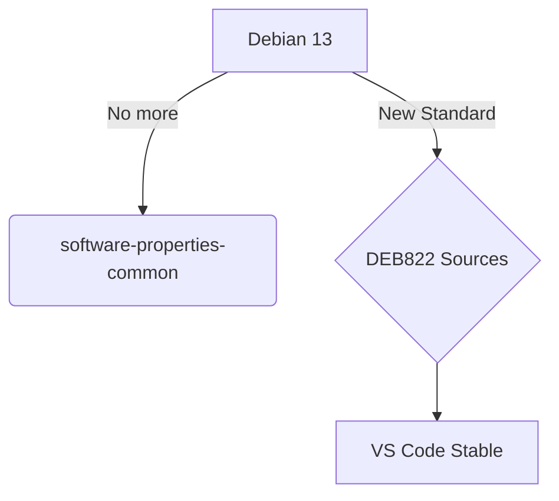

---

:::note Compatibilidad
Esta guía es exclusiva para **Debian 13**. Para sistemas basados en **Ubuntu 24.04 o Linux Mint 22**, utiliza el [protocolo de instalación estándar](./ubuntu-vscode-dev-setup.mdx).
:::

**Documentación Relacionada:**
- [Configuración de Runtimes en Debian](../runtimes/node-runtime-setup.mdx)
- [Arquitectura de Ingestión Semántica](../../engineering-standards/ai-protocols/document-ingestion-pipeline.mdx)

```

---

## Contenido archivo: `docs/sysadmin-linux/desktop/ubuntu-vscode-dev-setup.mdx`

```bash
$ cat docs/sysadmin-linux/desktop/ubuntu-vscode-dev-setup.mdx
---
id: ubuntu-vscode-dev-setup
title: "Estación de Trabajo: VS Code en Ubuntu / Linux Mint"
sidebar_label: "VSCode (Ubuntu/Mint)"
sidebar_position: 20
description: "Directiva de aprovisionamiento para entornos basados en Ubuntu 24.04 LTS y Linux Mint 22.x."
tags: [Ubuntu, Mint, VSCode, DevOps]
---

import Tabs from '@theme/Tabs';
import TabItem from '@theme/TabItem';

# VS Code en Ecosistemas Ubuntu/Mint

Esta guía define el **SOE (Standard Operating Environment)** para estaciones de trabajo basadas en Ubuntu 24.04 LTS. A diferencia de las versiones Debian puras, aquí mantenemos el uso de herramientas de transición como `software-properties-common` si fuera necesario, aunque priorizamos la limpieza del `keyring`.

:::danger Restricción de Aislamiento
**No instalar vía Flatpak o Snap.** El sandbox impide que VS Code detecte correctamente los binarios de `nvm`, `kubectl` y el agente `ssh-agent` del host, críticos para el workflow de ingeniería.
:::

## 1. Aprovisionamiento del Repositorio

```bash title="Terminal"
# 1. Dependencias de infraestructura de paquetes
sudo apt update && sudo apt install software-properties-common apt-transport-https wget gpg -y

# 2. Gestión de confianza (GPG Key)
wget -qO- https://packages.microsoft.com/keys/microsoft.asc | gpg --dearmor > microsoft.gpg
sudo install -D -o root -g root -m 644 microsoft.gpg /etc/apt/keyrings/microsoft.gpg

# 3. Registro del repositorio (Formato One-Line)
sudo sh -c 'echo "deb [arch=amd64,arm64,armhf signed-by=/etc/apt/keyrings/microsoft.gpg] https://packages.microsoft.com/repos/code stable main" > /etc/apt/sources.list.d/vscode.list'

# 4. Despliegue
sudo apt update && sudo apt install code -y
```

## 2. Stack DevOps y CKA Training
Se instalan las extensiones críticas para el pipeline de Docusaurus y laboratorios K8s:

| Categoría | Extensión | Utilidad | Extensión |
| :--- | :--- | :--- | :--- |
| **Infraestructura** | `ms-kubernetes-tools.vscode-kubernetes-tools` | Visualización de clústeres, logs y cambio de contexto. | Kubernetes |
| **Lenguaje** | `redhat.vscode-yaml` | Validación de esquemas de Kubernetes (indispensable). | YAML/K8s |
| **Contenedores** | `ms-azuretools.vscode-docker` | Gestión de imágenes, volúmenes y Dockerfiles localmente. | Docker/Podman |
| **Entorno CKA** | `vscodevim.vim` | **Crítico:** Mantiene la memoria muscular para el examen CKA. | Vim |
| **Documentación** | `unifiedjs.vscode-mdx` | Soporte para el contenido MDX de Docusaurus. | MDX |

---

:::info ¿Migrando a Debian 13?
Si estás operando en un entorno **Debian 13 (Trixie)**, *(o derivado como Q4OS, Linux MX, Linux Mint LDME 7, etc)*, el paquete `software-properties-common` no está disponible. Consulta la [guía específica para Debian 13](./deb13-vscode-dev-setup.mdx).
:::

:::tip Entrenamiento CKA
Instalar la extensión **Vim** en VS Code no es opcional. Durante el examen CKA no tendrás un IDE; dominar los comandos de movimiento y edición de Vim en tu día a día te dará una ventaja de velocidad decisiva.
:::

**Documentación Relacionada:**
- [Gestión del Runtime: Node.js](../runtimes/node-runtime-setup.mdx)
- [Workflow: Git Conventional Commits](../../engineering-standards/version-control/git-conventional-commits.mdx)

```

---

## Contenido archivo: `docs/sysadmin-linux/index.mdx`

```bash
$ cat docs/sysadmin-linux/index.mdx
---
id: index
title: "Administración de Sistemas y Entornos Linux"
sidebar_label: "Introducción"
sidebar_position: 1
---

import DocCardList from '@theme/DocCardList';

# Administración de Sistemas (SRE & SysAdmin)

Esta sección centraliza los estándares de configuración para estaciones de trabajo de ingeniería y servidores Linux. El objetivo es garantizar entornos de trabajo **reproducibles**, **seguros** y **optimizados**.

## Áreas de Especialización
*   **Gestión de Runtimes:** Estandarización de Node.js, Python y compiladores.
*   **Desktop Engineering:** Optimización de entornos Desktop de Linux (KDE Plasma (Q4OS) y Linux Mint XFCE).
*   **Tooling:** Configuración avanzada de IDEs (VSCode) y utilidades de CLI.

---

<DocCardList />

```

---

## Contenido archivo: `docs/sysadmin-linux/runtimes/node-runtime-setup.mdx`

```bash
$ cat docs/sysadmin-linux/runtimes/node-runtime-setup.mdx
---
id: node-runtime-setup
title: "Gestión del Runtime: Node.js y Ecosistema NVM"
sidebar_label: "Configuración de Node.js"
sidebar_position: 10
description: "Protocolo de instalación y gestión de versiones de Node.js mediante NVM en entornos Debian 13 / Q4OS."
tags: [Nodejs, NVM, Linux, SysAdmin, Debian]
---

import Tabs from '@theme/Tabs';
import TabItem from '@theme/TabItem';

# Gestión del Runtime: Node.js

En arquitecturas de ingeniería modernas, la gestión del runtime de Node.js debe estar desacoplada de los repositorios del sistema operativo. Esto previene conflictos de permisos (`EACCES`) y permite la paridad de entornos entre desarrollo y producción.

Este estándar define el uso de **Node Version Manager (NVM)** sobre estaciones de trabajo basadas en **Debian 13 (Trixie)** con escritorio **KDE Plasma (Q4OS)**.

:::info Visión de Arquitectura
El uso de NVM garantiza que los paquetes globales instalados vía `npm install -g` residan en el espacio de usuario (`$HOME`), eliminando la necesidad de `sudo` y preservando la integridad de las rutas protegidas del sistema.
:::

## 1. Protocolo de Instalación de NVM

El despliegue de NVM es el primer paso crítico para habilitar el ecosistema de desarrollo (Docusaurus/Astro).

<step>
1. **Inyección del Script de Gestión:**
   Descargue y ejecute el instalador oficial en el perfil del usuario.
   ```bash title="Terminal"
   curl -o- https://raw.githubusercontent.com/nvm-sh/nvm/v0.40.1/install.sh | bash
   ```
</step>

<step>
2. **Persistencia de Variables de Entorno:**
   Asegure que la shell reconozca el binario añadiendo estas directivas al final de su `~/.bashrc`:
   ```bash
   export NVM_DIR="$([ -z "${XDG_CONFIG_HOME-}" ] && echo "$HOME/.nvm" || echo "$XDG_CONFIG_HOME/nvm")"
   [ -s "$NVM_DIR/nvm.sh" ] && \. "$NVM_DIR/nvm.sh" 
   ```
</step>

<step>
3. **Refresco de Sesión:**
   ```bash
   source ~/.bashrc
   ```
</step>

---

## 2. Estrategia de Versiones (LTS)

Para garantizar la estabilidad en la compilación de este sitio (`dz.log`) y herramientas Big Data, utilizaremos exclusivamente ramas **LTS (Long Term Support)**.

<Tabs>
  <TabItem value="lts" label="Ruta LTS (Recomendado)" default>

```bash
# Instalar última versión estable
nvm install --lts

# Definir como persistente
nvm alias default 'lts/*'
```

  </TabItem>
  <TabItem value="specific" label="Versiones Específicas">

Utilice este método solo si un proyecto legacy requiere retrocompatibilidad:
```bash
nvm install 18.20.0
nvm use 18.20.0
```

  </TabItem>
</Tabs>

---

## 3. Integración con el Proyecto DZ.LOG

Para evitar discrepancias en el despliegue de este repositorio, implementamos un **Contrato de Versión** mediante archivos `.nvmrc`.

:::tip Práctica de Ingeniería Senior
Siempre que trabaje en el directorio `~/hot-tier/pascual-zamo.gitlab.io`, valide el runtime. Al entrar en la carpeta, ejecute `nvm use` para sincronizarse con la versión declarada en el proyecto.
:::

**Procedimiento para declarar la versión del proyecto:**
```bash title="Estableciendo el contrato"
node -v > .nvmrc # Captura la versión actual (ej: v22.13.0)
```

---

## 4. Diagnóstico y Troubleshooting

| Error Común | Causa Raíz | Acción Correctiva |
| :--- | :--- | :--- |
| `EACCES` | Node instalado vía APT | Desinstalar Node de APT e instalar vía NVM |
| `command not found: nvm` | Bash no inicializado | Validar carga en `~/.bashrc` y ejecutar `source` |
| `GLIBC not found` | Desajuste de Kernel | Validar Debian 13 / Kernel 6.x+ |

### Flujo Lógico de Inicialización

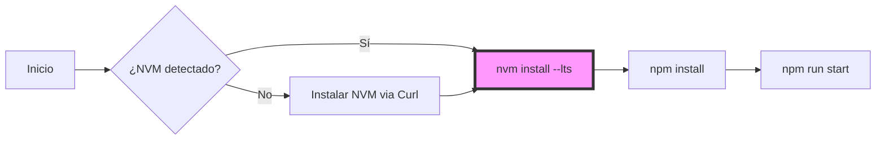

---
**Documentación Relacionada:**
- [Gobernanza de Estilo de la Base de Conocimiento](engineering-standards/overview.mdx)
- [Pipeline de Ingestión Semántica](engineering-standards/ai-protocols/document-ingestion-pipeline.mdx)

```

---

## Contenido archivo: `docs/sysadmin-linux/terminal-tools/dotfiles-management.mdx`

```bash
$ cat docs/sysadmin-linux/terminal-tools/dotfiles-management.mdx
---
id: dotfiles-management
title: "SOP: Gestión de Entorno (Dotfiles & Config)"
sidebar_label: "Gestión de Dotfiles"
sidebar_position: 20
description: "Protocolo de sincronización de perfiles de terminal (Bash/PowerShell) y configuraciones de aplicaciones desde el repositorio central."
tags: [Dotfiles, Bash, PowerShell, Linux, SysAdmin]
---

import Tabs from '@theme/Tabs';
import TabItem from '@theme/TabItem';

# Gestión de Entorno (Dotfiles)

En una arquitectura de ingeniería profesional, la configuración de la terminal debe tratarse como **Configuración como Código (CaC)**. Este repositorio centraliza los `dotfiles` en la raíz para garantizar la paridad de herramientas entre diferentes estaciones de trabajo (Debian, Q4OS, Windows/WSL).

## 1. Arquitectura de Sincronización

No copiamos los archivos manualmente. Utilizamos **Enlaces Simbólicos (Symlinks)**. De esta forma, cualquier cambio realizado en los archivos del repositorio se refleja instantáneamente en el sistema, permitiendo versionar las mejoras del entorno de forma orgánica.

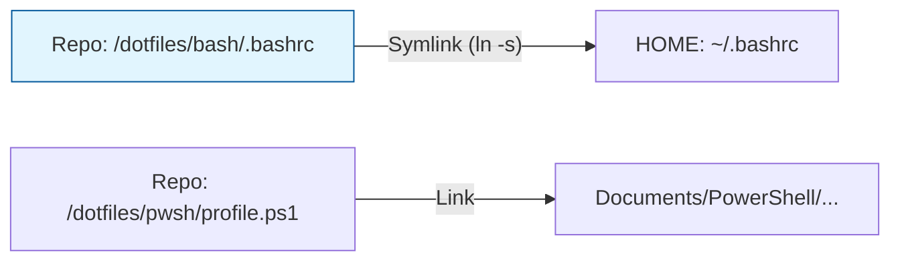

---

## 2. Protocolo de Implementación

Elija su entorno operativo para vincular las configuraciones:

<Tabs>
  <TabItem value="linux" label="Linux (Bash)" default>

### Vinculación de Perfiles
Ejecute estos comandos desde la raíz del repositorio para "anclar" su configuración:

```bash title="Terminal"
# 1. Backup de la config original (Solo la primera vez)
mv ~/.bashrc ~/.bashrc.bak
mv ~/.bash_aliases ~/.bash_aliases.bak

# 2. Creación de Enlaces Simbólicos
ln -sf $(pwd)/dotfiles/bash/.bashrc ~/.bashrc
ln -sf $(pwd)/dotfiles/bash/.bash_aliases ~/.bash_aliases

# 3. Aplicar cambios
source ~/.bashrc
```

  </TabItem>
  <TabItem value="pwsh" label="PowerShell 7">

### Vinculación del Perfil ($PROFILE)
En Windows o Linux con PowerShell 7, localice su archivo de perfil y apunte al archivo del repositorio.

```powershell title="PowerShell"
# Crear el directorio del perfil si no existe
New-Item -ItemType Directory -Force -Path (Split-Path $PROFILE)

# Crear enlace simbólico (Requiere privilegios de Admin en Windows)
New-Item -ItemType SymbolicLink -Path $PROFILE -Value "$PSScriptRoot\dotfiles\powershell\Microsoft.PowerShell_profile.ps1"
```

  </TabItem>
</Tabs>

---

## 3. Estándar de Contenido de los Dotfiles

Para mantener la portabilidad, los archivos deben seguir esta estructura lógica:

1.  **Variables de Entorno:** Paths de SDKs (Node, K8s, Python).
2.  **Aliases de Productividad:** Atajos de `kubectl`, `git`, y navegación.
3.  **Prompt Personalizado:** Identidad visual de la terminal (`PS1`).
4.  **Funciones Operativas:** Scripts pequeños para tareas recurrentes.

:::tip Recomendación de Seguridad
Nunca incluya credenciales (API Keys, Passwords) directamente en los archivos versionados. Utilice un archivo `.env.local` que esté incluido en el `.gitignore` y cárguelo desde el `.bashrc`:
```bash
[ -f ~/.env.local ] && source ~/.env.local
```
:::

---
**Documentación Relacionada:**
- [SOP: Ingeniería de Productividad en Terminal](../../platform-engineering/certification-lab/cka-terminal-productivity.mdx)
- [Vim Sovereignty: Estándar de Edición](./vim-sovereignty.mdx)

```

---

## Contenido archivo: `docs/sysadmin-linux/terminal-tools/vim-sovereignty.mdx`

```bash
$ cat docs/sysadmin-linux/terminal-tools/vim-sovereignty.mdx
---
id: vim-sovereignty
title: "SOP: Manipulación de Flujos de Texto (Vim Sovereignty)"
sidebar_label: "Vim Sovereignty"
sidebar_position: 10
description: "Estándar de edición masiva y navegación estructural en Vim para la administración de sistemas y entornos de certificación (CKA/Cloudera)."
tags: [Vim, Linux, SysAdmin, Productivity, CKA]
---

import Tabs from '@theme/Tabs';
import TabItem from '@theme/TabItem';

# Vim Sovereignty: Estándar de Edición en Terminal

En la administración de sistemas a escala, la capacidad de editar manifiestos YAML y archivos de configuración sin salir de la terminal es una ventaja competitiva. Este protocolo define los flujos de trabajo necesarios para dominar **Vim** como una herramienta de ingeniería, no solo como un editor de texto.

## 1. Operaciones de Alcance Global

Para un Arquitecto, la eficiencia se mide en la reducción de comandos repetitivos. Estas secuencias permiten gestionar el buffer completo de forma instantánea.

| Objetivo Operativo | Secuencia (Modo Normal) | Lógica Técnica |
| :--- | :--- | :--- |
| **Reset de Buffer** | `:%d` | Borrado total del archivo. |
| **Snap-to-Start** | `gg` | Posicionamiento en línea 1, columna 1. |
| **Snap-to-End** | `G` | Salto al final del flujo. |
| **Selección Integral** | `ggVG` | Acoplamiento: Inicio -> Modo Visual -> Final. |
| **Sincronización de Clipboard** | `:%y` | Copia del buffer completo al registro. |

:::tip Integración con Entornos Modernos
Si opera desde **VSCodeVim**, asegúrese de que su `settings.json` tenga habilitada la opción `"vim.useSystemClipboard": true` para que las operaciones de *yank* (`y`) interactúen directamente con el portapapeles de su SO (Debian/Q4OS).
:::

---

## 2. Gestión de Estructuras YAML (Indentación Masiva)

La integridad de los servicios en Kubernetes y Cloudera depende de la jerarquía de espacios. Vim permite correcciones estructurales sin intervención manual línea por línea.

### Flujo de Re-indentación

1.  **Activación Visual:** Presione `V` (Modo Visual de Línea).
2.  **Selección de Bloque:** Use `j/k` para sombrear el objeto (ej. un `spec` completo).
3.  **Desplazamiento:**
    *   `>`: Incrementa la indentación (2 espacios según nuestro `.vimrc`).
    *   `<`: Reduce la indentación.
4.  **Repetición Atómica:** Presione `.` para repetir el último desplazamiento sobre la misma selección.

---

## 3. Navegación y Búsqueda Forense

Cuando se analizan logs o descripciones de recursos extensos (ej. un `describe pod` de 500 líneas), la búsqueda secuencial es ineficiente.

<Tabs>
  <TabItem value="search" label="Búsqueda de Patrones" default>

```bash
# Iniciar búsqueda
/ <término_a_buscar> [Enter]

# Navegación entre coincidencias
n  # Siguiente (Next)
N  # Anterior (Previous)
```

  </TabItem>
  <TabItem value="internal" label="Navegación de Línea">

```bash
$  # Salto al final de la línea actual
0  # Salto al inicio de la línea (incluye espacios)
^  # Salto al primer carácter no vacío (ideal para YAML)
```

  </TabItem>
</Tabs>

---

## 4. Arquitectura de Salida (Modo Escape)

Para minimizar la fatiga del túnel carpiano y acelerar el cambio de modo, se recomienda el mapeo de "escape rápido".

```vim title="~/.vimrc snippet"
" Salir de modo insertar sin usar la tecla Esc
inoremap jj <Esc>
inoremap kk <Esc>
```

---

## 5. Cheat Sheet de Productividad

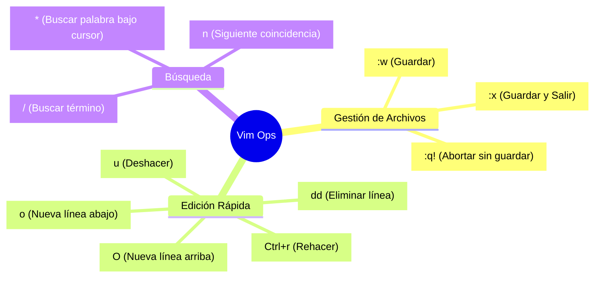

:::info Configuración Requerida
Este SOP asume que su entorno ha sido inicializado según el [Protocolo de Bootstrap de Terminal](../../platform-engineering/certification-lab/cka-terminal-productivity.mdx), garantizando que `tabstop=2` y `expandtab` estén activos para evitar errores de tabulación en YAML.
:::

---
**Documentación Relacionada:**
- [SOP: Ingeniería de Productividad en Terminal](../../platform-engineering/certification-lab/cka-terminal-productivity.mdx)
- [Gestión de Runtimes: Node.js](../runtimes/node-runtime-setup.mdx)
- [Arquitectura HDFS: Principios](../../data-engineering/cloudera-administration/hdfs-architecture-principles.mdx)

```

---

## Contenido archivo: `docs/homePageData.js`

```bash
$ cat docs/homePageData.js
import {
  BrainCircuit,
  Database,
  Workflow,
  Cog,
  GitBranch,
  GitCommit,
  GitGraph,
  GitMerge,
  Box,
  Server,
  Terminal,
  Edit,
  Cpu,     // IMPORTANTE: Añadido
  Network, // IMPORTANTE: Añadido
  ShieldCheck,
  Layers,
  FileSpreadsheet,
  Folder,
  Wand2,
  Users,
  UserCheck,
  Lock,
  UserPlus,
  ScrollText,
  Megaphone,
  Gem,
  Mail,
  ShoppingBag,
  Flag,
  Container
} from "lucide-react";

// Categorías Principales
export const featureCards = [
  {
    icon: Database,
    title: "Big Data Admin",
    color: "text-blue-500",
    content: "Administración de Cloudera Data Platform (CDP). Gobernanza de HDFS, tuning de servicios y operaciones de clúster.",
    href: "/data-engineering/cloudera-administration",
  },
  {
    icon: GitGraph,
    title: "Version Control Hub",
    color: "text-blue-500",
    content: "Estándares de Git, Branching Models y Semántica de Commits para flujos de trabajo profesionales.",
    href: "/engineering-standards/version-control/",
  },
  {
    icon: BrainCircuit,
    title: "AI Engineering",
    color: "text-blue-500",
    content: "Protocolos de Ingestión Semántica y refactorización mediante Modelos de Lenguaje (LLM).",
    href: "/engineering-standards/ai-protocols/document-ingestion-pipeline" 
  },
  {
    icon: Container,
    title: "Platform Engineering",
    color: "text-blue-500",
    content: "Orquestación con Kubernetes v1.35, Hardening de sistemas y automatización de infraestructura.",
    href: "/platform-engineering",
  },
  {
    icon: Terminal,
    title: "SysAdmin & Linux",
    color: "text-green-500",
    content: "Estándares de configuración de sistemas, gestión de runtimes (Node.js) y optimización de workstation.",
    href: "/sysadmin-linux",
  },
];

// Sección CKA: Entorno y Productividad
export const setupCards = [
  {
    icon: Cog,
    title: "Bootstrap del Entorno",
    color: "text-blue-500",
    content: "Configuración de terminal de alto rendimiento: aliases críticos y optimización de variables de entorno.",
    href: "/platform-engineering/certification-lab/cka-environment-bootstrap",
  },
  {
    icon: Cpu,
    title: "Productividad Operativa",
    color: "text-blue-500",
    content: "Maximización del throughput de comandos y gestión de latencia humana en entornos de certificación.",
    href: "/platform-engineering/certification-lab/cka-terminal-productivity",
  },
];

// NUEVA SECCIÓN: Lifecycle de Kubernetes
export const k8sLifecycleCards = [
  {
    icon: ShieldCheck,
    title: "Hardening de OS & Runtime",
    color: "text-blue-500",
    content: "Preparación de nodos Ubuntu 24.04: configuración de Kernel, módulos de red y optimización de containerd.",
    href: "/platform-engineering/certification-lab/k8s-os-runtime-prep",
  },
  {
    icon: Box,
    title: "Provisión de Binarios",
    color: "text-blue-500",
    content: "Despliegue de toolchain (kubeadm, kubelet, kubectl) con estrategias de version-pinning.",
    href: "/platform-engineering/certification-lab/k8s-binaries-install",
  },
  {
    icon: Network,
    title: "Orquestación CNI (Calico)",
    color: "text-blue-500",
    content: "Bootstrap del clúster e implementación del operador Tigera para políticas de red avanzadas.",
    href: "/platform-engineering/certification-lab/k8s-cluster-bootstrap-calico",
  },
];

export const deployOptions = [
  { icon: GitBranch, title: "Branching Models", href: "/engineering-standards/version-control/git-branching-model" },
  { icon: GitCommit, title: "Conventional Commits", href: "/engineering-standards/version-control/git-conventional-commits" },
  { icon: Workflow, title: "GitLab API Ops", href: "/engineering-standards/version-control/gitlab-api-pipeline-cleanup" },
  { icon: Terminal, title: "Dotfiles Management", href: "/sysadmin-linux/terminal-tools/dotfiles-management" },
  { icon: Edit, title: "Vim Sovereignty", href: "/sysadmin-linux/terminal-tools/vim-sovereignty" },
];

export const textLabels = {
  title: {
    prefix: "dz.log",
    highlight: "Knowledge Engineering Hub",
  },
  subtitle:
    "Documentación Técnica de Grado Industrial: Estándares de Configuración, Procedimientos Operativos (SOP) y Estrategias de Platform Engineering.",
  
  setupDanielZamo: {
    title: "Kubernetes: Foundation & Productivity",
    description: "Estándares de preparación para la certificación CKA y optimización de la terminal de administración.",
  },
  k8sLifecycle: {
    title: "Cluster Lifecycle Management",
    description: "Protocolos paso a paso para el despliegue de infraestructura de cómputo distribuido sobre Kubernetes v1.35.",
  },
  deployOn: {
    title: "Procedimientos Operativos Destacados (SOP)",
  },
};

export const sectionCards = {
  gettingStarted: {
    title: "Kubernetes Infrastructure Lab",
    description: "Acceso directo al framework de configuración de nodos y bootstrap de clústeres de prueba.",
    link: "/platform-engineering/certification-lab/k8s-os-runtime-prep",
  },
};

```

---

## Contenido archivo: `docs/homepage.css`

```bash
$ cat docs/homepage.css
@tailwind base;
@tailwind components;
@tailwind utilities;
```

---

## Contenido archivo: `docs/engineering-standards/version-control/docusaurus-visibility-lifecycle.mdx`

```bash
$ cat docs/engineering-standards/version-control/docusaurus-visibility-lifecycle.mdx
---
id: docusaurus-visibility-lifecycle
title: "Gestión de Visibilidad: Drafts, Unlisted e Ignored"
sidebar_label: "Visibilidad de Contenidos"
sidebar_position: 15
description: "Estándar operativo para la gestión del ciclo de vida del contenido y estados de visibilidad."
tags: [Documentation, Docusaurus, Standards]
---

import Tabs from '@theme/Tabs';
import TabItem from '@theme/TabItem';

# Gestión de Visibilidad y Ciclo de Vida del Contenido

Este estándar define los tres mecanismos para controlar qué contenido es procesado por el motor de Docusaurus y qué contenido es visible para el público.

## 1. El Pipeline de Publicación

<div style={{
  backgroundColor: 'rgba(0,0,0,0.05)', 
  padding: '24px', 
  borderRadius: '12px', 
  border: '1px solid var(--ifm-color-emphasis-200)',
  marginBottom: '30px'
}}>
  <div style={{
    display: 'flex', 
    flexDirection: 'row', 
    alignItems: 'center', 
    justifyContent: 'space-between',
    gap: '10px',
    flexWrap: 'wrap'
  }}>
    <div style={{flex: 1, minWidth: '140px', textAlign: 'center'}}>
      <div style={{backgroundColor: '#6c757d', color: 'white', padding: '12px', borderRadius: '6px', fontWeight: 'bold', fontSize: '11px', marginBottom: '8px', border: '1px solid #495057'}}>IGNORADO</div>
      <code style={{fontSize: '10px'}}>_archivo.md</code>
    </div>
    <div style={{color: 'var(--ifm-color-emphasis-400)', fontWeight: 'bold'}}>→</div>
    <div style={{flex: 1, minWidth: '140px', textAlign: 'center'}}>
      <div style={{backgroundColor: '#d29922', color: 'white', padding: '12px', borderRadius: '6px', fontWeight: 'bold', fontSize: '11px', marginBottom: '8px', border: '1px solid #b0801a'}}>DRAFT</div>
      <code style={{fontSize: '10px'}}>draft: true</code>
    </div>
    <div style={{color: 'var(--ifm-color-emphasis-400)', fontWeight: 'bold'}}>→</div>
    <div style={{flex: 1, minWidth: '140px', textAlign: 'center'}}>
      <div style={{backgroundColor: '#3182ce', color: 'white', padding: '12px', borderRadius: '6px', fontWeight: 'bold', fontSize: '11px', marginBottom: '8px', border: '1px solid #2b6cb0'}}>UNLISTED</div>
      <code style={{fontSize: '10px'}}>unlisted: true</code>
    </div>
    <div style={{color: 'var(--ifm-color-emphasis-400)', fontWeight: 'bold'}}>→</div>
    <div style={{flex: 1, minWidth: '140px', textAlign: 'center'}}>
      <div style={{backgroundColor: '#28a745', color: 'white', padding: '12px', borderRadius: '6px', fontWeight: 'bold', fontSize: '11px', marginBottom: '8px', border: '1px solid #1e7e34'}}>PUBLISHED</div>
      <code style={{fontSize: '10px'}}>Publicado</code>
    </div>
  </div>
</div>

---

## 2. Métricas por Entorno

| Atributo | Local (Dev) | Build (Prod) | URL Directa |
| :--- | :---: | :---: | :---: |
| `draft: true` | ✅ | ❌ | ❌ |
| `unlisted: true` | ✅ (Oculto) | ✅ (Oculto) | ✅ |
| `_folder/` | ❌ | ❌ | ❌ |

---

## 3. Implementación a Nivel de Directorio (Bulk Hiding)

Si desea ocultar una carpeta completa (por ejemplo, una certificación en progreso como CKA), no es necesario editar cada archivo. Se utiliza la configuración de categoría.

<div style={{backgroundColor: 'var(--ifm-color-emphasis-100)', padding: '20px', borderRadius: '8px', border: '1px solid var(--ifm-color-emphasis-300)', marginBottom: '20px'}}>
  <div style={{fontSize: '14px', fontWeight: 'bold', marginBottom: '10px', color: 'var(--ifm-color-primary)'}}>📁 Configuración de Carpeta Oculta</div>
  <div style={{fontSize: '13px', color: 'var(--ifm-color-emphasis-800)'}}>
    Cree un archivo <code>\_category\_.json</code> dentro del directorio objetivo:
  </div>
  <pre style={{marginTop: '10px', fontSize: '12px', backgroundColor: '#1e1e1e', color: '#d4d4d4'}}>
{`{
  "label": "Laboratorio Oculto",
  "unlisted": true
}`}
  </pre>
  <div style={{fontSize: '12px', fontStyle: 'italic', color: 'var(--ifm-color-emphasis-600)'}}>
    Resultado: Toda la carpeta desaparece del sidebar y buscador, pero las URLs siguen vivas para consulta privada.
  </div>
</div>

---

## 4. El "Guion Bajo" (Ignorado Absoluto)

Cualquier archivo o carpeta que comience con `_` es **ignorado por el motor de Docusaurus**. No se procesa, no se genera URL y no consume tiempo de build.

:::tip Caso de Uso
Ideal para la carpeta `docs/cka/_assets/` o `_research/` donde guardas capturas de pantalla crudas o PDFs de referencia que no quieres que el SSG intente compilar.
:::

---
:::info Nota Final
Este sistema permite que este sitio actúe simultáneamente como tu **Libreta de Estudio (Privada)** y tu **Portfolio de Ingeniería (Público)**.
:::

```

---

## Contenido archivo: `docs/engineering-standards/version-control/gitlab-api-pipeline-cleanup.DRAFT.mdx`

```bash
$ cat docs/engineering-standards/version-control/gitlab-api-pipeline-cleanup.DRAFT.mdx
---
id: gitlab-api-pipeline-cleanup.DRAFT
title: "SOP: Gestión Programática de Pipelines vía GitLab API"
sidebar_label: "DRAFT - Limpieza de Pipelines (API)"
sidebar_position: 41
description: "Protocolo de administración y purga de historiales de CI/CD mediante la API REST de GitLab desde entornos Linux CLI."
tags: [GitLab, API, Automation, Bash, DevOps]
draft: true
---

import Tabs from '@theme/Tabs';
import TabItem from '@theme/TabItem';

# Gestión Programática de Pipelines

En entornos de **Ingeniería de Plataforma**, el mantenimiento del historial de CI/CD es vital para la higiene del repositorio y la optimización de cuotas de almacenamiento. Este estándar define el procedimiento para interactuar con la API v4 de GitLab para la eliminación de registros de ejecución.

:::info Arquitectura de Repositorio
Siguiendo nuestro estándar de **Repositorio Unificado**, el código fuente de las herramientas de limpieza reside en la raíz del proyecto (`/scripts/ops/`), mientras que este documento sirve como su especificación técnica y manual de usuario.
:::

## 1. Requisitos Previos (Alistamiento)

Para interactuar con la API, se requieren dos componentes de identidad y localización:

1.  **Personal Access Token (PAT):** Generado en *User Settings > Access Tokens* con el scope `api`.
2.  **Project ID:** Identificador numérico único del repositorio (disponible en la página principal del proyecto).

```bash title="Dependencias de Estación de Trabajo"
# Instalación de procesador JSON y cliente de transferencia
sudo apt update && sudo apt install curl jq -y
```

---

## 2. Protocolo de Ejecución

El flujo lógico para la purga de datos sigue una arquitectura de **Identificación -> Validación -> Eliminación**.

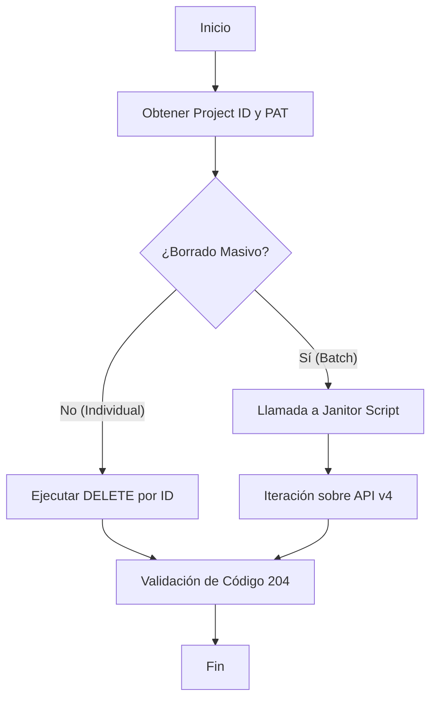

---

## 3. Comandos Operativos

<Tabs>
  <TabItem value="single" label="Eliminación Individual" default>

Utilice este método para eliminar un pipeline específico (ej: el `#52`) tras una validación fallida o detección de datos sensibles.

```bash title="Terminal (Manual)"
# Definición de variables de sesión (Volátiles)
read -sp "Token: " GIT_TOKEN
export PROJ_ID="12345678"
export PIPE_ID="52"

# Ejecución del comando DELETE
curl --request DELETE \
     --header "PRIVATE-TOKEN: $GIT_TOKEN" \
     "https://gitlab.com/api/v4/projects/$PROJ_ID/pipelines/$PIPE_ID"
```

  </TabItem>
  <TabItem value="mass" label="Purga Masiva (Janitor)">

Para limpiezas recurrentes, se recomienda el uso del script automatizado. Este método procesa los últimos 20 registros de forma secuencial.

```bash title="Ejecución desde la Raíz"
# Asegúrese de estar en la raíz del repositorio pascual-zamo.gitlab.io
chmod +x ./scripts/ops/gitlab-janitor.sh
./scripts/ops/gitlab-janitor.sh
```

  </TabItem>
</Tabs>

---

## 4. Código Fuente Operativo

El script de limpieza se mantiene fuera de la carpeta de documentación para permitir su integración en tareas programadas (cron) y evitar conflictos de renderizado en el SSG.

```bash title="scripts/ops/gitlab-janitor.sh"
#!/bin/bash
# ==============================================================================
# NAME: gitlab-janitor.sh
# DESCRIPTION: Automatización de purga de pipelines vía API v4
# ==============================================================================

TOKEN="${GIT_TOKEN}" # Se recomienda heredar de variable de entorno
PROJECT_ID="tu-id-aqui"

if [ -z "$TOKEN" ]; then
    echo "Error: La variable GIT_TOKEN no está definida."
    exit 1
fi

# Obtener IDs de pipelines (Últimos 20)
PIPELINES=$(curl --header "PRIVATE-TOKEN: $TOKEN" \
    "https://gitlab.com/api/v4/projects/$PROJECT_ID/pipelines?per_page=20" | jq '.[].id')

for ID in $PIPELINES; do
    echo "Eliminando Pipeline ID: $ID"
    STATUS=$(curl --request DELETE --header "PRIVATE-TOKEN: $TOKEN" \
        --write-out "%{http_code}" --silent --output /dev/null \
        "https://gitlab.com/api/v4/projects/$PROJECT_ID/pipelines/$ID")
    
    if [ "$STATUS" == "204" ]; then
        echo "Exito: ID $ID eliminado."
    else
        echo "Fallo: ID $ID devolvió código $STATUS."
    fi
done
```

:::info Mantenimiento del Script
Para proponer mejoras a este script, edite directamente el archivo en `/scripts/ops/`. El pipeline de validación de este repositorio no permite el despliegue si existen errores de sintaxis en la carpeta de scripts.
:::

---

## 5. Consideraciones de Seguridad y Auditoría

:::danger Advertencia de Integridad
La eliminación de un pipeline es una **operación irreversible**. Se pierden logs de ejecución, artefactos y la trazabilidad de despliegues pasados.
:::

- **No borre pipelines de producción:** Mantenga al menos 90 días de historial.
- **Inyección de Secretos:** Nunca guarde el `PRIVATE-TOKEN` dentro del código. Utilice el comando `read` o variables de entorno del sistema.
- **Validación de Roles:** Se requiere rol de **Owner** para ejecutar borrados vía API en namespaces personales.

---
**Documentación Relacionada:**
- [Estrategia de Ramas y Ciclo de Vida](./git-branching-model.mdx)
- [SOP: Configuración de Entorno CKA](../../platform-engineering/certification-lab/cka-environment-bootstrap.mdx)
- [Gestión de Runtimes: Node.js](../../sysadmin-linux/runtimes/node-runtime-setup.mdx)

```

---

## Contenido archivo: `docs/engineering-standards/version-control/gitlab-api-pipeline-cleanup.mdx`

```bash
$ cat docs/engineering-standards/version-control/gitlab-api-pipeline-cleanup.mdx
---
id: gitlab-api-pipeline-cleanup
title: "SOP: Gestión Programática de Pipelines vía GitLab API"
sidebar_label: "Limpieza de Pipelines (API)"
sidebar_position: 40
#slug: /engineering-standards/gitlab-api-pipeline-cleanup
description: "Protocolo de administración y purga de historiales de CI/CD mediante la API REST de GitLab desde entornos Linux CLI."
tags: [GitLab, API, Automation, Bash, DevOps]
---

import Tabs from '@theme/Tabs';
import TabItem from '@theme/TabItem';
import CodeBlock from '@theme/CodeBlock';
// Importación dinámica del script real desde la raíz del repositorio
import JanitorScript from '@site/scripts/ops/gitlab-janitor.sh';

# Gestión Programática de Pipelines

En entornos de **Ingeniería de Plataforma**, el mantenimiento del historial de CI/CD es vital para la higiene del repositorio y la optimización de cuotas de almacenamiento. Este estándar define el procedimiento para interactuar con la API v4 de GitLab para la eliminación de registros de ejecución.

:::info Arquitectura de Repositorio Unificado
Siguiendo nuestra estrategia de **Single Source of Truth (SSOT)**, el código fuente de las herramientas de limpieza reside en la raíz del proyecto (`/scripts/ops/`). Este documento importa dinámicamente el script real para garantizar que la documentación nunca quede obsoleta respecto al código operativo.
:::

## 1. Requisitos Previos (Alistamiento)

Para interactuar con la API, se requieren dos componentes de identidad y localización:

1.  **Personal Access Token (PAT):** Generado en *User Settings > Access Tokens* con el scope `api`.
2.  **Project ID:** Identificador numérico único del repositorio (disponible en la página principal del proyecto).

```bash title="Dependencias de Estación de Trabajo"
# Instalación de procesador JSON y cliente de transferencia
sudo apt update && sudo apt install curl jq -y
```

---

## 2. Protocolo de Ejecución

El flujo lógico para la purga de datos sigue una arquitectura de **Identificación -> Validación -> Eliminación**.

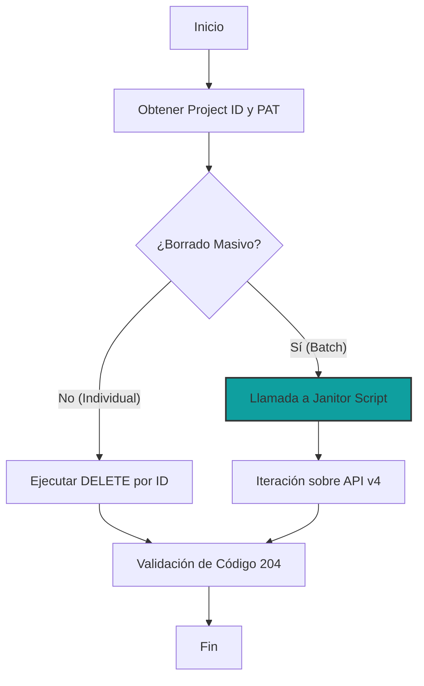

---

## 3. Comandos Operativos

<Tabs>
  <TabItem value="single" label="Eliminación Individual" default>

Utilice este método para eliminar un pipeline específico (ej: el `#52`) tras una validación fallida o detección de datos sensibles.

```bash title="Terminal (Manual)"
# Inyección segura de Token (Evita que quede en el historial de comandos)
read -sp "Ingrese su GitLab PAT: " GIT_TOKEN
export PROJ_ID="tu_id_de_proyecto"
export PIPE_ID="52"

# Ejecución del comando DELETE
curl --request DELETE \
     --header "PRIVATE-TOKEN: $GIT_TOKEN" \
     "https://gitlab.com/api/v4/projects/$PROJ_ID/pipelines/$PIPE_ID"
```

  </TabItem>
  <TabItem value="mass" label="Purga Masiva (Janitor)">

Para limpiezas recurrentes, se recomienda el uso del script automatizado. Este método procesa los registros de forma secuencial validando el código de respuesta HTTP.

```bash title="Ejecución desde la Raíz"
# Asegúrese de estar en la raíz: ~/pascual-zamo.gitlab.io/
chmod +x ./scripts/ops/gitlab-janitor.sh
./scripts/ops/gitlab-janitor.sh
```

  </TabItem>
</Tabs>

---

## 4. Código Fuente Operativo (SSOT)

El siguiente bloque de código se importa directamente desde el archivo `scripts/ops/gitlab-janitor.sh`. Cualquier modificación en el archivo físico se reflejará aquí automáticamente.

<CodeBlock language="bash" title="scripts/ops/gitlab-janitor.sh" showLineNumbers>
  {JanitorScript}
</CodeBlock>

:::tip Mantenimiento del Script
Si detecta un fallo en la lógica de borrado, edite el archivo directamente en la carpeta `/scripts/ops/` de su entorno local. Al hacer `git push`, tanto el script como esta página de documentación se actualizarán en sincronía.
:::

---

## 5. Consideraciones de Seguridad y Auditoría

:::danger Advertencia de Integridad
La eliminación de un pipeline es una **operación irreversible**. Se pierden logs de ejecución, artefactos y la trazabilidad de despliegues pasados.
:::

- **Gobernanza de Datos:** No borre pipelines de producción. Mantenga al menos 90 días de historial para auditorías.
- **Inyección de Secretos:** Nunca guarde el `PRIVATE-TOKEN` dentro del código de forma plana. Utilice el comando `read` (visto en la sección 3) o variables de entorno protegidas.
- **Privilegios:** Se requiere rol de **Owner** para ejecutar borrados vía API en namespaces personales de GitLab.

---
**Documentación Relacionada:**
- [Estrategia de Ramas y Ciclo de Vida](./git-branching-model.mdx)
- [Gestión de Dotfiles e Infraestructura Personal](../../sysadmin-linux/terminal-tools/dotfiles-management.mdx)
- [SOP: Configuración de Entorno CKA](../../platform-engineering/certification-lab/cka-environment-bootstrap.mdx)

```

---

## Contenido archivo: `docs/engineering-standards/version-control/git-conventional-commits.mdx`

```bash
$ cat docs/engineering-standards/version-control/git-conventional-commits.mdx
---
id: git-conventional-commits
sidebar_position: 20
title: "Semántica de Commits: Conventional Commits."
sidebar_label: "Mensajes de Commit"
description: "Guía sobre el uso de Conventional Commits para una base de conocimiento técnica y profesional."
---

# Semántica de Commits

En la filosofía DevOps, el historial de Git no es solo un backup, es **documentación cronológica**. Adoptar un estándar como _Conventional Commits_ facilita la trazabilidad y la automatización.

## 1. Estructura del Mensaje

Un commit profesional debe seguir esta estructura:
`tipo(alcance): descripción breve en minúsculas`

### Tipos principales (Types)

| Tipo         | Cuándo usarlo                                                    | Ejemplo                                                   |
| :----------- | :--------------------------------------------------------------- | :-------------------------------------------------------- |
| **feat**     | Nueva funcionalidad o **nuevo artículo/nota**.                   | `feat(linux): add guide for cron scheduling`              |
| **docs**     | Cambios exclusivos en documentación (corregir typos, gramática). | `docs(multimedia): fix typo in ImageMagick guide`         |
| **fix**      | Corregir un error técnico (link roto, error de MDX).             | `fix(search): fix invalid css selector in modal`          |
| **style**    | Cambios que no afectan la lógica (CSS, espacios, formato).       | `style(ui): update terminal cursor blink speed`           |
| **chore**    | Tareas de mantenimiento (actualizar dependencias, .gitignore).   | `chore: update docusaurus to v3.2`                        |
| **refactor** | Cambio de código que ni corrige error ni añade feature.          | `refactor(kb): restructure folders for better navigation` |

## 2. Commits Simples vs. Multilínea

### Commits Simples

Para cambios atómicos y directos.

```bash
git commit -m "feat(linux): add stat command reference"
```

### Commits Multilínea

Útiles cuando el cambio requiere una explicación del "por qué" o una lista de cambios realizados.

```bash
git commit -m "feat(ui): implement terminal identity" -m "- Add $ prompt via CSS
- Implement blinking cursor animation
- Force green color palette on search modal"
```

_Nota: Al usar múltiples `-m`, Git los interpreta como párrafos separados._

:::tip La Regla de Oro
El mensaje debe completar la frase: _"Si aplico este commit, yo estoy... [mensaje]"_.

- Ejemplo: _Si aplico este commit, yo estoy... **actualizando el estilo del buscador**._
  :::

```

---

## Contenido archivo: `docs/engineering-standards/version-control/git-branching-model.mdx`

```bash
$ cat docs/engineering-standards/version-control/git-branching-model.mdx
---
id: git-branching-model
title: "Estrategia de Ramas y Ciclo de Vida (Git Flow Light)"
sidebar_label: "Estrategia de Ramas"
sidebar_position: 30
description: "Estándar de nomenclatura de ramas y protocolo de limpieza (Housekeeping) para entornos de desarrollo y documentación."
tags: [Git, DevOps, Standards, Workflow]
---

import Tabs from '@theme/Tabs';
import TabItem from '@theme/TabItem';

# Estrategia de Ramas y Ciclo de Vida

En arquitecturas de software modernas, la rama `main` es sagrada. Para proteger la integridad del código y la documentación, implementamos un modelo de **Short-lived Feature Branches** (ramas de vida corta). Este enfoque reduce la divergencia de código y facilita la integración continua.

## 1. Convención de Nomenclatura (Naming Standard)

Adoptamos el uso de **prefijos semánticos** para identificar la naturaleza del cambio antes de leer una sola línea de código.

| Prefijo | Propósito | Ejemplo |
| :--- | :--- | :--- |
| `feat/` | Nuevas funcionalidades o secciones de notas. | `feat/cka-networking` |
| `fix/` | Corrección de errores en scripts o links rotos. | `fix/broken-links-cloudera` |
| `docs/` | Cambios exclusivos en documentación o SOPs. | `docs/update-naming-policy` |
| `refactor/` | Reestructuración de carpetas o limpieza de MDX. | `refactor/move-node-runtime` |
| `study/` | Ramas experimentales o de laboratorio personal. | `study/cka-scheduling` |

:::danger Anti-Patterns a Evitar
- **Nombres Personales:** No uses `daniel/fix-bug`. Usa el propósito, no el autor.
- **Ramas Permanentes:** No mantengas ramas como `documentacion-v1` separadas de `main` por meses.
- **Nombres Genéricos:** Evita `update`, `cambios` o `test`.
:::

---

## 2. Ciclo de Vida de una Rama

El flujo de trabajo estándar asegura que cada cambio sea validado antes de su persistencia en la rama principal.

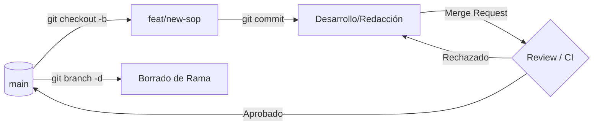

---

## 3. SOP: Limpieza de Repositorio (Housekeeping)

Un repositorio profesional debe mantenerse esbelto. Las ramas que ya han sido integradas o los experimentos fallidos deben ser eliminados sistemáticamente.

### Escenario de Ejemplo
Supongamos que el comando `git branch --all` muestra una rama obsoleta llamada `cka/study-victus` (incumple el estándar de prefijos).

<Tabs>
  <TabItem value="local" label="Borrado Local" default>

Para eliminar la rama localmente (solo si ya estás en `main`):

```bash title="Terminal"
# Intentar borrado seguro (falla si no ha sido mergeada)
git branch -d cka/study-victus

# Forzar borrado (si los cambios ya no son necesarios)
git branch -D cka/study-victus
```

  </TabItem>
  <TabItem value="remote" label="Borrado Remoto">

Para eliminar la referencia en el servidor (GitLab/GitHub):

```bash title="Terminal"
# Comando directo al origin
git push origin --delete cka/study-victus
```

  </TabItem>
  <TabItem value="prune" label="Sincronización">

Después de limpiezas masivas, purgue las referencias locales a ramas que ya no existen en el servidor:

```bash title="Terminal"
git fetch --prune
```

  </TabItem>
</Tabs>

---

## 4. Separación Docs vs Código: El Veredicto Técnico

Es una **excelente práctica** separar la lógica del contenido mediante ramas de prefijo `docs/` vs `feat/`. 

### Beneficios para el Pipeline (CI/CD)
Al detectar cambios exclusivamente en `docs/`, nuestro pipeline en GitLab puede saltarse etapas costosas como el despliegue de infraestructura de pruebas y centrarse solo en el **Build estático** de Docusaurus.

:::tip Recomendación de Arquitecto
Mantén tus ramas de documentación cerca del código, pero bajo su propio prefijo. Asegúrate de que su destino final siempre sea `main` para evitar el "Drift de Documentación" (cuando la nota dice algo que el sistema ya no hace).
:::

---
_Documentación Relacionada:_ 
- [Semántica de Commits (Conventional Commits)](./git-conventional-commits.mdx) 
- [Bootstrap del Entorno CKA](../../platform-engineering/certification-lab/cka-environment-bootstrap.mdx)

```

---

## Contenido archivo: `docs/engineering-standards/overview.mdx`

```bash
$ cat docs/engineering-standards/overview.mdx
---
id: overview
title: "Gobernanza de Documentación: Estándares y Taxonomía"
sidebar_label: "Guía de Estilo y Gobernanza"
sidebar_position: 10
description: "Marco normativo para la creación, clasificación y mantenimiento de activos de conocimiento técnico."
tags: [Governance, Standards, Documentation, SOP]
---

import Tabs from '@theme/Tabs';
import TabItem from '@theme/TabItem';

# Gobernanza de Documentación Técnica

Este documento define la **Taxonomía Oficial** y los estándares de ingeniería aplicados a esta base de conocimientos.

## 1. Clasificación Semántica (Taxonomía)

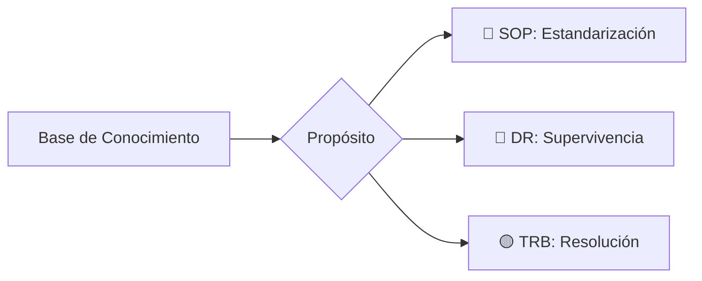

---

## 2. Anatomía de una Nota Técnica Senior

1. ### Definición del Contexto (RCA)
   Todo documento debe iniciar con el "Por qué". Identificar el error o requerimiento e identificar el impacto.

2. ### Ejecución Técnica Atómica
   Aquí es donde vive el SOP. No se permiten párrafos densos; se utilizan bloques de código con títulos descriptivos.

3. ### Validación de Resultados
   Un procedimiento no termina cuando se ejecuta el comando, sino cuando se valida el éxito mediante logs o dashboards.

---

## 3. Matriz de Detalle Operativo

Utilice las pestañas para profundizar en los requerimientos técnicos de cada fase definida anteriormente.

<Tabs>
  <TabItem value="context" label="📍 Contexto" default>
    - **Problema:** Descripción sucinta del fallo.
    - **Impacto:** ¿A qué servicios afecta?
  </TabItem>
  <TabItem value="code" label="🛠️ Código">
    ```bash title="hdfs-check.sh"
    # Ejemplo de comando estándar de validación
    hdfs fsck / -files -blocks -locations
    ```
  </TabItem>
  <TabItem value="logs" label="📊 Logs">
    ```text title="output.log"
    Status: HEALTHY
    Total blocks (validated): 1250
    ```
  </TabItem>
</Tabs>

---

:::tip Certificaciones en Foco
Este estándar se aplica estrictamente a los módulos de **CKA (Kubernetes)** y **Cloudera SysAdmin**, asegurando que el material de estudio sea idéntico a una documentación de producción real.
:::

```

---

## Contenido archivo: `docs/engineering-standards/ai-protocols/ai-prompting-protocols.mdx`

```bash
$ cat docs/engineering-standards/ai-protocols/ai-prompting-protocols.mdx
---
id: ai-prompting-docusaurus-ui
title: "Protocolos de IA: Refactorización de UI y Estilos"
sidebar_label: "Refactorización de UI"
sidebar_position: 20
description: "Protocolo técnico para la generación y refactorización de componentes UI en Docusaurus mediante modelos de razonamiento (Claude/DeepSeek)."
tags: [AI, Prompting, CSS, Docusaurus, Infima]
---

import Tabs from '@theme/Tabs';
import TabItem from '@theme/TabItem';

# Protocolos de Interacción con IA para UI/UX

En nuestra arquitectura de conocimiento, la IA no es un generador de texto, sino un **Senior Frontend Engineer** externo. Para obtener resultados de nivel "Seniority", debemos utilizar prompts basados en **Arquitectura y Contexto**, no solo en instrucciones aisladas.

## 1. El Flujo de Trabajo AI-Ops

El siguiente diagrama describe cómo este protocolo utiliza la capacidad de razonamiento inductivo de modelos como **Claude 3.5 Sonnet** o **DeepSeek-V3**.

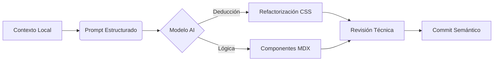

---

## 2. Protocolo de Refactorización de Admonitions

Este protocolo se utiliza específicamente cuando los elementos nativos de Infima/Docusaurus no cumplen con el estándar visual **dz.log** (basado en ToolJet).

### 2.1 El "Master Prompt"

Copia y adapta este bloque cuando necesites que la IA rediseñe componentes globales:

:::tip Protocolo de Uso
Utiliza este prompt preferentemente en **Claude AI** debido a su superior manejo de jerarquías de variables CSS y diseño sistemático.
:::

```markdown
### Rol: Senior Frontend Engineer & UI/UX Specialist
**Especialidad:** Docusaurus, Infima CSS y Sistemas de Diseño.

**Contexto del Proyecto:**
Sitio: `dz.log` (Inspiración: ToolJet Docs).
Framework: Docusaurus 3+.
CSS Base: Infima + Variables Tabler (`--tblr-*`).
Componente a refactorizar: **Admonitions** (alertas :::).

**El Problema:**
Falta de integración visual entre los bloques de código internos y el contenedor de la alerta. Jerarquía tipográfica disonante.

**Tarea:** Redefinir estilos en `custom.css` para:
1. Sobreescribir selectores `.admonition` y `.alert`.
2. Heredar estética de la clase `.dz-note` (bordes finos, radio 6px).
3. Integrar bloques `pre` y `code` con estilo "incrustado".
4. Soporte nativo para Modo Claro/Oscuro mediante variables de tema.

**Variables Disponibles:**
- Primario: `#4d72fa`
- Danger: `#d63939`
- Info: `#4299e1`
- Background: `--ifm-color-emphasis-100`
```

---

## 3. Metodología de Implementación

Para asegurar que los cambios no rompan la mantenibilidad del sitio, sigue este procedimiento:

<Tabs>
  <TabItem value="steps" label="Pasos de Ejecución" default>

1. **Extracción de Contexto:** Copia las primeras 50 líneas de tu `custom.css` actual.
2. **Inyección de Prompt:** Proporciona el prompt anterior junto con el CSS copiado a la IA.
3. **Validación Visual:** Aplica los estilos en modo `npm start` y verifica el contraste en Dark Mode.
4. **Refactorización de Código:** Asegúrate de que los bloques de código dentro de `:::info` no tengan márgenes dobles.

  </TabItem>
  <TabItem value="rules" label="Reglas de Oro">

*   **No !important:** Evita el uso de `!important` a menos que sea para ganar a un estilo inline de un plugin.
*   **Variables Primero:** Si la IA sugiere un color hexadecimal, pídele que use o cree una variable CSS.
*   **Aislamiento:** Los estilos de Admonitions deben estar en su propia sección dentro de `custom.css`.

  </TabItem>
</Tabs>

## 4. Consideraciones Técnicas (SOP)

:::danger Peligro: Especificidad CSS
Docusaurus carga los estilos de los componentes en un orden específico. Si tus nuevos estilos no se aplican, envuelve tus selectores en `[data-theme] .admonition` para aumentar la especificidad sin romper la cascada.
:::

### Ejemplo de Bloque Esperado (Output de IA)
```css
/* Sección: Custom Admonitions dz.log */
.admonition {
  border: 1px solid var(--ifm-color-emphasis-300);
  border-radius: 6px;
  background-color: var(--dz-bg-subtle);
  padding: 1.25rem;
}

.admonition code {
  background-color: rgba(0, 0, 0, 0.05); /* Modo claro */
}

[data-theme='dark'] .admonition code {
  background-color: rgba(255, 255, 255, 0.1); /* Modo oscuro */
}
```

---
_Protocolo actualizado el: 2024-03-20_
_Responsable: Arquitecto de Soluciones_

```

---

## Contenido archivo: `docs/engineering-standards/ai-protocols/document-ingestion-pipeline.mdx`

```bash
$ cat docs/engineering-standards/ai-protocols/document-ingestion-pipeline.mdx
---
id: document-ingestion-pipeline
title: "SOP: Pipeline de Ingestión y Transformación Semántica de Documentos"
sidebar_label: "Ingestión Semántica"
sidebar_position: 10
description: "Protocolos avanzados para la conversión de PDF a Markdown/DocX optimizados para modelos de contexto extendido como NotebookLM."
tags: [AI, Ingestion, CLI, Linux, Markdown, RAG]
---

import Tabs from '@theme/Tabs';
import TabItem from '@theme/TabItem';

# Pipeline de Ingestión y Transformación Semántica

En el marco de la **Ingeniería de Prompts** y el estudio profundo mediante LLMs (como NotebookLM), la calidad del resultado es directamente proporcional a la pureza semántica de la fuente. El formato PDF, diseñado para la visualización, debe ser "desestructurado" y vuelto a organizar en **Markdown** para eliminar el ruido sistémico (headers, footers, artefactos de maquetación).

## 1. Arquitectura del Flujo de Transformación

El siguiente diagrama detalla el proceso de conversión desde un binario visual (PDF) hasta un activo de conocimiento indexable.

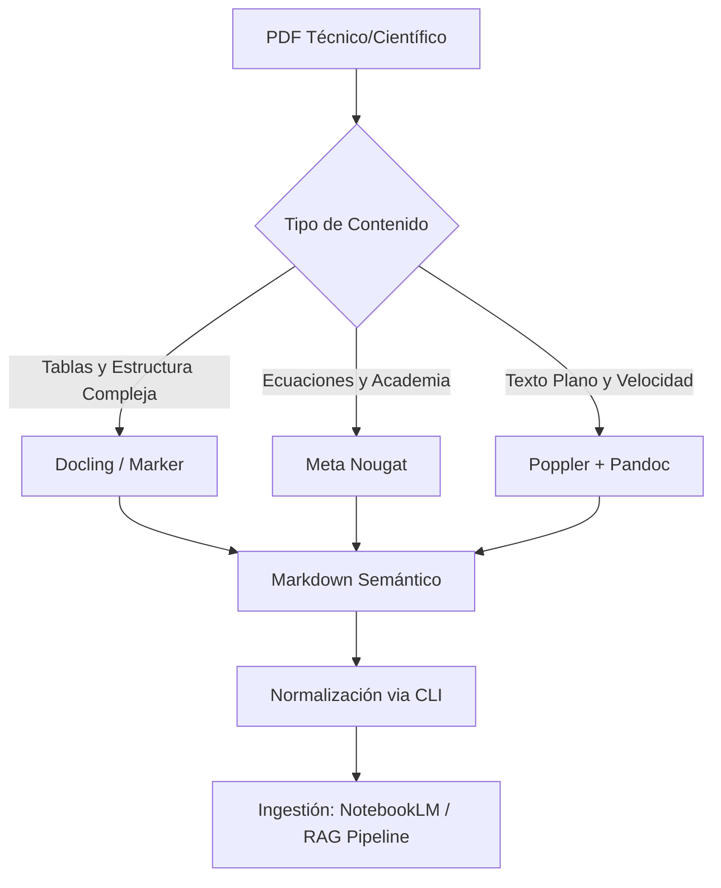

## 2. Motores de Inferencia de Layout (State-of-the-Art)

A diferencia del OCR tradicional, estos motores utilizan Deep Learning para entender la jerarquía del documento.

<Tabs>
  <TabItem value="marker" label="Marker (General Purpose)" default>

Ideal para libros técnicos y manuales de certificación (CKA/Cloudera).
*   **Capacidad:** Detecta orden de lectura, elimina artefactos y extrae imágenes.
*   **Comando Operativo:**
    ```bash
    marker_single /ruta/archivo.pdf --output_dir ./output/ --batch_multiplier 2
    ```

  </TabItem>
  <TabItem value="docling" label="Docling (IBM Research)">

Optimizado para documentos densos en datos tabulares.
*   **Capacidad:** Su motor de reconocimiento de tablas es superior para análisis financiero o técnico.
*   **Comando Operativo:**
    ```bash
    docling /ruta/archivo.pdf --to md
    ```

  </TabItem>
  <TabItem value="nougat" label="Nougat (Scientific)">

El estándar para papers científicos y documentación con carga matemática pesada.
*   **Capacidad:** Traduce visualmente ecuaciones a LaTeX de forma nativa.

  </TabItem>
</Tabs>

## 3. Interoperabilidad y Formatos Intermedios (DocX)

Para flujos que requieren revisión humana o integración con Google Docs antes de la ingesta final en NotebookLM, se recomienda el uso de **Pandoc** como puente semántico.

:::info El Rol de Pandoc
No se recomienda la conversión directa `PDF -> DocX` via herramientas de oficina (LibreOffice/Word), ya que generan metadatos de posicionamiento absoluto que confunden al LLM. El flujo profesional es:
**`PDF -> Markdown (IA) -> DocX (Pandoc)`**
:::

**Comando de conversión estructural:**
```bash
pandoc documento.md --reference-doc=template.docx -o ingestion_ready.docx
```

## 4. Procedimiento Operativo de Normalización (SOP)

Una vez obtenido el archivo Markdown, es imperativo realizar una limpieza proactiva mediante utilidades de CLI Linux.

<step>
1. **Recorte de Contexto Irrelevante:**
   Elimine páginas de bibliografía o índices que consumen tokens innecesarios.
   ```bash
   qpdf --empty --pages input.pdf 1-50 -- output_recortado.pdf
   ```
</step>

<step>
2. **Limpieza de Artefactos de Paginación:**
   Elimine números de página sueltos que rompen la continuidad de los párrafos.
   ```bash
   sed -i '/^[0-9]\+$/d' documento.md
   ```
</step>

<step>
3. **Consolidación Temática:**
   Para estudios transversales, combine múltiples fuentes en un solo compendio.
   ```bash
   cat chapter_*.md > full_knowledge_base.md
   ```
</step>

## 5. Consideraciones para NotebookLM

:::tip Optimización de Contexto
NotebookLM procesa mejor archivos con una estructura de encabezados clara (`#`, `##`, `###`). Asegúrese de que su Markdown respete esta jerarquía para que el modelo pueda realizar citaciones precisas de las fuentes originales.
:::

---
### Navegación de Referencia

*   **Estándares Relacionados:**
    *   [Estándares de Visibilidad de Contenidos](../version-control/docusaurus-visibility-lifecycle.mdx)
    *   [Guía de Estilo y Gobernanza](../overview.mdx)
*   **Dominio de Aplicación Primario:**
    *   [Administración de Cloudera (CDP)](../../data-engineering/cloudera-administration/index.mdx)

```

---

## Contenido archivo: `docs/00_Inbox.md`

```bash
$ cat docs/00_Inbox.md
---
description: "00_inbox - no publicar este"
unlisted: true
id: _00_inbox
slug: _00_inbox
---

docs/
├── 01-engineering-standards/        # El "Cómo trabajamos" (Git, Markdown, Docs)
├── 02-platform-engineering/         # CKA (Kubernetes)
│   ├── sops/                        # Procedimientos Estándar (Ej: Hardening de Cluster)
│   ├── architecture/                # Diagramas y conceptos de diseño
│   └── certification-lab/           # Escenarios prácticos de examen
├── 03-data-engineering/             # Cloudera
│   ├── administration/              # Gestión de nodos, HDFS, servicios
│   └── troubleshooting/             # Guías de resolución de incidentes
├── 04-cloud-infrastructure/         # Azure (Lo que ya tienes en Astro)
└── 05-technical-notes/              # Notas rápidas (Lo que antes era el blog)


Esta es una decisión crítica para tu carrera. Como Arquitecto de Soluciones, mi objetivo es eliminar la fricción operativa para que tu energía se dirija al **CKA** y **Cloudera**, no a debugear archivos `.astro` o `JSONs` de navegación.

### 1. Análisis de Estructuras y Diagnóstico

*   **Docusaurus (ToolJet Theme):** Es el **"Sweet Spot"**. Tienes lo mejor de dos mundos: la robustez de Docusaurus (gestión automática de archivos, búsqueda Algolia, escalabilidad) con una interfaz de "Producto Enterprise". El hecho de que ya tengas las *Cards* y el layout de ToolJet te da una ventaja competitiva: tu sitio parecerá una documentación oficial de una herramienta de software, no un blog personal.

---

### 2. El Veredicto: Docusaurus (Evolución ToolJet)

**El ganador es Docusaurus basado en el diseño de ToolJet.**

**¿Por qué?**
1.  **Agilidad Operativa:** El uso de `autogenerated` en `sidebars.js` te permite mover carpetas enteras de CKA a Cloudera sin tocar una sola línea de código de configuración.
2.  **Imagen Profesional:** El layout de "Cards" en la home permite segmentar tu conocimiento como "Módulos de Ingeniería" (SOPs, Labs, Certs) en lugar de una lista cronológica de blog.
3.  **SEO y Búsqueda:** Algolia ya está integrado en este repo. En una base de conocimientos técnica, la capacidad de encontrar una flag de un comando en 2 segundos es vital.

---

### 3. Estrategia de Organización: Del "Estudio" al "SOP"

Para evitar que tus notas parezcan "apuntes de estudiante", utilizaremos una **Arquitectura de Información Basada en Dominios de Ingeniería**.

**Estructura de carpetas propuesta:**

```bash
docs/
├── 01-engineering-standards/        # El "Cómo trabajamos" (Git, Markdown, Docs)
├── 02-cloud-infrastructure/         # Azure (Lo que ya tienes en Astro)
├── 03-platform-engineering/         # CKA (Kubernetes)
│   ├── sops/                        # Procedimientos Estándar (Ej: Hardening de Cluster)
│   ├── architecture/                # Diagramas y conceptos de diseño
│   └── certification-lab/           # Escenarios prácticos de examen
├── 04-data-engineering/             # Cloudera
│   ├── administration/              # Gestión de nodos, HDFS, servicios
│   └── troubleshooting/             # Guías de resolución de incidentes
└── 05-technical-notes/              # Notas rápidas (Lo que antes era el blog)
```

**La regla de oro para el Seniority:**
*   **Nota rápida:** "Cómo instalar Docker en Ubuntu". (Evítala).
*   **SOP Profesional:** "Procedimiento de Despliegue de Runtime de Contenedores en Entornos Enterprise (Ubuntu 24.04)".
    *   Usa el componente `<Steps>` de Docusaurus.
    *   Incluye una sección de **"Validación Técnica"** al final de cada nota (comandos `check`).

---

### 4. Plan de Acción Anti-Procrastinación (48 Horas)

No busques la perfección, busca la **Consolidación**.

#### Fase 1: El Trasplante (Horas 0-12)
1.  **Migrar Contenido de Astro:** Copia los `.mdx` de Astro a la carpeta `docs/` del repo ToolJet.
2.  **Normalización de Frontmatter:** Docusaurus usa `sidebar_label` e `id`, mientras que Starlight usa una estructura ligeramente distinta. No lo hagas a mano: usa un script simple en Python o busca/reemplaza masivo en VS Code para asegurar que los títulos se vean bien en el nuevo sidebar.
~~3.  **Habilitar Mermaid:** El repo ToolJet parece no tenerlo. Instala `@docusaurus/theme-mermaid` y actívalo en `docusaurus.config.js` para no perder tus diagramas de arquitectura.~~

#### Fase 2: El Portal (Horas 12-24)
1.  **Refactor de `homePageData.js`:** Cambia las cards de ToolJet por tus 4 pilares:
    *   **Cloud Ops** (Azure)
    *   **Kubernetes Engineering** (CKA)
    *   **Big Data Admin** (Cloudera)
    *   **Linux Internals** (SOPs)
2.  **Eliminar "Ruido":** Borra todos los archivos de ToolJet que no estés usando (las páginas de `actions`, `tutorials` de ellos, etc.). Deja el filesystem limpio.

#### Fase 3: Deployment y Retorno al Estudio (Horas 24-48)
1.  **Configurar GitLab/GitHub Pages:** Asegura que el `baseUrl` en `docusaurus.config.js` coincida con tu ruta `/kb/`.
2.  **Check de Búsqueda:** Asegura que Algolia esté indexando los nuevos docs.
3.  **Compromiso de Autor:** Una vez el sitio esté online, **prohíbete** tocar el CSS o la configuración por los próximos 30 días. Tu única tarea será crear la primera carpeta: `docs/03-platform-engineering/CKA-Daily-Log.md`.

**Consejo final:** El éxito de un arquitecto no es elegir la herramienta perfecta, sino elegir una suficientemente buena y **exprimirla al máximo**. El diseño de ToolJet sobre Docusaurus es tu mejor activo actual. Úsalo como tu "Centro de Comando" para tus certificaciones.
```

---

## Contenido archivo: `docs/platform-engineering/certification-lab/cka-environment-bootstrap.mdx`

```bash
$ cat docs/platform-engineering/certification-lab/cka-environment-bootstrap.mdx
---
id: cka-environment-bootstrap
title: "SOP: Configuración de Entorno de Alto Rendimiento (CKA)"
sidebar_label: "Bootstrap del Entorno"
sidebar_position: 10
description: "Protocolo de configuración inicial para la terminal del examen CKA: kubectl aliases, optimización de Vim y variables de entorno."
tags: [Kubernetes, CKA, Linux, Productivity]
---

import Tabs from '@theme/Tabs';
import TabItem from '@theme/TabItem';

# Configuración de Entorno de Alto Rendimiento (CKA)

En el contexto del examen **Certified Kubernetes Administrator (CKA)**, el tiempo es el recurso más crítico. Este protocolo establece la configuración de "piso base" que debe ejecutarse en los primeros 2 minutos para maximizar la agilidad operativa.

## 1. Pipeline de Inicialización (Bootstrap)

El objetivo es reducir la carga cognitiva y los errores de sintaxis mediante alias y autocompletado.

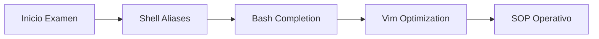

### 1.1. Optimización de la Shell (Bash)

Ejecute estas directivas inmediatamente al iniciar la sesión para habilitar el autocompletado y el alias universal `k`.

```bash
# Habilitar autocompletado de kubectl
source <(kubectl completion bash)
echo "source <(kubectl completion bash)" >> ~/.bashrc

# Alias universal y autocompletado para 'k'
alias k=kubectl
complete -F __start_kubectl k

# Variables de entorno críticas (Time-Savers)
export do="--dry-run=client -o yaml"
export now="--force --grace-period=0"
```

:::tip Uso de Variables
*   `k create deploy nginx $do > deploy.yaml`: Genera el manifiesto instantáneamente sin crear el recurso.
*   `k delete pod busybox $now`: Elimina el pod inmediatamente, saltándose el ciclo de terminación estándar (30s).
:::

---

## 2. Configuración del Editor de Texto (Vim)

Kubernetes depende de la indentación YAML. Un archivo `.vimrc` mal configurado es la principal causa de fallos en el examen.

Cree o edite el archivo `~/.vimrc`:

```vim
set ts=2        " Tab size a 2 espacios
set sw=2        " Shift width a 2 espacios
set et          " Expand tabs (usa espacios en lugar de tabs reales)
set nu          " Mostrar números de línea para depurar errores de YAML
set sts=2       " Soft tab stop
```

:::caution Validación de YAML
Si al pegar un manifiesto el código se "desplaza" hacia la derecha, ejecute `:set paste` dentro de Vim antes de pegar, y `:set nopaste` después.
:::

---

## 3. Comandos de Inspección Forense

Memorice estas variaciones para evitar el uso excesivo de `describe`, que genera un output demasiado extenso.

<Tabs>
  <TabItem value="inspeccion" label="Inspección Rápida" default>

```bash
# Ver recursos con labels (clave para NetworkPolicies y Services)
k get pods --show-labels

# Listar eventos ordenados por tiempo (clave para Troubleshooting)
k get events --sort-by=.metadata.creationTimestamp

# Ver consumo de recursos (Requiere Metrics Server)
k top nodes
k top pods --containers
```

  </TabItem>
  <TabItem value="contexto" label="Gestión de Contextos">

El examen requiere saltar entre múltiples clústeres. No pierda tiempo escribiendo el nombre completo.

```bash
# Cambiar de contexto rápidamente
k config use-context <nombre-del-cluster>

# Listar todos los contextos actuales
k config get-contexts
```

  </TabItem>
</Tabs>

---

## 4. Cheat Sheet de Comandos Imperativos

Priorice siempre la creación imperativa para generar la base del YAML.

| Acción | Comando Imperativo |
| :--- | :--- |
| **Pod** | `k run nginx --image=nginx $do` |
| **Deployment** | `k create deploy web --image=nginx --replicas=3 $do` |
| **Service** | `k expose pod nginx --port=80 --name=nginx-svc $do` |
| **Job** | `k create job test --image=busybox $do -- bin/sh -c "echo Hi"` |
| **CronJob** | `k create cj test --image=busybox --schedule="*/1 * * * *" $do` |

## 5. Conclusión Operativa

Este alistamiento no es opcional; es la infraestructura mínima para un Administrador de Kubernetes Senior. La práctica diaria de estos comandos reduce el error humano y permite centrarse en la resolución de problemas lógicos del clúster.

---
_Enlace Interno Recomendado:_ [Estrategia de Ramas para Manifiestos](../../engineering-standards/version-control/git-branching-model.mdx) | [Protocolo de Ingestión Semántica](../../engineering-standards/ai-protocols/document-ingestion-pipeline.mdx)

```

---

## Contenido archivo: `docs/platform-engineering/certification-lab/cka-terminal-productivity.mdx`

```bash
$ cat docs/platform-engineering/certification-lab/cka-terminal-productivity.mdx
---
id: cka-terminal-productivity
title: "SOP: Ingeniería de la Productividad en Terminal (CKA)"
sidebar_label: "Productividad y Aliases"
sidebar_position: 20
description: "Estándar operativo para maximizar el throughput de comandos y gestión de latencia humana en entornos críticos de Kubernetes."
tags: [Kubernetes, CKA, Productivity, Linux, DevOps]
---

import Tabs from '@theme/Tabs';
import TabItem from '@theme/TabItem';

# Ingeniería de la Productividad en Terminal

En un escenario de **Alta Disponibilidad** o durante la certificación **CKA**, la latencia humana (el tiempo que tardas en escribir y corregir comandos) es el principal cuello de botella. Este estándar establece un entorno de terminal optimizado para reducir la carga cognitiva y el error táctico.

## 1. Perfil Operativo de Shell (`.bashrc`)

La configuración de la shell no es un lujo, sino un **acelerador de entrega**. El objetivo es minimizar los *keystrokes* (pulsaciones de teclas) mediante una arquitectura de aliases jerárquica.

### 1.1. Aliases de Inspección y Despliegue
Añada estas definiciones al archivo `~/.bashrc` para habilitar una navegación fluida entre recursos:

```bash title="~/.bashrc"
# Abstracción Core
alias k='kubectl'

# Get Resources (Read-Only Ops)
alias kgp='k get pods'
alias kgs='k get svc'
alias kgd='k get deploy'
alias kgn='k get nodes'
alias kga='k get all'

# Context & Namespace Management (High Frequency)
# Uso: kns development
alias kns='k config set-context --current --namespace'

# Velocidad de Ejecución (Environment Variables)
export do="--dry-run=client -o yaml"
export now="--force --grace-period=0"

# Inyección de Autocompletado (Crítico)
source <(kubectl completion bash)
complete -o default -F __start_kubectl k
```

:::warning Validación de Contexto
El alias `kns` modifica el contexto actual permanentemente. Antes de ejecutar comandos destructivos, valide siempre el namespace actual con:
`k config view --minify | grep namespace`
:::

---

## 2. Configuración del Entorno de Edición (Vim)

Kubernetes es, en esencia, gestión de estado mediante **YAML**. Un editor mal configurado es un riesgo sistémico. El siguiente protocolo garantiza que Vim se comporte como un validador de sintaxis básico.

```bash title="Inicialización de .vimrc"
cat <<EOF > ~/.vimrc
set tabstop=2       # Indentación estándar YAML
set shiftwidth=2    # Espaciado de flujo
set expandtab       # Conversión de Tabs a Espacios (Obligatorio)
set nu              # Referenciación por línea para Troubleshooting
syntax on           # Resaltado sintáctico de objetos K8s
set cursorline      # Localización visual rápida
EOF
```

---

## 3. Workflow de Resolución: El Método "Imperativo-First"

Un Administrador Senior no escribe archivos YAML desde cero. El flujo de trabajo debe seguir una arquitectura de **Generación -> Edición -> Aplicación**.

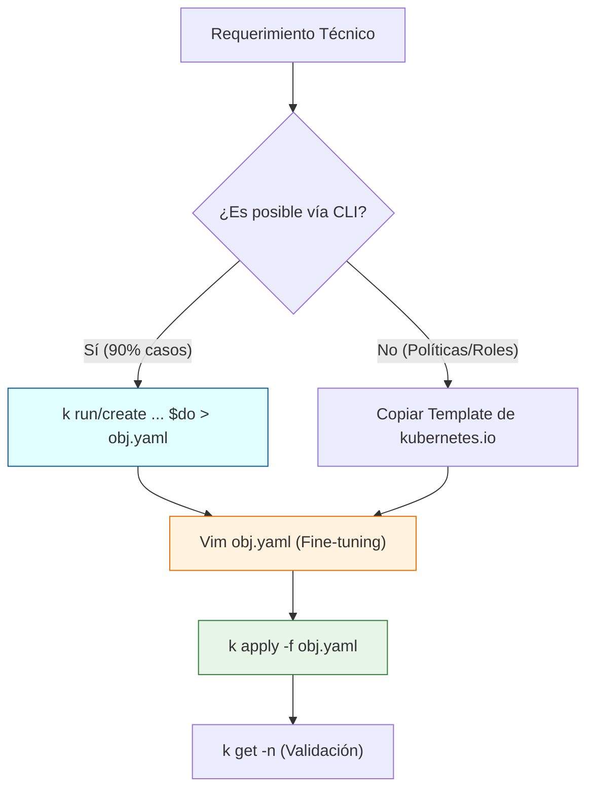

---

## 4. Protocolos de Supervivencia y Diagnóstico

### A. Gestión de Ciclo de Vida Acelerado
En entornos de examen o incidentes en vivo, el tiempo de espera por defecto (30s) para eliminar pods es inaceptable.

```bash
# Borrado instantáneo (Skip Grace Period)
k delete pod <pod_name> $now
```

### B. Descubrimiento Semántico de Recursos
Cuando la estructura de un objeto es incierta, utilice el motor de documentación interno en lugar de fuentes externas.

<Tabs>
  <TabItem value="explain" label="Exploración de Campos" default>

```bash
# Navegación jerárquica de la API
k explain pod.spec.containers.livenessProbe
```

  </TabItem>
  <TabItem value="labels" label="Filtrado por Etiquetas">

```bash
# Crucial para NetworkPolicies y Services
k get pods --show-labels
k get pods -l app=nginx
```

  </TabItem>
</Tabs>

## 5. Conclusión de Arquitectura
La adopción de estos estándares permite al ingeniero centrarse en la **lógica del clúster** y no en la **sintaxis de la herramienta**. La maestría en la terminal es la base de la observabilidad y el mantenimiento preventivo.

---
**Documentación Relacionada:**
- [SOP: Bootstrap del Entorno CKA](./cka-environment-bootstrap.mdx)
- [Gestión de Runtimes: Node.js](../../sysadmin-linux/runtimes/node-runtime-setup.mdx)
- [Estándares de Git y Conventional Commits](../../engineering-standards/version-control/git-conventional-commits.mdx)

```

---

## Contenido archivo: `docs/platform-engineering/certification-lab/k8s-cluster-bootstrap-calico.mdx`

```bash
$ cat docs/platform-engineering/certification-lab/k8s-cluster-bootstrap-calico.mdx
---
id: k8s-cluster-bootstrap-calico
title: "SOP: Orquestación de Clúster y Networking (Calico)"
sidebar_label: "Bootstrap y CNI"
sidebar_position: 50
#slug: /platform-engineering/k8s-cluster-bootstrap-calico
---

import Tabs from '@theme/Tabs';
import TabItem from '@theme/TabItem';

# Orquestación de Clúster y Networking

Este estándar detalla la inicialización del **Control Plane** y la implementación de **Calico** como solución de CNI (Container Network Interface) de grado empresarial para el cumplimiento de políticas de seguridad.

## 1. Inicialización del Control Plane

Utilizamos un CIDR específico para pods que evite solapamientos con la red física de la estación de trabajo (Victus).

```bash title="Master-01: Bootstrap"
# Inicialización con CIDR recomendado por Tigera/Calico
sudo kubeadm init --pod-network-cidr=192.168.0.0/16 --node-name master-01
```

### Configuración del Contexto Operativo (Kubeconfig)
Protocolo para habilitar la administración remota sin privilegios de superusuario:

```bash
mkdir -p $HOME/.kube
sudo cp -i /etc/kubernetes/admin.conf $HOME/.kube/config
sudo chown $(id -u):$(id -g) $HOME/.kube/config
```

---

## 2. Implementación de Networking (Calico CNI)

A diferencia de soluciones básicas como Flannel, implementamos Calico mediante el modelo de **Operadores**, lo que permite una gestión del ciclo de vida de la red mucho más robusta.

```bash title="Instalación vía Tigera Operator"
# 1. Despliegue del Operador
kubectl create -f https://raw.githubusercontent.com/projectcalico/calico/v3.27.3/manifests/tigera-operator.yaml

# 2. Aplicación de Custom Resources (Definición de Red)
kubectl create -f https://raw.githubusercontent.com/projectcalico/calico/v3.27.3/manifests/custom-resources.yaml
```

---

## 3. Protocolo de Unión de Nodos (Worker Join)

<Tabs>
  <TabItem value="join" label="Comando de Unión" default>

Ejecute el token generado en cada nodo Worker. En caso de expiración del token (24h), genere uno nuevo:
```bash
kubeadm token create --print-join-command
```

  </TabItem>
  <TabItem value="verify" label="Validación de Salud">

```bash
# Verificación de Nodos en estado Ready
kubectl get nodes -o wide

# Verificación de la malla de red
kubectl get pods -n calico-system
```

  </TabItem>
</Tabs>

:::tip Senior Insights: ¿Por qué Calico?
Implementamos Calico sobre Flannel porque en entornos de producción la seguridad es prioritaria. Calico permite el uso de **Network Policies**, habilitando el aislamiento de tráfico a nivel de L3/L4, requisito indispensable para cualquier arquitectura bajo cumplimiento (Compliance).
:::

---
**Documentación Relacionada:**
- [SOP: Ingeniería de la Productividad (Aliases)](./cka-terminal-productivity.mdx)
- [SOP: Gestión Programática de Pipelines](../../engineering-standards/version-control/gitlab-api-pipeline-cleanup.mdx)

```

---

## Contenido archivo: `docs/platform-engineering/certification-lab/k8s-binaries-install.mdx`

```bash
$ cat docs/platform-engineering/certification-lab/k8s-binaries-install.mdx
---
id: k8s-binaries-install
title: "SOP: Despliegue de la Toolchain de Kubernetes"
sidebar_label: "Instalación de Binarios"
sidebar_position: 40
#slug: /platform-engineering/k8s-binaries-install
description: "Protocolo de instalación de kubeadm, kubelet y kubectl utilizando el script de provisión centralizado."
---

import CodeBlock from '@theme/CodeBlock';
import RepoScript from '!!raw-loader!@site/scripts/setup/k8s-repo-setup.sh';

# Despliegue de la Toolchain de Kubernetes

Este procedimiento describe la instalación de los binarios fundamentales en todos los nodos del clúster. Para garantizar la consistencia, utilizamos el script de provisión alojado en la raíz del repositorio.

## 1. Sincronización de Repositorios Oficiales

Utilizamos la arquitectura de **Single Source of Truth** importando el script de setup:

<CodeBlock language="bash" title="scripts/setup/k8s-repo-setup.sh">
  {RepoScript}
</CodeBlock>

---

## 2. Provisión de Herramientas Core

Instalamos los tres componentes base y aplicamos una política de **Versioning Pinning** para evitar actualizaciones no controladas que puedan comprometer la disponibilidad del clúster.

```bash title="Instalación y Bloqueo de Versión"
sudo apt install -y kubelet kubeadm kubectl

# Prevención de actualizaciones accidentales vía apt upgrade
sudo apt-mark hold kubelet kubeadm kubectl
```

---

## 3. Matriz de Componentes

| Herramienta | Función Arquitectónica | Modo de Operación |
| :--- | :--- | :--- |
| **kubeadm** | Orquestador de Bootstrap | CLI Temporal |
| **kubelet** | Agente de Nodo (Cerebro local) | Daemon (Systemd) |
| **kubectl** | Interfaz de API Management | Usuario Final / CI/CD |

:::info Verificación de Salud
Tras la instalación, valide que el servicio `kubelet` esté en estado `active (running)` o en bucle de reinicio (esperando el `kubeadm init`), pero nunca en estado `masked` o `disabled`.
:::

---
**Documentación Relacionada:**
- [SOP: Bootstrap del Clúster (Calico)](./k8s-cluster-bootstrap-calico.mdx)
- [Estrategia de Ramas](../../engineering-standards/version-control/git-branching-model.mdx)

```

---

## Contenido archivo: `docs/platform-engineering/certification-lab/k8s-os-runtime-prep.mdx`

```bash
$ cat docs/platform-engineering/certification-lab/k8s-os-runtime-prep.mdx
---
id: k8s-os-runtime-prep
title: "SOP: Hardening de OS y Provisión de Runtime"
sidebar_label: "Preparación de Nodos"
sidebar_position: 30
#slug: /platform-engineering/k8s-os-runtime-prep
description: "Protocolo de pre-configuración de nodos Ubuntu 24.04 para clústeres de Kubernetes v1.35."
tags: [Kubernetes, containerd, SysAdmin, Linux]
---

# Hardening de OS y Provisión de Runtime

Este estándar define los requisitos mínimos de infraestructura y configuración del Kernel necesarios para garantizar la estabilidad de un nodo en un clúster de Kubernetes v1.35.

## 1. Alineación de Prerrequisitos

Antes de la inyección de binarios, cada nodo debe cumplir con el estado de "Arquitectura Limpia":
- **Swap Management:** Desactivación total para predictibilidad del Scheduler.
- **Identidad de Red:** Hostnames únicos y MAC addresses persistentes.

```bash title="Desactivación de Swap"
sudo swapoff -a
# Persistencia post-reboot
sudo sed -i '/swap/s/^/#/' /etc/fstab
```

---

## 2. Configuración de Capas de Red (Kernel)

Kubernetes requiere que el tráfico de los puentes (bridges) sea visible para las iptables y que el reenvío de IP esté habilitado a nivel de sistema.

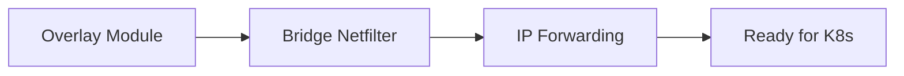

```bash title="Inyección de Módulos y Sysctl"
# Carga de módulos de red
cat <<EOF | sudo tee /etc/modules-load.d/k8s.conf
overlay
br_netfilter
EOF

sudo modprobe overlay
sudo modprobe br_netfilter

# Parámetros de red persistentes
cat <<EOF | sudo tee /etc/sysctl.d/k8s.conf
net.bridge.bridge-nf-call-iptables  = 1
net.bridge.bridge-nf-call-ip6tables = 1
net.ipv4.ip_forward                 = 1
EOF

sudo sysctl --system
```

---

## 3. Implementación del Container Runtime (CRI)

Utilizamos **containerd** como estándar de industria. El punto crítico de este paso es la alineación del driver de **cgroup** con el gestor del sistema operativo (systemd).

```bash title="Instalación y Optimización de containerd"
sudo apt update && sudo apt install -y containerd

# Generación de configuración estándar de ingeniería
sudo mkdir -p /etc/containerd
containerd config default | sudo tee /etc/containerd/config.toml > /dev/null

# Alineación con SystemdCgroup (Obligatorio para Ubuntu 24.04)
sudo sed -i 's/SystemdCgroup = false/SystemdCgroup = true/' /etc/containerd/config.toml
sudo systemctl restart containerd
```

:::warning Validación Crítica
Si el driver de cgroup de `containerd` no coincide con el de `kubelet` (ambos deben ser `systemd`), el clúster experimentará fallos de estabilidad aleatorios y reinicios del kubelet.
:::

---
**Documentación Relacionada:**
- [SOP: Provisión de Binarios K8s](./k8s-binaries-install.mdx)
- [Gestión de Dotfiles](../../sysadmin-linux/terminal-tools/dotfiles-management.mdx)


```

---

## Contenido archivo: `docs/platform-engineering/index.mdx`

```bash
$ cat docs/platform-engineering/index.mdx
---
id: index
sidebar_position: 1
title: "Roadmap de Ingeniería de Plataforma"
sidebar_label: "Roadmap & Objetivos"
description: "Estrategias de administración de clústeres, seguridad y orquestación de contenedores."
---

import DocCardList from '@theme/DocCardList';

# Ingeniería de Plataforma

Bienvenido al dominio de **Platform Engineering**. Esta sección centraliza los estándares operativos, diseños de arquitectura y protocolos de automatización necesarios para gestionar infraestructuras modernas basadas en Kubernetes y ecosistemas nativos de la nube.

## Objetivos de la Sección
*   **Certificación CKA:** Preparación técnica profunda para la administración de clústeres Kubernetes.
*   **Estandarización de SOPs:** Procedimientos para despliegues, seguridad y observabilidad.
*   **Arquitectura de Infraestructura:** Diseño de soluciones escalables y resilientes.

---

## Explorar Contenidos
A continuación, se presentan los módulos y laboratorios disponibles en este dominio:

<DocCardList />

:::tip Próximamente
Estamos integrando nuevas guías sobre **Helm Charts**, **Ingress Controllers** y **Hardening de Clústeres**.
:::

```

---

## Contenido archivo: `docs/data-engineering/cloudera-administration/hdfs-operations-guide.mdx`

```bash
$ cat docs/data-engineering/cloudera-administration/hdfs-operations-guide.mdx
---
id: hdfs-operations-guide
title: "HDFS: Guía de Operaciones CLI"
sidebar_label: "Operaciones HDFS (CLI)"
sidebar_position: 60
description: "Manual de comandos de usuario y administración para la gestión de archivos en HDFS."
tags: [HDFS, CLI, Operations, SysAdmin]
---

import Tabs from '@theme/Tabs';
import TabItem from '@theme/TabItem';

# HDFS: Operaciones de CLI e Inspección Forense

Esta guía establece los procedimientos estándar para la interacción con la capa de almacenamiento de CDP, contrastando el uso de la línea de comandos con la inspección visual de interfaces administrativas.

## 1. Gestión de Privilegios y Acceso

Para ejecutar operaciones de nivel administrativo (como `chown` o gestión de cuotas), el usuario debe estar integrado en el grupo LDAP **`supergroup`**. Esto otorga facultades de superusuario sobre el NameNode y YARN.

## 2. Protocolos de Interacción

<Tabs>
  <TabItem value="cli" label="HDFS Shell (CLI)" default>

El comando `hdfs dfs` emula la sintaxis de Linux pero opera sobre un sistema de archivos distribuido.

| Comando | Función | Ejemplo de Uso |
| :--- | :--- | :--- |
| `put` | Ingesta de datos | `hdfs dfs -put data.csv /user/allan_admin/` |
| `setrep` | Cambio de replicación | `hdfs dfs -setrep -R -w 2 /data/` |
| `cat/head` | Inspección rápida | `hdfs dfs -head /data/file.txt` |
| `get` | Extracción | `hdfs dfs -get /hdfs/path /local/tmp/` |

:::tip User Variables
HDFS interpreta rutas relativas basándose en el directorio del usuario en `/user/$USER/`. No es necesario usar rutas absolutas si se opera dentro del propio home del clúster.
:::

  </TabItem>
  <TabItem value="webui" label="Web UI (Inspección)">

La inspección visual es obligatoria para validar la salud de los volúmenes y el estado de replicación de los bloques.

**Workflow de Acceso:**
1. Cloudera Manager Home > **HDFS Service**.
2. Diagnostics > **Web UI**.
3. Seleccionar **NameNode Web UI (Active)**.


*Referencia: Dashboard de salud y capacidad del clúster.*

  </TabItem>
</Tabs>

## 3. Procedimiento de Inspección de Bloques

Ante una degradación de servicio o sospecha de corrupción, se debe ejecutar una inspección a nivel de bloque:

1.  **Navegación:** Utilities > Browse the file system.
2.  **Localización:** Ingrese a la ruta del archivo (ej: `/user/allan_admin/data/`).
3.  **Análisis de Bloques:** Haga clic en el archivo para desplegar la metadata del bloque.


*Inspección forense de un bloque: Identificación de Block ID y DataNodes que alojan las réplicas.*

## 4. Diagnóstico de Alta Disponibilidad (Active vs Standby)

HDFS en CDP opera en modo de Alta Disponibilidad (HA). Solo un NameNode puede procesar peticiones de escritura/lectura.

:::caution Comportamiento de Standby
Si al intentar navegar por el sistema de archivos recibe el error:

`Operation category READ is not supported in state standby`

**Acción:** Cierre la pestaña y acceda a la UI del NameNode marcado como **Active** en Cloudera Manager.
:::

## 5. Mantenimiento del Sistema de Archivos

*   **Papelera:** Los archivos borrados se mueven a `.Trash`. Use `-skipTrash` con precaución extrema.
*   **Recuperación:** Los archivos pueden recuperarse de la papelera moviéndolos nuevamente al directorio de usuario:
    ```bash
    hdfs dfs -mv .Trash/Current/user/allan_admin/file.txt /user/allan_admin/
    ```

---
_Referencia Técnica: CDP ADMIN-230 - Module 21-02 & 21-03_

```

---

## Contenido archivo: `docs/data-engineering/cloudera-administration/hdfs-storage-governance.mdx`

```bash
$ cat docs/data-engineering/cloudera-administration/hdfs-storage-governance.mdx
---
id: hdfs-storage-governance
title: "HDFS: Gobernanza de Almacenamiento y Resiliencia de Metadatos"
sidebar_label: "Gobernanza de HDFS"
sidebar_position: 120
description: "Análisis profundo sobre el ciclo de vida de metadatos, umbrales de capacidad y estrategias de balanceo en clústeres CDP."
tags: [HDFS, Metadata, Governance, Architecture, CDP]
---

# Gobernanza de Almacenamiento y Resiliencia de Metadatos

En infraestructuras CDP de misión crítica, la gestión de HDFS trasciende el simple almacenamiento de archivos. Requiere una estrategia proactiva para mantener la integridad de los metadatos y la distribución equilibrada de los bloques de datos.

## 1. Ciclo de Vida de Metadatos: El Checkpoint de fsimage

El NameNode mantiene el estado del sistema de archivos en memoria. Para garantizar la persistencia y la recuperación rápida, HDFS utiliza un proceso de consolidación entre el **fsimage** (snapshot estático) y los **Edit Logs** (transacciones en tiempo real). El NameNode coordina la persistencia mediante la fusión del **fsimage** y los **Edit Logs**. En CDP, el **Reports Manager** monitoriza este proceso.

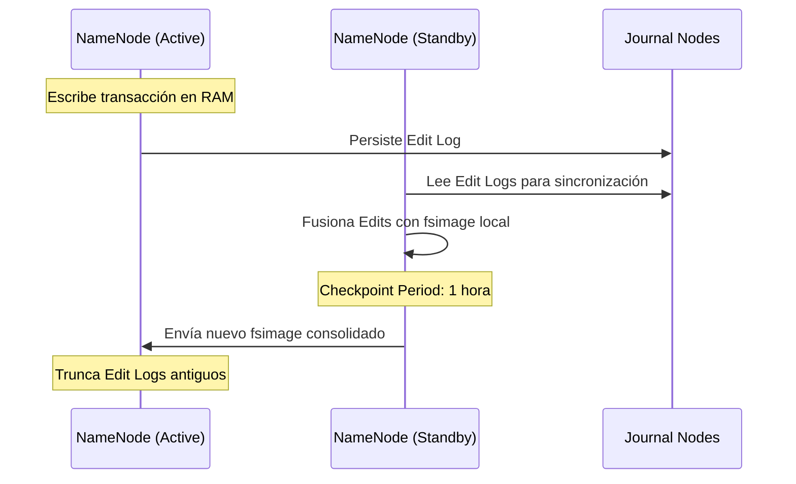

:::info Impacto Administrativo
Un NameNode con Edit Logs masivos no consolidados resultará en tiempos de arranque (*Startup*) prohibitivos, afectando los acuerdos de nivel de servicio (SLA).
:::

:::warning Alerta de Operación
Si el proceso de consolidación falla, Cloudera Manager reportará un estado de **Concerning** o **Bad** en el health check: *"The aging of the last checkpoint is... hours"*.
:::

## 2. Umbrales de Capacidad y Alertas Críticas

Como administradores, operamos bajo el concepto de **Capacity "Ungood"** para prevenir paradas del clúster por saturación de disco. La Web UI de Cloudera Manager utiliza un código de colores y estados estandarizados:

| CM Health Status (Estado de Salud) | Acción Requerida | Capacidad Usada | Nota |
| :--- | :--- | :--- | :--- |
| 🟢 **Good** (saludable) | Monitoreo estándar | < 60% | Saludable |
| 🟡 **Concerning** (Advertencia) | **Action Required:** Limpieza o expansión | 70% - 80% | Advertencia |
| 🔴 **Bad** (Crítico)| **Urgent Action:** Eliminación de datos | > 80% | Crítico |
| 🛑 **Critical** (Fallo Inminente) | **Crisis Action:** El sistema puede entrar en modo Read-only | > 90% | Fallo Inminente |

:::danger Relación 1:4
Recuerde que en producción, **1 TB de datos netos requiere 4 TB de almacenamiento bruto** (Replicación x3 + 25% overhead para logs y archivos temporales de YARN).
:::

## 3. Estrategias de Rebalanceo (HDFS Balancer)

El balanceo de datos no es automático tras añadir nuevos DataNodes. El administrador debe orquestar el proceso para evitar puntos calientes (*Hotspots*) de E/S. Cuando la distribución de bloques es asimétrica, CM marcará los DataNodes con una alerta de **Unbalanced Cluster**.

*   **Rebalance Waterline:** El Balancer mueve bloques desde nodos que exceden el promedio del clúster hacia nodos con menor ocupación.
*   **Threshold (Umbral):** Por defecto es **10%**. Significa que ningún nodo debe estar un 10% más lleno que el promedio global.

{/*
*   **Balancer Threshold:** Diferencia porcentual máxima permitida (Default: 10%).
*   **Rebalance Operation:** Se ejecuta desde **HDFS > Actions > Rebalance**.
*/}

---
_Enlace Interno:_ [Consulte la Arquitectura Core de HDFS](./hdfs-architecture-principles.mdx) para entender la fragmentación de bloques.
```

---

## Contenido archivo: `docs/data-engineering/cloudera-administration/hdfs-architecture-principles.mdx`

```bash
$ cat docs/data-engineering/cloudera-administration/hdfs-architecture-principles.mdx
---
id: hdfs-architecture-principles
title: "HDFS: Arquitectura y Principios de Diseño"
sidebar_label: "Arquitectura de HDFS"
sidebar_position: 30
description: "Principios de inmutabilidad, Data Locality y gestión de bloques en HDFS."
tags: [HDFS, Architecture, Big Data, Storage]
---

# HDFS: Arquitectura y Principios de Diseño Enterprise

En el ecosistema Cloudera Data Platform (CDP), el **Hadoop Distributed File System (HDFS)** no es simplemente un sistema de archivos, sino una capa de persistencia distribuida diseñada para el procesamiento masivo de datos bajo el paradigma de "Data Locality".

## 1. Mantras y Filosofía de Diseño

La arquitectura de HDFS se basa en premisas de ingeniería que priorizan la disponibilidad y el rendimiento secuencial sobre la latencia de acceso aleatorio.

:::info Principios de Ingeniería (Mantra)
*   **Smart Software, Utility Hardware:** La inteligencia reside en la capa de software, permitiendo el despliegue sobre hardware comercial (*commodity*).
*   **Data Locality:** Es más eficiente mover el código (procesamiento) hacia los datos que viceversa.
*   **Write-Once, Read-Many:** Optimizado para flujos de trabajo de análisis de datos persistentes.
:::

## 2. Topología HDFS y Orquestación YARN

La integración de HDFS con YARN es fundamental para la supercomputación distribuida. Mientras HDFS gestiona la **Localidad de Datos**, YARN gestiona la **Localidad de Cómputo**.

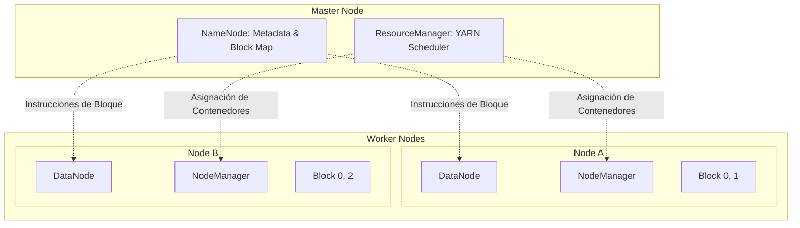

## 3. Mecánica de Bloques y Replicación

HDFS fragmenta los archivos en bloques de datos (Default: **128MB**).

1.  **Inmutabilidad:** Los bloques son inmutables para garantizar la integridad del checksum.
2.  **Validación Forense:** Cada bloque se valida mediante sumas de comprobación (*checksums*) durante la lectura para detectar corrupciones de disco de forma proactiva.
3.  **Tolerancia a Fallos:** El factor de replicación (default 3) asegura que el sistema pueda perder nodos enteros sin interrupción del servicio.

## 4. Riesgos Arquitectónicos: Small File Syndrome

Como administradores, el mayor riesgo para la estabilidad del NameNode es la proliferación de archivos pequeños.

:::danger Impacto en el Heap Space
El NameNode es un proceso **In-Memory**. Cada objeto (archivo, directorio o bloque) ocupa ~150 bytes en la memoria RAM del NameNode.
*   **Síndrome:** Millones de archivos de 1MB saturan el Heap Space mucho antes de agotar el almacenamiento físico.
*   **Consecuencia:** Degradación severa en las búsquedas (NN Lookups) y fallos críticos en la gestión de recursos de YARN.
:::

---
_Referencia Técnica: CDP ADMIN-230 - Module 21-01_

```

---

## Contenido archivo: `docs/data-engineering/cloudera-administration/cdp-logs-taxonomy-rca.md`

```bash
$ cat docs/data-engineering/cloudera-administration/cdp-logs-taxonomy-rca.md
---
id: cdp-logs-rca
title: "Taxonomía de Logs y Análisis de Causa Raíz (RCA)"
sidebar_label: "Inspección de Logs (RCA)"
sidebar_position: 20
description: "Gestión forense de registros y metodologías de troubleshooting en Cloudera Manager."
tags: [Troubleshooting, Logs, RCA, CDP]
---

# Taxonomía y Metodologías de Inspección de Logs en Cloudera Data Platform (CDP)

En la arquitectura de **Cloudera Data Platform (CDP)**, la gestión y el análisis de registros (logs) constituyen la infraestructura crítica para la observabilidad. El presente reporte establece el marco teórico y procedimental para la inspección forense de logs.

:::info Fuente Técnica
Contenido educido del módulo **ADMIN-230: Administrating Cloudera Data Platform**, orientado a la certificación de administrador.
:::

## 1. Taxonomía de los Registros del Sistema

La telemetría en CDP se organiza en categorías fundamentales, cada una cumpliendo un rol específico en la gobernanza:

| Categoría | Función Principal | Detalle Técnico |
| :--- | :--- | :--- |
| **Hadoop Daemons** | Base del ecosistema | `.log` (runtime) vs `.out` (boot-time/startup). |
| **CM Server Logs** | Orquestación central | Documenta la coordinación de configuraciones y salud global. |
| **CM Agent Logs** | Ejecución en nodos | Seguimiento de comandos a nivel de host y *health checks*. |
| **Audit Logs** | Gobernanza Administrativa | Rastrean cambios de configuración y acciones de usuarios en CM. |
| **Audit Event Logs** | Seguridad de Datos | Documentan acceso a HDFS y cumplimiento de políticas (*compliance*). |
| **Service Daemons** | Roles críticos | Visibilidad interna de NameNode, ResourceManager, etc. |
| **Application Logs** | Capa de Usuario | Logs activos en Web UI e históricos persistidos en HDFS. |

:::tip Diferencia Crítica: .log vs .out
Los archivos **.out** capturan la salida estándar durante el arranque y son truncados. Si un servicio falla al iniciar y no llega a escribir en el `.log`, el archivo `.out` es su única fuente de verdad.
:::

## 2. Estándares de Nomenclatura y Rutas

| Tipo de Log | Estándar de Ruta / Nomenclatura |
| :--- | :--- |
| **CM Server** | `/var/log/cloudera-scm-server/cloudera-scm-server.log` |
| **CM Agent** | `/var/log/cloudera-scm-agent/cloudera-scm-agent.log` |
| **Audit HDFS** | `/var/log/hadoop-hdfs/hdfs-audit.log` |
| **Service Logs** | `/var/log/<service-name>/` |

## 3. Metodologías de Inspección

### A. Vía Web UI (Cloudera Manager)
Ideal para **monitoreo visual y correlación rápida**.
* **Ruta:** `Diagnostics` > `Logs`.
* **Ventajas:** Filtrado multi-host, búsqueda por palabras clave (`ERROR`, `FATAL`) y salto rápido entre roles de un mismo host.

### B. Vía CLI (Línea de Comandos)
Protocolo estándar para **Análisis de Causa Raíz (RCA) profundo**.
* **Requerimiento:** Conexión SSH y privilegios de `root`.
* **Herramientas:** `less`, `grep`, `tail -f`, `vi`.
* **Artefactos extra:** Acceso a directorios `jstacks*` (thread dumps) para diagnosticar procesos colgados (*hung processes*).

## 4. Procedimiento Operativo de RCA (Ejemplo: Spark3)

Ante un fallo en el **Spark3 History Server**, siga este flujo lógico:

1. **Aislamiento:** En Cloudera Manager, localice la instancia del History Server con salud degradada.
2. **Localización:** Use `Log Files` > `Role Log File` en la UI para identificar la **ruta física** en el host.
3. **Acceso:** Conéctese vía SSH al host identificado (ej. `edge.example.com`).
4. **Escalamiento:** Ejecute `sudo su -l`.
5. **Exploración:** 
   ```bash
   cd /var/log/spark3
   ls -la
   ```
6. **Diagnóstico:** Busque excepciones de Java o errores de configuración:
   ```bash
   less spark3-history-server-edge.example.com.log
   ```

## 5. Conclusiones para el Administrador Senior

* **Dicotomía de Diagnóstico:** Diferenciar `.log` de `.out` ahorra horas en incidentes de arranque.
* **Correlación:** Use la Web UI para localizar el error y la CLI para el análisis técnico definitivo.
* **Persistencia:** La jerarquía en `/var/log/` es el último recurso de recuperación ante caídas de los servicios de monitoreo.

```

---

## Contenido archivo: `docs/data-engineering/cloudera-administration/hdfs-storage-defense-architecture.mdx`

```bash
$ cat docs/data-engineering/cloudera-administration/hdfs-storage-defense-architecture.mdx
---
id: hdfs-storage-defense-architecture
title: "HDFS: Cuotas, Balanceo y Defensa de Datos"
sidebar_label: "Defensa y Cuotas HDFS"
sidebar_position: 70
description: "Mecanismos de protección: Cuotas de nombre/espacio y estrategias de rebalanceo de bloques."
tags: [HDFS, Security, Quotas, Balancer, Defense]
---

# HDFS: Arquitectura de Defensa y Consistencia

La estabilidad de un cluster CDP no depende solo del hardware, sino de la implementación de límites lógicos y procesos de mantenimiento de metadatos. Como administradores, nuestra función es actuar como la **primera línea de defensa** de la integridad de los datos.

## 1. El Ciclo de Vida de los Metadatos: Checkpointing

El NameNode gestiona la persistencia de la estructura del sistema de archivos mediante dos artefactos críticos: el **fsimage** (estado consolidado) y los **Edit Logs** (transacciones recientes).

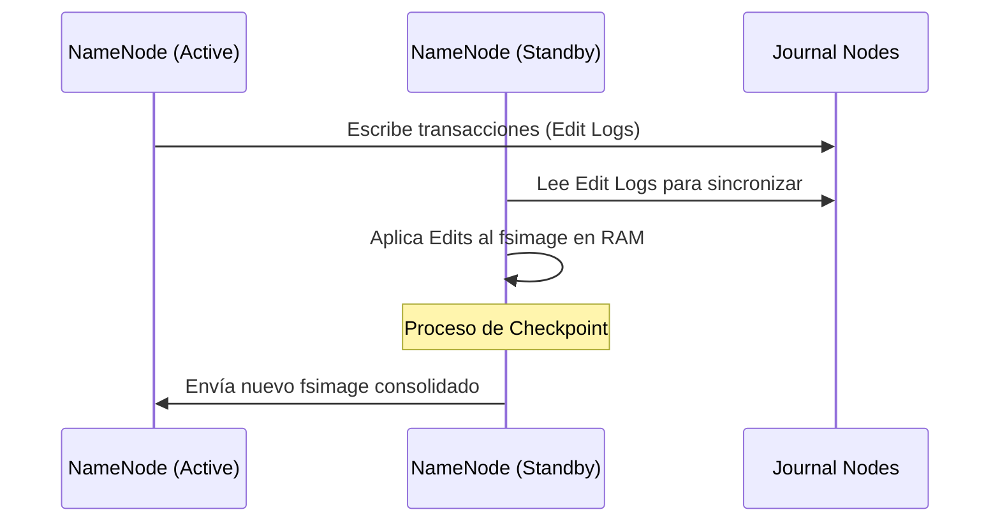

:::caution Importancia del RollEdits
Si los Edit Logs crecen indefinidamente sin consolidarse en un `fsimage`, el tiempo de arranque del NameNode tras un fallo será prohibitivo. En CDP, el **Reports Manager** automatiza este proceso cada hora (por defecto).
:::

## 2. Estrategias de Cuotas de Almacenamiento

Existen dos vectores de restricción de recursos para prevenir que un usuario o aplicación sature el cluster:

| Tipo de Cuota | Descripción Técnica | Fallo Típico |
| :--- | :--- | :--- |
| **Name Quota** | Límite de número de archivos y directorios. | `NSQuotaExceededException` |
| **Space Quota** | Límite de bytes físicos consumidos (considerando réplicas). | `DSQuotaExceededException` |

:::danger Regla de Cálculo de Espacio
Si un archivo de 1GB tiene un factor de replicación de 3, la **Space Quota** debe permitir al menos 3GB de consumo. No monitorizar esto causa fallos en pipelines de ingesta.
:::

## 3. Dinámica de Rebalanceo del Cluster

El **HDFS Balancer** es la herramienta encargada de redistribuir los bloques cuando existe una desviación en el uso de disco entre DataNodes.

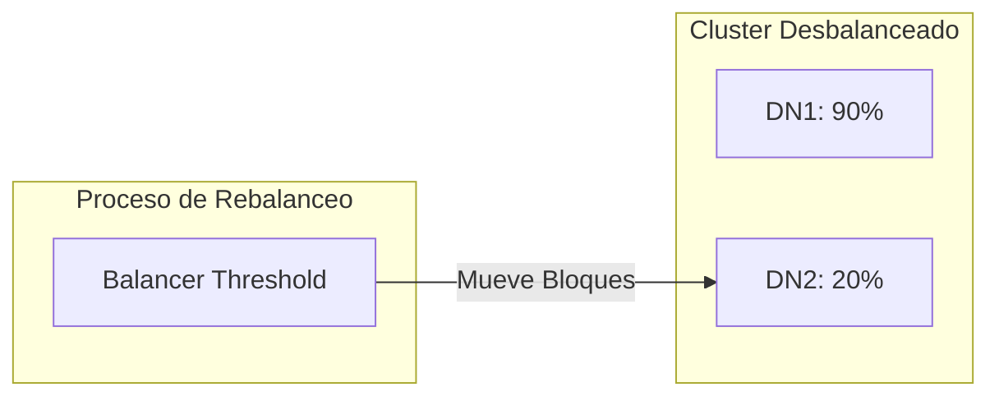

*   **Threshold:** Se define como la diferencia porcentual máxima permitida entre el nodo más lleno y el promedio del cluster (Default: 10%).
*   **Waterlines:** Un uso superior al 80% requiere acción inmediata; al 90%, el sistema corre riesgo inminente de stop por falta de espacio para bloques temporales.

---
_Referencia: CDP ADMIN-230 - Módulos 22-01 y 22-05_

```

---

## Contenido archivo: `docs/data-engineering/cloudera-administration/cdp-configuration-governance.mdx`

```bash
$ cat docs/data-engineering/cloudera-administration/cdp-configuration-governance.mdx
---
id: cdp-configuration-governance
title: "Gobernanza de Configuraciones: Modelo vs. Runtime"
sidebar_label: "Gobernanza Configuraciones"
sidebar_position: 40
description: "Análisis de la arquitectura de estados de Cloudera Manager y el ciclo de vida del cambio."
tags: [CDP, Governance, Cloudera Manager, Architecture]
---

# Gobernanza de Configuraciones y Ciclo de Vida del Cambio

En Cloudera Data Platform (CDP), la gestión de configuraciones no es una edición directa de archivos en disco. Se basa en una arquitectura de **Estados de Verdad** coordinada por Cloudera Manager (CM).

## 1. Dicotomía de Estados: Modelo vs. Runtime

La arquitectura de CM desacopla la intención del administrador de la ejecución real en el nodo.

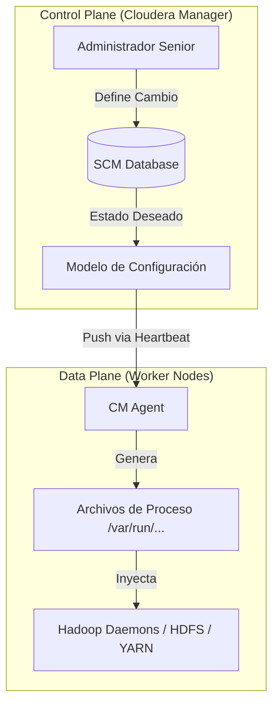

*   **Modelo (Model):** La configuración almacenada en la base de datos de CM. Es lo que "debería ser".
*   **Ejecución (Runtime):** Los procesos reales ejecutándose en los nodos. Un desfase entre estos dos estados genera una **Configuración Caduca (Stale Configuration)**.

## 2. Taxonomía y Precedencia de Archivos

El sistema de archivos de configuración sigue una jerarquía de herencia estricta para permitir la flexibilidad sin sacrificar la estandarización.

| Nivel | Tipo de Archivo | Origen | Alcance |
| :--- | :--- | :--- | :--- |
| **Default** | `*-default.xml` | JAR del Servicio | Valores de fábrica definidos por el desarrollador. |
| **Cluster** | `*-site.xml` | Cloudera Manager | Definiciones a nivel de clúster o servicio (override). |
| **Entorno** | `*-env.sh` | Bash Script | Configuraciones de JVM, Heap Memory y variables de entorno. |
| **Logging** | `log4j.properties` | Java Properties | Control de granularidad y retención de registros. |

:::info Regla de Precedencia
Una configuración definida a nivel de **Job (Cliente)** tiene prioridad sobre la del **Cluster**, la cual a su vez sobresale de los **Defaults**. Esto permite tunear aplicaciones específicas sin afectar la estabilidad global.
:::

## 3. Modo de Mantenimiento (Maintenance Mode)

Protocolo crítico para operaciones programadas. Al activar el Modo de Mantenimiento en un host o servicio:
1.  Se **suprimen las alertas** y health checks para evitar falsos positivos en el monitoreo.
2.  Se evita que el planificador de YARN asigne nuevas tareas a los nodos afectados.
3.  Permite realizar cambios de software o hardware bajo una ventana de riesgo controlada.

:::danger Riesgo de Cambio
Cualquier cambio fuera de una **Ventana de Mantenimiento (Outage Window)** debe ser evaluado mediante una matriz de impacto (Severidad vs. Probabilidad).
:::

---
_Enlace Interno Recomendado:_ [Consulte el SOP de Inspección de Logs](./cdp-logs-taxonomy-rca.md) para validar errores tras un cambio de configuración.

```

---

## Contenido archivo: `docs/data-engineering/cloudera-administration/hdfs-storage-management-sop.mdx`

```bash
$ cat docs/data-engineering/cloudera-administration/hdfs-storage-management-sop.mdx
---
id: hdfs-storage-management-sop
title: "HDFS: SOP de Gestión de Almacenamiento"
sidebar_label: "SOP Gestión de HDFS"
sidebar_position: 80
description: "Procedimientos para snapshots, políticas de retención y recuperación forense de datos."
tags: [Snapshots, SOP, Backup, HDFS, Recovery]
---

import Tabs from '@theme/Tabs';
import TabItem from '@theme/TabItem';

# SOP: Gestión y Defensa de Almacenamiento HDFS

Este Procedimiento Operativo Estándar (SOP) detalla las tareas de administración diaria para garantizar el aislamiento y la recuperabilidad en entornos CDP.

## 1. Aprovisionamiento de Directorios de Usuario

El aprovisionamiento debe realizarse mediante scripts de orquestación para asegurar los permisos adecuados.

<step>
1. **Ejecución del Script de Cuenta:**
   ```bash
   manage_hdfs_user.sh --add
   ```
2. **Validación de Estructura:**
   ```bash
   hdfs dfs -ls /user
   ```
</step>

## 2. Implementación de Cuotas y Snapshots

La defensa del almacenamiento se gestiona preferentemente desde Cloudera Manager para mantener la trazabilidad.

<Tabs>
  <TabItem value="cm" label="Cloudera Manager (UI)" default>

1. **Cuotas:** HDFS > File Browser > Seleccionar Directorio > **Edit Quota**.
   - Establecer *File Count Limit* y *Disk Space Limit*.
2. **Snapshots:** Seleccionar directorio > **Enable Snapshots** > **Take Snapshot**.
3. **Políticas:** Replication > Snapshot Policies para automatizar la retención (ej. mantener las últimas 3).


  </TabItem>
  <TabItem value="cli" label="Administración vía CLI">

Procedimiento manual para situaciones de emergencia o automatización:

```bash
# Habilitar snapshots en un path
hdfs dfsadmin -allowSnapshot /user/bo_biz

# Crear snapshot manual
hdfs dfs -createSnapshot /user/bo_biz second_snap

# Reporte de estado del cluster
hdfs dfsadmin -report
```

  </TabItem>
</Tabs>

## 3. Protocolo de Recuperación de Archivos

HDFS permite la recuperación forense mediante Snapshots o el sistema de Trash.

:::danger Refactorizando danger con Claude AI
Si un usuario elimina accidentalmente un archivo usando `-skipTrash`, la recuperación se realiza mediante un `cp` desde el directorio oculto:

```bash
hdfs dfs -cp /user/bo_biz/.snapshot/first_snap/latin.txt /user/bo_biz/
```
:::


:::info Refactorizando info con Claude AI
Si un usuario elimina accidentalmente un archivo usando `-skipTrash`, la recuperación se realiza mediante un `cp` desde el directorio oculto:

```bash
hdfs dfs -cp /user/bo_biz/.snapshot/first_snap/latin.txt /user/bo_biz/
```
:::

## 4. Mantenimiento Preventivo: El "Trash Interval"

Para evitar la pérdida accidental de datos, el administrador debe configurar el intervalo de persistencia en la papelera.

1.  **Configuración:** HDFS > Configuration > Buscar `trash`.
2.  **Parámetros:** 
    - `fs.trash.interval`: Tiempo de vida de los archivos borrados (ej: 8 horas).
    - `fs.trash.checkpoint.interval`: Frecuencia con la que el NameNode crea checkpoints de la papelera.

:::caution Limpieza Definitiva
El uso del comando `hdfs dfs -rm -skipTrash` elude este mecanismo y elimina los bloques de datos de forma inmediata y **no recuperable** (salvo existencia de Snapshot previo).
:::

## 5. Diagnóstico de Consistencia (`fsck`)

Ante sospechas de corrupción de bloques, se debe ejecutar la herramienta de chequeo de consistencia:

```bash
hdfs fsck /user/allan_admin/data/ -files -blocks -locations
```
Este comando reportará el **Block ID**, su ubicación física en los DataNodes y el estado de replicación actual.

---
_Referencia: Laboratorios CDP 22-02, 22-03, 22-04_

```

---

## Contenido archivo: `docs/data-engineering/cloudera-administration/hdfs-commands-cheatsheet.mdx`

```bash
$ cat docs/data-engineering/cloudera-administration/hdfs-commands-cheatsheet.mdx
---
id: hdfs-commands-cheatsheet
title: HDFS CLI Cheat Sheet
sidebar_label: HDFS Comandos (Cheat Sheet)
sidebar_position: 34
description: "Comando HDFS - Hadoop Distributed File System)."
tags: [HDFS, Architecture, Big Data, Storage]
---

# HDFS CLI Cheat Sheet

Guía rápida de comandos para la shell de HDFS (`hdfs dfs`). Todos los comandos se invocan a través del script de shell de HDFS.

## Sintaxis Básica
```bash
hdfs dfs <comando> [OPCIONES]
```

## Comandos de Sistema de Archivos (DFS)

| Comando | Descripción | Ejemplo |
| :--- | :--- | :--- |
| **-ls** | Lista los archivos y directorios. | `hdfs dfs -ls /user/centos` |
| **-mkdir** | Crea un nuevo directorio. | `hdfs dfs -mkdir /data` |
| **-put** | Sube un archivo local a HDFS. | `hdfs dfs -put local.txt /data/` |
| **-get** | Descarga un archivo de HDFS al sistema local. | `hdfs dfs -get /data/file.txt .` |
| **-cat** | Muestra el contenido de un archivo. | `hdfs dfs -cat /data/log.txt` |
| **-cp** | Copia archivos dentro de HDFS. | `hdfs dfs -cp /src /dest` |
| **-mv** | Mueve o renombra archivos en HDFS. | `hdfs dfs -mv /old /new` |
| **-rm** | Elimina un archivo o directorio. | `hdfs dfs -rm -r /tmp/data` |
| **-chmod** | Cambia permisos de un archivo/directorio. | `hdfs dfs -chmod 755 /data` |

## Otros Comandos Útiles de HDFS
* `hdfs classpath`: Muestra el classpath necesario para ejecutar aplicaciones Hadoop.
* `hdfs fsck`: Verifica la integridad del sistema de archivos (bloques corruptos o faltantes).
* `hdfs dfadmin`: Ejecuta comandos de administración del clúster.
* `hdfs balancer`: Ejecuta el balanceador de carga del clúster.

## Atributos de Archivos en HDFS
Al ejecutar `hdfs dfs -ls`, la salida muestra:
1. **Permissions:** (ej. `drwxr-xr-x`) - `d` para directorio, `-` para archivo.
2. **Replication Factor:** Número de copias (0 para directorios).
3. **Owner & Group:** Propietario y grupo del archivo.
4. **File Size:** Tamaño en bytes.
5. **Modification Date:** Fecha y hora de la última modificación.
6. **Name:** Ruta absoluta del archivo.

:::tip Nota sobre Rutas
HDFS utiliza rutas absolutas. No existe el comando `cd` en la shell de HDFS. Siempre debes referenciar la ruta completa o el sistema usará `/user/<username>` por defecto.
:::

```

---

## Contenido archivo: `docs/data-engineering/cloudera-administration/index.mdx`

```bash
$ cat docs/data-engineering/cloudera-administration/index.mdx
---
id: cloudera-admin-index
title: "Administración de CDP: Roadmap y Fundamentos"
sidebar_label: "Introducción y Roadmap"
sidebar_position: 10
description: "Sinopsis y objetivos técnicos del curso Administrating Cloudera Data Platform."
tags: [Cloudera, CDP, Architecture, Training]
---

import Tabs from '@theme/Tabs';
import TabItem from '@theme/TabItem';

# Administrando Cloudera Data Platform

El curso **ADMIN-230** define a **Cloudera Data Platform (CDP)** como un conjunto de productos integrados "Edge to AI". En este ecosistema, **Cloudera Manager (CM)** actúa como la herramienta DevOps autoritativa para el despliegue, gestión y escalabilidad de infraestructuras críticas.

:::info Visión General
Esta nota actúa como el marco de referencia (Syllabus Técnico) para la administración de clústeres empresariales, cubriendo desde los principios de diseño hasta la automatización vía REST API.
:::

## 1. Arquitectura Tecnológica de Cloudera

La plataforma se basa en una arquitectura **Servidor-Agente**, donde el Cloudera Manager Server orquesta la configuración y los Agentes ejecutan los procesos en cada nodo del clúster.

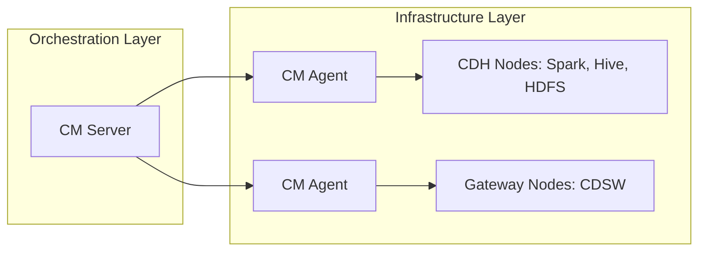

## 2. Pilares del Aprendizaje Técnico

Basado en los objetivos del curso, la administración de CDP se divide en tres dominios principales:

<Tabs>
  <TabItem value="deploy" label="Despliegue e Instancia" default>
    - **Principios de Diseño:** Entender la arquitectura y herramientas base.
    - **Repositorios:** Creación de repositorios "Air Gap" para entornos sin internet.
    - **Construcción:** Instalación de Cloudera Manager y despliegue del Clúster.
    - **Runtime:** Instalación de agentes y del Runtime de CDP.
  </TabItem>
  <TabItem value="security" label="Seguridad y Configuración">
    - **Auto-TLS:** Despliegue de CM como Root CA y creación de archivos `jssecacerts`.
    - **Kerberos:** Configuración y despliegue de autenticación fuerte.
    - **Gobernanza:** Gestión de usuarios y mejores prácticas recomendadas por el administrador.
  </TabItem>
  <TabItem value="ops" label="Operaciones y Ciclo de Vida">
    - **Gestión de Software:** Uso de **Parcels** para cambios y actualizaciones.
    - **Mantenimiento:** Backups de la base de datos SCM y upgrades de plataforma.
    - **Automatización:** Uso de **REST API** (Swagger UI) y scripts para gestión programática.
  </TabItem>
</Tabs>

---

## 3. Operaciones Críticas del Administrador

El documento ADMIN-230 destaca procesos específicos que garantizan la operatividad del negocio:

### 3.1 Gestión de Procesos vía `supervisord`
A diferencia de los servicios tradicionales de Linux, CDP utiliza `supervisord` para:
* Monitorear constantemente el estado de los demonios.
* Automatizar el reinicio de servicios del clúster ante fallos imprevistos.

### 3.2 Gestión de Recursos y Capacidad
* **YARN Queues:** Instalación y configuración de colas para el manejo de jobs.
* **Escalabilidad:** Procedimientos para añadir o remover *workers* y el decommissing de nodos.
* **Performance:** Tuning de propiedades específicas en Cloudera Manager.

:::tip Problem Management
El curso introduce el concepto de **Support Bundles**. Es vital recordar el uso de **Redaction Rules** (Reglas de Redacción) para proteger datos sensibles antes de cualquier escalación a soporte.
:::

## 4. Roadmap de Módulos (Detalle de Curso)

| Fase | Tópicos Clave |
| :--- | :--- |
| **Setup** | Air Gap, Instalación de Agentes, Roles de Administrador. |
| **Config** | Role Groups, Propiedades de Configuración, TLS, Kerberos. |
| **Management** | Gestión de Parcels, YARN Queues, Resource Management. |
| **Maintenance** | Backup/Restore, Upgrades, REST API Scripts. |

---
_Referencia: Cloudera Educational Services - Version 2.2.2 - ADMIN-230_

```

---

## Contenido archivo: `docs/data-engineering/cloudera-administration/cdp-tuning-operations-sop.mdx`

```bash
$ cat docs/data-engineering/cloudera-administration/cdp-tuning-operations-sop.mdx
---
id: cdp-tuning-operations-sop
title: "SOP: Optimización de Recursos y Gestión de Cambios"
sidebar_label: "Optimización y Tuning"
sidebar_position: 50
description: "Ajuste de parámetros en HDFS/YARN y uso de Safety Valves para tuning avanzado."
tags: [Tuning, Performance, YARN, HDFS, SOP]
---

import Tabs from '@theme/Tabs';
import TabItem from '@theme/TabItem';

# SOP: Optimización de Recursos y Gestión de Cambios

Este procedimiento detalla la ejecución técnica de ajustes de rendimiento y la resolución de configuraciones caducas en entornos de producción.

## 1. Identificación y Resolución de Configuraciones Caducas (Stale)

Cuando el **Modelo** y el **Runtime** no coinciden, Cloudera Manager marca el servicio con un icono de "reinicio necesario".

<step>
1. **Validación de Diferencias:** Utilice la vista "Review Changes" para contrastar el valor actual (Rojo) frente al valor propuesto (Verde).
2. **Estrategia de Despliegue:**
   - **Refresh:** Para cambios que no requieren reinicio del proceso (ej: Client Configs).
   - **Restart:** Obligatorio para cambios en variables de entorno o parámetros del core (ej: Heap Size).
3. **Rolling Restart:** En entornos de Alta Disponibilidad, ejecute reinicios secuenciales para mantener el servicio activo.
</step>

## 2. Protocolos de Optimización (Tuning)

El ajuste de parámetros debe realizarse basándose en la capacidad del hardware y la carga de trabajo (*workload*).

<Tabs>
  <TabItem value="hdfs" label="Tuning HDFS" default>

| Propiedad | Impacto | Recomendación Senior |
| :--- | :--- | :--- |
| `dfs.blocksize` | Rendimiento de E/S | Mínimo 16MB. Default 128MB. Valores mayores reducen presión en el NameNode. |
| `dfs.replication` | Resiliencia | Default 3. Reducir a 2 solo en entornos de desarrollo para ahorrar storage. |
| `dfs.datanode.scan.period.hours` | Salud de Datos | Frecuencia de escaneo de bloques corruptos. Ajustar según el MTBF del hardware. |

  </TabItem>
  <TabItem value="yarn" label="Tuning YARN">

La optimización de YARN se centra en prevenir el **Overcommitting** de memoria en los NodeManagers.

*   **`yarn.nodemanager.resource.memory-mb`**: Límite total de RAM que YARN puede usar en un nodo. Debe dejar margen para el OS y los agentes.
*   **`yarn.scheduler.maximum-allocated-mb`**: Tamaño máximo de un contenedor individual. Si una App pide más, será rechazada.
*   **VCORES**: Ajuste de núcleos virtuales para maximizar el paralelismo sin saturar la CPU física.

  </TabItem>
</Tabs>

## 3. Implementación de Propiedades No Expuestas (Safety Valves)

Existen parámetros avanzados que no aparecen en la búsqueda global de CM. Para estos, se utiliza el **Advanced Configuration Snippet** o "Válvula de Seguridad".

:::tip Validación Forense de Snippets
El uso de Safety Valves inyecta código directamente en los archivos XML de destino (`hdfs-site.xml`, `yarn-site.xml`). Un error de sintaxis aquí puede impedir el arranque de todo el clúster.
:::

**Procedimiento de Inyección:**
1. Navegue a la configuración del servicio (HDFS/YARN).
2. Busque el término "Advanced Configuration Snippet".
3. Identifique el archivo destino correcto (ej: `HDFS Service Advanced Configuration Snippet (Safety Valve) for hdfs-site.xml`).
4. Inyecte la propiedad en formato llave-valor.


## 4. Despliegue de Client Configurations

Tras modificar un servicio, es imperativo redistribuir los archivos de configuración a los nodos Gateway (Edge Nodes). 
*   **Ruta local:** `/etc/hadoop/conf/`
*   **Acción:** Seleccione "Deploy Client Configuration" en las acciones del servicio para asegurar que los usuarios finales (vía CLI) utilicen los nuevos parámetros (ej: nuevo `dfs.blocksize`).

---
_Enlace Interno Recomendado:_ [Guía Core de HDFS](./hdfs-operations-guide.mdx) para entender el impacto del blocksize en la arquitectura.

```

---

## Contenido archivo: `docs/data-engineering/cloudera-administration/hdfs-operations-sop.mdx`

```bash
$ cat docs/data-engineering/cloudera-administration/hdfs-operations-sop.mdx
---
id: hdfs-operations-sop
title: "SOP: Operaciones Avanzadas y Defensa de Datos en HDFS"
sidebar_label: "SOP: Defensa de HDFS"
sidebar_position: 125
description: "Protocolo operativo para el aprovisionamiento de usuarios, gestión de cuotas y recuperación de desastres mediante Snapshots."
tags: [HDFS, CLI, Snapshots, Quotas, Troubleshooting]
---

import Tabs from '@theme/Tabs';
import TabItem from '@theme/TabItem';

# SOP: Operaciones Avanzadas y Defensa de Datos

Este Procedimiento Operativo Estándar (SOP) define las directivas técnicas para el aislamiento de usuarios y la protección contra la eliminación accidental de datos.

## 1. Aprovisionamiento de Directorios de Usuario

En entornos empresariales, el aprovisionamiento debe ser estandarizado. Todo usuario requiere un directorio en `/user/<username>` con permisos restringidos.

<step>
1. **Ejecución de Script de Gestión:**
   ```bash
   # Automatiza creación de directorio y asignación de cuotas base
   manage_hdfs_user.sh --add
   ```
2. **Validación de Jerarquía:**
   ```bash
   hdfs dfs -ls /user
   ```
</step>

## 2. Implementación de Cuotas de Almacenamiento (Quotas)

HDFS permite dos niveles de restricción lógica para prevenir la denegación de servicio por agotamiento de recursos.

Las cuotas se gestionan en la sección **HDFS > File Browser**. Al seleccionar un directorio y pulsar en **Edit Quota**, se presentan dos límites críticos:

<Tabs>
  <TabItem value="name" label="Name Quotas (Archivos)" default>
    Limita el número total de nombres (archivos, directorios y enlaces) en un árbol de directorios.
    - **Uso:** Prevenir el *Small File Syndrome*.
    - **Comando CLI:** `hdfs dfsadmin -setQuota 1000 /user/bo_biz`
    - **UI Term:** `File count limit`
    - **Error en Log:** `NSQuotaExceededException`
    - **Definición:** Límite de objetos (archivos/carpetas)
  </TabItem>
  <TabItem value="space" label="Space Quotas (Bytes)">
    Limita el espacio físico total consumido, incluyendo todas las réplicas.
    - **Uso:** Controlar el crecimiento del storage.
    - **Comando CLI:** `hdfs dfsadmin -setSpaceQuota 50g /user/bo_biz`
    - **UI Term:** `Disk space limit`
    - **Error en Log:** `DSQuotaExceededException`
    - **Definición:** Límite de bytes físicos (incluye réplicas)
  </TabItem>
</Tabs>

:::caution Latencia de Actualización
Tras modificar una cuota, el mensaje informativo en la UI indicará: *"The modified quota will appear in the usage reports after the new HDFS fsimage has been processed"*.
:::

## 3. Defensa de Datos: Snapshots e Inmutabilidad

Los snapshots son copias de solo lectura del estado de un directorio en un punto del tiempo, capturando metadatos sin duplicar bloques de datos iniciales. Los Snapshots permiten capturar el estado del sistema de archivos. Para habilitarlos, el directorio debe estar marcado como **Snapshottable**.

**Workflow en Cloudera Manager:**
1. Navegar a **HDFS > File Browser**.
2. Seleccionar directorio > Botón desplegable > **Enable Snapshots**.
3. Una vez habilitado, ejecutar **Take Snapshot**.

:::info Snapshot Name
Se recomienda usar una nomenclatura estándar, ej: `manual_backup_20240313`. En la UI, aparecerán bajo la sección **Snapshots Show All**.
:::

### Protocolo de Recuperación Ante Eliminación Accidental
Si un archivo es eliminado incluso fuera del sistema de basura (`-skipTrash`), los snapshots permiten una recuperación instantánea.

```bash
# Paso 1: Localizar el archivo en el directorio oculto .snapshot
hdfs dfs -ls /user/bo_biz/.snapshot/first_snap/

# Paso 2: Restaurar mediante copia atómica
hdfs dfs -cp /user/bo_biz/.snapshot/first_snap/data.csv /user/bo_biz/
```

:::tip Snapshot Policies
Configure políticas automáticas en Cloudera Manager (**Replication > Snapshot Policies**) para mantener una ventana de retención (ej: 3 snapshots horarios, 1 diario).
:::

## 4. Inspección Forense de Bloques (`fsck`)

Ante una sospecha de corrupción de hardware, se debe realizar un análisis de consistencia a nivel de bloque.

```bash
# Reporte detallado de archivos, bloques y racks
hdfs fsck /user/allan_admin/latin/latin.txt -files -blocks -locations -racks
```


*Análisis forense: Visualización de Block IDs y mapeo de DataNodes.*

## 5. Gestión de Papelera (Trash Mechanism)

Cuando un usuario ejecuta `hdfs dfs -rm`, el archivo no se elimina permanentemente si el **Trash Interval** está activo.

*   **Parámetro en CM:** `fs.trash.interval` (Configuration > Search "trash").
*   **Comportamiento:** El archivo se mueve a un directorio oculto llamado `.Trash/Current`.
*   **Recuperación:** Mediante un comando `mv` (Move) desde la CLI.

:::danger Bypass de Trash
El flag `-skipTrash` elude este mecanismo. En la terminal aparecerá el mensaje: *"Deleted /user/path"*, lo que implica la eliminación inmediata de los bloques de datos.
:::

La papelera previene la pérdida de datos inmediata. El parámetro `fs.trash.interval` en Cloudera Manager determina el tiempo de vida de los datos eliminados.

*   **Ruta predeterminada:** `/user/<username>/.Trash/Current/`
*   **Recomendación Senior:** Establezca un intervalo de **8 a 24 horas**. Un valor superior puede agotar el espacio en clústeres de alta ingesta.

## 6. Diagnóstico de Alta Disponibilidad (HA)

Al acceder a la NameNode Web UI, es vital identificar el rol del nodo:
*   **Active:** Procesa lecturas y escrituras.
*   **Standby:** En espera. Si intenta navegar por este nodo, recibirá el error: `Operation category READ is not supported in state standby`.

---
_Relacionado:_ [Optimización y Tuning de HDFS](./cdp-tuning-operations-sop.mdx) | [Gobernanza de Configuraciones](./cdp-configuration-governance.mdx)

```

---

## Contenido archivo: `docs/data-engineering/cloudera-administration/hdfs-architecture-principles-part-ii.mdx`

```bash
$ cat docs/data-engineering/cloudera-administration/hdfs-architecture-principles-part-ii.mdx
---
id: hdfs-architecture-principles-part-ii
title: "HDFS: Arquitectura y Principios de Diseño - Parte II"
sidebar_label: "Teoría de HDFS"
sidebar_position: 32
description: "Principios de inmutabilidad, Data Locality y gestión de bloques en HDFS (Hadoop Distributed File System)."
tags: [HDFS, Architecture, Big Data, Storage]
---

# Teoría de HDFS

Este módulo cubre los principios de diseño, la arquitectura de HDFS  (Hadoop Distributed File System) y YARN, y la gestión de bloques de datos dentro de Cloudera Data Platform.

## 1. Principios de Diseño de Hadoop
El diseño original de Hadoop se basa en cinco pilares fundamentales:
* **Smart software, utility hardware:** El software es inteligente para compensar hardware común y económico.
* **Mover el procesamiento, no los datos:** Es más eficiente enviar el código donde están los datos que viceversa.
* **Share nothing:** Los nodos no comparten memoria ni almacenamiento centralizado.
* **Embrace failure:** El sistema asume que el hardware fallará y está diseñado para recuperarse automáticamente.
* **Enfoque en aplicaciones:** La infraestructura debe ser transparente para el desarrollador.

> **El Mantra de HDFS:** "HDFS es efectivo, pero no es eficiente" (está optimizado para grandes volúmenes, no para latencia mínima).

## 2. Arquitectura: HDFS y YARN
Hadoop combina almacenamiento y computación trabajando en conjunto:

| Componente | Rol Principal | Responsabilidad |
| :--- | :--- | :--- |
| **HDFS** | Almacenamiento | Distribuir datos entre los workers y mantener la **Data Locality**. |
| **YARN** | Computación | Negociar recursos y ejecutar trabajos de cómputo en paralelo. |

### Roles de los Nodos
- **NameNode (Maestro):** Mantiene las tablas de búsqueda en memoria (metadatos). Indica a los clientes dónde están los bloques.
- **DataNode (Worker):** Almacena y escribe los bloques de datos en los discos locales.
- **ResourceManager (YARN):** Gestiona el inventario de RAM y CPU en el clúster.
- **NodeManager (YARN):** Gestiona los recursos locales de cada worker.

## 3. Bloques de Datos (Data Blocks)
* **Inmutables:** Una vez escritos, no se pueden modificar (solo eliminar o sobreescribir el archivo completo).
* **Tamaño predeterminado:** Hasta **128 MB**.
* **Factor de Replicación:** Por defecto es **3**.
* **Validación:** Se validan mediante archivos de *checksum*.

## 4. El Problema de los Archivos Pequeños (Small File Syndrome)
Un problema crítico en HDFS es tener millones de archivos pequeños (ej. 1 MB).
* **Impacto en el NameNode:** Cada archivo requiere una entrada en la RAM del NameNode.
* **Ineficiencia:** Genera sobrecarga en las búsquedas y desperdicia recursos de red y CPU al iniciar contenedores YARN para procesar fragmentos diminutos.
* **Solución:** Consolidar archivos pequeños en archivos más grandes antes o durante la ingesta.

## 5. Métodos de Acceso
1. **Cloudera Manager Web UI:** Interfaz de administración general.
2. **NameNode UI:** Monitoreo del estado del sistema (Puerto por defecto: `9870` o `50070`).
3. **HDFS CLI:** Línea de comandos para interactuar con el sistema de archivos.

```

---

## Contenido archivo: `./docusaurus.config.js`

```bash
$ cat ./docusaurus.config.js
const devServerPlugin = require("./src/plugins/devServer/index.js");

const isProd = process.env.NODE_ENV === "production";

/** @type {import('@docusaurus/types').DocusaurusConfig} */
module.exports = {
  title: "dz.log",
  tagline: "Documentación técnica y notas de IT",

  url: "https://daniel-zamo.github.io",
  baseUrl: "/kb/", 
  organizationName: "daniel-zamo",
  projectName: "daniel-zamo.github.io",
  trailingSlash: true, 

  i18n: {
    defaultLocale: "es",
    locales: ["es"],
  },

  onBrokenLinks: "throw", 

  themes: [ '@docusaurus/theme-mermaid' ],
  markdown: {
    format: "detect",
    mermaid: true,
  },

  favicon: 'img/favicon.ico',
  future: { v4: true },

  headTags: [
    {
      tagName: 'link',
      attributes: {
        rel: 'icon',
        type: 'image/png',
        sizes: '32x32',
        href: '/img/favicon-32x32.png',
      },
    },
    {
      tagName: 'link',
      attributes: {
        rel: 'apple-touch-icon',
        sizes: '180x180',
        href: '/img/apple-touch-icon.png',
      },
    },
  ],

  themeConfig: {
    announcementBar: {
      id: "announcement_it_v3",
      content: "🚀 Bienvenido a mi nueva Base de Conocimientos sobre IT",
      backgroundColor: "#4368E3",
      textColor: "#ffffff",
      isCloseable: true,
    },
    docs: {
      sidebar: {
        hideable: true,
        autoCollapseCategories: true,
      },
    },
    colorMode: {
      defaultMode: "dark",
      respectPrefersColorScheme: true,
    },
    navbar: {
      title: "dz.log", 
      logo: {
        href: "/", 
        alt: "dz.log Logo",
        src: "img/docs_logo.svg",
        srcDark: "img/docs_logo_dark.svg",
        width: 120,
      },
      items: [
        { type: "search", position: "right" },
        {
          href: "https://github.com/daniel-zamo/daniel-zamo.github.io",
          label: "GitHub",
          position: "right",
        },
      ],
    },
    footer: {
      style: "dark",
      copyright: `Copyright © ${new Date().getFullYear()} Daniel Zamo. Construido con Docusaurus.`,
    },
  },

  presets: [
    [
      "@docusaurus/preset-classic",
      {
        docs: {
          sidebarPath: require.resolve("./sidebars.js"),
          routeBasePath: "/",
          showLastUpdateAuthor: false,
          showLastUpdateTime: true,
        },
        blog: false,
        theme: {
          customCss: require.resolve("./src/css/custom.css"),
        },
      },
    ],
  ],

  plugins: [
    devServerPlugin,
    "plugin-image-zoom",
    [
      require.resolve("@easyops-cn/docusaurus-search-local"),
      ({
        hashed: true,
        language: ["en", "es"],
        indexDocs: true,
        indexBlog: false,
        indexPages: false,
        docsRouteBasePath: "/",
        highlightSearchTermsOnTargetPage: true,
        explicitSearchResultPath: true,
      }),
    ],

    // --- PLUGIN PARA IMPORTAR ARCHIVOS EXTERNOS COMO TEXTO ---
    function rawLoaderPlugin(context, options) {
      return {
        name: 'raw-loader-plugin',
        configureWebpack(config, isServer) {
          return {
            module: {
              rules: [
                {
                  // Detecta archivos de script, texto o configuración
                  test: /\.(sh|ps1|txt|yml|yaml|cmd)$/,
                  // Webpack 5 Asset Modules: importa el contenido como string
                  type: 'asset/source',
                },
              ],
            },
          };
        },
      };
    },
  ],
};

```

---

## Contenido archivo: `./package.json`

```bash
$ cat ./package.json
{
  "name": "docs",
  "version": "0.0.0",
  "private": true,
  "scripts": {
    "docusaurus": "docusaurus",
    "start": "docusaurus start",
    "build": "npm install && docusaurus build",
    "swizzle": "docusaurus swizzle",
    "deploy": "docusaurus deploy",
    "clear": "docusaurus clear",
    "serve": "docusaurus serve",
    "write-translations": "docusaurus write-translations",
    "write-heading-ids": "docusaurus write-heading-ids"
  },
  "dependencies": {
    "@docusaurus/core": "^3.9.2",
    "@docusaurus/plugin-client-redirects": "^3.9.2",
    "@docusaurus/plugin-google-gtag": "^3.9.2",
    "@docusaurus/plugin-sitemap": "^3.9.2",
    "@docusaurus/preset-classic": "^3.9.2",
    "@docusaurus/theme-mermaid": "^3.9.2",
    "@easyops-cn/docusaurus-search-local": "^0.26.1",
    "@mdx-js/react": "^3.0.1",
    "autoprefixer": "^10.4.20",
    "clsx": "^2.0.0",
    "lucide-react": "^0.436.0",
    "plugin-image-zoom": "github:flexanalytics/plugin-image-zoom",
    "postcss": "^8.4.41",
    "prism-react-renderer": "^2.1.0",
    "raw-loader": "^4.0.2",
    "react": "^18.2.0",
    "react-dom": "^18.2.0",
    "redocusaurus": "^2.0.0",
    "tailwindcss": "^3.4.12"
  },
  "devDependencies": {
    "@docusaurus/module-type-aliases": "^3.9.2",
    "@docusaurus/types": "^3.9.2"
  },
  "overrides": {
    "got": "^12.1.0",
    "trim": "^0.0.3"
  },
  "browserslist": {
    "production": [
      ">0.5%",
      "not dead",
      "not op_mini all"
    ],
    "development": [
      "last 1 chrome version",
      "last 1 firefox version",
      "last 1 safari version"
    ]
  },
  "engines": {
    "node": "18.18.2",
    "npm": "9.8.1"
  }
}

```

---

## Contenido archivo: `./babel.config.js`

```bash
$ cat ./babel.config.js
module.exports = {
  presets: [require.resolve('@docusaurus/core/lib/babel/preset')],
};

```

---

## Contenido archivo: `./sidebars.js`

```bash
$ cat ./sidebars.js
// @ts-check

/** @type {import('@docusaurus/plugin-content-docs').SidebarsConfig} */
const sidebars = {
  docs: [
    // SECCIÓN: BIENVENIDA
    {
      type: "category",
      label: "Primeros Pasos",
      className: "category-as-header getting-started-header",
      collapsed: false,
      collapsible: false,
      items: [
        "doc-home-page",
      ],
    },

    // SECCIÓN: PLATFORM ENGINEERING (Aquí CKA)
    {
      type: "category",
      label: "Ingeniería de Plataforma",
      className: "category-as-header platform-engineering-header",
      collapsed: false,
      collapsible: false,
      items: [
        {
          type: "autogenerated",
          dirName: "platform-engineering",
        },
      ],
    },

    // SECCIÓN: DATA ENGINEERING (Cloudera)
    {
      type: "category",
      label: "Ingeniería de Datos",
      className: "category-as-header data-sources-header",
      collapsed: false,
      collapsible: false,
      items: [
        {
          type: "autogenerated",
          dirName: "data-engineering",
        },
      ],
    },

    // highlight-start
    // SECCIÓN: SYSADMIN & LINUX (Configuración de base)
    {
      type: "category",
      label: "SysAdmin & Linux",
      className: "category-as-header sysadmin-linux-header", // Clase para estilo visual consistente
      collapsed: false,
      collapsible: false,
      items: [
        {
          type: "autogenerated",
          dirName: "sysadmin-linux",
        },
      ],
    },
    // highlight-end

    // SECCIÓN: ESTÁNDARES
    {
      type: "category",
      label: "Estándares de Ingeniería",
      className: "category-as-header engineering-stds-header",
      collapsed: false,
      collapsible: false,
      items: [
	{
          type: "autogenerated",
          dirName: "engineering-standards",
        },
      ],
    },
  ],
};

module.exports = sidebars;

```

---

