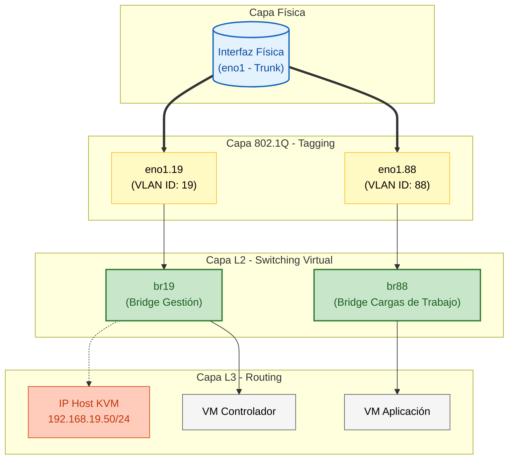
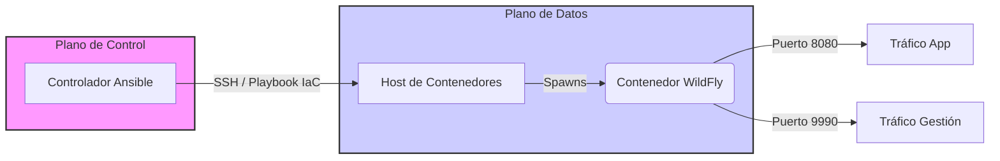
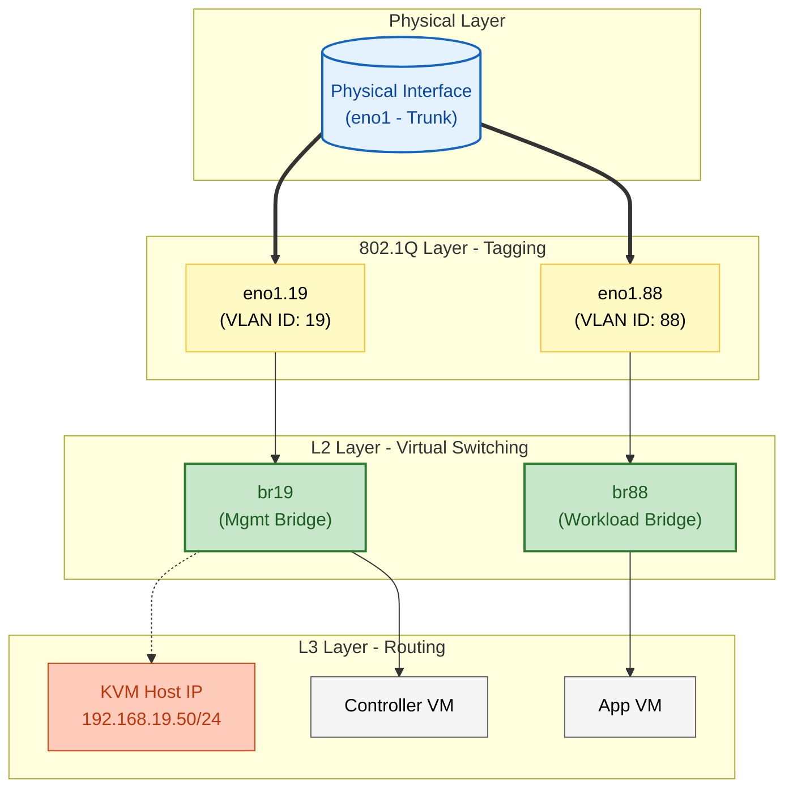
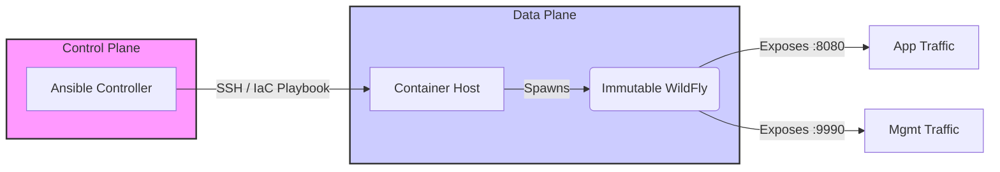
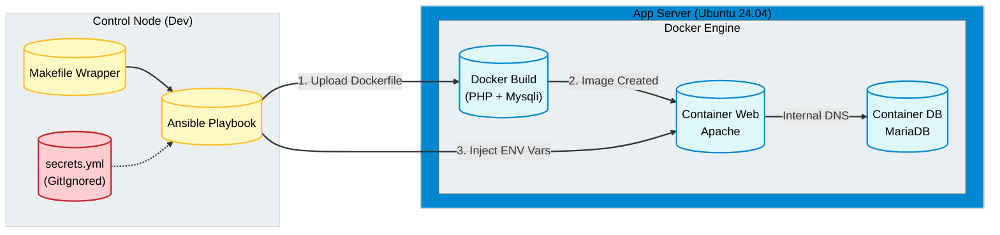

# Contenido de Archivos del Proyecto

Fecha de generación: vie 09 ene 2026 10:24:41 CET

## Contenido archivo: `src/content.config.ts`

```bash
$ cat src/content.config.ts
import { defineCollection, z } from 'astro:content';
import { docsSchema } from '@astrojs/starlight/schema';

// 1. Colección 'docs' (Tu documentación principal)
const docsCollection = defineCollection({
  schema: docsSchema({
    extend: z.object({
      // Mapeo de campos personalizados
      source: z.string().optional(),

      // Taxonomía de dominios
      domain: z.enum([
        'compute',
        'storage',
        'networking',
        'security',
        'virtualization',
        'containers',
        'automation',
        'monitoring',
        'cloud'
      ]).optional(),

      // Tipo de contenido (Añadido 'project' para portfolio)
      type: z.enum([
        'lab',
        'theory',
        'cheatsheet',
        'scenario',
        'configuration',
        'project'
      ]).default('theory'),
    }),
  })
});

// 2. Colección 'questions' (Para futuros quizzes)
const questionsCollection = defineCollection({
  loader: async () => [], // Placeholder: Astro 5 pide un loader si no hay archivos físicos aun
  schema: z.object({
    exam: z.string(),
    topic: z.string(),
    difficulty: z.enum(['easy', 'medium', 'hard']),
    question: z.object({
      scenario: z.string().optional(),
      prompt: z.string(),
    }),
    options: z.array(
      z.object({
        id: z.string(),
        text: z.string(),
      })
    ),
    correctAnswerId: z.string(),
    explanation: z.object({
      summary: z.string(),
      breakdown: z.array(
        z.object({
          optionId: z.string(),
          reasoning: z.string(),
        })
      ),
    }),
  }),
});

// 3. Exportamos
export const collections = {
  docs: docsCollection,
  // Si aún no tienes archivos .json/.yaml en src/content/questions, 
  // puedes comentar la siguiente línea para evitar warnings de "colección vacía"
  questions: questionsCollection,
};


```

---

## Contenido archivo: `src/styles/custom.css`

```bash
$ cat src/styles/custom.css
/* ============================================
   ESTILOS MÍNIMOS - Solo dropdowns del header
   ============================================ */

/* Fondo oscuro para los select del header */
/*
header starlight-theme-select select,
header starlight-lang-select select {
  background-color: var(--sl-color-gray-6);
  color: var(--sl-color-white);
  border: 1px solid var(--sl-color-gray-5); 
} 
*/

/* Hover en los select */
/*
header starlight-theme-select select:hover,
header starlight-lang-select select:hover {
  background-color: var(--sl-color-gray-5);
  border-color: var(--sl-color-gray-4);
}
*/
header starlight-theme-select select:hover,
header starlight-lang-select select:hover {
  background-color: var(--sl-color-gray-5);
}

/* Opciones del dropdown (para Firefox) */
/*
header starlight-theme-select select option,
header starlight-lang-select select option {
  background-color: var(--sl-color-gray-6);
  color: var(--sl-color-white);
}
*/

/* Modo Light */
/*
[data-theme="light"] header starlight-theme-select select,
[data-theme="light"] header starlight-lang-select select {
  background-color: var(--sl-color-white);
  color: var(--sl-color-gray-6);
  border-color: var(--sl-color-gray-4);
}
*/

/*
[data-theme="light"] header starlight-theme-select select:hover,
[data-theme="light"] header starlight-lang-select select:hover {
  background-color: var(--sl-color-gray-2);
}
*/

/*
[data-theme="light"] header starlight-theme-select select option,
[data-theme="light"] header starlight-lang-select select option {
  background-color: var(--sl-color-white);
  color: var(--sl-color-gray-6);
}
*/
```

---

## Contenido archivo: `src/components/Quiz.astro`

```bash
$ cat src/components/Quiz.astro
---
// RUTA: src/components/Quiz.astro (VERSIÓN FINAL CON MEJORAS)
import type { CollectionEntry } from 'astro:content';

interface Props {
  question: CollectionEntry<'questions'>['data'];
  questionId: string;
  prevId: string | null;
  nextId: string | null;
}
const { question, questionId, prevId, nextId } = Astro.props;
const formId = `quiz-form-${questionId}`;
---

<div class="quiz-container">
  {question.question.scenario && <p class="scenario"><em>{question.question.scenario}</em></p>}
  <p class="prompt">{question.question.prompt}</p>

  <form 
    class="options-form" 
    id={formId}
    data-correct-answer-id={question.correctAnswerId}
    data-explanation={JSON.stringify(question.explanation)}
  >
    {question.options.map(option => (
      <div class="option">
        <input type="radio" id={`option-${option.id}-${questionId}`} name={`quiz_option_${questionId}`} value={option.id}>
        <label for={`option-${option.id}-${questionId}`}>{option.text}</label>
      </div>
    ))}

    <div class="button-group">
      <button type="submit">Check Answer</button>
      <button type="reset" class="reset-button">Clear</button>
      
      <div class="navigation-buttons">
        {prevId && <a href={`/practice/quiz?id=${prevId}`} class="nav-button"><< Prev</a>}
        {nextId && <a href={`/practice/quiz?id=${nextId}`} class="nav-button">Next >></a>}
      </div>
    </div>
  </form>

  <div class="feedback-container" style="display: none;">
    <h3 class="feedback-title"></h3>
    <p class="feedback-summary"></p>
    <h4>Breakdown:</h4>
    <ul class="feedback-breakdown"></ul>
  </div>
</div>

<style>
  .quiz-container { border: 1px solid #ccc; padding: 1.5rem; border-radius: 8px; margin-top: 2rem; background-color: var(--sl-color-gray-6); }
  .scenario { border-left: 3px solid var(--sl-color-accent); padding-left: 1rem; color: var(--sl-color-gray-3); }
  .prompt { font-size: 1.2em; font-weight: bold; }
  .options-form .option { margin: 0.8rem 0; }
  .options-form button { margin-top: 1rem; padding: 0.5rem 1rem; border-radius: 4px; border: none; background-color: var(--sl-color-accent); color: white; cursor: pointer; }
  .feedback-container { margin-top: 1.5rem; padding-top: 1.5rem; border-top: 1px solid #ccc; }
  .button-group { display: flex; align-items: center; gap: 1rem; margin-top: 1.5rem; flex-wrap: wrap; }
  .reset-button { background-color: var(--sl-color-gray-4); color: var(--sl-color-text); border: none; padding: 0.5rem 1rem; border-radius: 4px; cursor: pointer; }
  .navigation-buttons { margin-left: auto; display: flex; gap: 0.5rem; }
  .nav-button { display: inline-block; padding: 0.5rem 1rem; border: 1px solid var(--sl-color-gray-4); border-radius: 4px; text-decoration: none; color: var(--sl-color-text); transition: background-color 0.2s; }
  .nav-button:hover { background-color: var(--sl-color-gray-5); }
  
/* .nav-button { display: inline-block; padding: 0.5rem 1rem; border: 1px solid var(--sl-color-gray-4); border-radius: 4px; text-decoration: none; color: var(--sl-color-text); transition: background-color 0.2s; } */
</style>

```

---

## Contenido archivo: `src/components/LabEnvironment.astro`

```bash
$ cat src/components/LabEnvironment.astro
---
/* src/components/LabEnvironment.astro */
import { Image } from "astro:assets";
// Asegúrate de que tu imagen esté en src/assets/images/
import topologyImg from "../assets/images/lab-01-topology.png"; 
---

<div class="lab-card">
  <!-- Cabecera -->
  <div class="card-header">
    <span class="icon">🖧</span>
    <strong>Infrastructure Context</strong>
  </div>

  <!-- Imagen del Diagrama -->
  <div class="img-wrapper">
    <Image
      src={topologyImg}
      alt="Network Topology Diagram"
      width={800}
      class="topology-img"
    />
  </div>

  <!-- Contenido -->
  <div class="info-content">
    <p class="intro-text">
      Access via SSH from the <strong>default terminal</strong>. The cluster
      topology is defined below:
    </p>
    
    <!-- Simulación de archivo /etc/hosts -->
    <div class="terminal-window">
      <div class="terminal-bar">
        <span class="dot red"></span>
        <span class="dot yellow"></span>
        <span class="dot green"></span>
        <span class="terminal-title">📄 /etc/hosts (Cluster Inventory)</span>
      </div>
      <div class="terminal-body">
        <pre><code>
<span class="comment"># Management & Controller</span>
10.0.0.15   terminal       <span class="comment"># Main Entry Point</span>

<span class="comment"># Web & Application Tier</span>
10.0.0.60   web-srv1   <span class="comment"># Nginx / Apache</span>
10.0.0.70   app-srv1    <span class="comment"># Backend App</span>

<span class="comment"># Data Persistence Tier</span>
10.0.0.80   data-001    <span class="comment"># Primary DB</span>
10.0.0.90   data-002    <span class="comment"># Replica / Backup</span>

<span class="comment"># Virtualization & Containers</span>
10.0.0.100  kvm-001        <span class="comment"># Libvirt Hypervisor</span>
10.0.0.110  docker-001     <span class="comment"># Container Runtime</span>
</code></pre>
      </div>
    </div>

    <!-- Alerta de Seguridad -->
    <div class="security-alert">
      <div class="alert-icon">⚠️</div>
      <div class="alert-text">
        <strong>Constraint:</strong> Nested SSH is forbidden. Connect directly from
        <code>terminal</code> to target IPs.
      </div>
    </div>
  </div>
</div>

<style>
  /* 1. Contenedor Principal */
  .lab-card {
    border: 1px solid var(--sl-color-gray-5);
    background-color: var(--sl-color-gray-6);
    border-radius: 0.5rem;
    overflow: hidden;
    margin-bottom: 2rem;
    box-shadow: var(--sl-shadow-sm);
  }

  /* 2. Cabecera */
  .card-header {
    background-color: var(--sl-color-gray-5);
    padding: 0.5rem 1rem;
    font-size: 0.9rem;
    border-bottom: 1px solid var(--sl-color-gray-4);
    display: flex;
    align-items: center;
    gap: 0.5rem;
    font-weight: 600;
    color: var(--sl-color-white);
  }

  /* 3. Imagen */
  .img-wrapper {
    /* Usamos variable de fondo para adaptarse si algún día pones modo claro */
    background-color: var(--sl-color-black); 
    padding: 1rem;
    display: flex;
    justify-content: center;
    border-bottom: 1px solid var(--sl-color-gray-5);
  }

  .topology-img {
    height: auto;
    max-width: 100%;
    object-fit: contain;
    border-radius: 4px;
  }

  /* 4. Contenido */
  .info-content {
    padding: 1.2rem;
  }

  .intro-text {
    margin-top: 0;
    margin-bottom: 1rem;
    font-size: 0.9rem;
    color: var(--sl-color-gray-2);
  }

  /* 5. Terminal Window */
  .terminal-window {
    background-color: #1e1e1e; /* Mantenemos oscuro duro para look terminal */
    border-radius: 6px;
    box-shadow: 0 4px 10px rgba(0, 0, 0, 0.3);
    margin-bottom: 1.5rem;
    border: 1px solid #333;
    overflow: hidden;
  }

  .terminal-bar {
    background-color: #2d2d2d;
    padding: 6px 10px;
    display: flex;
    align-items: center;
    border-bottom: 1px solid #333;
  }

  .dot {
    height: 10px;
    width: 10px;
    border-radius: 50%;
    display: inline-block;
    margin-right: 6px;
  }
  .dot.red { background-color: #ff5f56; }
  .dot.yellow { background-color: #ffbd2e; }
  .dot.green { background-color: #27c93f; }

  .terminal-title {
    margin-left: 10px;
    color: #999;
    font-family: monospace;
    font-size: 0.8rem;
  }

  .terminal-body {
    padding: 1rem;
    overflow-x: auto;
  }

  pre {
    margin: 0;
    font-family: var(--sl-font-mono); /* Usar fuente mono del tema */
    font-size: 0.85rem;
    line-height: 1.5;
    color: #e0e0e0;
    background: transparent !important;
    border: none !important;
  }

  .comment {
    color: #6a9955;
    font-style: italic;
  }

  /* 6. Alerta - Usando colores semánticos de Starlight */
  .security-alert {
    display: flex;
    align-items: center;
    gap: 0.8rem;
    /* Usamos variables de advertencia de Starlight */
    background-color: var(--sl-color-orange-low); 
    border: 1px solid var(--sl-color-orange-high);
    padding: 0.75rem;
    border-radius: 6px;
    color: var(--sl-color-orange-high);
    font-size: 0.85rem;
  }

  .alert-icon {
    font-size: 1.2rem;
  }
</style>


```

---

## Contenido archivo: `src/components/QuestionList.astro`

```bash
$ cat src/components/QuestionList.astro
---
// RUTA: src/components/QuestionList.astro
import { getCollection } from 'astro:content';
const allQuestions = await getCollection('questions');
---

<ul>
  {allQuestions.map(question => (
    <li>
      <a href={`/practice/quiz?id=${question.id}`}>
        Question about: {question.data.topic} ({question.data.difficulty})
      </a>
    </li>
  ))}
</ul>

<style>
  li {
    margin-bottom: 0.5rem;
  }
</style>

```

---

## Contenido archivo: `src/components/ReferenceArchitecture.astro`

```bash
$ cat src/components/ReferenceArchitecture.astro
---
/* 
   COMPONENT: ReferenceArchitecture.astro
   REPLACES: LabEnvironment.astro
   PURPOSE: Muestra la topología lógica del entorno usando Mermaid en lugar de imágenes estáticas.
*/
---

<div class="arch-card">
  <div class="card-header">
    <span class="icon">🏗️</span>
    <strong>Standard Operating Environment (SOE)</strong>
  </div>

  <div class="diagram-wrapper">
    <pre
      class="mermaid">
      graph TD
        %% Definición de Estilos
        classDef mgmt fill:#263238,stroke:#eceff1,color:#fff;
        classDef compute fill:#0277bd,stroke:#b3e5fc,color:#fff;
        classDef data fill:#2e7d32,stroke:#c8e6c9,color:#fff;
        classDef virt fill:#ef6c00,stroke:#ffe0b2,color:#fff;

        subgraph Management_Zone [Zone: Management]
            Bastion[("💻 terminal<br />(10.0.0.15)")]:::mgmt
        end

        subgraph Workload_Zone [Zone: Application Tier]
            Web["🌐 web-srv1<br />(Nginx)"]:::compute
            App["⚙️ app-srv1<br />(Backend)"]:::compute
        end

        subgraph Data_Zone [Zone: Persistence Tier]
            DB1[("🗄️ data-001<br />(Primary)")]:::data
            DB2[("🗄️ data-002<br />(Replica)")]:::data
        end

        subgraph Specialized_Compute [Zone: Virtualization]
            KVM["🖥️ kvm-001<br />(Libvirt/QEMU)"]:::virt
            Docker["🐳 docker-001<br />(Container Runtime)"]:::virt
        end

        %% Conexiones Lógicas (Flujo de Gestión)
        Bastion -.-> Web
        Bastion -.-> App
        Bastion -.-> DB1
        Bastion -.-> DB2
        Bastion -.-> KVM
        Bastion -.-> Docker

        %% Conexiones de Aplicación
        Web --> App
        App --> DB1
        DB1 -.-> DB2
    </pre>
  </div>

  <div class="info-footer">
    <p>
      <strong>Topology Context:</strong> The diagram above represents the logical
      connectivity and role distribution of the reference cluster. All operations
      are initiated from the <code>terminal</code> node (Bastion Host) via SSH.
    </p>
  </div>
</div>

<style>
  .arch-card {
    border: 1px solid var(--sl-color-gray-5);
    background-color: var(--sl-color-gray-6);
    border-radius: 0.5rem;
    overflow: hidden;
    margin-bottom: 2rem;
    box-shadow: var(--sl-shadow-sm);
  }

  .card-header {
    background-color: var(--sl-color-gray-5);
    padding: 0.5rem 1rem;
    font-size: 0.9rem;
    border-bottom: 1px solid var(--sl-color-gray-4);
    display: flex;
    align-items: center;
    gap: 0.5rem;
    font-weight: 600;
    color: var(--sl-color-white);
  }

  .diagram-wrapper {
    background-color: #1e1e1e; /* Fondo oscuro para el diagrama */
    padding: 1rem;
    display: flex;
    justify-content: center;
  }

  .info-footer {
    padding: 1rem;
    font-size: 0.85rem;
    color: var(--sl-color-gray-2);
    border-top: 1px solid var(--sl-color-gray-5);
  }
</style>

```

---

## Contenido archivo: `src/components/QuizLoader.astro`

```bash
$ cat src/components/QuizLoader.astro
---
// RUTA: src/components/QuizLoader.astro (REFACTORIZADO PARA BOTONES)
import { getCollection } from 'astro:content';
import Quiz from './Quiz.astro';
const allQuestions = await getCollection('questions');
---

<div id="quiz-loader-wrapper">
  {allQuestions.map((question, index) => {
    // --- LÓGICA NUEVA: Calculamos los IDs de navegación ---
    const prevQuestionId = index > 0 ? allQuestions[index - 1].id : null;
    const nextQuestionId = index < allQuestions.length - 1 ? allQuestions[index + 1].id : null;

    return (
      <div id={question.id} class="quiz-instance-wrapper" style="display: none;">
        {/* Pasamos los nuevos props a Quiz.astro */}
        <Quiz 
          question={question.data} 
          questionId={question.id} 
          prevId={prevQuestionId} 
          nextId={nextQuestionId} 
        />
      </div>
    );
  })}
  <div id="quiz-not-found" style="display: none;">
    <h3>Question not found</h3>
    <p>Return to the <a href="/practice/">practice index</a>.</p>
  </div>
</div>

<!-- --- INICIO DEL SCRIPT ACTUALIZADO --- -->
<script>
  // Una única función para manejar todos los eventos del formulario
  function handleQuizEvent(event) {
    const form = event.target.closest('.options-form');
    if (!form) return;

    // --- LÓGICA NUEVA: Manejar el evento de reseteo ---
    if (event.type === 'reset') {
      const quizContainer = form.closest('.quiz-container');
      const feedbackContainer = quizContainer.querySelector('.feedback-container');
      feedbackContainer.style.display = 'none'; // Ocultamos el feedback
      // No hace falta preventDefault, el reset ya limpia el formulario
      return; 
    }

    // --- LÓGICA EXISTENTE: Manejar el envío del formulario ---
    if (event.type === 'submit') {
      event.preventDefault();

      const correctAnswerId = form.dataset.correctAnswerId;
      const explanation = JSON.parse(form.dataset.explanation);
      const quizContainer = form.closest('.quiz-container');
      const selectedOption = form.querySelector(`input[name^='quiz_option_']:checked`);
      
      if (!selectedOption) {
        alert('Please select an answer.');
        return;
      }

      const feedbackContainer = quizContainer.querySelector('.feedback-container');
      const feedbackTitle = feedbackContainer.querySelector('.feedback-title');
      const feedbackSummary = feedbackContainer.querySelector('.feedback-summary');
      const feedbackBreakdown = feedbackContainer.querySelector('.feedback-breakdown');

      if (selectedOption.value === correctAnswerId) {
        feedbackTitle.textContent = '✅ Correct!';
        feedbackTitle.style.color = 'green';
      } else {
        feedbackTitle.textContent = '❌ Incorrect';
        feedbackTitle.style.color = 'red';
      }

      feedbackSummary.textContent = explanation.summary;
      feedbackBreakdown.innerHTML = '';
      explanation.breakdown.forEach(item => {
        const li = document.createElement('li');
        li.textContent = `${item.optionId}: ${item.reasoning}`;
        if (item.optionId === correctAnswerId) li.style.fontWeight = 'bold';
        if (item.optionId === selectedOption.value && selectedOption.value !== correctAnswerId) li.style.color = 'darkred';
        feedbackBreakdown.appendChild(li);
      });

      feedbackContainer.style.display = 'block';
    }
  }

  // --- LÓGICA EXISTENTE: Mostrar el quiz correcto al cargar la página ---
  function showQuizFromUrl() {
    const params = new URLSearchParams(window.location.search);
    const questionId = params.get('id');

    if (questionId) {
      const quizWrapper = document.getElementById(questionId);
      if (quizWrapper) {
        quizWrapper.style.display = 'block';
      } else {
        document.getElementById('quiz-not-found').style.display = 'block';
      }
    } else {
      document.getElementById('quiz-not-found').style.display = 'block';
    }
  }

  // --- LÓGICA NUEVA: Añadimos 'reset' a la lista de eventos que escuchamos ---
  document.addEventListener('submit', handleQuizEvent);
  document.addEventListener('reset', handleQuizEvent);
  document.addEventListener('DOMContentLoaded', showQuizFromUrl);
</script>
<!-- --- FIN DEL SCRIPT ACTUALIZADO --- -->
```

---

## Contenido archivo: `src/content/docs/es/index.mdx`

```bash
$ cat src/content/docs/es/index.mdx
---
title: SysAdmin & DevOps
description: Portfolio de automatización de infraestructura y administración de sistemas por Daniel Zamo.
template: splash
hero:
  tagline: Automatización de Infraestructura, Administración Linux Enterprise y Arquitectura Cloud.
  image:
    file: ../../../assets/images/hero-image.png
  actions:
    - text: Ver Proyecto Destacado (LAMP)
      link: /es/projects/middleware/lamp-ansible-docker/
      icon: rocket
      variant: primary
    - text: Procedimientos Operativos
      link: /es/linux-ops/
      icon: right-arrow
      variant: minimal
prev: false
next: false
editUrl: false
lastUpdated: 2025-12-06
head:
  - tag: meta
    attrs:
      property: og:title
      content: "Daniel Zamo | SysAdmin & DevOps"
  - tag: meta
    attrs:
      property: og:description
      content: "Soluciones de Infraestructura como Código (Ansible), Docker y Administración Linux Enterprise."
  - tag: meta
    attrs:
      property: og:image
      content: https://daniel-zamo.github.io/images/og-homepage-es-es.png
  - tag: meta
    attrs:
      property: og:image:width
      content: "1200"
  - tag: meta
    attrs:
      property: og:image:height
      content: "630"
---

import { Card, CardGrid } from '@astrojs/starlight/components';

## Implementaciones y Competencias

<CardGrid stagger>
  <Card title="Automatización & IaC" icon="rocket">
    Despliegue de infraestructura inmutable. Ejemplo destacado: **Stack LAMP** con gestión de secretos, construcción de imágenes Docker custom y Makefiles.
    
    **[Ver Caso de Estudio: LAMP + Ansible →](/es/projects/middleware/lamp-ansible-docker/)**
  </Card>

  <Card title="Arquitectura Cloud Azure" icon="microsoft">
    Diseño de soluciones híbridas y gobierno de identidad. Alineado con el estándar **AZ-104** (Administrador de Azure).
    
    **[Explorar Operaciones Cloud →](/es/cloud-ops/)**
  </Card>
  
  <Card title="Operaciones Linux Enterprise" icon="linux">
    Base de conocimiento técnico para entornos de misión crítica: Gestión de almacenamiento LVM, Hardening y Troubleshooting.
    
    **[Consultar Procedimientos (SOP) →](/es/linux-ops/)**
  </Card>
  
  <Card title="Orquestación KVM/Libvirt" icon="laptop">
    Gestión de bajo nivel de recursos de cómputo. Aprovisionamiento de máquinas virtuales (VMs) mediante CLI y optimización de rendimiento.
    
    **[Ver Escenario de Virtualización →](/es/linux-ops/scenarios/04-kvm-management/)**
  </Card>

  <Card title="Arquitectura Cloud Azure" icon="microsoft">
    Diseño de soluciones híbridas y gobierno de identidad. Alineado con el estándar **AZ-104** (Administrador de Azure).
    
    *(Estado: Roadmap de Certificación Activo)*
  </Card>
</CardGrid>

```

---

## Contenido archivo: `src/content/docs/es/linux-ops/index.mdx`

```bash
$ cat src/content/docs/es/linux-ops/index.mdx
---
title: Operaciones de Sistemas Linux (Enterprise)
description: Base de conocimiento técnico para la administración, hardening y optimización de sistemas Linux.
sidebar:
  label: Visión General
  order: 0
type: theory
source: manual
---

import { Card, CardGrid, LinkButton, Icon } from '@astrojs/starlight/components';

Este repositorio centraliza los **Procedimientos Operativos Estándar (SOP)** y las mejores prácticas de ingeniería para la gestión de infraestructura basada en Linux.

El contenido refleja estándares de producción, priorizando la estabilidad, la seguridad y la capacidad de auditoría en entornos de misión crítica.

:::tip[Enfoque Operacional]
Esta documentación prioriza la **CLI (Línea de Comandos)** sobre herramientas gráficas, garantizando la capacidad de gestión en servidores *headless* y la automatización de tareas.
:::

## 🎯 Dominios de Competencia

Áreas funcionales críticas para la continuidad del servicio:

<CardGrid>
  <Card title="Operaciones Core" icon="linux">
    Manipulación de flujos de texto, gestión de procesos y scripting en Bash.
  </Card>
  <Card title="Gestión de Runtime" icon="setting">
    Análisis de arranque (Systemd), parámetros del kernel y tuning de sistema.
  </Card>
  <Card title="Gestión de Identidad" icon="user">
    Usuarios locales, integración LDAP/AD y políticas PAM.
  </Card>
  <Card title="Redes & Seguridad" icon="signal">
    Enrutamiento, Firewalling y sincronización NTP/PTP precisa.
  </Card>
  <Card title="Servicios de Infraestructura" icon="puzzle">
    DNS, SSH seguro, Servidores Web y Runtimes de contenedores.
  </Card>
  <Card title="Almacenamiento" icon="laptop">
    Gestión de LVM, RAID por software y sistemas de archivos transaccionales.
  </Card>
</CardGrid>

---

## 🧪 Procedimientos Operativos

Acceda al catálogo de escenarios para ver implementaciones paso a paso de tareas de administración.

<div style="display: flex; gap: 1rem; flex-wrap: wrap; margin-top: 1rem;">
    <LinkButton href="/es/linux-ops/scenarios/" variant="primary" icon="rocket">
        Ver Catálogo de Procedimientos
    </LinkButton>
</div>
```

---

## Contenido archivo: `src/content/docs/es/linux-ops/scenarios/index.mdx`

```bash
$ cat src/content/docs/es/linux-ops/scenarios/index.mdx
---
title: Catálogo de Escenarios Operativos
description: Colección de procedimientos técnicos para la resolución de incidencias, aprovisionamiento de recursos y gestión de ciclo de vida en Linux.
sidebar:
  label: Catálogo de Escenarios
  order: 0
type: scenario
source: manual
---

import { CardGrid, LinkCard, Icon } from '@astrojs/starlight/components';

Esta sección aloja la **capa de ejecución práctica** del portfolio. Cada entrada está estructurada como un **Procedimiento Operativo Estándar (SOP)**, simulando tickets de infraestructura reales que requieren configuración, *troubleshooting* y validación en un entorno vivo.

El objetivo es demostrar capacidad de resolución bajo restricciones técnicas alineadas con estándares de la industria (LFCS/RHCSA).

---

## 🏗️ Topología del Entorno (Standard Operating Environment)

Todos los escenarios se ejecutan sobre un clúster estandarizado de 7 nodos. Esta topología simula una arquitectura de tres capas (Web, App, Data) con capacidades de virtualización anidadas.

:::danger[Protocolos de Acceso y Seguridad]
*   **Bastión:** Todas las operaciones se inician desde el nodo `terminal`.
*   **SSH Anidado:** Estrictamente prohibido por políticas de seguridad. La conexión debe ser directa desde el controlador.
*   **Persistencia:** Toda configuración debe sobrevivir al reinicio del sistema (*Reboot-proof*).
:::

### Inventario de Nodos

| Rol | Hostname | Función / Contexto de Negocio |
| :--- | :--- | :--- |
| **Gestión** | `terminal` | Controlador de operaciones (Bastion Host) y CLI principal. |
| **Capa Web** | `web-srv1` | Terminación SSL, Proxy Inverso y Servidor HTTP. |
| **Capa App** | `app-srv1` | Ejecución de lógica de negocio y APIs internas. |
| **Capa Datos** | `data-001/002` | Persistencia, bases de datos y almacenamiento en bloque. |
| **Virtualización** | `kvm-001` | Hipervisor Libvirt para consolidación de servidores. |
| **Contenedores** | `docker-001` | Runtime para microservicios y orquestación ligera. |

---

## 🚀 Procedimientos Disponibles

Seleccione un escenario para ver los requisitos de ingeniería y la estrategia de implementación.

<CardGrid>
  <LinkCard
    title="01 - Gestión de Tiempo (NTP/Chrony)"
    description="Configuración de clientes de tiempo para garantizar la consistencia transaccional en sistemas distribuidos."
    href="/es/linux-ops/scenarios/01-time-sync/"
  />
  <LinkCard
    title="02 - Balanceo de Carga L7 (Nginx)"
    description="Implementación de Proxy Reverso y balanceo de tráfico HTTP para aplicaciones internas."
    href="/es/linux-ops/scenarios/02-nginx-proxy/"
  />
  <LinkCard
    title="03 - Storage & LVM"
    description="Gestión elástica de volúmenes: Redimensionamiento en caliente y gestión de Physical Volumes."
    href="/es/linux-ops/scenarios/03-storage-mgmt/"
  />
   <LinkCard
    title="04 - Orquestación KVM"
    description="Aprovisionamiento de máquinas virtuales (VMs) y gestión del ciclo de vida con Virsh."
    href="/es/linux-ops/scenarios/04-kvm-management/"
  />
</CardGrid>

:::tip[Nota de Infraestructura]
Los procedimientos asumen conectividad de red preconfigurada entre los nodos del inventario. Para detalles específicos de direccionamiento IP, consulte la ficha técnica dentro de cada escenario.
:::

```

---

## Contenido archivo: `src/content/docs/es/linux-ops/scenarios/04-kvm-management.mdx`

```bash
$ cat src/content/docs/es/linux-ops/scenarios/04-kvm-management.mdx
---
title: "Orquestación de VMs con KVM/Libvirt"
description: Aprovisionamiento y gestión del ciclo de vida de instancias de cómputo utilizando herramientas CLI de virtualización.
sidebar:
  label: Orquestación KVM
  order: 4
type: scenario
domain: virtualization
source: manual
---

import { Steps } from '@astrojs/starlight/components';
import LabEnvironment from '../../../../../components/LabEnvironment.astro';

<LabEnvironment />

## 📋 Requisitos de Ingeniería

**Contexto de Negocio:**
El equipo de QA requiere una instancia de cómputo dedicada y aislada en el hipervisor `kvm-001` para pruebas de integración. El entorno debe ser aprovisionado usando herramientas CLI estándar para asegurar la reproducibilidad.

**Objetivos Técnicos:**
1.  **Estado del Host:** Validar el estado del stack `qemu-kvm` y `libvirtd`.
2.  **Almacenamiento:** Aprovisionar un volumen `qcow2` de **10 GiB** (Thin Provisioned) llamado `qa-vm-disk.qcow2`.
3.  **Definición de Instancia (`qa-vm01`):**
    *   **Specs:** 1 vCPU, 1024 MiB RAM.
    *   **Red:** Bridge NAT por defecto.
    *   **Consola:** Redirección serie (Modo Headless).
4.  **Ciclo de Vida:** Habilitar auto-inicio en el arranque y realizar prueba de apagado controlado.

:::note[Alcance]
No se requiere la instalación completa del OS. Arrancar exitosamente el kernel hasta el prompt del instalador vía consola serie es suficiente para la validación.
:::

---

## 🔧 Procedimiento de Implementación

<Steps>

1.  **Acceso al Nodo Hipervisor**

    Conecte al host de virtualización.

    ```bash
    ssh kvm-001
    ```

2.  **Verificar Prerrequisitos del Host**

    Asegúrese de que el demonio libvirt está activo y habilitado.

    ```bash
    sudo systemctl is-active libvirtd
    # Si inactivo: sudo systemctl enable --now libvirtd
    ```

3.  **Aprovisionar Volumen de Almacenamiento**

    Cree el disco virtual usando `qemu-img`.

    ```bash
    sudo qemu-img create -f qcow2 /var/lib/libvirt/images/qa-vm-disk.qcow2 10G
    ```

4.  **Definir y Arrancar Instancia**

    Ejecute `virt-install` con parámetros para entorno headless (`--graphics none`).

    ```bash
    sudo virt-install \
      --name qa-vm01 \
      --ram 1024 \
      --vcpus 1 \
      --disk path=/var/lib/libvirt/images/qa-vm-disk.qcow2,format=qcow2 \
      --os-variant rocky9 \
      --network network=default \
      --graphics none \
      --console pty,target_type=serial \
      --location "https://download.rockylinux.org/pub/rocky/9/BaseOS/x86_64/os/" \
      --extra-args "console=ttyS0"
    ```

    *Tip: Para desconectarse de la consola sin matar la VM, presione `Ctrl + ]`.*

5.  **Configurar Auto-inicio**

    Asegure que la VM sobrevive a reinicios del host.

    ```bash
    sudo virsh autostart qa-vm01
    ```

6.  **Validar Control de Ciclo de Vida**

    Verifique que la VM corre, luego solicite un apagado ACPI.

    ```bash
    # Verificar estado
    sudo virsh list --all

    # Solicitud de apagado controlado
    sudo virsh shutdown qa-vm01
    ```

</Steps>

## 🔍 Diagnóstico y Resolución

*   **"Guest name already in use":** Si un intento previo falló parcialmente, limpie los metadatos:
    ```bash
    sudo virsh destroy qa-vm01
    sudo virsh undefine qa-vm01
    ```
*   **Consola Congelada:** Si la consola no muestra salida, asegúrese de que `--extra-args "console=ttyS0"` fue pasado correctamente para redirigir los logs del kernel al puerto serie.

```

---

## Contenido archivo: `src/content/docs/es/linux-ops/scenarios/01-time-sync.mdx`

```bash
$ cat src/content/docs/es/linux-ops/scenarios/01-time-sync.mdx
---
title: "Estrategia NTP y Sincronización"
description: Configuración de políticas systemd-timesyncd para consistencia transaccional en clústers distribuidos.
sidebar:
  label: Estrategia NTP
  order: 1
type: scenario
domain: networking
source: manual
---

import { Steps } from '@astrojs/starlight/components';
import LabEnvironment from '../../../../../components/LabEnvironment.astro';

<LabEnvironment />

## 📋 Requisitos de Ingeniería

**Contexto de Negocio:**
Los registros de auditoría indican una deriva (drift) en los relojes del sistema a través del clúster, causando fallos en la conciliación de transacciones distribuidas. Se debe aplicar una política estricta de NTP en el nodo controlador.

**Objetivos Técnicos:**
1.  **Upstreams Primarios:** Configurar `0.pool.ntp.org` y `1.pool.ntp.org` como fuentes autoritativas.
2.  **Failover:** Definir `ntp.ubuntu.com` y `0.debian.pool.ntp.org` como servidores de respaldo.
3.  **Ajuste de Rendimiento (Tuning):**
    *   Intervalo máximo de sondeo (Poll): `1000s`.
    *   Intervalo de reintento de conexión: `20s`.

:::caution[Restricción de Servicio]
El entorno utiliza `systemd-timesyncd` como cliente SNTP ligero estándar. No instale paquetes `chrony` o `ntp` legacy a menos que se requiera explícitamente, para evitar conflictos de servicio.
:::

---

## 🔧 Procedimiento de Implementación

<Steps>

1.  **Auditoría del Estado Actual**

    Verifique la versión del sistema operativo y el estado activo del servicio de tiempo antes de aplicar cambios.

    ```bash
    # Verificar versión de OS
    cat /etc/os-release | grep PRETTY_NAME

    # Verificar estado del servicio
    timedatectl timesync-status
    ```

2.  **Aplicar Política de Configuración**

    Edite el archivo de configuración del demonio `/etc/systemd/timesyncd.conf`.

    ```bash
    sudo vim /etc/systemd/timesyncd.conf
    ```

    Modifique la sección `[Time]` para coincidir estrictamente con los requisitos:

    ```ini title="/etc/systemd/timesyncd.conf" {2-5}
    [Time]
    NTP=0.pool.ntp.org 1.pool.ntp.org
    FallbackNTP=ntp.ubuntu.com 0.debian.pool.ntp.org
    PollIntervalMaxSec=1000
    ConnectionRetrySec=20
    ```

3.  **Reiniciar Servicio**

    Aplique la nueva política reiniciando la unidad systemd.

    ```bash
    sudo systemctl restart systemd-timesyncd.service
    ```

4.  **Validar Implementación**

    Confirme que el servicio está activo y sincronizando con el estrato (stratum) correcto.

    ```bash
    # Estado del servicio
    sudo systemctl status systemd-timesyncd.service

    # Validar métricas (Poll interval)
    timedatectl timesync-status
    ```

    *Criterio de Validación:* La salida debe mostrar `Active: active (running)` y las métricas de intervalo coincidiendo con la configuración.

</Steps>

## 🔍 Diagnóstico y Resolución

Si la sincronización falla (ej. "Packet not received"), inspeccione el journal del sistema:

```bash
sudo journalctl -u systemd-timesyncd --no-pager | tail -n 20
```

*Indicador de Éxito:* Busque logs que indiquen: *"Contacted time server ... (0.pool.ntp.org)"*.

```

---

## Contenido archivo: `src/content/docs/es/linux-ops/scenarios/05-kvm-networking.mdx`

```bash
$ cat src/content/docs/es/linux-ops/scenarios/05-kvm-networking.mdx
---
title: "Networking Avanzado KVM: Bridges & VLANs"
description: Diseño e implementación de segmentación de red 802.1Q y Linux Bridges persistentes sobre host de virtualización.
sidebar:
  label: Networking KVM (VLANs)
  order: 5
type: scenario
domain: networking
---

import { Steps, LinkButton } from '@astrojs/starlight/components';

## 📋 Definición de Arquitectura

**Contexto de Ingeniería:**
En entornos de virtualización *bare-metal* (Host KVM), el uso de una red plana ("Flat Network") presenta riesgos de seguridad y congestión de broadcast. Se requiere evolucionar la configuración de red del host anfitrión para soportar **múltiples zonas de aislamiento** utilizando una única interfaz física (Trunk).

**Objetivos de Diseño:**
1.  **Desacoplamiento L3:** La IP de gestión del host no debe residir en la interfaz física, sino en un Bridge virtual, permitiendo mayor flexibilidad.
2.  **Segmentación 802.1Q:** Implementación de sub-interfaces VLAN para segregar tráfico de Gestión (VLAN 19) y Laboratorio/Tenant (VLAN 88).
3.  **Persistencia NetworkManager:** Configuración declarativa mediante `nmcli` para garantizar la estabilidad tras reinicios, abandonando scripts legacy.

---

## 🏗️ Topología Lógica del Host

El siguiente diagrama detalla la pila de red interna configurada dentro del Host KVM (`kvm-001`).



---

## 🚀 Procedimiento de Implementación (SOP)

Este diseño ha sido estandarizado y documentado en la **Librería de Estándares de Operaciones**. El SOP detalla los comandos atómicos de `nmcli` necesarios para transformar una interfaz estándar en un trunk VLAN con bridges.

<div style="display: flex; justify-content: center; gap: 1rem; margin: 2rem 0;">
  <LinkButton 
    href="https://github.com/daniel-zamo/ops-standards-library/blob/main/linux/SOP-LINUX-NM-01_bridge-vlan-config.md"
    variant="primary"
    icon="github"
    target="_blank"
  >
    Ver Procedimiento Técnico (GitHub)
  </LinkButton>
  <LinkButton 
    href="https://github.com/daniel-zamo/ops-standards-library/tree/main/linux"
    variant="secondary"
    icon="external"
    target="_blank"
  >
    Explorar Repo OPS
  </LinkButton>
</div>

### Resultados de la Configuración

Al aplicar esta arquitectura:

1.  **Aislamiento:** Las VMs conectadas a `br88` están lógicamente aisladas de la red de gestión del host.
2.  **Estandarización:** Se elimina la dependencia de nombres de interfaz impredecibles (ej. `eth0` vs `enp3s0`) al abstraer la conexión en Bridges estandarizados (`brXX`).
3.  **Observabilidad:** La estructura permite inspeccionar el tráfico de cada segmento independientemente usando `tcpdump -i br19`.

```

---

## Contenido archivo: `src/content/docs/es/linux-ops/scenarios/03-storage-mgmt.mdx`

```bash
$ cat src/content/docs/es/linux-ops/scenarios/03-storage-mgmt.mdx
---
title: "Gestión del Ciclo de Vida LVM"
description: Redimensionamiento dinámico de Grupos de Volúmenes y retiro de Volúmenes Físicos en producción.
sidebar:
  label: Gestión LVM
  order: 3
type: scenario
domain: storage
source: manual
---

import { Steps } from '@astrojs/starlight/components';
import LabEnvironment from '../../../../../components/LabEnvironment.astro';

<LabEnvironment />

## 📋 Requisitos de Ingeniería

**Contexto de Negocio:**
Una iniciativa de consolidación de almacenamiento requiere retirar el disco físico `/dev/vdh` del grupo de volúmenes existente `vol1`. Este disco debe ser reutilizado para crear un nuevo grupo de almacenamiento aislado (`vol2`) para un proyecto específico.

**Objetivos Técnicos:**
1.  **Migración en Caliente:** Evacuar datos de `/dev/vdh` sin interrupción del servicio usando capacidades de mirroring de LVM.
2.  **Cambio de Topología:** Remover `/dev/vdh` de `vol1` e inicializar un nuevo Volume Group `vol2`.
3.  **Aprovisionamiento:** Crear un Volumen Lógico `p1` (50 MiB) dentro de `vol2`.
4.  **Filesystem:** Formatear el nuevo volumen con **ext4**.

:::caution[Integridad de Datos]
En producción, ejecutar `pvmove` es una operación intensiva en I/O. Asegúrese de que no haya backups críticos ejecutándose simultáneamente.
:::

---

## 🔧 Procedimiento de Implementación

<Steps>

1.  **Analizar Topología de Almacenamiento**

    Confirme el esquema actual y verifique que `/dev/vdh` es parte de `vol1`.

    ```bash
    sudo pvs
    sudo vgs
    ```

2.  **Evacuación de Datos (pvmove)**

    Reubique los "physical extents" (PE) asignados desde el disco objetivo hacia otros discos libres dentro del mismo Grupo de Volúmenes.

    ```bash
    # Verificar asignación
    sudo pvdisplay -m /dev/vdh

    # Migrar datos
    sudo pvmove /dev/vdh
    ```

3.  **Retirar Disco**

    Una vez el disco esté totalmente libre, remuévalo del Grupo de Volúmenes.

    ```bash
    sudo vgreduce vol1 /dev/vdh
    ```

4.  **Inicializar Nuevo Grupo de Almacenamiento**

    Cree el nuevo Volume Group `vol2` usando el volumen físico reclamado.

    ```bash
    sudo vgcreate vol2 /dev/vdh
    ```

5.  **Aprovisionar Volumen Lógico**

    Asigne la capacidad de almacenamiento solicitada.

    ```bash
    sudo lvcreate -n p1 -L 50M vol2
    ```

6.  **Aplicar Sistema de Archivos**

    Formatee el dispositivo de bloque.

    ```bash
    sudo mkfs.ext4 /dev/vol2/p1
    ```

7.  **Validación Final**

    Verifique la nueva estructura LVM y la firma del filesystem.

    ```bash
    sudo lvs -o lv_name,vg_name,lv_size,seg_pe_ranges
    lsblk -f /dev/vol2/p1
    ```

</Steps>

## 🔍 Diagnóstico y Resolución

*   **"Physical volume is still in use":** El comando `vgreduce` fallará si saltó el Paso 2. **Debe** evacuar los datos primero.
*   **"Insufficient free extents":** Si `vol1` no tiene suficiente espacio libre en otros discos (ej. `/dev/vdb`) para contener los datos de `/dev/vdh`, la operación `pvmove` fallará.

```

---

## Contenido archivo: `src/content/docs/es/linux-ops/scenarios/02-nginx-proxy.mdx`

```bash
$ cat src/content/docs/es/linux-ops/scenarios/02-nginx-proxy.mdx
---
title: "Balanceo de Carga L7 y Edge Proxy"
description: Implementación de reglas de Proxy Reverso y algoritmos de distribución de tráfico usando Nginx.
sidebar:
  label: Balanceo de Carga L7
  order: 2
type: scenario
domain: networking
source: manual
---

import { Steps } from '@astrojs/starlight/components';
import LabEnvironment from '../../../../../components/LabEnvironment.astro';

<LabEnvironment />

## 📋 Requisitos de Ingeniería

**Contexto de Negocio:**
Las aplicaciones internas legacy alojadas en `web-server01` están expuestas actualmente en puertos no estándar (`1111`, `2222`), complicando las reglas de firewall y el acceso del cliente. Se requiere una solución de Proxy Reverso para estandarizar el acceso vía HTTP.

**Objetivos Técnicos:**
1.  **Nodo Objetivo:** `web-server01` (10.0.0.60).
2.  **Redirección de Tráfico (Puerto 8001):**
    *   El tráfico entrante debe ser reenviado a la ruta backend específica: `http://127.0.0.1:2222/special`.
3.  **Balanceo de Carga (Puerto 8000):**
    *   Distribuir tráfico entre **App A** (`:1111`) y **App B** (`:2222`).
    *   Algoritmo: Round Robin (Por defecto) o Random.

:::danger[Restricciones Operativas]
*   **Backend Inmutable:** No modifique los archivos de configuración de Nginx existentes que sirven los puertos 1111/2222.
*   **Persistencia:** La configuración debe persistir tras un reinicio del sistema.
:::

---

## 🔧 Procedimiento de Implementación

<Steps>

1.  **Acceso al Nodo Objetivo**

    Establezca una conexión segura al servidor web desde el host bastión.

    ```bash
    ssh web-server01
    ```

2.  **Verificar Salud del Backend**

    Asegúrese de que las aplicaciones upstream están operativas antes de configurar el proxy.

    ```bash
    curl -I http://127.0.0.1:1111
    curl -I http://127.0.0.1:2222
    ```

3.  **Definir Configuración del Proxy**

    Cree un archivo de configuración modular en `/etc/nginx/conf.d/`. Evite editar `nginx.conf` directamente.

    ```bash
    sudo vim /etc/nginx/conf.d/loadbalancer.conf
    ```

    Implemente el siguiente bloque para definir el grupo upstream y los contextos server:

    ```nginx title="/etc/nginx/conf.d/loadbalancer.conf"
    # 1. Definir Grupo Upstream (Balanceador)
    upstream backend_apps {
        server 127.0.0.1:1111;
        server 127.0.0.1:2222;
    }

    # 2. Tarea: Balanceador de Carga (Puerto 8000)
    server {
        listen 8000;
        server_name localhost;

        location / {
            proxy_pass http://backend_apps;
        }
    }

    # 3. Tarea: Redirección/Proxy (Puerto 8001)
    server {
        listen 8001;
        server_name localhost;

        location / {
            proxy_pass http://127.0.0.1:2222/special;
        }
    }
    ```

4.  **Validar y Recargar**

    Realice una comprobación de sintaxis para prevenir caídas del servicio, luego recargue la señal del proceso.

    ```bash
    sudo nginx -t
    sudo systemctl reload nginx
    ```

5.  **Verificación Funcional**

    **Probar Balanceador (8000):** Ejecute múltiples peticiones. Las respuestas deben alternar entre backends.
    ```bash
    for i in {1..4}; do curl http://localhost:8000; echo; done
    ```

    **Probar Redirección (8001):**
    ```bash
    curl -v http://localhost:8001
    ```

</Steps>

## 🔍 Diagnóstico y Resolución

*   **Connection Refused:** Asegúrese de que Nginx está escuchando en los nuevos puertos:
    ```bash
    ss -tulpn | grep nginx
    ```
*   **502 Bad Gateway:** Indica que Nginx no puede alcanzar los puertos upstream (1111/2222). Verifique si las apps backend han caído.

```

---

## Contenido archivo: `src/content/docs/es/cloud-ops/index.mdx`

```bash
$ cat src/content/docs/es/cloud-ops/index.mdx
---
title: Arquitectura & Operaciones Azure
description: Documentación técnica para el diseño, gobierno y administración de entornos Cloud basados en Microsoft Azure.
sidebar:
  label: Visión General
  order: 0
type: theory
domain: cloud
---

import { Card, CardGrid, LinkButton } from '@astrojs/starlight/components';

Esta sección consolida **procedimientos de ingeniería** y arquitecturas de referencia para la implementación de infraestructura en la nube.

El contenido se alinea con las mejores prácticas del **Microsoft Cloud Adoption Framework (CAF)**, priorizando la seguridad, la automatización y el gobierno operativo sobre la gestión manual.

---

## ☁️ Dominios de Arquitectura

<CardGrid>
  <Card title="Identidad y Gobierno" icon="user">
    Implementación de políticas de acceso (RBAC), gestión de identidades con Entra ID y cumplimiento normativo mediante Azure Policy.
  </Card>
  <Card title="Networking (VNETs)" icon="signal">
    Diseño de topologías Hub-and-Spoke, segmentación de tráfico con NSGs y conectividad híbrida segura.
  </Card>
  <Card title="Cómputo IaaS" icon="laptop">
    Gestión del ciclo de vida de Máquinas Virtuales, optimización de costes (Spot Instances) y escalado automático.
  </Card>
  <Card title="Storage & Data" icon="document">
    Administración de cuentas de almacenamiento, protección de datos y estrategias de redundancia (LRS/GRS).
  </Card>
</CardGrid>

---

## 🚀 Implementaciones Técnicas

Escenarios prácticos de despliegue y resolución de problemas de infraestructura.

<div style="display: flex; gap: 1rem; flex-wrap: wrap; margin-top: 1rem;">
    <LinkButton href="/es/cloud-ops/compute/scenario-01-lamp-iaas/" variant="primary" icon="rocket">
        Ver Escenario 01: Stack LAMP IaaS
    </LinkButton>
</div>

```

---

## Contenido archivo: `src/content/docs/es/cloud-ops/compute/scenario-01-lamp-iaas.mdx`

```bash
$ cat src/content/docs/es/cloud-ops/compute/scenario-01-lamp-iaas.mdx
---
title: "Escenario 01: Migración LAMP a Azure IaaS"
description: Despliegue automatizado de un servidor web Linux (Apache/PHP/MySQL) en Azure usando CLI y Cloud-Init.
sidebar:
  label: 01 - Stack LAMP IaaS
  order: 1
type: scenario
domain: compute
---

import { Steps } from '@astrojs/starlight/components';

## 📋 Definición del Proyecto

**Contexto de Negocio:**
Como parte de una iniciativa de modernización, se requiere migrar una carga de trabajo web legacy (Stack LAMP) a la nube pública. El objetivo es reducir la sobrecarga operativa del hardware físico manteniendo el control total sobre la configuración del sistema operativo.

**Requisitos Técnicos:**
1.  **Aislamiento de Recursos:** Implementación de un Grupo de Recursos dedicado para la gestión del ciclo de vida.
2.  **Seguridad de Red:** Segmentación mediante VNET y filtrado de tráfico estricto (NSG) permitiendo únicamente HTTP (80) y SSH (22).
3.  **Eficiencia de Cómputo:** Aprovisionamiento de instancia `Standard_B1s` (Burstable) sobre Ubuntu 22.04 LTS.
4.  **Automatización (Infrastructure as Code):** El aprovisionamiento debe ser desatendido, utilizando **Cloud-Init** para la configuración del stack de software en el primer arranque.

:::tip[Estrategia de Aprovisionamiento]
En entornos productivos, se evita la configuración manual post-despliegue. El uso de **Custom Data (Cloud-Init)** garantiza que la VM esté operativa y configurada desde el segundo cero, facilitando la escalabilidad horizontal.
:::

---

## 🔧 Procedimiento de Implementación (Azure CLI)

Ejecución mediante `az cli` para garantizar la reproducibilidad y auditabilidad del despliegue.

<Steps>

1.  **Definición de Variables de Entorno**

    Estandarización de nomenclaturas para recursos.

    ```bash
    RG_NAME="rg-lamp-migration-001"
    LOCATION="northeurope"
    VM_NAME="vm-web-legacy-01"
    VNET_NAME="vnet-prod-01"
    NSG_NAME="nsg-web-public"
    ```

2.  **Creación del Contenedor Lógico**

    ```bash
    az group create --name $RG_NAME --location $LOCATION
    ```

3.  **Configuración de Bootstrapping (Cloud-Init)**

    Definición del estado deseado del sistema operativo. Este manifiesto instala dependencias y genera archivos de prueba automáticamente.

    ```yaml title="cloud-init-lamp.txt"
    #cloud-config
    package_upgrade: true
    packages:
      - apache2
      - php
      - libapache2-mod-php
      - mysql-server
      - php-mysql
    write_files:
      - content: |
          <?php phpinfo(); ?>
        path: /var/www/html/info.php
    runcmd:
      - systemctl restart apache2
      - systemctl enable apache2
    ```

4.  **Despliegue de Infraestructura**

    Comando atómico que aprovisiona red, seguridad, IP pública y cómputo, inyectando la configuración de Cloud-Init.

    ```bash
    az vm create \
      --resource-group $RG_NAME \
      --name $VM_NAME \
      --image Ubuntu2204 \
      --admin-username azureuser \
      --generate-ssh-keys \
      --public-ip-sku Standard \
      --size Standard_B1s \
      --custom-data @cloud-init-lamp.txt \
      --nsg $NSG_NAME
    ```

5.  **Hardening de Red (NSG)**

    Configuración explícita de reglas de entrada para permitir tráfico web.

    ```bash
    az network nsg rule create \
      --resource-group $RG_NAME \
      --nsg-name $NSG_NAME \
      --name Allow-HTTP \
      --protocol Tcp \
      --priority 100 \
      --destination-port-range 80 \
      --access Allow
    ```

6.  **Verificación de Servicio**

    Validación de la disponibilidad del endpoint público.

    ```bash
    IP_ADDRESS=$(az vm show -d -g $RG_NAME -n $VM_NAME --query publicIps -o tsv)
    echo "Endpoint disponible en: http://$IP_ADDRESS/info.php"
    ```

</Steps>

## 🔍 Decisión de Diseño

### ¿Por qué Cloud-Init para este escenario?
Para despliegues de **instancias únicas** o **imágenes base**, Cloud-Init es el estándar de la industria "Cloud-Native". Elimina la necesidad de un servidor de configuración externo (como Ansible Tower) para el bootstrap inicial, reduciendo la complejidad y el tiempo de arranque (RTO).

```

---

## Contenido archivo: `src/content/docs/es/projects/index.mdx`

```bash
$ cat src/content/docs/es/projects/index.mdx
---
title: Portafolio de Ingeniería
description: Iniciativas de automatización de infraestructura, prácticas DevOps y arquitecturas Cloud-Native.
sidebar:
  label: Visión General
  order: 0
type: project
---

import { Card, CardGrid, LinkButton } from '@astrojs/starlight/components';

Esta sección consolida **proyectos de grado de producción** que demuestran experiencia práctica en la resolución de problemas complejos de infraestructura.

Cada entrada está documentada no solo a nivel de código, sino también justificando las **decisiones de arquitectura** y el **impacto en el negocio**.

---

## 🎯 Dominios de Especialización

<CardGrid>
  <Card title="Automatización Middleware" icon="puzzle">
    Orquestación de servidores de aplicaciones empresariales y reducción de deuda técnica mediante Infraestructura como Código (IaC).
    
    **Stack:** Ansible, Docker, JBoss/WildFly.
    
    [Ver Proyectos Middleware →](/es/projects/middleware/)
  </Card>
  
  <Card title="Arquitectura Cloud & Gobierno" icon="rocket">
    **Roadmap Activo:** Diseño de Azure Landing Zones, gestión de identidad (IAM) y redes híbridas. Implementación de referencia alineada con la certificación **AZ-104**.
    
    **Stack:** Azure Resource Manager, VNet, Entra ID.
  </Card>
  
  <Card title="Cómputo & Virtualización" icon="laptop">
    **Roadmap Activo:** Automatización de hipervisores KVM/Libvirt y estrategias de aprovisionamiento de máquinas virtuales (VMs).
    
    **Stack:** QEMU/KVM, Virsh, Cloud-Init.
  </Card>
  
  <Card title="Ingeniería de Release (CI/CD)" icon="setting">
    **Roadmap Activo:** Pipelines de integración continua, gestión de artefactos y estrategias de despliegue automatizado.
    
    **Stack:** GitLab CI, Registros de Contenedores.
  </Card>
</CardGrid>

---

## 📊 Habilidades Transversales

Estos proyectos validan competencias más allá de la ejecución de comandos:

- **Infrastructure as Code (IaC):** Gestión declarativa de recursos para asegurar la consistencia.
- **Inmutabilidad:** Adopción de patrones de contenedores para eliminar la deriva de configuración.
- **Modernización:** Capacidad para transformar sistemas legacy en arquitecturas gestionables.
- **Documentación Técnica:** Comunicación efectiva de diseños complejos para equipos de operaciones.

---

## 🚀 Navegación Rápida

<div style="display: flex; gap: 1rem; flex-wrap: wrap; margin-top: 1.5rem;">
  <LinkButton href="/es/projects/middleware/" variant="primary" icon="right-arrow">
    Soluciones Middleware
  </LinkButton>
  <LinkButton href="/es/lfcs/" variant="secondary" icon="document">
    Explorar Operaciones Linux
  </LinkButton>
</div>

:::tip[Contexto Profesional]
Los escenarios presentados reflejan desafíos reales encontrados en entornos corporativos (Banca, Telco), priorizando la **seguridad**, la **mantenibilidad** y la **excelencia operacional**.
:::

```

---

## Contenido archivo: `src/content/docs/es/projects/middleware/index.mdx`

```bash
$ cat src/content/docs/es/projects/middleware/index.mdx
---
title: Ingeniería de Middleware y Automatización
description: Estrategias de modernización para servidores de aplicaciones empresariales mediante IaC y contenedorización.
sidebar:
  label: Middleware
  order: 0
type: project
---

import { CardGrid, LinkCard } from '@astrojs/starlight/components';

## Visión Arquitectónica

Esta sección documenta la **modernización de plataformas middleware**. El objetivo es transicionar infraestructuras monolíticas y manuales hacia arquitecturas elásticas y gestionadas por código.

### El Problema de Negocio

En sectores regulados, la gestión tradicional de servidores de aplicaciones presenta fricciones críticas:
*   **Riesgo Operacional:** La configuración manual introduce errores humanos y deriva entre entornos.
*   **Coste de Mantenimiento:** El tiempo dedicado a parches manuales impide la innovación.

**Solución:** Infraestructura Inmutable + Orquestación.

---

## 🚀 Catálogo de Soluciones

<CardGrid>

  <LinkCard
    title="Stack LAMP: Ansible & Docker"
    description="Implementación de referencia con gestión de secretos, construcción de imágenes personalizadas y Makefiles."
    href="/es/projects/middleware/lamp-ansible-docker/"
  />

  <LinkCard
    title="WildFly: Orquestación Inmutable"
    description="Despliegue automatizado de JBoss/WildFly. Reduce el tiempo de aprovisionamiento en un 98%."
    href="/es/projects/middleware/wildfly-ansible-docker/"
  />

  <LinkCard
    title="Roadmap: Alta Disponibilidad JBoss EAP"
    description="Diseño de arquitectura en clúster (Domain Mode) utilizando JGroups y TCPPING."
    href="#"
  />
</CardGrid>

---

## 🛠️ Stack Tecnológico

| Componente | Función | Justificación Técnica |
|:-----------|:--------|:----------------------|
| **Ansible** | Configuración | Modelo sin agentes (Agentless) ideal para entornos con restricciones de seguridad estrictas. |
| **Docker** | Runtime | Aislamiento de procesos y portabilidad de binarios y dependencias. |
| **WildFly/JBoss** | Middleware | Estándar de facto para aplicaciones Java EE en entorno Enterprise. |
| **Systemd** | Supervisión | Gestión nativa del ciclo de vida del servicio en el host Linux. |

---

## 🎯 Competencias Clave

*   **Ingeniería de Automatización:** Desarrollo de Playbooks idempotentes y roles reutilizables.
*   **Gestión de Secretos:** Desacoplamiento de credenciales y configuración del código fuente.
*   **Networking en Contenedores:** Exposición segura de servicios y gestión de interfaces de red.

:::note[Entorno de Validación]
Las arquitecturas aquí descritas han sido validadas sobre la topología de laboratorio LFCS, utilizando el nodo `docker-001` como host de ejecución.
:::

```

---

## Contenido archivo: `src/content/docs/es/projects/middleware/wildfly-ansible-docker.mdx`

```bash
$ cat src/content/docs/es/projects/middleware/wildfly-ansible-docker.mdx
---
title: "Modernización Middleware: WildFly + Ansible"
description: Implementación de una pipeline de Infraestructura como Código (IaC) para el despliegue inmutable de WildFly, eliminando la deriva de configuración en entornos críticos.
sidebar:
  label: Orquestación WildFly
  order: 1
type: project
domain: automation
tags: ["ansible", "docker", "middleware", "devops", "hardening"]
---

import { Steps } from '@astrojs/starlight/components';

## 📋 Resumen Ejecutivo

En infraestructuras críticas (Banca y Telco), la gestión tradicional de servidores de aplicaciones basada en *scripts* manuales o "Pets" conlleva riesgos inaceptables: **deriva de configuración**, **vulnerabilidades de seguridad** no parcheadas y un **Time-to-Market** lento para nuevas features.

Este proyecto implementa una estrategia de **Modernización de Infraestructura** migrando cargas de trabajo legacy de JBoss/WildFly hacia una arquitectura inmutable basada en contenedores.

### 🎯 Objetivos de la Solución
*   **Integridad Operacional:** Garantizar que el artefacto desplegado en Desarrollo es bit a bit idéntico al de Producción (Paridad de Entornos).
*   **Seguridad por Diseño:** Inyección de secretos en tiempo de ejecución, evitando credenciales hardcodeadas en archivos XML.
*   **Recuperación ante Desastres (DR):** Reducción del RTO (Recovery Time Objective) de horas a segundos mediante el redespilegue automatizado.

---

## 🏗️ Arquitectura y Decisiones de Diseño

La solución desacopla el *runtime* (WildFly) de la configuración, orquestado por un controlador centralizado.



### Principios Técnicos Aplicados
1.  **Inmutabilidad (Docker):** Se abandonan las actualizaciones "in-place" (yum update). Cada despliegue destruye el contenedor anterior y levanta una versión limpia y aprobada.
2.  **Idempotencia (Ansible):** El playbook puede ejecutarse N veces sin causar efectos secundarios adversos, garantizando el estado deseado.
3.  **12-Factor App:** La configuración específica del entorno (usuarios, contraseñas, memoria JVM) se inyecta vía **Variables de Entorno**, no editando el `standalone.xml`.

---

## 💻 Implementación Técnica

<Steps>

1.  **Definición del Inventario (IaC)**

    El inventario segrega los entornos, permitiendo aplicar políticas diferentes a `staging` y `production` desde una única base de código.

    ```ini title="inventory.ini"
    [middleware_nodes]
    # Nodo objetivo con rol de Host de Contenedores
    192.168.1.50 ansible_user=dzamo ansible_python_interpreter=/usr/bin/python3
    ```

2.  **Playbook de Aprovisionamiento**

    Este artefacto automatiza el ciclo de vida completo. Nótese el uso de `restart_policy: always` para resiliencia automática ante fallos del daemon.

    ```yaml title="deploy-wildfly.yml"
    ---
    - name: Orquestación de Stack Middleware (WildFly)
      hosts: middleware_nodes
      become: true
      vars:
        # Versionado estricto para evitar actualizaciones accidentales
        wildfly_tag: "24.0.0.Final"
        container_name: "wildfly-prod-core"
        # En producción, estos valores vendrían de Ansible Vault
        mgmt_user: "admin_ops"
        mgmt_pass: "{{ vault_mgmt_pass | default('SecurePass123!') }}"

      tasks:
        - name: Verificación de Prerrequisitos (Python SDK)
          apt:
            name: python3-docker
            state: present
            update_cache: yes
            cache_valid_time: 3600

        - name: Pull de Imagen Base Aprobada
          community.docker.docker_image:
            name: "quay.io/wildfly/wildfly:{{ wildfly_tag }}"
            source: pull

        - name: Despliegue de Contenedor (Runtime)
          community.docker.docker_container:
            name: "{{ container_name }}"
            image: "quay.io/wildfly/wildfly:{{ wildfly_tag }}"
            state: started
            restart_policy: always
            ports:
              - "8080:8080" # Tráfico HTTP
              - "9990:9990" # Consola JBoss CLI
            # Binding a 0.0.0.0 es necesario en contenedores para exposición externa
            command: /opt/jboss/wildfly/bin/standalone.sh -b 0.0.0.0 -bmanagement 0.0.0.0
            env:
              WILDFLY_USERNAME: "{{ mgmt_user }}"
              WILDFLY_PASSWORD: "{{ mgmt_pass }}"
            labels:
              com.company.env: "production"
              com.company.service: "middleware-core"

        - name: Validación de Salud del Servicio (Healthcheck)
          wait_for:
            host: "127.0.0.1"
            port: 9990
            delay: 5
            timeout: 60
    ```

3.  **Ejecución y Verificación**

    ```bash
    ansible-playbook -i inventory.ini deploy-wildfly.yml
    ```

</Steps>

## 🔍 Análisis de Valor e Impacto

La implementación de este flujo automatizado reemplaza un procedimiento manual de **~40 pasos** documentados en Word/Excel, logrando:

| Métrica | Antes (Manual) | Después (Automatizado) |
| :--- | :--- | :--- |
| **Tiempo de Aprovisionamiento** | 4 Horas | < 2 Minutos |
| **Error Humano** | Alto Riesgo | Eliminado (Idempotente) |
| **Escalabilidad** | Lineal (1 admin por N servidores) | Exponencial |

### Siguientes Pasos (Roadmap)
*   **Hardening:** Implementación de escaneo de vulnerabilidades en la imagen (Trivy/Clair) en el pipeline CI.
*   **Alta Disponibilidad:** Evolución hacia un Clúster JBoss en Modo Dominio utilizando **JGroups con TCPPING** para entornos sin multicast.

```

---

## Contenido archivo: `src/content/docs/es/projects/middleware/lamp-ansible-docker.mdx`

```bash
$ cat src/content/docs/es/projects/middleware/lamp-ansible-docker.mdx
---
title: "Stack LAMP con Ansible & Docker"
description: Despliegue automatizado de arquitectura web con gestión de secretos, construcción de imágenes personalizadas y workflow estandarizado.
sidebar:
  label: Stack LAMP (Web)
  order: 2
type: project
domain: automation
tags: ["ansible", "docker", "lamp", "mysql", "security", "make"]
---

import { Steps } from '@astrojs/starlight/components';

## 📋 Resumen Ejecutivo

Este proyecto moderniza el despliegue de aplicaciones PHP (Legacy), evolucionando de una configuración manual a una **Infraestructura Inmutable**. A diferencia de los despliegues básicos de contenedores, esta solución aborda problemas del mundo real: la necesidad de compilar extensiones de PHP personalizadas (`mysqli`), la gestión segura de credenciales fuera del código y la estandarización del entorno de desarrollo.

### 🎯 Objetivos de Ingeniería
1.  **Inmutabilidad:** Construcción de imágenes Docker personalizadas (*custom builds*) en tiempo de despliegue para inyectar dependencias del sistema.
2.  **Seguridad (12-Factor App):** Desacoplamiento total de credenciales. El código fuente no contiene secretos; estos se inyectan como variables de entorno.
3.  **Estandarización:** Implementación de un `Makefile` como wrapper para abstraer la complejidad de Python/Ansible y facilitar el *onboarding*.

---

## 🏗️ Arquitectura de la Solución

El diseño implementa un patrón de **Build & Deploy Remoto** orquestado por Ansible. El nodo de control prepara la configuración y los secretos, mientras que el host remoto construye y ejecuta los contenedores.


---

## 💻 Implementación Técnica

La solución utiliza una estructura profesional que separa configuración, secretos y lógica de despliegue.

<Steps>

1.  **Wrapper de Ejecución (Makefile)**

    Para evitar problemas de versiones y entornos virtuales, encapsulamos los comandos en un `Makefile`. Esto garantiza que cualquier desarrollador use las mismas herramientas.

    ```makefile title="Makefile"
    setup:
        python3 -m venv .venv
        .venv/bin/pip install ansible-core docker
        .venv/bin/ansible-galaxy install -r requirements.yml

    deploy:
        .venv/bin/ansible-playbook playbook/deploy-lamp.yml
    ```

2.  **Gestión de Secretos (Patrón de Sobreescritura)**

    Ansible carga primero las variables públicas (`all.yml`) y luego sobreescribe con un archivo de secretos local que está excluido de Git (`.gitignore`).

    ```yaml title="playbook/deploy-lamp.yml"
    - hosts: app_servers
      vars_files:
        - "../group_vars/all.yml"      # Estructura pública (Placeholders)
        - "../group_vars/secrets.yml"  # Secretos locales (Real Passwords)
    ```

3.  **Lógica del Playbook (Build & Run)**

    El playbook no solo descarga imágenes, sino que sube un `Dockerfile` y compila una imagen personalizada para soportar `mysqli`.

    ```yaml title="playbook/deploy-lamp.yml"
    tasks:
      - name: Construir imagen PHP personalizada
        community.docker.docker_image:
          name: "{{ custom_image_name }}"
          tag: latest
          build:
            path: "{{ remote_project_path }}" # Ruta remota del Dockerfile
          source: build
          force_source: true

      - name: Desplegar Web Container
        community.docker.docker_container:
          name: "{{ project_name }}-web"
          image: "{{ custom_image_name }}:latest" # Usamos la imagen recién creada
          env:
            # Inyección segura de variables de entorno
            DB_HOST: "{{ project_name }}-db"
            DB_USER: "{{ mysql_user }}"
            DB_PASSWORD: "{{ mysql_pass }}"
    ```

4.  **Código Agnóstico (PHP)**

    El código fuente (`src/index.php`) no contiene ninguna credencial. Lee la configuración del entorno, cumpliendo con los principios de *The Twelve-Factor App*.

    ```php title="src/index.php"
    <?php
    // Lectura segura desde variables de entorno
    $servername = getenv('DB_HOST');
    $username = getenv('DB_USER');
    $password = getenv('DB_PASSWORD');

    $conn = new mysqli($servername, $username, $password, $dbname);
    
    if ($conn->connect_error) {
        die("❌ Fallo de conexión: " . $conn->connect_error);
    }
    echo "✅ Conectado exitosamente a MariaDB.";
    ?>
    ```

5.  **Ejecución Estandarizada**

    Gracias al Makefile, el despliegue se reduce a dos comandos, independientemente de la complejidad subyacente.

    ```bash
    # Inicialización (Solo la primera vez)
    make setup

    # Despliegue idempotente
    make deploy
    ```

</Steps>

## 🔍 Análisis de Valor

| Característica | Script Bash Tradicional | Ansible + Docker Pro |
| :--- | :--- | :--- |
| **Credenciales** | Hardcoded en archivos (`.php`) | Inyectadas en Memoria (ENV) |
| **Dependencias** | Instalación manual (`apt-get`) | Docker Build Automático |
| **Portabilidad** | "Funciona en mi máquina" | Estandarizado vía Makefile |

### Próximos Pasos (Roadmap AZ-104)

Este proyecto sirve como base para la migración a la nube. Hemos documentado este proceso en la sección de Operaciones Cloud:

1. **Migración IaaS:** Replicar esta arquitectura utilizando Máquinas Virtuales en Azure.
    - **[👉 Ver Escenario 01: Migración LAMP a Azure IaaS](/es/cloud-ops/compute/scenario-01-lamp-iaas/)**
    
2. **Azure Container Registry (ACR):** Mover el proceso de *build* a la nube.
3. **Azure Key Vault:** Gestión de secretos centralizada.
```

---

## Contenido archivo: `src/content/docs/en/index.mdx`

```bash
$ cat src/content/docs/en/index.mdx
---
title: SysAdmin & DevOps
description: Infrastructure automation portfolio and architectural documentation by Daniel Zamo.
template: splash
hero:
  tagline: Infrastructure Orchestration, Enterprise Linux Administration, and Cloud Architecture.
  image:
    file: ../../../assets/images/hero-image.png
  actions:
    - text: View Featured Project (LAMP)
      link: /en/projects/middleware/lamp-ansible-docker/
      icon: rocket
      variant: primary
    - text: Browse Standard Procedures
      link: /en/linux-ops/
      icon: right-arrow
      variant: minimal
prev: false
next: false
editUrl: false
lastUpdated: 2025-12-06
head:
  - tag: meta
    attrs:
      property: og:title
      content: "Daniel Zamo | SysAdmin & DevOps"
  - tag: meta
    attrs:
      property: og:description
      content: "Infrastructure as Code (Ansible), Docker solutions, and Enterprise Linux Administration."
  - tag: meta
    attrs:
      property: og:image
      content: https://daniel-zamo.github.io/images/og-homepage-en-us.png
  - tag: meta
    attrs:
      property: og:image:width
      content: "1200"
  - tag: meta
    attrs:
      property: og:image:height
      content: "630"
---

import { Card, CardGrid } from '@astrojs/starlight/components';

## Implementations & Core Competencies

<CardGrid stagger>
  <Card title="Automation & IaC" icon="rocket">
    Immutable infrastructure deployment. Featured case: **LAMP Stack** orchestration with secret management, custom Docker builds, and Makefiles.
    
    **[View Case Study: LAMP + Ansible →](/en/projects/middleware/lamp-ansible-docker/)**
  </Card>

  <Card title="Azure Cloud Architecture" icon="microsoft">
    Hybrid solution design and identity governance. Aligned with **AZ-104** (Azure Administrator) standards.
    
    **[Explore Cloud Operations →](/en/cloud-ops/)**
  </Card>
  
  <Card title="Enterprise Linux Operations" icon="linux">
    Technical knowledge base for mission-critical environments: LVM Storage Management, Security Hardening, and Troubleshooting.
    
    **[View Standard Procedures (SOP) →](/en/linux-ops/)**
  </Card>
  
  <Card title="KVM/Libvirt Orchestration" icon="laptop">
    Low-level compute resource management. CLI-based Virtual Machine (VM) provisioning and performance optimization.
    
    **[View Virtualization Scenario →](/en/linux-ops/scenarios/04-kvm-management/)**
  </Card>

  <Card title="Azure Cloud Architecture" icon="microsoft">
    Hybrid solution design and identity governance. Aligned with **AZ-104** (Azure Administrator) standards.
    
    *(Status: Active Certification Roadmap)*
  </Card>
</CardGrid>

```

---

## Contenido archivo: `src/content/docs/en/linux-ops/index.mdx`

```bash
$ cat src/content/docs/en/linux-ops/index.mdx
---
title: Linux Systems Operations (Enterprise)
description: Technical knowledge base for administration, hardening, and optimization of Linux systems.
sidebar:
  label: Overview
  order: 0
type: theory
source: manual
---

import { Card, CardGrid, LinkButton, Icon } from '@astrojs/starlight/components';

This repository consolidates **Standard Operating Procedures (SOP)** and engineering best practices for Linux-based infrastructure management.

Content reflects production standards, prioritizing stability, security, and auditability in mission-critical environments.

:::tip[Operational Focus]
Documentation prioritizes **CLI (Command Line Interface)** over graphical tools, ensuring management capabilities in *headless* servers and task automation.
:::

## 🎯 Competency Domains

Functional areas critical for service continuity:

<CardGrid>
  <Card title="Core Operations" icon="linux">
    Text stream manipulation, process management, and Bash scripting.
  </Card>
  <Card title="Runtime Management" icon="setting">
    Boot analysis (Systemd), kernel parameters, and system tuning.
  </Card>
  <Card title="Identity Management" icon="user">
    Local users, LDAP/AD integration, and PAM policies.
  </Card>
  <Card title="Networking & Security" icon="signal">
    Routing, Firewalling, and precise NTP/PTP synchronization.
  </Card>
  <Card title="Infrastructure Services" icon="puzzle">
    DNS, Secure SSH, Web Servers, and Container Runtimes.
  </Card>
  <Card title="Enterprise Storage" icon="laptop">
    LVM Management, software RAID, and transactional filesystems.
  </Card>
</CardGrid>

---

## 🧪 Standard Procedures

Access the scenario catalog to view step-by-step implementations of administration tasks.

<div style="display: flex; gap: 1rem; flex-wrap: wrap; margin-top: 1rem;">
    <LinkButton href="/en/linux-ops/scenarios/" variant="primary" icon="rocket">
        View Procedure Catalog
    </LinkButton>
</div>
```

---

## Contenido archivo: `src/content/docs/en/linux-ops/scenarios/index.mdx`

```bash
$ cat src/content/docs/en/linux-ops/scenarios/index.mdx
---
title: Operational Scenarios Catalog
description: Technical procedures for incident resolution, resource provisioning, and Linux lifecycle management.
sidebar:
  label: Scenario Catalog
  order: 0
type: scenario
source: manual
---

import { CardGrid, LinkCard, Icon } from '@astrojs/starlight/components';

This section hosts the **practical execution layer** of the portfolio. Each entry is structured as a **Standard Operating Procedure (SOP)**, simulating real-world infrastructure tickets requiring configuration, troubleshooting, and validation in a live environment.

The objective is to demonstrate resolution capabilities under technical constraints aligned with industry standards (LFCS/RHCSA).

---

## 🏗️ Environment Topology (Standard Operating Environment)

All scenarios run on a standardized 7-node cluster. This topology simulates a three-tier architecture (Web, App, Data) with nested virtualization capabilities.

:::danger[Access & Security Protocols]
*   **Bastion:** All operations originate from the `terminal` node.
*   **Nested SSH:** Strictly forbidden by security policy. Connections must be direct from the controller.
*   **Persistence:** All configurations must survive a system reboot (*Reboot-proof*).
:::

### Node Inventory

| Role | Hostname | Function / Business Context |
| :--- | :--- | :--- |
| **Management** | `terminal` | Operations Controller (Bastion Host) and main CLI. |
| **Web Tier** | `web-srv1` | SSL Termination, Reverse Proxy, and HTTP Server. |
| **App Tier** | `app-srv1` | Business logic execution and internal APIs. |
| **Data Tier** | `data-001/002` | Persistence, databases, and raw block storage. |
| **Virtualization** | `kvm-001` | Libvirt hypervisor for server consolidation. |
| **Containers** | `docker-001` | Runtime for microservices and lightweight orchestration. |

---

## 🚀 Available Procedures

Select a scenario to view engineering requirements and implementation strategy.

<CardGrid>
  <LinkCard
    title="01 - Time Management (NTP/Chrony)"
    description="Configuration of time clients to ensure transactional consistency in distributed systems."
    href="/en/linux-ops/scenarios/01-time-sync/"
  />
  <LinkCard
    title="02 - L7 Load Balancing (Nginx)"
    description="Implementation of Reverse Proxy and HTTP traffic balancing for internal applications."
    href="/en/linux-ops/scenarios/02-nginx-proxy/"
  />
  <LinkCard
    title="03 - Storage & LVM"
    description="Elastic volume management: Hot resizing and Physical Volume lifecycle management."
    href="/en/linux-ops/scenarios/03-storage-mgmt/"
  />
   <LinkCard
    title="04 - KVM Orchestration"
    description="Provisioning of virtual machines (VMs) and lifecycle management using Virsh."
    href="/en/linux-ops/scenarios/04-kvm-management/"
  />
</CardGrid>

:::tip[Infrastructure Note]
Procedures assume pre-configured network connectivity between inventory nodes. For specific IP addressing details, refer to the technical datasheet within each scenario.
:::

```

---

## Contenido archivo: `src/content/docs/en/linux-ops/scenarios/04-kvm-management.mdx`

```bash
$ cat src/content/docs/en/linux-ops/scenarios/04-kvm-management.mdx
---
title: "KVM/Libvirt VM Orchestration"
description: Provisioning and lifecycle management of compute instances using virtualization CLI tools.
sidebar:
  label: KVM Orchestration
  order: 4
type: scenario
domain: virtualization
source: manual
---

import { Steps } from '@astrojs/starlight/components';
import LabEnvironment from '../../../../../components/LabEnvironment.astro';

<LabEnvironment />

## 📋 Engineering Requirements

**Business Context:**
The QA team requests a dedicated, isolated compute instance on the `kvm-001` hypervisor for integration testing. The environment must be provisioned using standard CLI tools to ensure reproducibility.

**Technical Objectives:**
1.  **Host Readiness:** Validate the `qemu-kvm` and `libvirtd` stack status.
2.  **Storage:** Provision a **10 GiB** `qcow2` volume (Thin Provisioned) named `qa-vm-disk.qcow2`.
3.  **Instance Definition (`qa-vm01`):**
    *   **Specs:** 1 vCPU, 1024 MiB RAM.
    *   **Network:** Default NAT bridge.
    *   **Console:** Serial redirection (Headless mode).
4.  **Lifecycle:** Enable auto-start on boot and perform a graceful shutdown test.

:::note[Scope Constraint]
Full OS installation is not required. Successfully booting the kernel into the installer prompt via the serial console is sufficient for validation.
:::

---

## 🔧 Implementation Procedure

<Steps>

1.  **Access Hypervisor Node**

    Connect to the virtualization host.

    ```bash
    ssh kvm-001
    ```

2.  **Verify Host Prerequisites**

    Ensure the libvirt daemon is active and enabled.

    ```bash
    sudo systemctl is-active libvirtd
    # If inactive: sudo systemctl enable --now libvirtd
    ```

3.  **Provision Storage Volume**

    Create the virtual disk using `qemu-img`.

    ```bash
    sudo qemu-img create -f qcow2 /var/lib/libvirt/images/qa-vm-disk.qcow2 10G
    ```

4.  **Define and Boot Instance**

    Execute `virt-install` with parameters for a headless environment (`--graphics none`).

    ```bash
    sudo virt-install \
      --name qa-vm01 \
      --ram 1024 \
      --vcpus 1 \
      --disk path=/var/lib/libvirt/images/qa-vm-disk.qcow2,format=qcow2 \
      --os-variant rocky9 \
      --network network=default \
      --graphics none \
      --console pty,target_type=serial \
      --location "https://download.rockylinux.org/pub/rocky/9/BaseOS/x86_64/os/" \
      --extra-args "console=ttyS0"
    ```

    *Tip: To detach from the console without killing the VM, press `Ctrl + ]`.*

5.  **Configure Autostart**

    Ensure the VM survives host reboots.

    ```bash
    sudo virsh autostart qa-vm01
    ```

6.  **Validate Lifecycle Control**

    Verify the VM is running, then request an ACPI shutdown.

    ```bash
    # Check status
    sudo virsh list --all

    # Graceful shutdown request
    sudo virsh shutdown qa-vm01
    ```

</Steps>

## 🔍 Troubleshooting

*   **"Guest name already in use":** If a previous attempt failed partially, clean up the metadata:
    ```bash
    sudo virsh destroy qa-vm01
    sudo virsh undefine qa-vm01
    ```
*   **Console Hanging:** If the console does not show output, ensure `--extra-args "console=ttyS0"` was passed correctly to redirect kernel logs to the serial port.

```

---

## Contenido archivo: `src/content/docs/en/linux-ops/scenarios/01-time-sync.mdx`

```bash
$ cat src/content/docs/en/linux-ops/scenarios/01-time-sync.mdx
---
title: "NTP Strategy & Time Synchronization"
description: Configuration of systemd-timesyncd policies for transactional consistency in distributed clusters.
sidebar:
  label: NTP Strategy
  order: 1
type: scenario
domain: networking
source: manual
---

import { Steps } from '@astrojs/starlight/components';
import LabEnvironment from '../../../../../components/LabEnvironment.astro';

<LabEnvironment />

## 📋 Engineering Requirements

**Business Context:**
Audit logs indicate drift in system clocks across the cluster, causing failures in distributed transaction reconciliation. A strict NTP policy must be enforced on the controller node to ensure consistency.

**Technical Objectives:**
1.  **Primary Upstreams:** Configure `0.pool.ntp.org` and `1.pool.ntp.org` as authoritative sources.
2.  **Failover:** Define `ntp.ubuntu.com` and `0.debian.pool.ntp.org` as fallback servers.
3.  **Performance Tuning:**
    *   Max poll interval: `1000s`.
    *   Connection retry interval: `20s`.

:::caution[Service Constraint]
The environment utilizes `systemd-timesyncd` as the standard lightweight SNTP client. Do not install `chrony` or legacy `ntp` packages unless explicitly required, to avoid service conflicts.
:::

---

## 🔧 Implementation Procedure

<Steps>

1.  **Audit Current State**

    Verify the operating system version and the active time synchronization status before applying changes.

    ```bash
    # Check OS version
    cat /etc/os-release | grep PRETTY_NAME

    # Verify active time service status
    timedatectl timesync-status
    ```

2.  **Apply Configuration Policy**

    Edit the daemon configuration file `/etc/systemd/timesyncd.conf`.

    ```bash
    sudo vim /etc/systemd/timesyncd.conf
    ```

    Modify the `[Time]` section to strictly match the engineering requirements:

    ```ini title="/etc/systemd/timesyncd.conf" {2-5}
    [Time]
    NTP=0.pool.ntp.org 1.pool.ntp.org
    FallbackNTP=ntp.ubuntu.com 0.debian.pool.ntp.org
    PollIntervalMaxSec=1000
    ConnectionRetrySec=20
    ```

3.  **Restart Service**

    Apply the new policy by restarting the systemd unit.

    ```bash
    sudo systemctl restart systemd-timesyncd.service
    ```

4.  **Validate Implementation**

    Confirm the service is active and synchronizing with the correct upstream stratum.

    ```bash
    # Check service status
    sudo systemctl status systemd-timesyncd.service

    # Validate metrics (Poll interval)
    timedatectl timesync-status
    ```

    *Validation Criteria:* Output must show `Active: active (running)` and `Poll interval` metrics matching the configuration.

</Steps>

## 🔍 Troubleshooting

If synchronization fails (e.g., "Packet not received"), inspect the system journal:

```bash
sudo journalctl -u systemd-timesyncd --no-pager | tail -n 20
```

*Success Indicator:* Look for logs stating: *"Contacted time server ... (0.pool.ntp.org)"*.

```

---

## Contenido archivo: `src/content/docs/en/linux-ops/scenarios/05-kvm-networking.mdx`

```bash
$ cat src/content/docs/en/linux-ops/scenarios/05-kvm-networking.mdx
---
title: "Advanced KVM Networking: Bridges & VLANs"
description: Design and implementation of 802.1Q network segmentation and persistent Linux Bridges on a virtualization host.
sidebar:
  label: KVM Networking (VLANs)
  order: 5
type: scenario
domain: networking
---

import { Steps, LinkButton } from '@astrojs/starlight/components';

## 📋 Architectural Definition

**Engineering Context:**
In bare-metal virtualization environments (KVM Host), utilizing a "Flat Network" introduces security risks and broadcast congestion. It is necessary to evolve the host network configuration to support **multiple isolation zones** using a single physical interface (Trunk).

**Design Objectives:**
1.  **L3 Decoupling:** The host management IP must not reside on the physical interface but on a virtual Bridge, enabling greater flexibility.
2.  **802.1Q Segmentation:** Implementation of VLAN sub-interfaces to segregate Management traffic (VLAN 19) from Lab/Tenant traffic (VLAN 88).
3.  **NetworkManager Persistence:** Declarative configuration via `nmcli` to ensure stability across reboots, deprecating legacy scripts.

---

## 🏗️ Host Logical Topology

The following diagram details the internal network stack configured within the KVM Host (`kvm-001`).



---

## 🚀 Implementation Procedure (SOP)

This design has been standardized and documented in the **Ops Standards Library**. The SOP details the atomic `nmcli` commands required to transform a standard interface into a VLAN trunk with bridges.

<div style="display: flex; justify-content: center; gap: 1rem; margin: 2rem 0;">
  <LinkButton 
    href="https://github.com/daniel-zamo/ops-standards-library/blob/main/linux/SOP-LINUX-NM-01_bridge-vlan-config.md"
    variant="primary"
    icon="github"
    target="_blank"
  >
    View Technical Procedure (GitHub)
  </LinkButton>
  <LinkButton 
    href="https://github.com/daniel-zamo/ops-standards-library/tree/main/linux"
    variant="secondary"
    icon="external"
    target="_blank"
  >
    Explore OPS Repo
  </LinkButton>
</div>

### Configuration Outcomes

Upon applying this architecture:

1.  **Isolation:** VMs connected to `br88` are logically isolated from the host management network.
2.  **Standardization:** Dependency on unpredictable interface names (e.g., `eth0` vs `enp3s0`) is eliminated by abstracting connectivity into standardized Bridges (`brXX`).
3.  **Observability:** The structure allows for independent traffic inspection of each segment using `tcpdump -i br19`.

```

---

## Contenido archivo: `src/content/docs/en/linux-ops/scenarios/03-storage-mgmt.mdx`

```bash
$ cat src/content/docs/en/linux-ops/scenarios/03-storage-mgmt.mdx
---
title: "LVM Volume Lifecycle Management"
description: Dynamic resizing of Volume Groups and decommissioning of Physical Volumes in production.
sidebar:
  label: LVM Management
  order: 3
type: scenario
domain: storage
source: manual
---

import { Steps } from '@astrojs/starlight/components';
import LabEnvironment from '../../../../../components/LabEnvironment.astro';

<LabEnvironment />

## 📋 Engineering Requirements

**Business Context:**
A storage optimization initiative requires decommissioning the physical disk `/dev/vdh` from the existing volume group `vol1`. This disk must be repurposed to create a new isolated storage group (`vol2`) for a specific project.

**Technical Objectives:**
1.  **Hot Migration:** Evacuate data from `/dev/vdh` without service interruption using LVM mirroring capabilities.
2.  **Topology Change:** Remove `/dev/vdh` from `vol1` and initialize a new Volume Group `vol2`.
3.  **Provisioning:** Create a Logical Volume `p1` (50 MiB) within `vol2`.
4.  **Filesystem:** Format the new volume with **ext4**.

:::caution[Data Integrity]
In production, executing `pvmove` is an I/O intensive operation. Ensure no critical backups are running simultaneously.
:::

---

## 🔧 Implementation Procedure

<Steps>

1.  **Analyze Storage Topology**

    Confirm the current layout and verify `/dev/vdh` is part of `vol1`.

    ```bash
    sudo pvs
    sudo vgs
    ```

2.  **Data Evacuation (pvmove)**

    Relocate allocated physical extents (PE) from the target disk to other free disks within the same Volume Group.

    ```bash
    # Verify allocation
    sudo pvdisplay -m /dev/vdh

    # Migrate data
    sudo pvmove /dev/vdh
    ```

3.  **Decommission Disk**

    Once the disk is fully free, remove it from the Volume Group.

    ```bash
    sudo vgreduce vol1 /dev/vdh
    ```

4.  **Initialize New Storage Group**

    Create the new Volume Group `vol2` using the reclaimed physical volume.

    ```bash
    sudo vgcreate vol2 /dev/vdh
    ```

5.  **Provision Logical Volume**

    Allocate the requested storage capacity.

    ```bash
    sudo lvcreate -n p1 -L 50M vol2
    ```

6.  **Apply Filesystem**

    Format the block device.

    ```bash
    sudo mkfs.ext4 /dev/vol2/p1
    ```

7.  **Final Validation**

    Verify the new LVM structure and filesystem signature.

    ```bash
    sudo lvs -o lv_name,vg_name,lv_size,seg_pe_ranges
    lsblk -f /dev/vol2/p1
    ```

</Steps>

## 🔍 Troubleshooting

*   **"Physical volume is still in use":** The `vgreduce` command will fail if you skipped Step 2. You **must** evacuate data first.
*   **"Insufficient free extents":** If `vol1` does not have enough free space on other disks (e.g., `/dev/vdb`) to hold the data from `/dev/vdh`, the `pvmove` operation will fail.

```

---

## Contenido archivo: `src/content/docs/en/linux-ops/scenarios/02-nginx-proxy.mdx`

```bash
$ cat src/content/docs/en/linux-ops/scenarios/02-nginx-proxy.mdx
---
title: "L7 Load Balancing & Edge Proxy"
description: Implementation of Reverse Proxy rules and traffic distribution algorithms using Nginx.
sidebar:
  label: L7 Load Balancing
  order: 2
type: scenario
domain: networking
source: manual
---

import { Steps } from '@astrojs/starlight/components';
import LabEnvironment from '../../../../../components/LabEnvironment.astro';

<LabEnvironment />

## 📋 Engineering Requirements

**Business Context:**
Legacy internal applications hosted on `web-server01` are currently exposed on non-standard ports (`1111`, `2222`), complicating firewall rules and client access. A Reverse Proxy solution is required to standardize access via HTTP.

**Technical Objectives:**
1.  **Target Node:** `web-server01` (10.0.0.60).
2.  **Traffic Redirection (Port 8001):**
    *   Incoming traffic must be forwarded to the specific backend path: `http://127.0.0.1:2222/special`.
3.  **Load Balancing (Port 8000):**
    *   Distribute traffic between **App A** (`:1111`) and **App B** (`:2222`).
    *   Algorithm: Round Robin (Default) or Random.

:::danger[Operational Constraints]
*   **Immutable Backend:** Do not modify the existing Nginx configuration files serving ports 1111/2222.
*   **Persistence:** The configuration must persist after a system reboot.
:::

---

## 🔧 Implementation Procedure

<Steps>

1.  **Access Target Node**

    Establish a secure connection to the web server from the bastion host.

    ```bash
    ssh web-server01
    ```

2.  **Verify Backend Health**

    Ensure the upstream applications are operational before configuring the proxy.

    ```bash
    curl -I http://127.0.0.1:1111
    curl -I http://127.0.0.1:2222
    ```

3.  **Define Proxy Configuration**

    Create a modular configuration file in `/etc/nginx/conf.d/`. Avoid editing the main `nginx.conf` directly.

    ```bash
    sudo vim /etc/nginx/conf.d/loadbalancer.conf
    ```

    Implement the following block to define the upstream group and server contexts:

    ```nginx title="/etc/nginx/conf.d/loadbalancer.conf"
    # 1. Define Upstream Group (Load Balancer)
    upstream backend_apps {
        server 127.0.0.1:1111;
        server 127.0.0.1:2222;
    }

    # 2. Task: Load Balancer (Port 8000)
    server {
        listen 8000;
        server_name localhost;

        location / {
            proxy_pass http://backend_apps;
        }
    }

    # 3. Task: Redirection/Proxy (Port 8001)
    server {
        listen 8001;
        server_name localhost;

        location / {
            proxy_pass http://127.0.0.1:2222/special;
        }
    }
    ```

4.  **Validate and Reload**

    Perform a syntax check to prevent service downtime, then reload the process signal.

    ```bash
    sudo nginx -t
    sudo systemctl reload nginx
    ```

5.  **Functional Verification**

    **Test Load Balancer (8000):** Run multiple requests. Responses should alternate between backends.
    ```bash
    for i in {1..4}; do curl http://localhost:8000; echo; done
    ```

    **Test Redirection (8001):**
    ```bash
    curl -v http://localhost:8001
    ```

</Steps>

## 🔍 Troubleshooting

*   **Connection Refused:** Ensure Nginx is bound to the new ports:
    ```bash
    ss -tulpn | grep nginx
    ```
*   **502 Bad Gateway:** Indicates Nginx cannot reach the upstream ports (1111/2222). Check if the backend apps crashed.

```

---

## Contenido archivo: `src/content/docs/en/cloud-ops/index.mdx`

```bash
$ cat src/content/docs/en/cloud-ops/index.mdx
---
title: Azure Architecture & Operations
description: Technical documentation for the design, governance, and administration of Microsoft Azure Cloud environments.
sidebar:
  label: Overview
  order: 0
type: theory
domain: cloud
---

import { Card, CardGrid, LinkButton } from '@astrojs/starlight/components';

This section consolidates **engineering procedures** and reference architectures for cloud infrastructure implementation.

The content aligns with the best practices of the **Microsoft Cloud Adoption Framework (CAF)**, prioritizing security, automation, and operational governance over manual management.

---

## ☁️ Architectural Domains

<CardGrid>
  <Card title="Identity & Governance" icon="user">
    Implementation of access policies (RBAC), identity management with Entra ID, and compliance via Azure Policy.
  </Card>
  <Card title="Networking (VNETs)" icon="signal">
    Design of Hub-and-Spoke topologies, traffic segmentation with NSGs, and secure hybrid connectivity.
  </Card>
  <Card title="Compute IaaS" icon="laptop">
    Virtual Machine lifecycle management, cost optimization (Spot Instances), and auto-scaling.
  </Card>
  <Card title="Storage & Data" icon="document">
    Management of storage accounts, data protection, and redundancy strategies (LRS/GRS).
  </Card>
</CardGrid>

---

## 🚀 Technical Implementations

Practical deployment scenarios and infrastructure troubleshooting.

<div style="display: flex; gap: 1rem; flex-wrap: wrap; margin-top: 1rem;">
    <LinkButton href="/en/cloud-ops/compute/scenario-01-lamp-iaas/" variant="primary" icon="rocket">
        View Scenario 01: LAMP Stack IaaS
    </LinkButton>
</div>

```

---

## Contenido archivo: `src/content/docs/en/cloud-ops/compute/scenario-01-lamp-iaas.mdx`

```bash
$ cat src/content/docs/en/cloud-ops/compute/scenario-01-lamp-iaas.mdx
---
title: "Scenario 01: LAMP Migration to Azure IaaS"
description: Automated deployment of a Linux web server (Apache/PHP/MySQL) on Azure using CLI and Cloud-Init.
sidebar:
  label: 01 - LAMP Stack IaaS
  order: 1
type: scenario
domain: compute
---

import { Steps } from '@astrojs/starlight/components';

## 📋 Project Definition

**Business Context:**
As part of a modernization initiative, a legacy web workload (LAMP Stack) needs to be migrated to the public cloud. The objective is to reduce the operational overhead of physical hardware while maintaining full control over the operating system configuration.

**Technical Requirements:**
1.  **Resource Isolation:** Implementation of a dedicated Resource Group for lifecycle management.
2.  **Network Security:** Segmentation via VNET and strict traffic filtering (NSG) allowing only HTTP (80) and SSH (22).
3.  **Compute Efficiency:** Provisioning of a `Standard_B1s` (Burstable) instance on Ubuntu 22.04 LTS.
4.  **Automation (Infrastructure as Code):** Provisioning must be unattended, utilizing **Cloud-Init** for software stack configuration upon first boot.

:::tip[Provisioning Strategy]
In production environments, manual post-deployment configuration is avoided. Using **Custom Data (Cloud-Init)** ensures the VM is operational and configured from second zero, facilitating horizontal scalability.
:::

---

## 🔧 Implementation Procedure (Azure CLI)

Execution via `az cli` to ensure deployment reproducibility and auditability.

<Steps>

1.  **Environment Variable Definition**

    Standardizing naming conventions for resources.

    ```bash
    RG_NAME="rg-lamp-migration-001"
    LOCATION="northeurope"
    VM_NAME="vm-web-legacy-01"
    VNET_NAME="vnet-prod-01"
    NSG_NAME="nsg-web-public"
    ```

2.  **Logical Container Creation**

    ```bash
    az group create --name $RG_NAME --location $LOCATION
    ```

3.  **Bootstrapping Configuration (Cloud-Init)**

    Defining the desired state of the operating system. This manifest installs dependencies and generates test files automatically.

    ```yaml title="cloud-init-lamp.txt"
    #cloud-config
    package_upgrade: true
    packages:
      - apache2
      - php
      - libapache2-mod-php
      - mysql-server
      - php-mysql
    write_files:
      - content: |
          <?php phpinfo(); ?>
        path: /var/www/html/info.php
    runcmd:
      - systemctl restart apache2
      - systemctl enable apache2
    ```

4.  **Infrastructure Deployment**

    Atomic command that provisions network, security, public IP, and compute, injecting the Cloud-Init configuration.

    ```bash
    az vm create \
      --resource-group $RG_NAME \
      --name $VM_NAME \
      --image Ubuntu2204 \
      --admin-username azureuser \
      --generate-ssh-keys \
      --public-ip-sku Standard \
      --size Standard_B1s \
      --custom-data @cloud-init-lamp.txt \
      --nsg $NSG_NAME
    ```

5.  **Network Hardening (NSG)**

    Explicit configuration of inbound rules to allow web traffic.

    ```bash
    az network nsg rule create \
      --resource-group $RG_NAME \
      --nsg-name $NSG_NAME \
      --name Allow-HTTP \
      --protocol Tcp \
      --priority 100 \
      --destination-port-range 80 \
      --access Allow
    ```

6.  **Service Verification**

    Validation of the public endpoint availability.

    ```bash
    IP_ADDRESS=$(az vm show -d -g $RG_NAME -n $VM_NAME --query publicIps -o tsv)
    echo "Endpoint available at: http://$IP_ADDRESS/info.php"
    ```

</Steps>

## 🔍 Design Decision

### Why Cloud-Init for this scenario?
For **single instance** or **base image** deployments, Cloud-Init is the "Cloud-Native" industry standard. It removes the need for an external configuration server (like Ansible Tower) for the initial bootstrap, reducing complexity and Recovery Time Objective (RTO).

```

---

## Contenido archivo: `src/content/docs/en/projects/index.mdx`

```bash
$ cat src/content/docs/en/projects/index.mdx
---
title: Engineering Portfolio
description: Infrastructure automation initiatives, DevOps practices, and Cloud-Native architectures.
sidebar:
  label: Overview
  order: 0
type: project
---

import { Card, CardGrid, LinkButton } from '@astrojs/starlight/components';

This section consolidates **production-grade projects** demonstrating practical expertise in solving complex infrastructure challenges.

Each entry is documented not just at the code level, but also justifying **architectural decisions** and **business impact**.

---

## 🎯 Specialization Domains

<CardGrid>
  <Card title="Middleware Automation" icon="puzzle">
    Orchestration of enterprise application servers and technical debt reduction using Infrastructure as Code (IaC).
    
    **Stack:** Ansible, Docker, JBoss/WildFly.
    
    [View Middleware Projects →](/en/projects/middleware/)
  </Card>
  
  <Card title="Cloud Architecture & Governance" icon="rocket">
    **Active Roadmap:** Design of Azure Landing Zones, Identity Management (IAM), and hybrid networking. Reference implementation aligned with **AZ-104** certification.
    
    **Stack:** Azure Resource Manager, VNet, Entra ID.
  </Card>
  
  <Card title="Compute & Virtualization" icon="laptop">
    **Active Roadmap:** KVM/Libvirt hypervisor automation and Virtual Machine (VM) provisioning strategies.
    
    **Stack:** QEMU/KVM, Virsh, Cloud-Init.
  </Card>
  
  <Card title="Release Engineering (CI/CD)" icon="setting">
    **Active Roadmap:** Continuous integration pipelines, artifact management, and automated deployment strategies.
    
    **Stack:** GitLab CI, Container Registries.
  </Card>
</CardGrid>

---

## 📊 Transversal Skills

These projects validate competencies beyond command execution:

- **Infrastructure as Code (IaC):** Declarative resource management ensuring consistency.
- **Immutability:** Adoption of container patterns to eliminate configuration drift.
- **Modernization:** Ability to transform legacy systems into manageable architectures.
- **Technical Documentation:** Effective communication of complex designs for operations teams.

---

## 🚀 Quick Navigation

<div style="display: flex; gap: 1rem; flex-wrap: wrap; margin-top: 1.5rem;">
  <LinkButton href="/en/projects/middleware/" variant="primary" icon="right-arrow">
    Middleware Solutions
  </LinkButton>
  <LinkButton href="/en/linux-ops/" variant="secondary" icon="document">
    Explore Linux Operations
  </LinkButton>
</div>

:::tip[Professional Context]
The scenarios presented reflect real-world challenges encountered in corporate environments (Banking, Telco), prioritizing **security**, **maintainability**, and **operational excellence**.
:::

```

---

## Contenido archivo: `src/content/docs/en/projects/middleware/index.mdx`

```bash
$ cat src/content/docs/en/projects/middleware/index.mdx
---
title: Middleware Engineering & Automation
description: Modernization strategies for enterprise application servers using IaC and containerization.
sidebar:
  label: Middleware
  order: 0
type: project
---

import { CardGrid, LinkCard } from '@astrojs/starlight/components';

## Architectural Vision

This section documents the **modernization of middleware platforms**. The goal is to transition monolithic, manual infrastructures toward elastic, code-managed architectures.

### The Business Problem

Traditional management of application servers introduces critical friction:
*   **Operational Risk:** Manual configuration leads to human error and Environment Drift.
*   **Maintenance Cost:** Excessive time spent on manual patching (Toil).

**Solution:** Immutable Infrastructure + Orchestration.

---

## 🚀 Solution Catalog

<CardGrid>
  <LinkCard
    title="LAMP Stack: Ansible & Docker"
    description="Reference implementation featuring secret management, custom image builds, and standardized Makefiles."
    href="/en/projects/middleware/lamp-ansible-docker/"
  />

  <LinkCard
    title="WildFly: Immutable Orchestration"
    description="Automated deployment of JBoss/WildFly. Reduces provisioning time by 98%."
    href="/en/projects/middleware/wildfly-ansible-docker/"
  />  
  
  <LinkCard
    title="Roadmap: JBoss EAP High Availability"
    description="Cluster architecture design (Domain Mode) utilizing JGroups and TCPPING."
    href="#"
  />
</CardGrid>

---

## 🛠️ Tech Stack

| Component | Function | Technical Justification |
|:-----------|:--------|:----------------------|
| **Ansible** | Configuration | Agentless model ideal for environments with strict security constraints. |
| **Docker** | Runtime | Process isolation and portability of binaries and dependencies. |
| **WildFly/JBoss** | Middleware | De facto standard for Java EE applications in Enterprise environments. |
| **Systemd** | Supervision | Native service lifecycle management on the Linux host. |

---

## 🎯 Key Competencies

*   **Automation Engineering:** Development of idempotent Playbooks and reusable roles.
*   **Secret Management:** Decoupling credentials and configuration from source code.
*   **Container Networking:** Secure service exposure and network interface management.

:::note[Validation Environment]
The architectures described here have been validated using the LFCS lab topology, utilizing the `docker-001` node as the execution host.
:::

```

---

## Contenido archivo: `src/content/docs/en/projects/middleware/wildfly-ansible-docker.mdx`

```bash
$ cat src/content/docs/en/projects/middleware/wildfly-ansible-docker.mdx
---
title: "Middleware Modernization: WildFly + Ansible"
description: Implementation of an Infrastructure as Code (IaC) pipeline for immutable WildFly deployments, eliminating configuration drift in critical environments.
sidebar:
  label: WildFly Orchestration
  order: 1
type: project
domain: automation
tags: ["ansible", "docker", "middleware", "devops", "hardening"]
---

import { Steps } from '@astrojs/starlight/components';

## 📋 Executive Summary

In critical infrastructure sectors (Banking & Telco), traditional "Pet-based" middleware management leads to unacceptable risks: **configuration drift**, unpatched **security vulnerabilities**, and slow **Time-to-Market** for new features.

This project implements an **Infrastructure Modernization** strategy, migrating legacy JBoss/WildFly workloads toward an immutable, container-based architecture.

### 🎯 Solution Objectives
*   **Operational Integrity:** Ensure the artifact deployed in Development is bit-for-bit identical to Production (Environment Parity).
*   **Security by Design:** Runtime secret injection, avoiding hardcoded credentials in XML configuration files.
*   **Disaster Recovery (DR):** Reduction of RTO (Recovery Time Objective) from hours to seconds via automated redeployment.

---

## 🏗️ Architecture & Design Decisions

The solution decouples the runtime (WildFly) from configuration, orchestrated by a centralized controller.



### Technical Principles
1.  **Immutability (Docker):** Abandoning "in-place" updates (yum update). Every deployment destroys the previous container and spins up a clean, approved version.
2.  **Idempotency (Ansible):** The playbook can be executed N times without adverse side effects, enforcing the desired state.
3.  **12-Factor App:** Environment-specific configuration (users, passwords, JVM memory) is injected via **Environment Variables**, not by editing `standalone.xml`.

---

## 💻 Technical Implementation

<Steps>

1.  **Inventory Definition (IaC)**

    The inventory segregates environments, allowing different policies for `staging` and `production` from a single code base.

    ```ini title="inventory.ini"
    [middleware_nodes]
    # Target node acting as Container Host
    192.168.1.50 ansible_user=dzamo ansible_python_interpreter=/usr/bin/python3
    ```

2.  **Provisioning Playbook**

    This artifact automates the full lifecycle. Note the use of `restart_policy: always` for automatic resilience against daemon failures.

    ```yaml title="deploy-wildfly.yml"
    ---
    - name: Middleware Stack Orchestration (WildFly)
      hosts: middleware_nodes
      become: true
      vars:
        # Strict versioning to avoid accidental upgrades
        wildfly_tag: "24.0.0.Final"
        container_name: "wildfly-prod-core"
        # In production, these would come from Ansible Vault
        mgmt_user: "admin_ops"
        mgmt_pass: "{{ vault_mgmt_pass | default('SecurePass123!') }}"

      tasks:
        - name: Prerequisite Verification (Python SDK)
          apt:
            name: python3-docker
            state: present
            update_cache: yes
            cache_valid_time: 3600

        - name: Pull Approved Base Image
          community.docker.docker_image:
            name: "quay.io/wildfly/wildfly:{{ wildfly_tag }}"
            source: pull

        - name: Container Deployment (Runtime)
          community.docker.docker_container:
            name: "{{ container_name }}"
            image: "quay.io/wildfly/wildfly:{{ wildfly_tag }}"
            state: started
            restart_policy: always
            ports:
              - "8080:8080" # HTTP Traffic
              - "9990:9990" # JBoss CLI Console
            # Binding to 0.0.0.0 is required in containers for external exposure
            command: /opt/jboss/wildfly/bin/standalone.sh -b 0.0.0.0 -bmanagement 0.0.0.0
            env:
              WILDFLY_USERNAME: "{{ mgmt_user }}"
              WILDFLY_PASSWORD: "{{ mgmt_pass }}"
            labels:
              com.company.env: "production"
              com.company.service: "middleware-core"

        - name: Service Health Validation (Healthcheck)
          wait_for:
            host: "127.0.0.1"
            port: 9990
            delay: 5
            timeout: 60
    ```

3.  **Execution & Verification**

    ```bash
    ansible-playbook -i inventory.ini deploy-wildfly.yml
    ```

</Steps>

## 🔍 Value & Impact Analysis

Implementing this automated flow replaces a manual procedure of **~40 steps** documented in Word/Excel, achieving:

| Metric | Before (Manual) | After (Automated) |
| :--- | :--- | :--- |
| **Provisioning Time** | 4 Hours | < 2 Minutes |
| **Human Error** | High Risk | Eliminated (Idempotent) |
| **Scalability** | Linear (1 admin per N servers) | Exponential |

### Roadmap & Next Steps
*   **Hardening:** Implement vulnerability scanning (Trivy/Clair) in the CI pipeline.
*   **High Availability:** Evolution towards a JBoss Cluster in Domain Mode using **JGroups with TCPPING** for non-multicast environments.

```

---

## Contenido archivo: `src/content/docs/en/projects/middleware/lamp-ansible-docker.mdx`

```bash
$ cat src/content/docs/en/projects/middleware/lamp-ansible-docker.mdx
---
title: "LAMP Stack with Ansible & Docker"
description: Automated deployment of web architecture (Apache, MySQL, PHP) focusing on secret management, custom image builds, and standardized workflows.
sidebar:
  label: LAMP Stack (Web)
  order: 2
type: project
domain: automation
tags: ["ansible", "docker", "lamp", "mysql", "security", "make"]
---

import { Steps } from '@astrojs/starlight/components';

## 📋 Executive Summary

This project modernizes the deployment of Legacy PHP applications, evolving from manual configuration to **Immutable Infrastructure**. Unlike basic container deployments, this solution addresses real-world challenges: compiling custom PHP extensions (`mysqli`), managing credentials securely outside the codebase, and standardizing the development environment.

### 🎯 Engineering Objectives
1.  **Immutability:** On-demand custom Docker image builds to inject system dependencies during deployment.
2.  **Security (12-Factor App):** Full decoupling of credentials. Source code contains no secrets; they are injected as environment variables.
3.  **Standardization:** Implementation of a `Makefile` wrapper to abstract Python/Ansible complexity and ensure zero-friction onboarding.

---

## 🏗️ Solution Architecture

The workflow implements a remote **Build & Deploy** pattern orchestrated by Ansible. The control node handles configuration and secrets, while the remote host builds and runs the containers.



---

## 💻 Technical Implementation

The solution uses a professional structure separating configuration, secrets, and deployment logic.

<Steps>

1.  **Execution Wrapper (Makefile)**

    To avoid versioning and virtual environment issues, we encapsulate commands in a `Makefile`. This ensures every developer uses the exact same tooling.

    ```makefile title="Makefile"
    setup:
        python3 -m venv .venv
        .venv/bin/pip install ansible-core docker
        .venv/bin/ansible-galaxy install -r requirements.yml

    deploy:
        .venv/bin/ansible-playbook playbook/deploy-lamp.yml
    ```

2.  **Secret Management (Override Pattern)**

    Ansible loads public variables (`all.yml`) first, then overwrites them with a local secret file that is excluded from Git (`.gitignore`).

    ```yaml title="playbook/deploy-lamp.yml"
    - hosts: app_servers
      vars_files:
        - "../group_vars/all.yml"      # Public Structure (Placeholders)
        - "../group_vars/secrets.yml"  # Local Secrets (Real Passwords)
    ```

3.  **Playbook Logic (Build & Run)**

    The playbook not only pulls images but uploads a `Dockerfile` and compiles a custom image to support `mysqli`.

    ```yaml title="playbook/deploy-lamp.yml"
    tasks:
      - name: Build Custom PHP Image
        community.docker.docker_image:
          name: "{{ custom_image_name }}"
          tag: latest
          build:
            path: "{{ remote_project_path }}" # Remote path to Dockerfile
          source: build
          force_source: true

      - name: Deploy Web Container
        community.docker.docker_container:
          name: "{{ project_name }}-web"
          image: "{{ custom_image_name }}:latest" # Use the freshly built image
          env:
            # Secure injection of environment variables
            DB_HOST: "{{ project_name }}-db"
            DB_USER: "{{ mysql_user }}"
            DB_PASSWORD: "{{ mysql_pass }}"
    ```

4.  **Agnostic Code (PHP)**

    The source code (`src/index.php`) contains no credentials. It reads the environment configuration, complying with *The Twelve-Factor App* principles.

    ```php title="src/index.php"
    <?php
    // Secure reading from Environment Variables
    $servername = getenv('DB_HOST');
    $username = getenv('DB_USER');
    $password = getenv('DB_PASSWORD');

    $conn = new mysqli($servername, $username, $password, $dbname);
    
    if ($conn->connect_error) {
        die("❌ Connection failed: " . $conn->connect_error);
    }
    echo "✅ Successfully connected to MariaDB.";
    ?>
    ```

5.  **Standardized Execution**

    Thanks to the Makefile, deployment is reduced to two commands, regardless of the underlying complexity.

    ```bash
    # Initialization (First time only)
    make setup

    # Idempotent Deploy
    make deploy
    ```

</Steps>

## 🔍 Value Analysis

| Feature | Traditional Bash Script | Ansible + Docker Pro |
| :--- | :--- | :--- |
| **Credentials** | Hardcoded in files (`.php`) | Injected in Memory (ENV) |
| **Dependencies** | Manual installation (`apt-get`) | Automatic Docker Build |
| **Portability** | "Works on my machine" | Standardized via Makefile |

### Next Steps (Roadmap AZ-104)

This project serves as the baseline for cloud migration. We have documented this process in the Cloud Operations section:

1. **IaaS Migration:** Replicate this architecture using Azure Virtual Machines.
   - **[👉 View Scenario 01: LAMP Migration to Azure IaaS](/en/cloud-ops/compute/scenario-01-lamp-iaas/)**

2. **Azure Container Registry (ACR):** Move the build process to the cloud.
3. **Azure Key Vault:** Centralized secret management.
```

---

## Contenido archivo: `./astro.config.mjs`

```bash
$ cat ./astro.config.mjs
// astro.config.mjs - Configuración con soporte inglés/español
import { defineConfig } from 'astro/config';
import starlight from '@astrojs/starlight';
import mermaid from 'astro-mermaid';

export default defineConfig({
    site: 'https://daniel-zamo.github.io',
    redirects: {
        '/': '/es/',
    },

    integrations: [
        starlight({
            title: 'Daniel Zamo | SysAdmin & DevOps',
            favicon: '/favicon.png',
            social: [
                { icon: 'github', label: 'GitHub', href: 'https://github.com/daniel-zamo/daniel-zamo.github.io' },
                { icon: 'linkedin', label: 'Linkedin', href: 'https://www.linkedin.com/in/danielzamo/' }
            ],

            customCss: ['./src/styles/custom.css'],

            defaultLocale: 'es',
            locales: {
                en: { label: 'English', lang: 'en' },
                es: { label: 'Español', lang: 'es' }
            },

            // ... (Sección head se mantiene igual) ...
            head: [
                {
                    tag: 'script',
                    content: `
                        const storedTheme = localStorage.getItem('starlight-theme');
                        if (!storedTheme) {
                            document.documentElement.setAttribute('data-theme', 'dark');
                            localStorage.setItem('starlight-theme', 'dark');
                        }
                    `,
                },
                // ... (resto de metas) ...
            ],

            // --- ACTUALIZACIÓN DEL SIDEBAR ---
            sidebar: [
                {
                    label: 'Home',
                    translations: { es: 'Inicio' },
                    link: '/'
                },
                {
                    label: 'Engineering Projects',
                    translations: { es: 'Proyectos de Ingeniería' },
                    collapsed: false,
                    autogenerate: { directory: 'projects' }
                },
                {
                    label: 'Azure Cloud Operations', // <--- NUEVA SECCIÓN
                    translations: { es: 'Operaciones Cloud Azure' },
                    collapsed: true, // Colapsado para no saturar
                    autogenerate: { directory: 'cloud-ops' }
                },
                {
                    label: 'Linux Systems Engineering',
                    translations: { es: 'Ingeniería de Sistemas Linux' },
                    collapsed: true,
                    autogenerate: { directory: 'linux-ops' }
                },
            ],
        }),
        mermaid(),
    ],
});

```

---

## Contenido archivo: `./package.json`

```bash
$ cat ./package.json
{
  "name": "daniel-zamo.github.io",
  "type": "module",
  "version": "0.0.1",
  "scripts": {
    "dev": "astro dev",
    "start": "astro dev",
    "build": "astro build",
    "preview": "astro preview",
    "astro": "astro"
  },
  "dependencies": {
    "@astrojs/starlight": "^0.37.1",
    "astro": "^5.16.5",
    "astro-mermaid": "^1.1.0",
    "sharp": "^0.34.2"
  }
}

```

---

## Contenido archivo: `./tsconfig.json`

```bash
$ cat ./tsconfig.json
{
  "extends": "astro/tsconfigs/strict",
  "include": [".astro/types.d.ts", "**/*"],
  "exclude": ["dist"]
}

```

---

## Contenido archivo: `./src/content.config.ts`

```bash
$ cat ./src/content.config.ts
import { defineCollection, z } from 'astro:content';
import { docsSchema } from '@astrojs/starlight/schema';

// 1. Colección 'docs' (Tu documentación principal)
const docsCollection = defineCollection({
  schema: docsSchema({
    extend: z.object({
      // Mapeo de campos personalizados
      source: z.string().optional(),

      // Taxonomía de dominios
      domain: z.enum([
        'compute',
        'storage',
        'networking',
        'security',
        'virtualization',
        'containers',
        'automation',
        'monitoring',
        'cloud'
      ]).optional(),

      // Tipo de contenido (Añadido 'project' para portfolio)
      type: z.enum([
        'lab',
        'theory',
        'cheatsheet',
        'scenario',
        'configuration',
        'project'
      ]).default('theory'),
    }),
  })
});

// 2. Colección 'questions' (Para futuros quizzes)
const questionsCollection = defineCollection({
  loader: async () => [], // Placeholder: Astro 5 pide un loader si no hay archivos físicos aun
  schema: z.object({
    exam: z.string(),
    topic: z.string(),
    difficulty: z.enum(['easy', 'medium', 'hard']),
    question: z.object({
      scenario: z.string().optional(),
      prompt: z.string(),
    }),
    options: z.array(
      z.object({
        id: z.string(),
        text: z.string(),
      })
    ),
    correctAnswerId: z.string(),
    explanation: z.object({
      summary: z.string(),
      breakdown: z.array(
        z.object({
          optionId: z.string(),
          reasoning: z.string(),
        })
      ),
    }),
  }),
});

// 3. Exportamos
export const collections = {
  docs: docsCollection,
  // Si aún no tienes archivos .json/.yaml en src/content/questions, 
  // puedes comentar la siguiente línea para evitar warnings de "colección vacía"
  questions: questionsCollection,
};


```

---

