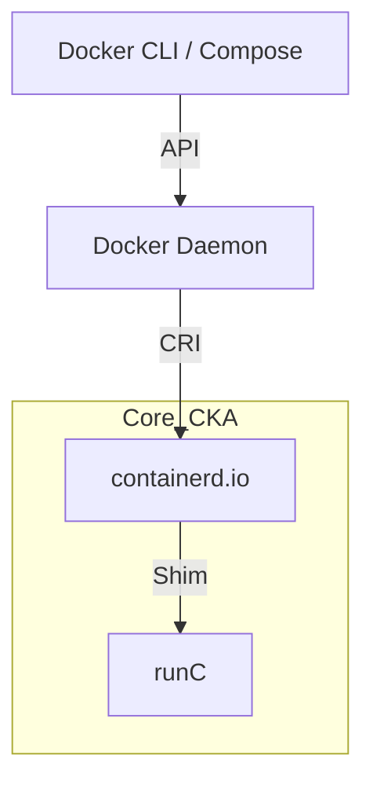

# Docker Engine & containerd

Para la estación de trabajo Acer, implementamos **[Docker Engine](https://docs.docker.com/engine/)** sobre Linux Mint. Esta decisión nos permite disponer de las herramientas de productividad de Docker, manteniendo el runtime **containerd** (requisito CKA) como motor base.

## 1. Instalación de Docker Engine (Nativo)

Evitamos la versión de los repositorios de Mint para asegurar la última versión estable (Ubuntu 24.04 Noble).

```bash title="Instalación"
# 1. Configurar GPG Key y Repositorio
sudo apt update
sudo apt install ca-certificates curl
sudo install -m 0755 -d /etc/apt/keyrings
sudo curl -fsSL https://download.docker.com/linux/ubuntu/gpg -o /etc/apt/keyrings/docker.asc
sudo chmod a+r /etc/apt/keyrings/docker.asc

echo "deb [arch=$(dpkg --print-architecture) signed-by=/etc/apt/keyrings/docker.asc] https://download.docker.com/linux/ubuntu $(. /etc/os-release && echo "$UBUNTU_CODENAME") stable" | sudo tee /etc/apt/sources.list.d/docker.list > /dev/null

# 2. Instalar Runtime
sudo apt update
sudo apt install docker-ce docker-ce-cli containerd.io docker-buildx-plugin docker-compose-plugin -y

# 3. Post-instalación (Sin sudo)
sudo usermod -aG docker $USER
```

:::warning Permisos
Es necesario cerrar y abrir sesión para que el grupo `docker` se active.
:::

## 2. Alineación con el Examen CKA

Al instalar `containerd.io`, podemos practicar con la herramienta `crictl`, que es el estándar en el examen CKA para diagnosticar nodos cuando el Kubelet falla.

```bash title="Diagnóstico Nivel CKA"
# Verificar el socket de containerd
sudo crictl --runtime-endpoint unix:///run/containerd/containerd.sock version
```

## 3. Arquitectura del Stack



---
**Documentación Relacionada:**
- [Optimización de Memoria (zRAM)](./zram-swap-optimization)
- [Productividad Terminal CKA](./k8s-terminal-productivity)
- [Implementación de Syncthing](./productivity-sync-syncthing)
---
