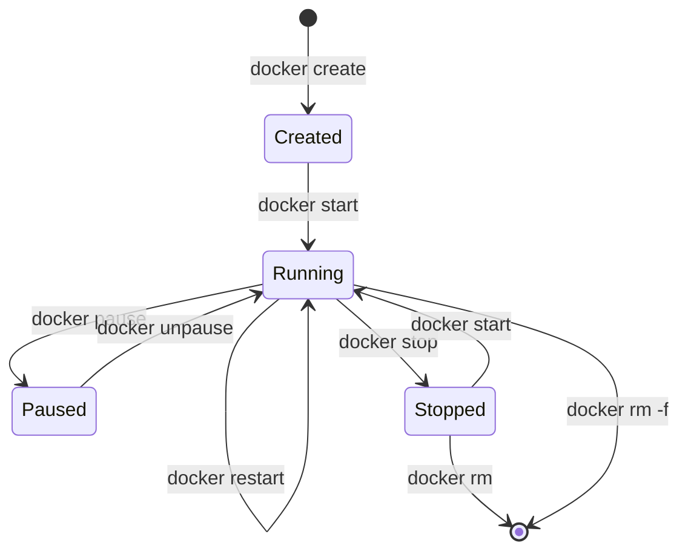

# Docker & Compose: Cheat Sheet

Esta guía centraliza los comandos más utilizados en la gestión diaria de infraestructuras basadas en contenedores. Se divide en operaciones imperativas (Docker CLI) y gestión de stacks (Docker Compose).

## 1. Ciclo de Vida del Contenedor (Docker CLI)

Utilizado para pruebas rápidas y ejecución de herramientas efímeras.

| Acción | Comando | Notas |
| :--- | :--- | :--- |
| **Iniciar** | `docker run -d --name <nombre> <imagen>` | `-d` corre en segundo plano (detached). |
| **Listar Activos** | `docker ps` | Añadir `-a` para ver también los detenidos. |
| **Detener** | `docker stop <nombre_o_id>` | Envía un SIGTERM seguido de SIGKILL. |
| **Iniciar Detenido** | `docker start <nombre_o_id>` | Reanuda un contenedor existente. |
| **Reiniciar** | `docker restart <nombre_o_id>` | Útil para recargar configuraciones. |
| **Eliminar** | `docker rm -f <nombre_o_id>` | `-f` fuerza el borrado si está corriendo. |

## 2. Gestión de Stacks (Docker Compose)

Enfoque declarativo basado en archivos `docker-compose.yml`.

```bash title="Operaciones de Stack"
# Levantar todo el stack (y construir imágenes si es necesario)
docker compose up -d

# Detener y eliminar contenedores, redes y volúmenes
docker compose down

# Ver el estado de los servicios del stack actual
docker compose ps

# Reiniciar un solo servicio del stack
docker compose restart <nombre_servicio>

# Validar la sintaxis del archivo compose
docker compose config
```

## 3. Diagnóstico y Observabilidad

Vital para el troubleshooting (habilidad core para la CKA).

```bash title="Logs e Inspección"
# Ver logs en tiempo real (Follow)
docker logs -f <nombre_contenedor>

# Ver las últimas 50 líneas de logs
docker logs --tail 50 <nombre_contenedor>

# Acceso interactivo a la terminal del contenedor
docker exec -it <nombre_contenedor> /bin/bash # o /bin/sh

# Inspeccionar toda la metadata (JSON) de un contenedor
docker inspect <nombre_contenedor>

# Ver procesos internos del contenedor
docker top <nombre_contenedor>
```

## 4. Mantenimiento y Limpieza (Pruning)

Para mantener el disco NVMe de la Acer libre de artefactos innecesarios.

```bash title="Limpieza de Sistema"
# Eliminar contenedores detenidos, redes sin uso y caché
docker system prune

# Eliminar TODO (incluyendo volúmenes y todas las imágenes no usadas)
docker system prune -a --volumes

# Eliminar imágenes huérfanas (dangling)
docker rmi $(docker images -f "dangling=true" -q)
```

## 5. El Ciclo de Vida Visual



:::info Conexión CKA
Aunque en el examen CKA usarás `kubectl`, la lógica de los comandos es idéntica:
*   `docker logs` &rarr; `kubectl logs`
*   `docker exec` &rarr; `kubectl exec`
*   `docker ps` &rarr; `kubectl get pods`
*   `docker inspect` &rarr; `kubectl describe`
*   `docker run` &rarr; `kubectl run` (para Pods efímeros)
:::

---
**Documentación Relacionada:**
- [Runtime de Contenedores (Docker)](./container-runtime-setup)
- [Sincronización con Syncthing](./productivity-sync-syncthing)
- [Productividad Terminal CKA](./k8s-terminal-productivity)
---
