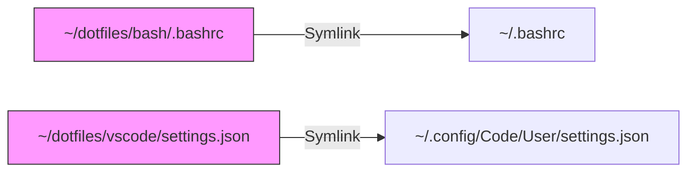

# Dotfiles: Infraestructura de Productividad

En el camino hacia la certificación **CKA**, la consistencia del entorno es vital. Los **Dotfiles** son los archivos de configuración (que suelen empezar por un punto, como `.bashrc` o `.vimrc`) que definen cómo se comporta nuestra terminal y nuestras herramientas de edición.

## 1. Estrategia: Repositorio + Enlaces Simbólicos

Como profesionales DevOps, no copiamos archivos de configuración manualmente. Utilizamos un repositorio centralizado y **Enlaces Simbólicos (Symlinks)**.

### Por qué usar Symlinks
Un enlace simbólico permite que el archivo resida en tu carpeta de configuración sincronizada (ej. `~/dotfiles`) pero el sistema operativo crea un "acceso directo" en la ruta donde la aplicación lo espera (ej. `~/.bashrc`).



## 2. VS Code: Configuración Unificada (CKA Ready)

Para minimizar la carga cognitiva, configuramos VS Code para que se comporte lo más parecido posible a una terminal pura con **Vim**.

```json title="~/.config/Code/User/settings.json"
{
    // --- UI & ASPECTO (DRACULA STYLE) ---
    "workbench.colorTheme": "Dracula",
    "editor.fontSize": 14,
    "editor.fontFamily": "'JetBrains Mono', 'Fira Code', monospace",
    "editor.fontLigatures": true,
    "editor.minimap.enabled": false,
    "telemetry.telemetryLevel": "off",

    // --- EDITOR CORE (ALINEADO A YAML/K8S) ---
    "editor.tabSize": 2,
    "editor.insertSpaces": true,
    "editor.wordWrap": "on",
    "files.autoSave": "onFocusChange",
    "editor.formatOnSave": false,

    // --- EXTENSIÓN VIM (MEMORIA MUSCULAR CKA) ---
    "vim.useSystemClipboard": true,
    "vim.hlsearch": true,
    "vim.leader": "<space>",
    "vim.insertModeKeyBindings": [
        { "before": ["j", "j"], "after": ["<Esc>"] }
    ],
    "vim.handleKeys": {
        "<C-f>": false,
        "<C-z>": false
    },

    // --- TERMINAL INTEGRADA ---
    "terminal.integrated.fontSize": 13,
    "terminal.integrated.defaultProfile.linux": "bash",
    "terminal.integrated.defaultProfile.windows": "Git Bash",
    "terminal.integrated.showOnStartup": "always",

    // --- KUBERNETES ---
    "kubernetes.kubectlVersioning": "use-context",
    "yaml.schemas": {
        "kubernetes": "/*.yaml"
    }
}
```

## 3. Automatización de la Inicialización

Para desplegar este entorno en la Acer, la HP Victus o la PC Clone de forma instantánea, utilizamos un script de instalación.

```bash title="~/dotfiles/install.sh"
#!/bin/bash

# Directorio del repositorio
DOTFILES_DIR="$HOME/dotfiles"

echo "Iniciando despliegue de Dotfiles..."

# Función para crear enlaces simbólicos
link_file() {
    local src=$1
    local dest=$2
    ln -sfn "$src" "$dest"
    echo "Linked: $dest -> $src"
}

# 1. Bash Config
link_file "$DOTFILES_DIR/bash/.bashrc" "$HOME/.bashrc"

# 2. Vim Config
link_file "$DOTFILES_DIR/vim/.vimrc" "$HOME/.vimrc"

# 3. VS Code Config (Linux)
link_file "$DOTFILES_DIR/vscode/settings.json" "$HOME/.config/Code/User/settings.json"

echo "Entorno configurado correctamente."
```

## 4. Estrategia de Sincronización

Combinamos **Git** para el control de versiones y **Syncthing** para la disponibilidad inmediata.

1.  **Git:** Para cambios estructurales. "Hice un nuevo alias para los laboratorios de Cloudera". `git commit && git push`.
2.  **Syncthing:** Sincroniza la carpeta `~/dotfiles` entre todos tus dispositivos. Un cambio en los settings de VS Code en la Acer se refleja automáticamente en la HP Victus sin intervención manual.

:::tip Recomendación de Arquitecto
Prioriza siempre la configuración **Global (User)**. Mantener una configuración coherente en todas las máquinas entrena tu memoria muscular, permitiéndote reaccionar más rápido durante la presión del examen CKA.
:::

---
**Documentación Relacionada:**
- [Productividad Terminal CKA](./k8s-terminal-productivity)
- [Docker & Compose Cheatsheet](./docker-ops-cheatsheet)
- [Syncthing Setup](./productivity-sync-syncthing)
---
