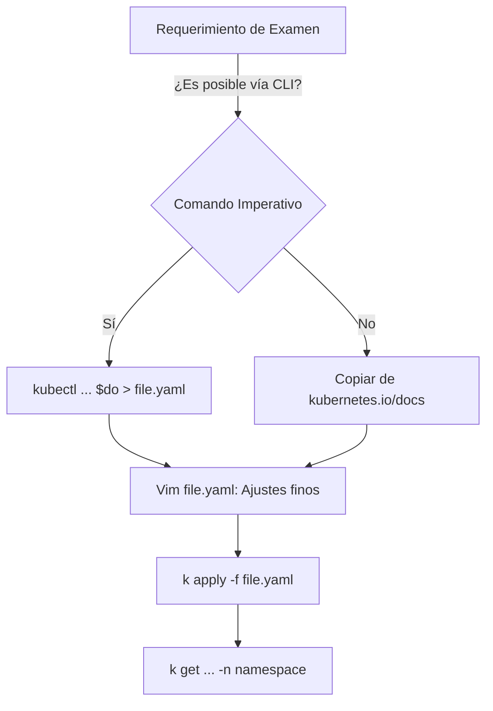

import Tabs from '@theme/Tabs';
import TabItem from '@theme/TabItem';

# Optimización de Terminal para Kubernetes

En el examen **CKA (Certified Kubernetes Administrator)**, el factor crítico de éxito no es solo el conocimiento, sino la **gestión del tiempo**. Dispones de 120 minutos para resolver entre 15 y 20 escenarios complejos. Automatizar los comandos repetitivos es obligatorio.

## 1. Configuración de Bash (`.bashrc`)

El objetivo es reducir la carga de teclado (keystrokes) y minimizar errores tipográficos en nombres de recursos o namespaces.

```bash title="~/.bashrc"
# Aliases Core
alias k='kubectl'
alias kgp='k get pods'
alias kgs='k get svc'
alias kgd='k get deploy'
alias kgn='k get nodes'

# Variables de velocidad (Cruciales)
# Uso: k run nginx --image=nginx $do > pod.yaml
export do="--dry-run=client -o yaml"
# Uso: k delete pod nginx $now
export now="--force --grace-period=0"

# Gestión de Contextos y Namespaces
alias kns='k config set-context --current --namespace'

# Autocompletado
source <(kubectl completion bash)
complete -o default -F __start_kubectl k
```

:::tip Recomendación de Arquitecto
La variable `$do` es tu mejor herramienta. El examen CKA premia el uso de **Comandos Imperativos** para generar archivos **Declarativos**. Nunca escribas un YAML desde cero; genéralo con `$do` y edítalo.
:::

## 2. Configuración de VIM para YAML

Vim es el editor por defecto en el entorno del examen. Una indentación incorrecta en Kubernetes romperá el manifiesto.

```bash title="Comando de inicialización rápida"
# Ejecuta esto al iniciar cualquier laboratorio para preparar VIM
cat <<EOF > ~/.vimrc
set tabstop=2
set shiftwidth=2
set expandtab
set nu
syntax on
EOF
```

| Parámetro | Función |
| :--- | :--- |
| `tabstop=2` | Define el ancho del tabulador a 2 espacios. |
| `expandtab` | Convierte los tabs en espacios reales (Vital para YAML). |
| `nu` | Muestra números de línea para identificar errores del linter. |

## 3. Flujo de Trabajo: El Método Imperativo

El siguiente diagrama muestra la arquitectura de decisión durante el examen para resolver una tarea en menos de 2 minutos:



## 4. Comandos de Supervivencia

### Cambio rápido de Namespace
En el examen, saltarás entre `default`, `kube-system`, y namespaces personalizados.
```bash
# Cambiar permanentemente al namespace 'finance'
kns finance
```

### Borrado instantáneo
Si un pod se queda en estado `Terminating`, no esperes los 30 segundos por defecto.
```bash
k delete pod <pod_name> $now
```

### Explicación de Recursos
Si olvidas el nombre de un campo en el YAML:
```bash
k explain pod.spec.containers.livenessProbe
```

---
**Documentación Relacionada:**
- [Runtime de Contenedores: Docker](./container-runtime-setup)
- [Estructura de Filesystems LVM](./fs-identification)
- [Base de Conocimiento Técnica](/)
---
