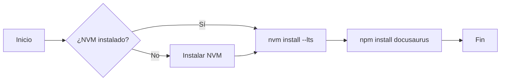

import Tabs from '@theme/Tabs';
import TabItem from '@theme/TabItem';

# Gestión del Runtime: Node.js

En un entorno de ingeniería DevOps, la instalación directa de Node.js desde los repositorios oficiales de la distribución suele ser contraproducente debido al desfase de versiones y la gestión de permisos en directorios globales (`/usr/lib/node_modules`).

Este estándar define el uso de **NVM (Node Version Manager)** como el método oficial para la Acer Aspire con Linux Mint.

:::tip Beneficio de Arquitecto
El uso de NVM permite ejecutar procesos de `npm install -g` sin requerir `sudo`, manteniendo la integridad del sistema de archivos y evitando conflictos de permisos en el despliegue de sitios como Docusaurus o Astro.
:::

## 1. Procedimiento de Instalación

Seleccione el método según el alcance del entorno:

<Tabs>
  <TabItem value="nvm" label="NVM (Recomendado)" default>

### Instalación vía Script
Descarga e instala el script de gestión en el perfil del usuario:

```bash title="Terminal"
curl -o- https://raw.githubusercontent.com/nvm-sh/nvm/v0.40.1/install.sh | bash
```

### Carga de variables de entorno
Añade lo siguiente a tu `~/.bashrc` (o reinicia la terminal):

```bash
export NVM_DIR="$([ -z "${XDG_CONFIG_HOME-}" ] && echo "$HOME/.nvm" || echo "$XDG_CONFIG_HOME/nvm")"
[ -s "$NVM_DIR/nvm.sh" ] && \. "$NVM_DIR/nvm.sh" # This loads nvm
```

  </TabItem>
  <TabItem value="apt" label="APT (Legacy/Server)">

:::danger No recomendado para Desarrollo
Este método instala Node.js en rutas protegidas, lo que genera errores de `EACCES` al instalar dependencias globales de Docusaurus.
:::

```bash title="Terminal"
sudo apt update
sudo apt install nodejs npm -y
```

  </TabItem>
</Tabs>

## 2. Definición de Versión Estándar (LTS)

Para garantizar la compatibilidad con el proyecto `dzamo.gitlab.io` y las herramientas de Cloudera, utilizaremos la versión **LTS (Long Term Support)** actual.

```bash title="Estrategia de versiones"
# Instalar la última versión estable (LTS)
nvm install --lts

# Definirla como predeterminada para nuevas terminales
nvm alias default 'lts/*'

# Verificar instalación
node -v # Debería devolver v22.x.x (Jodrell Bank) o superior
npm -v
```

:::info Persistencia de NVM
Los comandos de alias en NVM son persistentes a nivel de sistema de archivos del usuario. Una vez definido el alias default, este se mantendrá activo entre reinicios, siempre que el script de inicialización de NVM esté presente en el archivo de configuración del shell (.bashrc o .zshrc).
:::

## 3. Configuración para Docusaurus

Una vez instalado el runtime, es necesario preparar el entorno de este repositorio para su ejecución local.

:::info Estándar de Operación
Siempre que se trabaje en el directorio `~/hot-tier/dzamo.gitlab.io`, se debe validar que la versión de Node sea la correcta mediante un archivo `.nvmrc`.
:::

```bash title="Preparación de DZ.LOG"
cd ~/hot-tier/dzamo.gitlab.io

# Instalar dependencias del proyecto
npm install

# Levantar servidor de desarrollo local
npm run start
```

### Creación del Contrato de Versión (.nvmrc)

Para asegurar que cualquier colaborador (o tú mismo en el futuro) use la versión correcta, crea el archivo de configuración:

```bash title="Terminal"
cd ~/hot-tier/dzamo.gitlab.io/
node -v > .nvmrc  # Guarda la versión actual (ej: v22.13.0)
```

De ahora en adelante, al entrar al proyecto, solo necesitas ejecutar `nvm use` para sincronizar tu runtime con los requerimientos del sitio.

:::info Buenas practicas de ingeniería
Con lo anterior se evita bastante el clásico *"en mi máquina funciona, pero en el servidor de despliegue no"*. Al tener el `.nvmrc`, GitLab CI (donde despliegas tu blog) también sabrá qué versión de Node usar para compilar el sitio.
:::

## 4. Solución de Problemas Comunes

| Error | Causa | Solución |
| :--- | :--- | :--- |
| `EACCES` | Uso de `npm -g` con APT | Migrar a NVM o cambiar owner de `/usr/local` |
| `GLIBC_X.XX not found` | Kernel muy antiguo | No aplica en Mint (Kernel 6.x+) |
| `command not found: nvm` | Bash no refrescado | Ejecutar `source ~/.bashrc` |



---
**Próximos Pasos:**
- Configuración de `husky` para pre-commit hooks.
- Integración de pipelines en GitLab CI para el despliegue automático de esta base de conocimientos.

