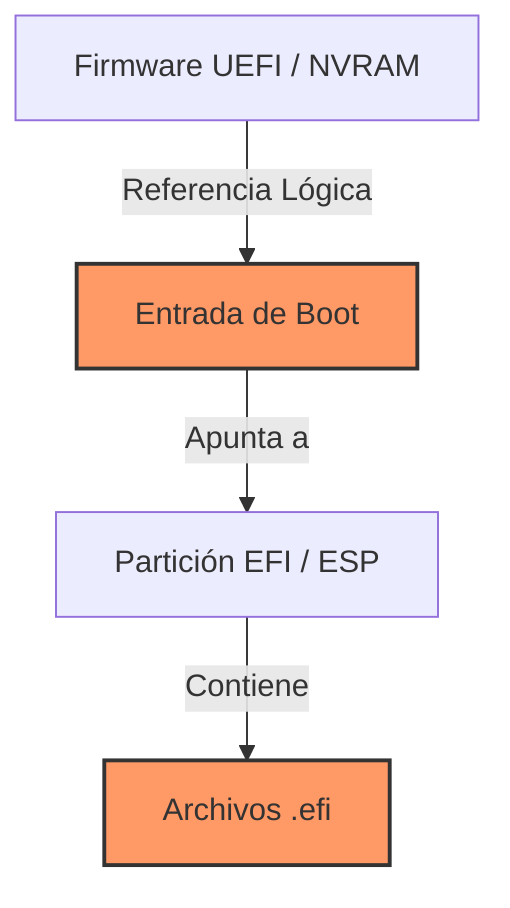

import Tabs from '@theme/Tabs';
import TabItem from '@theme/TabItem';

# Gestión de Entradas UEFI

Durante el ciclo de vida de una estación de trabajo de ingeniería (como la Acer Aspire), es común realizar pruebas con distintas distribuciones (ej. MX Linux). Estas instalaciones suelen dejar rastro en la **NVRAM** del firmware y en la partición **ESP**, lo que genera "entradas fantasma" en el menú de arranque.

## 1. Arquitectura del Arranque UEFI

Es fundamental entender que la limpieza debe realizarse en dos niveles para que sea total:



## 2. Procedimientos de Limpieza

Seleccione el entorno desde el cual desea realizar el mantenimiento:

<Tabs>
  <TabItem value="linux" label="Linux (Recomendado)" default>

### Uso de `efibootmgr`

Es la herramienta estándar en Linux para manipular el firmware.

1.  **Listar entradas actuales:**
    ```bash title="Terminal"
    sudo efibootmgr
    ```
    Identifique el número de la entrada (ej. `Boot0002* MX Linux`).

2.  **Eliminar entrada de la NVRAM:**
    ```bash title="Terminal"
    # Reemplace 0002 por el número identificado
    sudo efibootmgr -b 0002 -B
    ```

:::tip Verificación
Vuelva a ejecutar `sudo efibootmgr` para confirmar que el `BootOrder` se ha actualizado automáticamente.
:::

  </TabItem>
  <TabItem value="filesystem" label="Limpieza de Partición (Pro)">

### Borrado de archivos físicos

Eliminar la entrada de la NVRAM no borra los archivos del disco. Para una limpieza "Total Clean":

1.  **Navegar a la partición EFI:**
    ```bash title="Terminal"
    cd /boot/efi/EFI/
    ls -l
    ```

2.  **Eliminar directorio huérfano:**
    Si observa carpetas de distribuciones antiguas (ej. `MX-Linux` o `ubuntu` antiguo):
    ```bash title="Terminal"
    # PRECAUCIÓN: No borrar la carpeta 'debian', 'Microsoft' o 'Boot'
    sudo rm -rf MX-Linux
    ```

  </TabItem>
  <TabItem value="windows" label="Windows (GUI)">

### Uso de BCDEDIT

Si prefiere gestionar el firmware desde Windows 11:

1.  Abrir **CMD** como Administrador.
2.  Listar entradas de firmware:
    ```cmd
    bcdedit /enum firmware
    ```
3.  Borrar la entrada mediante su identificador (GUID):
    ```cmd
    bcdedit /delete {identificador-largo-entre-llaves}
    ```

  </TabItem>
</Tabs>

## 3. Consideraciones de Seguridad

:::danger Secure Boot
Si tiene **Secure Boot** activado, algunas operaciones de escritura en la NVRAM podrían ser bloqueadas por el firmware. Si los cambios no persisten tras un reinicio, verifique el estado del Secure Boot en su BIOS.
:::

## 4. Resumen de Operación

| Nivel | Herramienta | Acción | Resultado |
| :--- | :--- | :--- | :--- |
| **Lógico** | `efibootmgr` | Delete Entry | Desaparece del menú de BIOS. |
| **Físico** | `rm -rf` | Delete Folder | Libera espacio en la partición ESP. |
| **Windows** | `bcdedit` | Delete GUID | Limpieza desde entorno alternativo. |

---
**Documentación Relacionada:**
- [Estructura de Filesystems LVM](./fs-identification)
- [Optimización de Terminal CKA](./k8s-terminal-productivity)
---
