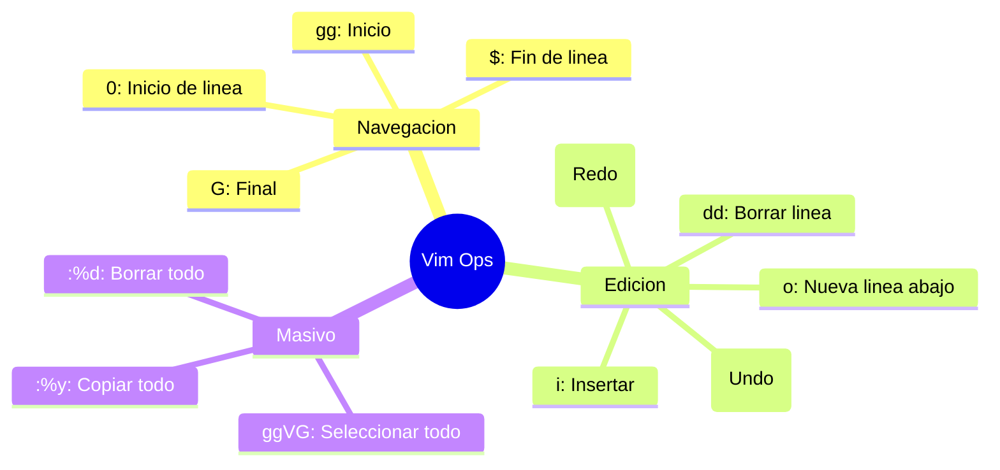

# Vim: Productividad en Edición de Manifiestos

En el ecosistema Kubernetes, la edición de archivos YAML es constante. Dominar los modos de **Vim** permite realizar modificaciones estructurales sin despegar las manos del teclado, una habilidad crítica durante la presión del examen CKA.

## 1. Operaciones de Archivo Completo

Estas secuencias son vitales cuando necesitas limpiar un manifiesto generado por `--dry-run` o copiar configuraciones enteras.

| Acción | Secuencia (Modo Normal) | Explicación |
| :--- | :--- | :--- |
| **Ir al inicio** | `gg` | Salta a la primera línea del archivo. |
| **Ir al final** | `G` | Salta a la última línea del archivo. |
| **Seleccionar Todo** | `ggVG` | Inicio (`gg`), Modo Visual Línea (`V`), Final (`G`). |
| **Borrar Todo** | `:%d` | Comando: En todo el archivo (`%`), borrar (`d`). |
| **Copiar Todo** | `:%y` | Comando: En todo el archivo (`%`), copiar/yank (`y`). |

:::tip Pro-Tip de Arquitecto
Si estás en **VSCodeVim**, al hacer `ggVG` el contenido queda resaltado. Puedes presionar `d` para borrarlo o `y` para copiarlo al portapapeles del sistema (si tienes activado `vim.useSystemClipboard` en `settings.json`).
:::

## 2. Edición de Bloques YAML (Indentación)

El error más común en la CKA es una indentación incorrecta. Vim permite mover bloques completos de código fácilmente.

*   **Identar un bloque:**
    1. Entra en modo visual por línea: `V`.
    2. Selecciona las líneas con las flechas o `j/k`.
    3. Presiona `>` para mover a la derecha o `<` para la izquierda.
*   **Repetir última acción:** Presiona el punto `.` (Muy útil para indentar varias veces el mismo bloque).

## 3. Navegación y Búsqueda Rápida

Para encontrar un parámetro específico en un `describe` o un archivo de configuración extenso:

1.  **Buscar:** Presiona `/` seguido del término (ej. `/imagePullPolicy`) y `Enter`.
2.  **Siguiente coincidencia:** Presiona `n`.
3.  **Coincidencia anterior:** Presiona `N`.

## 4. El "Modo Emergencia" (jj)

Si has configurado tu `settings.json` o tu `.vimrc` con un mapeo rápido, puedes salir del modo **Insertar** al modo **Normal** sin estirar el dedo meñique hasta la tecla `Esc`.

```bash title="Recomendación de mapeo"
# En VS Code o .vimrc, mapear 'jj' para salir a modo Normal
jj -> <Esc>
```

## 5. Tabla de Referencia Rápida (Cheat Sheet)



:::info Configuración para CKA
Recuerda que en el examen, antes de empezar, es recomendable ejecutar el comando para configurar el `.vimrc` (visto en la nota [Aliases y Productividad K8s...](/05-technical-notes/k8s-terminal-productivity)) para asegurar que los espacios de los YAML sean consistentes:
`set tabstop=2 shiftwidth=2 expandtab`
:::

---
**Documentación Relacionada:**
- [Productividad Terminal CKA](./k8s-terminal-productivity)
- [Cheat Sheet Docker](./docker-ops-cheatsheet)
---
