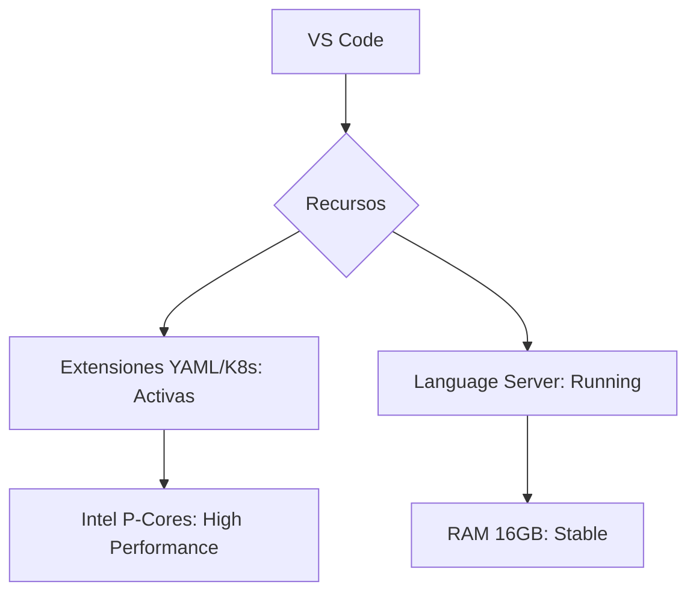

import Tabs from '@theme/Tabs';
import TabItem from '@theme/TabItem';

# Configuración de Visual Studio Code

Visual Studio Code (VS Code) se establece como el IDE estándar para la gestión de esta base de conocimientos y el desarrollo de artefactos para la certificación CKA. En Linux Mint 22.x, optamos por la instalación vía **repositorio oficial de Microsoft** para asegurar actualizaciones vía `apt` y compatibilidad con CLI.

:::warning No utilizar Flatpak/Snap
Las versiones aisladas (sandbox) suelen presentar conflictos al intentar acceder al agente SSH del host o al interactuar con binarios instalados vía NVM.
:::

## 1. Instalación del Repositorio Oficial

Para mantener el sistema limpio y actualizado, seguimos el flujo de confianza de Debian/Ubuntu:

```bash title="Terminal"
# 1. Instalar dependencias necesarias
sudo apt update && sudo apt install software-properties-common apt-transport-https wget -y

# 2. Importar la llave GPG de Microsoft
wget -qO- https://packages.microsoft.com/keys/microsoft.asc | gpg --dearmor > microsoft.gpg
sudo install -D -o root -g root -m 644 microsoft.gpg /etc/apt/keyrings/microsoft.gpg

# 3. Añadir el repositorio APT
sudo sh -c 'echo "deb [arch=amd64,arm64,armhf signed-by=/etc/apt/keyrings/microsoft.gpg] https://packages.microsoft.com/repos/code stable main" > /etc/apt/sources.list.d/vscode.list'

# 4. Instalar el binario
sudo apt update
sudo apt install code
```

## 2. Stack de Extensiones DevOps (Curado)

Para la preparación de la CKA y la gestión de Cloudera/Docusaurus, estas extensiones son obligatorias:

| Categoría | Extensión | Utilidad |
| :--- | :--- | :--- |
| **Infraestructura** | `ms-kubernetes-tools.vscode-kubernetes-tools` | Visualización de clústeres, logs y cambio de contexto. |
| **Lenguaje** | `redhat.vscode-yaml` | Validación de esquemas de Kubernetes (indispensable). |
| **Contenedores** | `ms-azuretools.vscode-docker` | Gestión de imágenes, volúmenes y Dockerfiles localmente. |
| **Entorno CKA** | `vscodevim.vim` | **Crítico:** Mantiene la memoria muscular para el examen CKA. |
| **Documentación** | `unifiedjs.vscode-mdx` | Soporte para el contenido MDX de Docusaurus. |

:::tip Entrenamiento CKA
Instalar la extensión **Vim** en VS Code no es opcional. Durante el examen CKA no tendrás un IDE; dominar los comandos de movimiento y edición de Vim en tu día a día te dará una ventaja de velocidad decisiva.
:::

## 3. Configuración del Editor (`settings.json`)

Para optimizar el rendimiento en la Acer Aspire (Intel 12th Gen) y mantener el estilo "Terminal", se recomienda ajustar los siguientes parámetros:

```json title="~/.config/Code/User/settings.json"
{
    "editor.fontSize": 14,
    "editor.fontFamily": "'JetBrains Mono', 'Fira Code', monospace",
    "editor.fontLigatures": true,
    "terminal.integrated.fontSize": 13,
    "editor.tabSize": 2, // Estándar para YAML/Kubernetes
    "editor.insertSpaces": true,
    "files.autoSave": "onFocusChange",
    "telemetry.telemetryLevel": "off", // Limpieza de procesos de fondo
    "workbench.colorTheme": "Dracula", // Consistente con tu docusaurus dark theme
    "kubernetes.kubectlVersioning": "use-context"
}
```

## 4. Integración con Git y Docusaurus

Desde la terminal integrada de VS Code (`Ctrl + J`), ya puedes gestionar el flujo de trabajo de `dz.log`:

```bash title="Workflow"
# Abrir el proyecto
code ~/hot-tier/dzamo.gitlab.io

# Lanzar docusaurus desde la terminal de VS Code
npm run start
```

## 5. Validación de Performance



---
**Documentación Relacionada:**
- [Gestión del Runtime: Node.js](/05-technical-notes/node-runtime-setup)
- [Estándares de Commits: Conventional](../devops-standards/git-conventional-commits)
