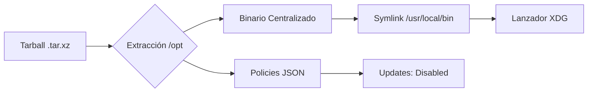

import Tabs from '@theme/Tabs';
import TabItem from '@theme/TabItem';

# Instalación de Zen Browser

Zen Browser se presenta como una alternativa de alto rendimiento basada en Firefox, enfocada en la privacidad y una interfaz optimizada. En entornos gestionados bajo estándares **LFCS**, optamos por una instalación manual en `/opt` para garantizar que el binario sea inmutable para usuarios sin privilegios y centralizar su administración.

:::warning Control de Binarios
Al descargar el formato `.tar.xz`, el navegador no es gestionado por `apt`. Es responsabilidad del administrador del sistema realizar el seguimiento de versiones y la auditoría de los binarios extraídos.
:::

## 1. Despliegue en el FileSystem

Siguiendo el estándar de jerarquía de archivos (FHS), ubicaremos el navegador en `/opt`. Esto evita la fragmentación de aplicaciones en los directorios `$HOME` de los usuarios.

```bash title="Terminal"
# 1. Preparar directorio de destino
sudo mkdir -p /opt/zen-browser

# 2. Extraer el paquete (ajustar nombre de archivo si varía)
# El flag --strip-components=1 elimina la carpeta raíz del tarball
sudo tar -xJf ~/Downloads/zen.linux-x86_64.tar.xz -C /opt/zen-browser --strip-components=1

# 3. Normalizar permisos (Root-Owned)
sudo chown -R root:root /opt/zen-browser
sudo chmod +x /opt/zen-browser/zen

# 4. Crear symlink en el PATH global
sudo ln -sf /opt/zen-browser/zen /usr/local/bin/zen
```

## 2. Integración con el Entorno XFCE

Para que Zen aparezca en el menú de aplicaciones y en el buscador de Linux Mint (Whisker Menu), creamos el archivo de entrada de escritorio.

```bash title="Creación de lanzador .desktop"
cat <<EOF | sudo tee /usr/share/applications/zen.desktop
[Desktop Entry]
Version=1.0
Type=Application
Name=Zen Browser
GenericName=Navegador Web
Comment=Navegador centrado en la privacidad y el diseño
Exec=/opt/zen-browser/zen %u
Icon=/opt/zen-browser/browser/chrome/icons/default/default128.png
Terminal=false
Categories=Network;WebBrowser;
MimeType=text/html;text/xml;application/xhtml+xml;application/xml;application/rss+xml;application/rdf+xml;image/gif;image/jpeg;image/png;x-scheme-handler/http;x-scheme-handler/https;
StartupNotify=true
StartupWMClass=zen-alpha
EOF

# Indexar nuevo lanzador
sudo update-desktop-database /usr/share/applications/
```

## 3. Hardening: Desactivar Actualizaciones Automáticas

En una estación de trabajo de administración, las actualizaciones deben ser predecibles. Deshabilitamos el motor de actualización interna para evitar conflictos de escritura en `/opt`.

```bash title="Aplicación de Políticas JSON"
sudo mkdir -p /opt/zen-browser/distribution

cat <<EOF | sudo tee /opt/zen-browser/distribution/policies.json
{
  "policies": {
    "DisableAppUpdate": true,
    "ManualAppUpdateOnly": true
  }
}
EOF
```

:::tip Verificación de Políticas
Una vez iniciado el navegador, escribe `about:policy` en la barra de direcciones para confirmar que la directiva **DisableAppUpdate** está activa.
:::

## 4. Personalización y Look & Feel

Puedes ajustar el comportamiento visual inicial sin necesidad de reinstalar el perfil.

<Tabs>
  <TabItem value="accent" label="Colores de Acento" default>
    Haz clic derecho en cualquier espacio libre de la barra de pestañas y selecciona **"Change theme colors"**. Esto permite alternar entre esquemas cromáticos sin entrar en menús profundos.
  </TabItem>
  <TabItem value="reset" label="Reiniciar Wizard">
    Si deseas volver a ejecutar el asistente de bienvenida, abre la terminal y ejecuta:
    ```bash
    zen -P
    ```
    Crea un nuevo perfil para disparar el flujo de configuración inicial.
  </TabItem>
  <TabItem value="config" label="Directorio de Perfil">
    Toda tu configuración de usuario (CSS, pestañas, historial) persiste en:
    `~/.zen/` o `~/.mozilla/zen/` (dependiendo de la versión).
  </TabItem>
</Tabs>

## 5. Flujo de Instalación (Resumen)



---
**Documentación Relacionada:**
- [Estación de Trabajo: VS Code en Linux Mint](./vscode-dev-setup)
- [Optimización de Memoria: ZRAM](./zram-swap-optimization)
