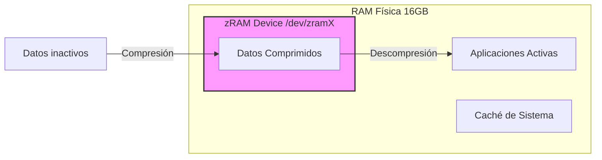

# Optimización de Memoria: zRAM

En equipos modernos con discos NVMe y procesadores de alto rendimiento como el Intel 12th Gen, el uso de una partición de Swap física en disco genera una degradación innecesaria del hardware y latencias evitables.

## 1. Estrategia y Justificación

Para la estación de trabajo **Acer Aspire (16GB RAM)**, hemos optado por eliminar la Swap física en favor de **zRAM**.

### Razonamiento Técnico
*   **Vida útil del NVMe:** Evitamos el "swap churn" (escritura constante), protegiendo las celdas de memoria del disco de 1TB.
*   **Velocidad:** La compresión/descompresión en RAM es órdenes de magnitud más rápida que el I/O de disco.
*   **Contexto CKA:** El `kubelet` de Kubernetes tradicionalmente requiere que el swap esté desactivado. zRAM nos permite tener una red de seguridad para el SO sin entrar en conflicto directo con los requerimientos de K8s durante los laboratorios.

:::tip Veredicto del Arquitecto
No se crea partición de Swap física. La eficiencia de la arquitectura híbrida de Intel (P-cores/E-cores) permite que la compresión `zstd` o `lz4` de zRAM sea prácticamente "gratis" en términos de CPU.
:::

## 2. Implementación

El paquete `zram-config` automatiza la creación de dispositivos swap comprimidos en RAM.

```bash title="Instalación y Activación"
# Actualizar repositorios e instalar el módulo
sudo apt update && sudo apt install zram-config -y
```

### Flujo de Datos en Memoria



## 3. Integración con Kubernetes (Modo Laboratorio)

Aunque zRAM es más amigable, para simulacros estrictos de la certificación CKA donde necesites un entorno "Pure Clean", debes ser capaz de desactivar cualquier forma de swap.

```bash title="Scripts de Control (Draft 03)"
# Desactivar swap momentáneamente para laboratorios de K8s
sudo swapoff -a

# Verificar que no hay dispositivos de swap activos
swapon --show
```

:::info Persistencia
Linux Mint configurará zRAM automáticamente en cada reinicio. Si realizas un cambio en el archivo de configuración del Kubelet para permitir swap (`failSwapOn: false`), podrías mantener zRAM activo incluso durante los laboratorios, aunque no es la configuración estándar del examen.
:::

## 4. Verificación del Estado

Para observar el ratio de compresión y cuánto espacio estás ahorrando realmente, utiliza:

```bash title="Terminal"
zramctl
```

---
**Documentación Relacionada:**
- [Estructura de Filesystems](./fs-identification)
- [Preparación de Entorno VS Code](./vscode-dev-setup)

