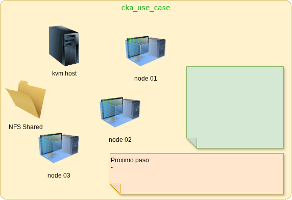
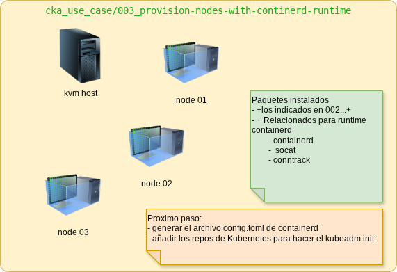
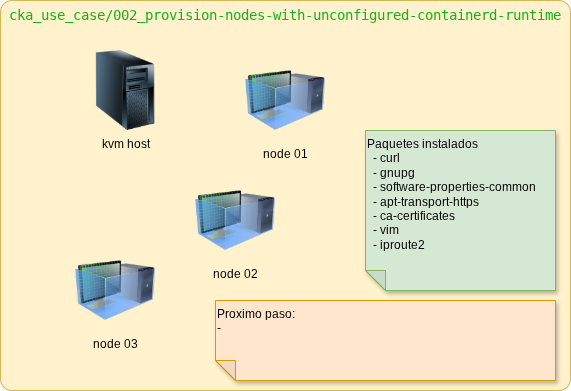

# README.md

> Caso de Uso CKA

## Objetivo

> Despliegue completo, en diferentes etapas (evoluciones) y/o puntos de control, para desplegar un cluster Kubernetes completo para escenario de producción real.

## Representación del depliegue

## `.../003_provision-nodes-with-continerd-runtime/`

> Aprovisionamiento de los nodos (`master`'s y` worker`'s) con runtime `containerd` instalado.
 

## `.../002_provision-nodes-with-unconfigured-containerd-runtime`

> - Aprovisionamiento de los dominios (maquinas virtuales o guest) para host anfitrión KVM.
> - Aprincipales tecnologías utilizadas: `libvirt/Qemu/KVM`, `cloud-init`

#### Lógica de ejecución

~~- script `src/002_provision_cluster/provision_vms_cluster.sh`: El script para shell bash recorre el archivo `nodes.csv` y provisiona las VMs. (dominios de host KVM) segun registro del archivo utilizando el CLI `virsh` explotando la opción `--init-cloud`~~
~~- script `src/002_provision_cluster/cleanup_cluster_vms.sh`: El script detiene todos los dominios registrados en el `nodes.csv`, destruyendo los recursos y borrando los storage, para liberar y mantener el anfitrión KVM limpio.~~
