## VMware vSphere: Install, Configure, Manage [V8] 

## Lab Manual 

Adapted by Help-IT 13-09-2023 

VMware® Education Services VMware, Inc. www.vmware.com/education 

VMware vSphere: Install, Configure, Manage [V8] 

Lab Manual 

Part Number EDU-EN-VSICM8-LAB (02-DEC-2022) 

Copyright © 2022 VMware, Inc. All rights reserved. This manual and its accompanying materials are protected by U.S. and international copyright and intellectual property laws. VMware products are covered by one or more patents listed at 

http://www.vmware.com/go/patents. VMware is a registered trademark or trademark of VMware, Inc. in the United States and/or other jurisdictions. All other marks and names mentioned herein may be trademarks of their respective companies. VMware vSphere® vMotion®, VMware vSphere® Storage vMotion®, VMware vSphere® Lifecycle Manager™, VMware vSphere® High Availability, VMware vSphere® Enterprise Plus Edition™, VMware vSphere® ESXi™ Shell, VMware vSphere® Distributed Switch™, VMware vSphere® Distributed Resource Scheduler™, VMware vSphere® Client™, VMware vSphere® 2015, VMware vSphere®, VMware vSAN™, VMware vRealize®, VMware vCloud®, VMware vCenter Server®, VMware vCenter®, VMware View®, VMware Horizon® View™, VMware Verify™, VMware Host Client™, VMware Horizon® 7, VMware Horizon® 7, VMware Horizon® 7 on VMware Cloud™ on AWS, VMware Cloud™ on AWS GovCloud (US), VMware Cloud™ on AWS Outposts, VMware vSphere® VMFS, vSphere Storage vMotion, Project Photon OS™, VMware Photon™, VMware Pivotal Labs® Navigator™, VMware vCenter® Log Insight™, VMware Horizon® Standard Edition, VMware Go™, VMware ESXi™, VMware ESX®, and VMware vSphere® Distributed Resource Scheduler™ are registered trademarks or trademarks of VMware, Inc. in the United States and/or other jurisdictions. 

The training material is provided “as is,” and all express or implied conditions, representations, and warranties, including any implied warranty of merchantability, fitness for a particular purpose or noninfringement, are disclaimed, even if VMware, Inc., has been advised of the possibility of such claims. This material is designed to be used for reference purposes in conjunction with a training course. 

The training material is not a standalone training tool. Use of the training material for selfstudy without class attendance is not recommended. These materials and the computer programs to which it relates are the property of, and embody trade secrets and confidential information proprietary to, VMware, Inc., and may not be reproduced, copied, disclosed, transferred, adapted or modified without the express written approval of VMware, Inc. 

www.vmware.com/education 

## **Typographical Conventions** 

The following typographical conventions are used in this course. 

|**Conventions**|**Usage and Examples**|
|---|---|
|`Monospace`|Identifies command names, command options, parameters, code|
||fragments, error messages, filenames, folder names, directory names,|
||and path names:|
||• Run the`esxtop`command.|
||• ... found in the`/var/log/messages`file.|
|**`Monospace`**|Identifies user inputs:|
|**`Bold`**|• Enter**`ip a`**.|
|**Boldface**|Identifies user interface controls:|
||• Click the**Configuration**tab.|
|_Italic_|Identifies book titles:|
||• _vSphere Virtual Machine Administration_|
|< >|Indicates placeholder variables:|
||• <ESXi_host_name>|
||• ... the`Settings/<Your_Name>.txt`file|

www.vmware.com/education 

## Contents 

Lab 1 Accessing the Lab Environment ....................................................................................... 1 Task 1: Access the Student Console ............................................................................................................................. 1 Task 2: Log In to an ESXi Host with VMware Host Client ................................................................................... 2 Task 3: Log In to vCenter with the vSphere Client ................................................................................................ 4 Lab 2 Configuring an ESXi Host .................................................................................................. 6 Task 1: Add an ESXi Host to an LDAP Server ......................................................................................................... 7 Task 2: Log In to the ESXi Host as an LDAP User................................................................................................. 8 Task 3: Activate the SSH and vSphere ESXi Shell Services .............................................................................. 9 Task 4: Configure the ESXi Host as an NTP Client .............................................................................................. 10 Lab 3 Adding vSphere Licenses ................................................................................................. 11 Task 1: Add vSphere Licenses to vCenter ............................................................................................................... 12 Task 2: Assign a License to the vCenter Instance ................................................................................................ 13 Lab 4 Creating and Managing the vCenter Inventory ...................................................... 15 Task 1: Create a Data Center Object .......................................................................................................................... 16 Task 2: Add Two ESXi Hosts to the Inventory ...................................................................................................... 17 Task 3: View Information About the ESXi Hosts ................................................................................................... 19 Task 4: Configure an ESXi Host as an NTP Client ............................................................................................... 20 Task 5: Create a Folder for the ESXi Hosts ............................................................................................................. 21 Task 6: Create Folders for VMs and VM Templates ........................................................................................... 22 Lab 5 Adding an Identity Source .............................................................................................. 23 Task 1: Add vclass.local as an LDAP Identity Source ......................................................................................... 23 Lab 6 Users Groups and Permissions ..................................................................................... 25 Task 1: View LDAP Users ............................................................................................................................................... 26 

iv 

Task 2: Assign Root-Level Global Permission to an LDAP User ................................................................... 27 Task 3: Assign Object Permission to an LDAP User ........................................................................................... 28 Task 4: Verify that the cladmin User Can Access Content Library ............................................................... 29 Task 5: Verify that the studentadmin User Can Perform Administrator Tasks ....................................... 30 Lab 7 Creating Standard Switches ............................................................................................ 31 Task 1: View the Standard Switch Configuration .................................................................................................. 32 Task 2: Create a Standard Switch with a Virtual Machine Port Group ......................................................... 33 Task 3: Attach Virtual Machines to the Virtual Machine Port Group ............................................................. 36 Lab 8 Configuring vSphere Distributed Switches .............................................................. 39 Task 1: Create a Distributed Switch ........................................................................................................................... 40 Task 2: Add ESXi Hosts to the Distributed Switch ..............................................................................................42 Task 3: Verify Your Distributed Switch Configuration ........................................................................................43 Lab 9 Accessing iSCSI Storage ................................................................................................. 45 Task 1: View an Existing ESXi Host iSCSI Configuration ................................................................................... 46 Task 2: Add a VMkernel Port for IP Storage......................................................................................................... 48 Task 3: Add a Second VMkernel Port for IP Storage .......................................................................................... 51 Task 4: Add the iSCSI Software Adapter to an ESXi Host .............................................................................. 53 Task 5: Discover LUNs on the iSCSI Target Server ............................................................................................54 Lab 10 Managing VMFS Datastores ........................................................................................ 55 Task 1: Create VMFS Datastores for the ESXi Hosts ......................................................................................... 55 Task 2: Expand a VMFS Datastore to Consume Unused Space on a LUN ............................................... 58 Task 3: Remove a VMFS Datastore ........................................................................................................................... 58 Task 4: Extend a VMFS Datastore by Adding a LUN ......................................................................................... 59 Lab 11 Accessing NFS Storage ................................................................................................. 60 Task 1: Configure Access to an NFS Datastore ..................................................................................................... 61 Task 2: View NFS Storage Information .................................................................................................................... 62 Lab 12 Creating and Removing a Virtual Machine ............................................................. 63 Task 1: Create a Virtual Machine ................................................................................................................................. 64 Task 2: Remove the Virtual Machine from the vCenter Inventory ................................................................66 Task 3: Register the Virtual Machine to Re-Add it to the vCenter Inventory ...........................................66 Task 4: Delete the Virtual Machine from the Datastore ..................................................................................... 67 Lab 13 (Simulation) Installing VMware Tools ........................................................................ 68 Lab 14 Adding Virtual Hardware ............................................................................................... 69 

v 

Task 1: Examine a Virtual Machine's Configuration .............................................................................................. 70 Task 2: Add Virtual Hard Disks to the Virtual Machine ........................................................................................ 71 Task 3: Compare Thin-Provisioned and Thick-Provisioned Disks.................................................................. 72 Lab 15 Modifying Virtual Machines ........................................................................................... 73 Task 1: Adjust Memory Allocation on a Powered-On Virtual Machine ......................................................... 74 Task 2: Increase the Size of a Virtual Disk ............................................................................................................... 75 Task 3: Configure the Guest OS to Recognize the Additional Disk Space ................................................ 76 Task 4: Rename a Virtual Machine in the vCenter Inventory ........................................................................... 78 Lab 16 Creating Templates and Deploying VMs ................................................................ 79 Task 1: Create a Virtual Machine Template ............................................................................................................. 80 Task 2: Create Customization Specifications .......................................................................................................... 81 Task 3: Deploy Virtual Machines from a Template ............................................................................................... 82 Lab 17 Using Local Content Libraries ...................................................................................... 85 Task 1: Create a Local Content Library .....................................................................................................................86 Task 2: Create an OVF Template in the Content Library ................................................................................. 87 Task 3: Create a VM Template in the Content Library ....................................................................................... 88 Task 4: View the Content Library Templates ........................................................................................................89 Task 5: Deploy a VM from a Template in the Content Library ...................................................................... 90 Lab 18 Using Subscribed Content Libraries ........................................................................... 91 Task 1: Publish a Local Content Library..................................................................................................................... 92 Task 2: Create a Subscribed Content Library ........................................................................................................ 93 Task 3: Create a Subscription for VM Templates ................................................................................................. 95 Task 4: Deploy a VM from the Subscribed Content Library ............................................................................96 Lab 19 Versioning VM Templates in Content Libraries .................................................... 99 Task 1: Check Out a VM Template in the Content Library ............................................................................. 100 Task 2: Make Changes to the VM .............................................................................................................................. 101 Task 3: Check In the VM Template to the Content Library ........................................................................... 102 Task 4: Revert to a Previous Version of the VM Template ........................................................................... 103 Lab 20 vSphere vMotion Migrations ..................................................................................... 104 Task 1: Configure vSphere vMotion Networking on sa-esxi-01.vclass.local .............................................104 Task 2: Configure vSphere vMotion Networking on sa-esxi-02.vclass.local ........................................... 106 Task 3: Prepare Virtual Machines for vSphere vMotion Migration ............................................................... 108 Task 4: Migrate Virtual Machines Using vSphere vMotion ............................................................................... 110 

vi 

Lab 21 vSphere Storage vMotion Migrations ...................................................................... 112 Task 1: Migrate Virtual Machine Files from One Datastore to Another ...................................................... 113 Task 2: Migrate Both the Compute Resource and Storage of a Virtual Machine ................................... 114 Lab 22 Working with Snapshots .............................................................................................. 115 Task 1: Take Snapshots of a Virtual Machine ......................................................................................................... 116 Task 2: Add Files and Take Another Snapshot of a Virtual Machine .......................................................... 118 Task 3: Revert the Virtual Machine to a Snapshot .............................................................................................. 119 Task 4: Delete a Snapshot ........................................................................................................................................... 120 Task 5: Delete All Snapshots........................................................................................................................................ 121 Lab 23 Controlling VM Resources .......................................................................................... 123 Task 1: Create CPU Contention.................................................................................................................................. 123 Task 2: Verify the CPU Share Functionality .......................................................................................................... 126 Lab 24 Implementing vSphere DRS Clusters .................................................................... 129 Task 1: Create a Cluster That Is Configured for vSphere DRS...................................................................... 130 Task 2: Verify vSphere vMotion Configuration on the ESXi Hosts .............................................................. 131 Task 3: Add ESXi Hosts to the Cluster ................................................................................................................... 132 Task 4: Modify vSphere DRS Settings .................................................................................................................... 133 Task 5: Power On VMs and Review vSphere DRS Recommendations .................................................... 134 Task 6: Review vSphere DRS Recommendations When the Cluster Is Imbalanced ........................... 135 Lab 25 Configuring vSphere HA ............................................................................................. 137 Task 1: Configure vSphere HA in a Cluster ............................................................................................................ 138 Task 2: View Information About the vSphere HA Cluster .............................................................................. 139 Task 3: Configure Network Management Redundancy ...................................................................................140 Task 4: Test the vSphere HA Functionality .......................................................................................................... 142 Task 5: View the vSphere HA Cluster Resource Usage .................................................................................. 144 Task 6: Configure the Percentage of Resource Degradation to Tolerate ............................................... 145 Lab 26 Using vSphere Lifecycle Manager .......................................................................... 147 Task 1: Create a Cluster and Select an Image ...................................................................................................... 148 Task 2: Add ESXi Hosts to the Cluster ................................................................................................................... 149 Task 3: Check for Host Compliance ......................................................................................................................... 152 Task 4: Remediate Noncompliant Hosts ................................................................................................................ 153 Answer Key ...................................................................................................................................... 155 

vii 

viii 

## **Lab 1 Accessing the Lab Environment** 

## **Objective and Tasks** 

Log in to the Console VM and access the vSphere Client and VMware Host Client: 

1. Access the Student Console 

2. Log In to an ESXi Host with VMware Host Client 

3. Log In to vCenter with the vSphere Client 

## **Task 1: Access the Student Console** 

You access and manage the lab environment from the Console VM. 

The system assigned to you serves as an end-user terminal. 

1. Verify that you are successfully logged into the Console VM. 

NOTE 

~~If not, log in to the Console VM by entering~~ ~~**`Student01`** as the user name and~~ ~~**`VMware1!`** as the password.~~ 

Ask your instructor to receive instructions on what username and password you should connect to the "Student" machine with. 

1 

## **Task 2: Log In to an ESXi Host with VMware Host Client** 

You log in to the sa-esxi-01.vclass.local ESXi host as user root to familiarize yourself with the VMware Host Client UI. 

1. From your student desktop, log in to SA-ESXi-01 as root using VMware Host Client. 

   - a. Click the ~~**Firefox**~~ icon on the taskbar of your student desktop. Chrome 

   - b. From the bookmarks toolbar, select **vSphere Site-A > Host Client (SA-ESXi-01)** . 

   - c. To log in, enter **`root`** for the user name and **`VMware1!`** for the password. 

      - VMware Host Client opens with **Host** selected in the left pane, also called the Navigator pane. 

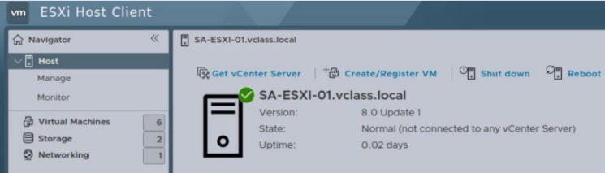

2. Explore the user interface by clicking objects in the Navigator pane and viewing information about them in the right pane. 

   - Q1. How many CPUs and how much memory does this ESXi host have? 

   - Q2. Is the NTP service running on this ESXi host? 

   - Q3. How many virtual machines are on this host? 

   - Q4. What are the guest operating system types for the virtual machines on this host? 

2 

3. Log out of VMware Host Client. 

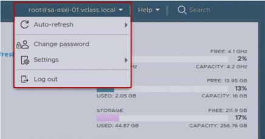

The logout function is in the **root@sa-esxi-01.vclass.local** drop-down menu, in the top-right corner of the window. 

3 

## **Task 3: Log In to vCenter with the vSphere Client** 

You log in to the sa-vcsa-01.vclass.local vCenter system and view information to familiarize yourself with the UI layout using the vSphere Client. 

1. From your student desktop, log in to sa-vcsa-01.vclass.local as administrator@vsphere.local using the vSphere Client. 

   - a. From the bookmarks toolbar, select **vSphere Site-A** > **vSphere Client (SA-VCSA-01)** . 

   - b. Log in by entering **`administrator@vsphere.local`** as the user name and **`VMware1!`** as the password. 

The vSphere Client opens and the home page appears. 

2. From the main menu, select **Inventory** . 

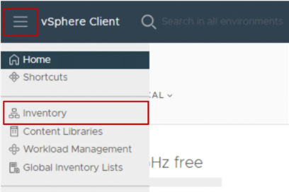

The Hosts and Clusters inventory appears in the left pane, also called the navigation pane. The navigation pane lists the vCenter inventory for sa-vcsa-01.vclass.local. 

3. In the navigation pane, expand **sa-vcsa-01.vclass.local** . 

Q1. Do you see the host (sa-esxi-01.vclass.local) that you logged in the previous task? 

4 

4. From the main menu, select **Home** . 

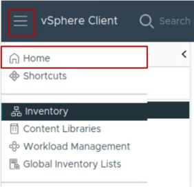

The Home page appears. 

5. On the Home page, verify that **SA-VCSA-01.VCLASS.LOCAL** is selected from the dropdown menu at the top. 

The page provides information about the objects managed by the vCenter instance, such as the total CPU, memory, and storage used on all the managed hosts. 

The vCenter instance has no activity yet because the inventory is empty. There are no objects in the inventory for vCenter to manage. 

6. Log out of the vSphere Client. 

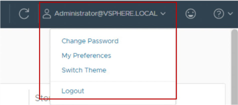

The logout function is in the **Administrator@VSPHERE.LOCAL** drop-down menu, in the topright corner of the window. 

5 

## **Lab 2 Configuring an ESXi Host** 

## **Objective and Tasks** 

Use VMware Host Client to configure an ESXi host: 

1. Add an ESXi Host to an LDAP Server 

2. Log In to the ESXi Host as an LDAP User 

3. Activate the SSH and vSphere ESXi Shell Services 

4. Configure the ESXi Host as an NTP Client 

6 

## **Task 1: Add an ESXi Host to an LDAP Server** 

Using VMware Host Client, you configure the sa-esxi-01.vclass.local ESXi host to use a directory service (Samba LDAP server) for managing users. 

1. From your student desktop, log in to sa-esxi-01 as root using VMware Host Client. 

   - a. Click the **Firefox** icon on the taskbar of your student desktop. 

   - b. From the bookmarks toolbar, select **vSphere Site-A** > **Host Client (SA-ESXi-01)** . 

   - c. Log in by entering **`root`** for the user name and **`VMware1!`** for the password. 

      - VMware Host Client opens with **Host** selected in the Navigator pane. 

2. In the Navigator pane, select **Manage** . 

3. In the right pane, click **Security & users** . 

4. Click **Authentication** and click **Join domain** . 

The Join domain window opens. 

5. In the **Domain name** text box, enter **`vclass.local`** . 

6. Leave the **Use authentication proxy** check box unselected. 

7. In the **User name** text box, enter **`administrator`** . 

8. In the **Password** text box, enter ~~**`VMware1!`**~~ 

9. Click **JOIN DOMAIN** . 

   - Use the same RDP Password. If you need, ask your instructor for help. 

10. Monitor the Recent tasks pane and wait for the task to complete. 

11. Verify that the domain membership status is OK and that the sa-esxi-01 host has joined the vclass.local domain. 

7 

## **Task 2: Log In to the ESXi Host as an LDAP User** 

You verify that you can log in to sa-esxi-01.vclass.local as the LDAP user esxadmin@vclass.local. 

esxadmin@vclass.local is a preconfigured user account that is a member of the ESX Admins domain group. 

1. Log out of VMware Host Client. 

2. To log back in, enter **`esxadmin@vclass.local`** for the user name and **`VMware1!`** for the password. 

3. Verify that you successfully logged in as this user. 

By default, any user that is a member of the ESX Admins domain group has full administrative access to ESXi hosts that join the domain. 

8 

## **Task 3: Activate the SSH and vSphere ESXi Shell Services** 

You start the SSH and vSphere ESXi Shell services on sa-esxi-01.vclass.local so that you can access the ESXi host command line, both locally and remotely. 

## IMPORTANT 

In a production environment, keep the SSH and vSphere ESXi Shell services deactivated. Activate these services only if you must access the command line to troubleshoot problems. When you finish troubleshooting, deactivate these services. 

1. In the Navigator pane, select **Manage** . 

2. In the right pane, click the **Services** tab. 

3. Scroll down the list of services to find the TSM and TSM-SSH services. 

TSM (Tech Support Mode) refers to the local vSphere ESXi Shell service and TSM-SSH refers to the SSH service. Both services are stopped by default. 

4. Select **TSM** and click **Start** . 

5. Select **TSM-SSH** and click **Start** . 

6. Verify that the TSM and TSM-SSH services appear with the Running status. 

9 

## **Task 4: Configure the ESXi Host as an NTP Client** 

You configure the sa-esxi-01.vclass.local host to use Network Time Protocol (NTP) so it can maintain the accurate time and date. 

1. In the right pane, click **System** and select **Time & date** . 

2. Click **Edit NTP Settings** . 

The Edit NTP Settings dialog box appears. 

3. Click **Use Network Time Protocol (enable NTP client)** . 

4. From the **NTP service startup policy** drop-down menu, select **Start and stop with host** . 

5. In the **NTP servers** text box, enter **`172.20.10.2`** . 

6. Click **SAVE** . 

7. Verify that the NTP server address appears in the right pane. 

The NTP service status is Stopped. 

8. Start the NTP service: 

   - a. In the right pane, select **Services** . 

   - b. Scroll through the services list and select **ntpd** . 

   - c. Click **Start** . 

   - d. Verify that the ntpd service has a status of Running. 

9. Click **System** in the right pane. 

10. Verify that the NTP service status is Running. 

You might need to click **Refresh** to update the pane. 

11. Log out of VMware Host Client. 

10 

## **Lab 3 Adding vSphere Licenses** 

## **Objective and Tasks** 

Use the vSphere Client to add vSphere licenses to vCenter and assign a license to vCenter: 

1. Add vSphere Licenses to vCenter 

2. Assign a License to the vCenter Instance 

11 

## **Task 1: Add vSphere Licenses to vCenter** 

You add vSphere licenses to vCenter. 

1. Use the vSphere Client to log in to the SA-VCSA-01 vCenter system as the administrator. 

   - a. In the bookmarks toolbar in Firefox, select **vSphere Site-A > vSphere Client (SA-VCSA01)** . 

   - b. At the login prompt, enter **`administrator@vsphere.local`** for the user name and **`VMware1!`** for the password. 

2. Navigate to the License pane. 

   - a. From the main menu, select **Administration** . 

   - b. In the navigation pane, select **Licenses** . 

The Licenses pane opens to the right. 

3. Add the vCenter and vSphere Enterprise Plus license keys. 

   - a. In the right pane, click **ADD** . 

The New Licenses wizard appears. 

- b. On the Enter license keys page, enter the vCenter and vSphere Enterprise Plus license keys from this link in the **License keys** text box. 

You must enter the license keys on separate lines. 

- c. Verify that both licenses are listed correctly in the text box and click **NEXT** . 

- d. On the Edit license names page, enter **`vCenter Training`** and **`ESXi Training`** in the appropriate **License name** text boxes. 

- e. Click **NEXT** . 

- f. On the Ready to complete page, click **FINISH** . 

If you have problems with the link, on the desktop there is a shortcut to a text file with licenses 

4. Verify that the licenses that you added appear in the list. 

12 

## **Task 2: Assign a License to the vCenter Instance** 

You assign a standard license to the sa-vcsa-01.vclass.local vCenter instance. 

1. In the Licenses pane, select the **Assets** tab. 

The vCenter instance is listed. 

2. Select the **sa-vcsa-01.vclass.local** check box and click **ASSIGN LICENSE** . 

3. In the Assign License dialog box, select the **vCenter Training** license and click **OK** . 

4. Verify that sa-vcsa-01.vclass.local has a valid license. 

## NOTE 

You assign licenses to your ESXi hosts when you add them to the vCenter inventory. 

13 

## **Lab 4 Creating and Managing the vCenter Inventory** 

## **Objective and Tasks** 

Use the vSphere Client to create and configure objects in the vCenter inventory: 

1. Create a Data Center Object 

2. Add Two ESXi Hosts to the Inventory 

3. View Information About the ESXi Hosts 

4. Configure an ESXi Host as an NTP Client 

5. Create a Folder for the ESXi Hosts 

6. Create Folders for VMs and VM Templates 

15 

## **Task 1: Create a Data Center Object** 

You create a data center object named ICM-Datacenter to organize the hosts and VMs in the environment. 

1. Use the vSphere Client to log in to the SA-VCSA-01 vCenter system as the administrator. 

   - a. In the bookmarks toolbar in Firefox, select **vSphere Site-A > vSphere Client (SA-VCSA01)** . 

   - b. At the login prompt, enter **`administrator@vsphere.local`** for the user name and **`VMware1!`** for the password. 

2. From the main menu, select **Inventory** . 

The Hosts and Clusters view appears in the navigation pane. 

3. In the navigation pane, right-click **sa-vcsa-01.vclass.local** and select **New Datacenter** . The New Datacenter dialog box opens. 

4. In the **Name** text box, enter **`ICM-Datacenter`** and click **OK** . 

5. Expand **sa-vcsa-01.vclass.local** and verify that ICM-Datacenter appears in the navigation pane. 

16 

## **Task 2: Add Two ESXi Hosts to the Inventory** 

You add the sa-esxi-01.vclass.local and sa-esxi-02.vclass.local ESXi hosts to ICM-Datacenter. 

1. In the navigation pane, right-click **ICM-Datacenter** and select **Add Host** . The Add Host wizard opens. 

2. On the Name and location page, enter **`sa-esxi-01.vclass.local`** and click **NEXT** . 

3. On the Connection settings page, enter **`root`** as the user name and **`VMware1!`** as the password and click **NEXT** . 

4. On the Host summary page, review the information and click **NEXT** . 

## Extra step: 

5. On the Assign license page, click the **ESXi Training** license key and click **NEXT** . 

6. On the Lockdown mode page, leave the default as **Disabled** and click **NEXT** . 

7. On the VM location page, click **NEXT** . 

8. On the Ready to complete page, review the information and click **FINISH** . 

9. Monitor the progress of the task in the Recent Tasks pane at the bottom of the window. 

   - If the Recent Tasks pane is closed, you can expand the pane by clicking the arrow in the bottom-left corner of the window. 

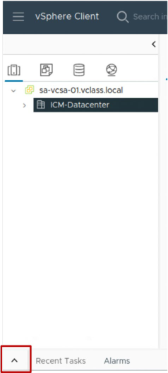

On the Host lifecycle page, Deselect the Manage host with an image check box and click NEXT 

17 

10. Repeat steps 1 through 9 to add sa-esxi-02.vclass.local to ICM-Datacenter. 

For step 2, you enter **`sa-esxi-02.vclass.local`** on the Name and location page. 

11. Expand **ICM-Datacenter** and verify that sa-esxi-01.vclass.local and sa-esxi-02.vclass.local appear in the navigation pane. 

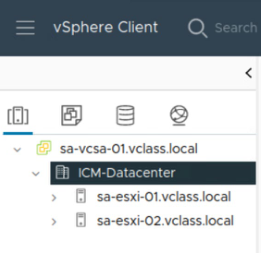

18 

## **Task 3: View Information About the ESXi Hosts** 

You view information about the ESXi host, including information about the CPU, memory, storage, NICs, and virtual machines. Knowing where to look in the UI for this information can help you diagnose and troubleshoot ESXi host issues. 

1. In the navigation pane, select **sa-esxi-01.vclass.local** . 

2. In the right pane, click the **Summary** tab. 

3. View the Issues and Alarms pane. 

Two messages appear informing you that ESXi Shell and SSH are activated for this host. 

## IMPORTANT 

In a production environment, keep the vSphere ESXi Shell and SSH services deactivated. Activate these services only if you must access the command line to troubleshoot problems. When you finish troubleshooting, deactivate these services. 

4. Suppress the informational messages in the Issues and Alarms pane. 

   - a. Select the first message, click **Actions** , and select **Suppress Warning** . 

   - b. Click **YES** to continue with suppressing the warnings. 

   - c. Verify that the messages do not appear in the **Summary** tab. 

5. View the Host Details pane of the ESXi host. 

      - Q1. How many logical processors (CPUs) does the ESXi host have? 

6. View the Capacity and Usage pane of the ESXi host. 

Q2. How much memory is installed on the ESXi host? 

7. View the Hardware pane of the ESXi host. 

Q3. How many networks is this ESXi host connected to? 

19 

## **Task 4: Configure an ESXi Host as an NTP Client** 

You use the vSphere Client to configure the sa-esxi-02.vclass.local ESXi host to use Network Time Protocol (NTP) so it can maintain the accurate time and date. 

1. In the navigation pane, select **sa-esxi-02.vclass.local** and click the **Configure** tab in the right pane. 

2. In the right pane under **System** , select **Time Configuration** . 

3. Click **ADD SERVICE** > **Network Time Protocol** . 

The Network Time Protocol dialog box opens. 

4. Deselect the **Enable monitoring events** check box. 

5. In the **NTP Servers** text box, enter **`172.20.10.2`** . 

6. Click **OK** . 

7. Verify that the Network Time Protocol service appears in the list and its status is Running. 

8. Change the startup policy so that the NTP service starts and stops with the host. 

   - a. In the right pane under **System** , select **Services** . 

   - b. Locate NTP Daemon in the list and verify that its status is Running. 

   - c. Click **NTP Daemon** . 

   - d. Click **EDIT STARTUP POLICY** . 

   - e. Click **Start and stop with host** and click **OK** . 

   - f. Verify that the startup policy for NTP Daemon is to start and stop with host. 

20 

## **Task 5: Create a Folder for the ESXi Hosts** 

You create a folder named Lab Servers to help organize your ESXi hosts. 

1. In the navigation pane, select **ICM-Datacenter** . 

2. Right-click **ICM-Datacenter** and select **New Folder** > **New Host and Cluster Folder** . 

3. Enter **`Lab Servers`** for the folder name and click **OK** . 

4. Verify that the Lab Servers folder appears in the navigation pane. 

5. Drag **sa-esxi-01.vclass.local** and **sa-esxi-02.vclass.local** into the Lab Servers folder. 

6. Verify that both hosts appear under the `Lab Servers` folder. 

7. Expand sa-esxi-01.vclass.local and verify that six VMs are located on this host. 

8. Expand sa-esxi-02.vclass.local and verify that no VMs are located on this host. 

21 

## **Task 6: Create Folders for VMs and VM Templates** 

You create a folder named Lab VMs and you create a folder named Lab Templates. 

1. In the navigation pane, click the **VMs and Templates** icon. 

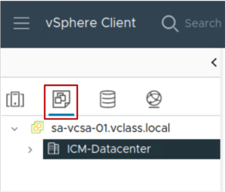

2. Create a folder for the VMs and move VMs into the folder. 

   - a. Expand **sa-vcsa-01.vclass.local** and select **ICM-Datacenter** . 

   - b. Right-click **ICM-Datacenter** and select **New Folder** > **New VM and Template Folder** . 

   - c. Enter **`Lab VMs`** for the folder name and click **OK** . 

   - d. In the navigation pane, expand **ICM-Datacenter** . 

   - e. Drag the **Linux-02** , **Linux-04** , and **Linux-06** virtual machines to the **Lab VMs** folder. 

   - f. Verify that all three virtual machines appear under the Lab VMs folder. 

3. Create a folder for VM templates. 

   - a. Right-click **ICM-Datacenter** and select **New Folder** > **New VM and Template Folder.** 

   - b. Enter **`Lab Templates`** for the folder name and click **OK** . 

   - c. Verify that the Lab Templates folder appears in the navigation pane. 

In a later lab, you will place templates that you create in this folder. 

22 

## **Lab 5 Adding an Identity Source** 

## **Objective and Tasks** 

Add vclass.local as an ~~LDAP~~ identity source: Active Directory 

1. Add vclass.local as an ~~LDAP~~ Identity Source 

## **Task 1: Add vclass.local as an** ~~**LDAP**~~ **Identity Source** 

You add the vclass.local domain as an ~~LDAP~~ identity source. You use this identity source to enable users to log in with their domain credentials. 

1. Using the vSphere Client, log in to sa-vcsa-01.vclass.local by entering 

   - **`administrator@vsphere.local`** for the user name and **`VMware1!`** for the password. 

In this lab we use the Active Directory with IWA (Integrated Windows Authentication) version and different steps are performed. Consult the instructor if you have questions. 

2. From the main menu, select **Administration** . 

3. In the navigation pane under **Single Sign On** , select **Configuration** . 

4. In the right pane, verify that **Identity Sources** is selected. ~~The vsphere.local and LocalOS domains appear as identity sources.~~ 

~~5. Click~~ ~~**ADD** .~~ 

~~The Add Identity Source dialog box opens.~~ 

~~6. From the~~ ~~**Identity Source Type** drop-down menu, select~~ ~~**Active Directory over LDAP** .~~ 

~~7. In the~~ ~~**Identity source name** text box, enter~~ ~~**`LDAPS-vclass`** .~~ 

~~8. In the~~ ~~**Base distinguished name for users** text box, enter~~ ~~**`dc=vclass,dc=local`** .~~ 

~~9. In the~~ ~~**Base distinguished name for groups** text box, enter~~ ~~**`dc=vclass,dc=local`** .~~ 

~~10. In the~~ ~~**Domain name** text box, enter~~ ~~**`vclass.local`** .~~ 

~~11. Leave the~~ ~~**Domain alias** text box blank.~~ 

~~12. In the~~ ~~**Username** text box, enter~~ ~~**`administrator@vclass.local`** .~~ 

~~13. In the~~ ~~**Password** text box, enter~~ ~~**`VMware1!`**~~ 

~~23~~ 

~~14. In the~~ ~~**Primary server URL** text box, enter~~ ~~**`ldaps://dc.vclass.local:636`** .~~ 

~~15. Next to~~ ~~**Certificates (for LDAPS)** , click~~ ~~**BROWSE** .~~ 

~~16. On the student01 Desktop, select~~ ~~**cert.pem** and click~~ ~~**Open** .~~ 

~~17. Click~~ ~~**ADD** .~~ 

~~18. Verify that vclass.local is added as an identity source.~~ 

- 5- Go to Active Directory Domain click on **JOIN AD** 

- 6- In Domain text box enter **VCLASS.LOCAL** 

- 7- Leave the Organizational Unit text box blank 

- 8- In Username **administrator** 

- 9- Password: The same for **RDP** use. Ask your Instructor if have doubts 10- Click JOIN 

11- Verify that sa-vcsa-01.vclass.local successfully joined Active Directory. Note: You see the mesage: **Node sa-vcsa-01.vclass.local has joined the active directory successfully. Reboot the node to apply changes.** 

12. Restart vCenter Server Appliance using the vCenter Server Appliance Management Interface. vCenter Server Appliance must be restarted for these changes to take effect. 

- a. Open a new tab in the browser. 

- b. From the bookmarks toolbar, select vSphere Site-A > vCenter Appliance 

- Management (SA-VCSA-01). 

c.If a security warning appears, click Advanced and click Accept the Risk and Continue. 

d. At the login screen, log in by entering **root** for the user name and **VMware1!** for the password. 

The vCenter Server Management window opens. 

e. From the **Actions** drop-down menu in the top-right corner, select **Reboot** . f. Click YES to proceed. The reboot takes **10–15 minutes** . During this time, the vSphere Client is unavailable. 

13. Close the VMware Appliance Management browser tab. 

14. In the vSphere Client tab, refresh the screen periodically until the vSphere Client login page appears. 

24 

## **Adition part:** 

**Configuring Active Directory** : Adding an Identity Source 

Objective and Tasks Add vclass.local as an identity source: 

1. Add vclass.local as an Identity Source 

Task 1: Add **vclass.local** as an Identity Source You add an identity source to enable the single sign-on configuration. 

1. Using the vSphere Client, log in to sa-vcsa-01.vclass.local by entering **administrator@vsphere.local** for the user name and **VMware1!** for the password. 

2. From the Menu drop-down menu, select **Administration** . 

3. In the navigation pane under **Single Sign On** , select **Configuration** . 

4. In the right pane, click **Identity Sources** . The vsphere.local and LocalOS domains appear as identity sources. 

5. Click **ADD** . The Add Identity Source dialog box opens. 

6. For the Identity Source Type, verify that **Active Directory (Integrated Windows Authentication)** is selected. 

7. Verify that the domain name is **vclass.local** . 

## 8. Click **ADD** . 

9. Verify that **vclass.local** is added as an identity source. 

## **Lab 6 Users Groups and Permissions** 

## **Objective and Tasks** Active Directory 

Assign roles and permissions so that an ~~LDAP~~ user can perform functions in vCenter: 

1. View ~~LDAP~~ Users 

2. Assign Root-Level Global Permission to an ~~LDAP~~ User 

3. Assign Object Permission to an ~~LDAP~~ User 

4. Verify that the cladmin User Can Access Content Library 

5. Verify that the studentadmin User Can Create a Virtual Machine 

25 

## **Task 1: View LDAP Users** 

You view the list of LDAP users to verify that the Administrator single sign-on account exists. 

1. Using the vSphere Client, log in to sa-vcsa-01.vclass.local by entering **`administrator@vsphere.local`** for the user name and **`VMware1!`** for the password. 

2. From the main menu, select **Administration** . 

3. Under **Single Sign On** in the navigation pane, select **Users and Groups** . 

By default, the list of users for the LocalOS domain appears in the right pane. 

4. In the Users pane, select **vclass.local** from the **Domain** drop-down menu. 

The list of users in the vclass.local domain appears. You should see the following users: studentadmin and cladmin. 

26 

## **Task 2: Assign Root-Level Global Permission to an LDAP User** 

You grant global permission to cladmin@vclass.local to administer content libraries. 

Content libraries are located directly under the global root object. You assign the Content Library Administrator role to cladmin@vclass.local at the global root object. This role gives the cladmin user administrator rights for all content libraries only. 

1. In the navigation pane under **Access Control** , select **Global Permissions** . 

2. In the Global Permissions pane, click **ADD** . 

The Add Permission window appears. 

3. Configure the permission settings. 

   - a. From the **Domain** drop-down menu, select **vclass.local** . 

   - b. In the **User/Group** search box, enter **`cl`** and select **cladmin** from the list. 

   - c. From the **Role** drop-down menu, select **Content library administrator (sample)** . 

   - d. Select the **Propagate to children** check box. 

   - e. Click **OK** . 

4. Verify that vclass.local\cladmin appears in the list, is assigned the Content Library Administrator (sample) role and is assigned global permission at the global root object. 

27 

## **Task 3: Assign Object Permission to an LDAP User** 

You assign permission at the vCenter level to the studentadmin@vclass.local user. 

This permission propagates to the child objects of vCenter. 

1. From the main menu, select **Inventory** and click the **Hosts and Clusters** icon. 

2. In the navigation pane, select the vCenter instance, **sa-vcsa-01.vclass.local** . 

3. In the right pane, click **Permissions** . 

4. Click **ADD** . 

The Add Permission window opens. 

5. Configure the permission settings. 

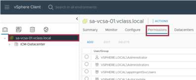

- a. From the **Domain** drop-down menu, select **vclass.local** . 

NOTE 

Ensure that you select vclass.local, not vsphere.local. 

   - b. In the **User/Group** search box, enter **`student`** and select **studentadmin** from the list. 

   - c. Leave the role as Administrator. 

   - d. Select the **Propagate to children** check box. 

   - e. Click **OK** . 

6. Verify that vclass.local\studentadmin appears in the list, is assigned the Administrator role, and is defined in the vCenter object and its children. 

7. Log out of the vSphere Client. 

28 

## **Task 4: Verify that the cladmin User Can Access Content Library** 

You verify that cladmin@vclass.local can access only the Content Library pane. This user does not have access to administrative tasks such as creating VMs. 

1. Log in to the vSphere Client as cladmin@vclass.local. 

   - a. On the vSphere Client login screen, enter **`cladmin@vclass.local`** as the user name and **`VMware1!`** as the password. 

   - b. Verify that you are logged in to the vSphere Client as cladmin@vclass.local. 

2. From the main menu, select **Content Libraries** . 

3. Verify that the **CREATE** button appears in the right pane. 

   - You have the correct privileges to create a content library. Do not create a content library at this time. 

4. From the main menu, select **Inventory** and click the **Hosts and Clusters** icon. 

5. Expand **sa-vcsa-01.vclass.local** and right-click **ICM-Datacenter** . 

Several actions are grayed out in the drop-down menu. As cladmin, you cannot perform administrative tasks, such as adding hosts, creating clusters, or creating virtual machines. 

6. Log out of the vSphere Client. 

29 

## **Task 5: Verify that the studentadmin User Can Perform Administrator Tasks** 

You verify that studentadmin@vclass.local can perform administrator tasks. You do this by accessing the menus that allow you to perform administrative functions, such as creating virtual machines, adding hosts, and creating clusters. 

1. Log in to the vSphere Client as studentadmin@vclass.local. 

   - a. On the vSphere Client login screen, enter **`studentadmin@vclass.local`** as the user name and **`VMware1!`** as the password. 

   - b. Verify that you are logged in to the vSphere Client as studentadmin@vclass.local. 

2. In the navigation pane, select the **VMs and Templates** icon. 

3. In the navigation pane, expand **sa-vcsa-01.vclass.local** > **ICM-Datacenter** . 

4. Right-click **Lab VMs** and select **New Virtual Machine** . 

The New Virtual Machine wizard opens. 

## NOTE 

Being able to access the New Virtual Machine wizard is sufficient verification that you can create a virtual machine. You do not need to create the virtual machine. 

5. Click **CANCEL** to exit the wizard. 

6. In the navigation pane, select the **Hosts and Clusters** icon. 

7. Expand **sa-vcsa-01.vclass.local** and right-click **ICM-Datacenter** 

As studentadmin, you can perform administrative tasks, such as adding hosts, creating clusters, or creating virtual machines. 

8. Log out of the vSphere Client. 

30 

## **Lab 7 Creating Standard Switches** 

## **Objective and Tasks** 

Create a standard switch and a port group for virtual machines: 

1. View the Standard Switch Configuration 

2. Create a Standard Switch with a Virtual Machine Port Group 

3. Attach Virtual Machines to the Virtual Machine Port Group 

31 

## **Task 1: View the Standard Switch Configuration** 

You view the vSphere standard switch settings on sa-esxi-01.vclass.local to confirm the proper configuration of the default switch. 

1. Using the vSphere Client, log in to sa-vcsa-01.vclass.local by entering **`administrator@vsphere.local`** for the user name and **`VMware1!`** for the password. 

2. From the main menu, select **Inventory** , and click the **Hosts and Clusters** icon. 

3. Expand **ICM-Datacenter > Lab Servers** and select **sa-esxi-01.vclass.local** in the navigation pane. 

4. Click the **Configure** tab in the right pane. 

5. Under **Networking** , select **Virtual switches** . 

6. Review the information about the vSwitch0 standard switch that is provided in the Virtual switches pane. 

   - Q1. Which physical adapters are connected to vSwitch0? 

   - Q2. Which port groups are connected to vSwitch0? 

   - Q3. Which virtual machines and templates are connected to the VM Network port group? 

32 

## **Task 2: Create a Standard Switch with a Virtual Machine Port Group** 

You create a standard switch and a virtual machine port group on sa-esxi-01.vclass.local and saesxi-02.vclass.local to handle the virtual machine network traffic. 

1. Add a virtual machine port group named Production to sa-esxi-01.vclass.local. 

   - a. Select **sa-esxi-01.vclass.local** in the navigation pane and click **ADD NETWORKING** in the right pane. 

The Add Networking wizard appears. 

- b. On the Select connection type page, click **Virtual Machine Port Group for a Standard Switch** and click **NEXT** . 

- c. On the Select target device page, click **New standard switch** and click **NEXT** . 

- d. On the Create a Standard Switch page, select **vmnic2** and click **MOVE DOWN** until vmnic2 appears under Active adapters. 

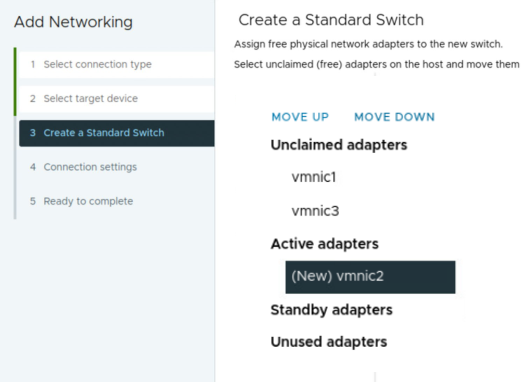

   - e. Click **NEXT** . 

   - f. On the Connection settings page, enter **`Production`** in the **Network label** text box and click **NEXT** . 

   - g. On the Ready to complete page, review the information and click **FINISH** . 

2. In the Virtual switches pane, collapse **vSwitch0** and expand **vSwitch1** . 

33 

3. Verify that the Production port group is on vSwitch1 and that vmnic2 is the physical adapter. 

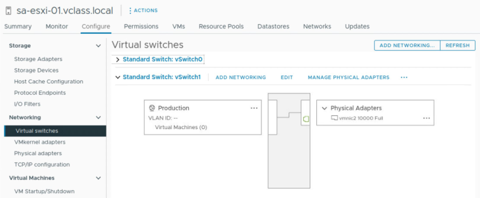

4. Add a virtual machine port group named Production to sa-esxi-02.vclass.local. 

   - a. Select **sa-esxi-02.vclass.local** in the navigation pane and click **ADD NETWORKING** in the right pane. 

The Add Networking wizard appears. 

- b. On the Select connection type page, click **Virtual Machine Port Group for a Standard Switch** and click **NEXT** . 

- c. On the Select target device page, click **New standard switch** and click **NEXT** . 

- d. On the Create a Standard Switch page, select **vmnic2** and click **MOVE DOWN** until vmnic2 appears under Active adapters. 

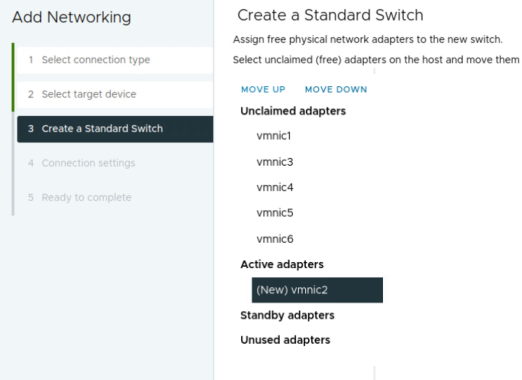

- e. Click **NEXT** . 

34 

   - f. On the Connection settings page, enter **`Production`** in the **Network label** text box and click **NEXT** . 

   - g. On the Ready to complete page, review the information and click **FINISH** . 

5. In the Virtual switches pane, collapse **vSwitch0** and expand **vSwitch1** . 

6. Verify that the Production port group is on vSwitch1 and that vmnic2 is the physical adapter. 

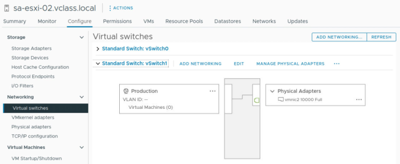

35 

## **Task 3: Attach Virtual Machines to the Virtual Machine Port Group** 

You attach virtual machines to the Production virtual machine port group so that the VMs can communicate with other networked devices through vSwitch1 and vmnic2. 

1. In the navigation pane, select the **VMs and Templates** icon and expand **Lab VMs** . 

2. Connect the Linux-02 VM to the Production port group. 

   - a. In the navigation pane, select the **Linux-02** virtual machine. 

   - b. Right-click **Linux-02** and select **Edit Settings** . 

   - c. In the Edit Settings window, find **Network adapter 1** . 

   - d. Click the downward arrow next to VM Network and click **Browse** . 

   - e. In the Select Network window, select **Production** and click **OK** . 

   - f. Expand **Network adapter 1** and verify that the **Connect At Power On** check box is selected. 

   - g. Click **OK** to save your changes. 

3. In the right pane, click the **Summary** tab. 

4. View the VM Hardware pane and verify that the Production port group is listed. The Production port group has a status of disconnected because the VM is powered off. 

5. Power on the Linux-02 VM. 

   - a. In the navigation pane, select **Linux-02** . 

   - b. Right-click **Linux-02** and select **Power** > **Power On** . 

6. In Linux-02's **Summary** tab, click **LAUNCH WEB CONSOLE** . Or Remote Console 

7. Wait for the boot process to complete. 

The Linux-02 VM is configured to automatically log you in as localadmin. 

36 

8. View the virtual machine’s IP address. 

   - a. Click the **Terminal** icon, located on the left side, to open the Linux terminal window. 

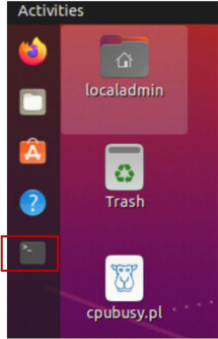

- b. At the command prompt, enter **`ip a`** and view the IP address for the ens192 interface. 

The IP address should start with 172.20.11. 

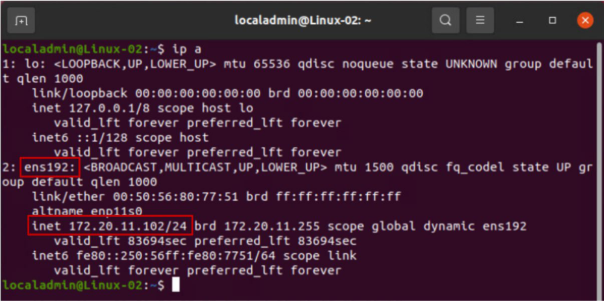

9. At the command prompt, enter **`ping 172.20.11.2`** (the default gateway) to verify that the virtual machine is connected to the Production network. 

This command pings the Production network's default gateway. Your ping should be successful. 

10. Close the Linux terminal window. 

11. Close the Linux-02 VM's console tab. 

12. Repeat steps 2 through 11 on the Linux-04 VM to connect it to the Production port group. 

37 

13. Shut down Linux-02 and Linux-04. 

   - a. In the navigation pane, right-click **Linux-02** and select **Power** > **Shut Down Guest OS** . 

   - b. Click **YES** to confirm the shutdown. 

   - c. Repeat steps a and b on Linux-04. 

38 

## **Lab 8 Configuring vSphere Distributed Switches** 

## **Objective and Tasks** 

Create and configure a distributed switch: 

1. Create a Distributed Switch 

2. Add ESXi Hosts to the Distributed Switch 

3. Verify Your Distributed Switch Configuration 

39 

## **Task 1: Create a Distributed Switch** 

You create a distributed switch that functions as a single virtual switch across all associated hosts in your vSphere environment. 

1. Using the vSphere Client, log in to sa-vcsa-01.vclass.local by entering **`administrator@vsphere.local`** for the user name and **`VMware1!`** for the password. 

2. In the navigation pane, click the **Networking** icon. 

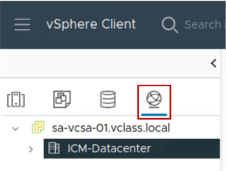

3. Expand **sa-vcsa-01.vclass.local** and right-click **ICM-Datacenter** . 

4. Select **Distributed Switch** > **New Distributed Switch** . 

The New Distributed Switch wizard appears. 

5. Create a distributed switch. 

   - a. On the Name and location page, enter **`dvs-Lab`** in the **Name** text box and click **NEXT** . 

   - b. On the Select version page, leave **8.0.0 - ESXi 8.0 and later** selected and click **NEXT** . 

   - c. On the Configure settings page, enter **`pg-SA-Production`** in the **Port group name** text box, keep all other default values, and click **NEXT** . 

   - d. On the Ready to complete page, review the configuration settings and click **FINISH** . 

6. In the navigation pane, expand **ICM-Datacenter** and verify that the dvs-Lab distributed switch appears. 

7. Configure the pg-SA-Production port group to use only Uplink 3. 

   - a. In the navigation pane, expand **dvs-Lab** . 

   - b. Right-click **pg-SA-Production** and select **Edit Settings** . 

   - c. In the Edit Settings window, select **Teaming and failover** . 

40 

- d. Under the Failover Order section, move **Uplink 1** , **Uplink 2** and **Uplink 4** down until they appear under the Unused uplinks section. 

You must click the Uplink to select it and click the Uplink again to deselect it. 

Uplink 3 should be the only active uplink. 

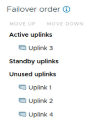

- e. Click **OK** . 

41 

## **Task 2: Add ESXi Hosts to the Distributed Switch** 

You add ESXi hosts and physical adapters to the new distributed switch. 

1. In the navigation pane, right-click **dvs-Lab** and select **Add and Manage Hosts** . 

The Add and Manage Hosts wizard appears. 

2. On the Select task page, leave **Add hosts** selected and click **NEXT** . 

3. On the Select hosts page, select the **sa-esxi-01.vclass.local** and **sa-esxi-02.vclass.local** check boxes, and click **NEXT** . 

4. On the Manage physical adapters page, assign vmnic3 on sa-esxi-01.vclass.local and sa-esxi02.vclass.local to Uplink 3. 

   - a. Click the double arrow next to vmnic3 and verify that sa-esxi-01.vclass.local and sa-esxi02.vclass.local appear in the host list. 

   - b. Click **X** to close the Related hosts pane. 

   - c. In the vmnic3 row, select **Uplink 3** from the **Assign uplink** drop-down menu. 

   - d. Click **NEXT** . 

5. On the Manage VMkernel adapters page, click **NEXT** . 

6. On the Migrate VM networking page, migrate all VMs to the pg-SA-Production port group. 

   - a. Select the **Migrate virtual machine networking** check box. 

In the Configure per network adapter pane, the Used by column shows a number of VMs. Record this value. __________ 

- b. Click **ASSIGN PORT GROUP** . 

The pg-SA-Production network appears. 

   - c. Click **ASSIGN** and click **NEXT** . 

7. On the Ready to complete page, review the information and click **FINISH** . 

8. Monitor the Recent Tasks pane and verify that the tasks are completed successfully. 

42 

## **Task 3: Verify Your Distributed Switch Configuration** 

You verify that the distributed switch was configured properly. You also examine other distributed switch information, such as general settings for dvs-Lab and general properties for pgSA-Production. 

1. In the left pane, select **dvs-Lab** . 

2. In the right pane, click the **Configure** tab and under **Settings** , select **Topology** . 

3. In the distributed switch topology diagram, expand **Uplink 3** . 

4. Verify that vmnic3 appears under Uplink 3 for ESXi hosts sa-esxi-01.vclass.local and sa-esxi02.vclass.local. 

5. In the pg-SA-Production box, verify that the number of VMs connected to pg-SAProduction matches what you recorded in task 2, step 6. 

6. In the right pane under Settings, select **Properties** and verify the settings. 

   - Number of uplinks is **4** . 

   - The MTU size is **1500 Bytes** . 

   - The Discover Protocol Type is set to **Cisco Discovery Protocol** and operation is set to **Listen** . 

7. In the left pane, select the **pg-SA-Production** port group. 

8. In the right pane, click the **Configure** tab and select **Properties** . 

9. Verify the distributed port group settings in the main window. 

   - Port binding is set to Static binding. 

   - Port allocation is set to Elastic. 

   - Number of ports is set to 8. 

43 

## **Lab 9 Accessing iSCSI Storage** 

## **Objective and Tasks** 

Configure access to an iSCSI datastore: 

1. View an Existing ESXi Host iSCSI Configuration 

2. Add a VMkernel Port for IP Storage 

3. Add a Second VMkernel Port for IP Storage 

4. Add the iSCSI Software Adapter to an ESXi Host 

5. Discover LUNs on the iSCSI Target Server 

45 

## **Task 1: View an Existing ESXi Host iSCSI Configuration** 

The iSCSI software adapter configuration has been pre-configured on sa-esxi-01.vclass.local. You familiarize yourself with the VMkernel ports and port groups in this configuration. 

1. Using the vSphere Client, log in to sa-vcsa-01.vclass.local by entering **`administrator@vsphere.local`** for the user name and **`VMware1!`** for the password. 

2. From the main menu, select **Inventory** , and click the **Hosts and Clusters** icon. 

3. In the navigation pane, select **sa-esxi-01.vclass.local** and select the **Configure** tab in the right pane. 

4. In the right pane under **Storage** , select **Storage Adapters** . 

5. In the Storage Adapters pane, verify the status of the existing iSCSI software adapter. 

   - a. Select **vmhba65** (the iSCSI software adapter). 

   - b. Verify that Online appears in the Status column. 

6. Review the properties of the iSCSI software adapter. 

   - a. In the Storage Adapters pane, view the **Properties** tab. 

   - b. Review the storage adapter properties. 

      - Adapter status 

      - Adapter name 

      - Adapter iSCSI name 

7. Select the **Devices** tab. 

8. Verify that the following LUNs appear in the list. 

   - LUN 0 (120 GB) 

   - LUN 2 (11 GB) 

   - LUN 5 (130 GB) 

   - LUN 6 (7 GB) 

LUN 2 and LUN 6 have a status of Not Consumed in the Datastore column. These LUNs can be used to create datastores. 

LUN 0 and LUN 5 are already formatted with VMFS datastores: ICM-Datastore and iSCSIDatastore, respectively. 

9. Select the **Dynamic Discovery** tab and record the iSCSI Server IP address. __________ 

46 

10. View and record information about the network port binding configuration. 

   - a. Select the **Network Port Binding** tab. 

      - Q1. How many port groups are listed and what are their names? 

   - b. Under **Networking** , select **Virtual switches** . 

   - c. Collapse **dvs-Lab** and expand **vSwitch0** . 

      - The IP Storage 1 and IP Storage 2 port groups appear in the network topology diagram. 

   - d. Select **vmk1** in the IP Storage 1 box. 

The topology shows that vmk1 is connected to the active uplink vmnic5. 

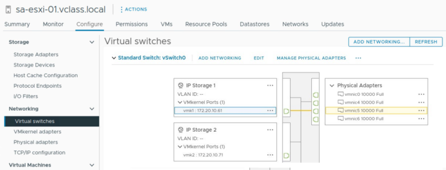

- e. Select **vmk2** in the IP Storage 2 box. 

- f. The topology shows that vmk2 is connect to the active uplink vmnic6. 

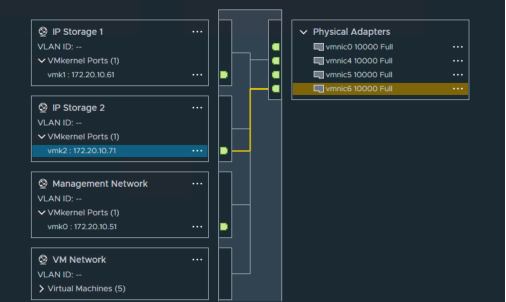

47 

## **Task 2: Add a VMkernel Port for IP Storage** 

You configure a VMkernel port and port group on sa-esxi-02.vclass.local to use for the software iSCSI traffic. 

1. In the navigation pane, select **sa-esxi-02.vclass.local** . 

2. On the **Configure** tab, select **VMkernel adapters** under **Networking** . 

3. Click **ADD NETWORKING** . 

The Add Networking wizard appears. 

4. On the Select connection type page, verify that **VMkernel Network Adapter** is selected and click **NEXT** . 

5. On the Select target device page, click **New standard switch** and click **NEXT** . 

6. On the Create a Standard Switch page, select **vmnic5** and **vmnic6** , and click **MOVE DOWN** until both vmnics appear under Active adapters. 

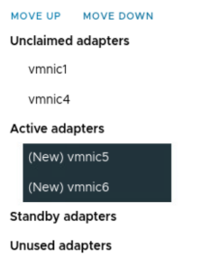

7. Click **NEXT** . 

8. On the Port properties page, enter **`IP Storage 1`** in the **Network label** text box and click **NEXT** . 

9. On the IPv4 settings page, configure the IPv4 settings. 

   - a. Click **Use static IPv4 settings** . 

   - b. Enter **`172.20.10.62`** in the **IPv4 address** text box. 

   - c. Enter **`255.255.255.0`** in the **Subnet mask** text box. 

   - d. Click **NEXT** . 

10. On the Ready to complete page, click **FINISH** . 

11. Verify that vmk1 (IP Storage 1) appears in the VMkernel adapters list. 

48 

12. View the VMkernel adapter in the network topology diagram. 

   - a. In the **Configure** tab, click **Virtual switches** . 

   - b. Collapse **dvs-Lab** and expand **vSwitch2** . 

   - c. Verify that the IP Storage 1 port group appears and that vmk1 is a VMkernel port in this port group. 

   - d. In the IP Storage 1 port group box, select **vmk1** . 

The topology shows that vmk1 is connected to both the vmnic5 and vmnic6 active uplinks. You must connect vmk1 to one of those uplinks. 

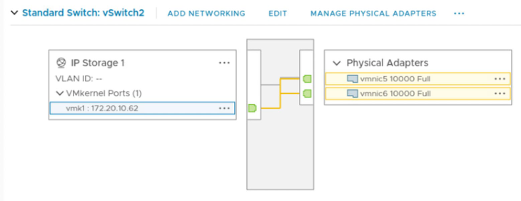

13. Associate vmk1 with the vmnic5 uplink. 

   - a. Click the vertical ellipsis to the right of the IP Storage 1 label and select **Edit Settings** . 

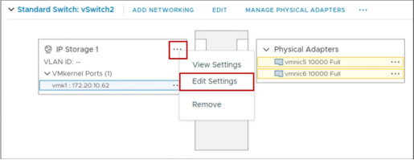

The Edit Settings window appears. 

- b. Click **Teaming and failover** . 

- c. Under **Failover order** , select the **Override** check box. 

49 

- d. Select **vmnic6** and move it down until it appears under Unused adapters. 

You click vmnic to select it and click vmnic again to deselect it. 

vmnic5 must be the only active adapter. 

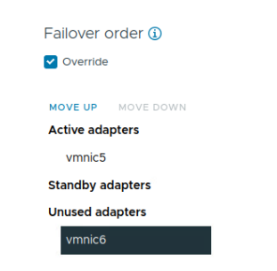

   - e. Click **OK** . 

14. In the topology diagram, select **vmk1** in the IP Storage 1 box and verify that it is connected only to the vmnic5 uplink. 

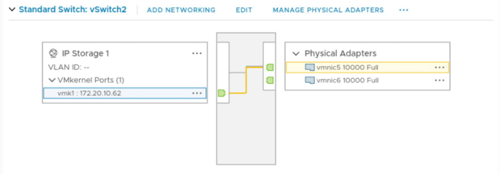

An orange line shows that vmk1 is connected to the vmnic5 active adapter. 

50 

## **Task 3: Add a Second VMkernel Port for IP Storage** 

You configure a second VMkernel port and port group on vSwitch2 on sa-esxi-02.vclass.local to be used for software iSCSI traffic. 

1. In the navigation pane, select **sa-esxi-02.vclass.local** . 

2. On the **Configure** tab, select **VMkernel adapters** under Networking. 

3. Click **ADD NETWORKING** . 

The Add Networking wizard opens. 

4. On the Select connection type page, verify that **VMkernel Network Adapter** is selected and click **NEXT** . 

5. On the Select target device page, click **Select an existing standard switch** . 

6. Click **vSwitch2** and click **NEXT** . 

7. On the Port properties page, enter **`IP Storage 2`** in the **Network label** text box and click **NEXT** . 

8. On the IPv4 settings page, configure the IPv4 settings. 

   - a. Click **Use static IPv4 settings** . 

   - b. In the **IPv4 address** text box, enter **`172.20.10.72`** . 

   - c. In the **Subnet mask** text box, enter **`255.255.255.0`** . 

   - d. Click **NEXT** . 

9. On the Ready to complete page, click **FINISH** . 

10. Verify that vmk2 (IP Storage 2) appears in the VMkernel adapters list. 

11. View the VMkernel adapter in the network topology diagram. 

   - a. In the **Configure** tab, click **Virtual switches** . 

   - b. Verify that a port group named IP Storage 2 appears on vSwitch2 and that vmk2 is a VMkernel port in this port group. 

   - c. In the IP Storage 2 port group box, select **vmk2** . 

The topology shows that vmk2 is connected to all the active uplinks. You must connect vmk2 to just one of those uplinks. 

51 

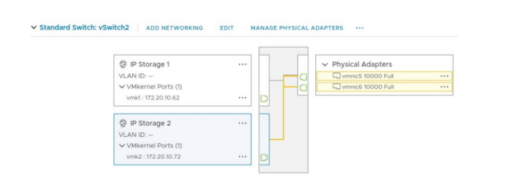

12. Associate vmk2 with the vmnic6 uplink. 

   - a. Click the ellipsis to the right of the IP Storage 2 label and select **Edit Settings** . The Edit Settings window appears. 

   - b. Click **Teaming and failover** . 

   - c. Under **Failover order** , select the **Override** check box. 

   - d. Under the Failover Order section, move **vmnic5** down until it appears under Unused adapters. 

You click the vmnic to select it and click the vmnic again to deselect it. 

vmnic6 should be the only active adapter. 

   - e. Click **OK** . 

13. In the topology diagram, select **vmk2** in the IP Storage 2 box and verify that it is connected only to the uplink vmnic6. 

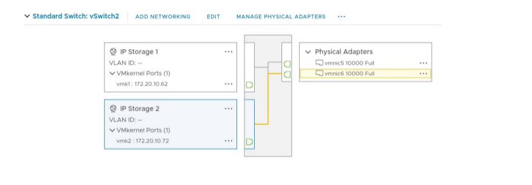

52 

## **Task 4: Add the iSCSI Software Adapter to an ESXi Host** 

You add the iSCSI software adapter to sa-esxi-02.vclass.local so that you can access the iSCSI server. 

1. In the navigation pane, verify that **sa-esxi-02.vclass.local** is selected. 

2. On the **Configure** tab under **Storage** , select **Storage** Adapters . 

3. Click **ADD SOFTWARE ADAPTER > Add iSCSI adapter** . 

4. In the Add Software iSCSI adapter window, click **OK** . 

5. In the Storage Adapters list, select the newly created iSCSI software adapter (vmhba65). 

6. In the **Properties** tab below, verify that the adapter status appears as Enabled. 

7. Verify that the iSCSI name matches iqn.1998-01.com.vmware:sa-esxi02.vclass.local:########. 

The # symbol represents characters that might change. 

53 

## **Task 5: Discover LUNs on the iSCSI Target Server** 

You bind the IP storage port groups to vmhba65, the iSCSI software adapter. Then, you configure the target iSCSI server so that sa-esxi-02.vclass.local can discover LUNs on the iSCSI server. 

1. In the Storage Adapters pane, ensure that **vmhba65** is selected. 

2. Select the **Dynamic Discovery** tab and click **ADD** . 

3. In the Add Send Target Server window, enter **`172.20.10.15`** in the **iSCSI Server** text box and click **OK** . 

A warning appears stating that because of recent configuration changes, a rescan of vmhba65 is recommended. Do not rescan yet. 

4. In the Storage Adapters pane, click the **Network Port Binding** tab. 

5. Click **ADD** . 

6. Select the **IP Storage 1 (vSwitch2)** and **IP Storage 2 (vSwitch2)** check boxes, and click **OK** . 

7. Click **RESCAN ADAPTER** . 

The Rescan Adapter task rescans the iSCSI software adapter to activate the network port bindings and discover newly added storage devices. 

8. Monitor the Recent Tasks pane and wait for the rescan tasks to finish. 

9. In the **Network Port Binding** tab, verify that the paths are Active. 

10. Select the **Devices** tab and verify that the following LUNs appear in the list. 

   - LUN 0 (120 GB) 

   - LUN 2 (11 GB) 

   - LUN 5 (130 GB) 

   - LUN 6 (7 GB) 

LUN 2 and LUN 6 have a status of Not Consumed in the Datastore column. These LUNs can be used to create datastores. 

LUN 0 and LUN 5 are already formatted with VMFS datastores: ICM-Datastore and iSCSIDatastore, respectively. Now that sa-esxi-02.vclass.local can access these LUNs, it can see the file systems and automatically mounts the datastores. Recall that sa-esxi-01.vclass.local also has access to these datastores. 

## 11. Extra step: 

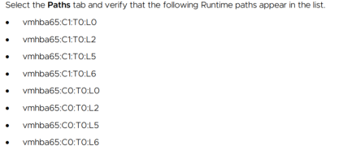

54 

## **Lab 10 Managing VMFS Datastores** 

## **Objective and Tasks** 

Create VMFS datastores, increase the size of these datastores, and share datastores between ESXi hosts: 

1. Create VMFS Datastores for the ESXi Hosts 

2. Expand a VMFS Datastore to Consume Unused Space on a LUN 

3. Remove a VMFS Datastore 

4. Extend a VMFS Datastore by Adding a LUN 

## **Task 1: Create VMFS Datastores for the ESXi Hosts** 

You set up VMFS datastores on iSCSI-based storage devices to be used as repositories by virtual machines. 

1. Using the vSphere Client, log in to sa-vcsa-01.vclass.local by entering **`administrator@vsphere.local`** for the user name and **`VMware1!`** for the password. 

2. From the main menu, select **Inventory** , and click the **Storage** icon. 

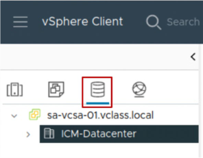

55 

3. Create a VMFS datastore called VMFS-2 on the specified LUN. 

   - a. In the navigation pane, expand **sa-vcsa-01.vclass.local** . 

   - b. Right-click **ICM-Datacenter** and select **Storage > New Datastore** . 

The New Datastore wizard opens. 

- c. On the Type page, verify that **VMFS** is selected and click **NEXT** . 

- d. On the Name and device selection page, enter **`VMFS-2`** in the **Name** text box. 

- e. From the **Select a host** drop-down menu, select **sa-esxi-01.vclass.local** to view the list of available LUNs. 

- f. From the LUN list, select **LUN 2** (11 GB in size). 

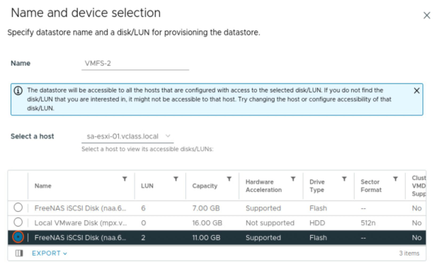

   - g. Click **NEXT** . 

   - h. On the VMFS version page, leave **VMFS 6** selected and click **NEXT** . 

   - i. On the Partition configuration page, move the **Datastore Size** slider to reduce the datastore size to 8 GB and click **NEXT** . 

   - j. On the Ready to complete page, review the information and click **FINISH** . 

4. In the navigation pane, expand **ICM-Datacenter** and verify that the VMFS-2 datastore appears. 

5. In the navigation pane, select **VMFS-2** . 

6. In the right pane, select the **Summary** tab and in the Capacity and Usage pane, record the value for the amount of storage allocated. __________ 

The value is less than 8 GB because some space has been allocated to system overhead. 

56 

7. Create a VMFS datastore called VMFS-3 on the specified LUN. 

   - a. Right-click **ICM-Datacenter** and select **Storage > New Datastore** . 

   - b. On the Type page, verify that **VMFS** is selected and click **NEXT** . 

   - c. On the Name and device selection page, enter **`VMFS-3`** in the **Datastore name** text box. 

   - d. From the **Select a host** drop-down menu, select **sa-esxi-02.vclass.local** . A LUN list appears. 

   - e. In the LUN list, select **LUN 6** (7 GB in size) and click **NEXT** . 

   - f. On the VMFS version page, accept **VMFS 6** and click **NEXT** . 

   - g. On the Partition configuration page, accept the default ( **Use all available partitions** ) and click **NEXT** . 

   - h. On the Ready to complete page, review the information and click **FINISH** . 

8. Verify that the VMFS-3 datastore appears under ICM-Datacenter. 

57 

## **Task 2: Expand a VMFS Datastore to Consume Unused Space on a LUN** 

You dynamically increase the capacity of the VMFS-2 datastore when more space is required by virtual machines. 

1. In the navigation pane, right-click the **VMFS-2** datastore and select **Increase Datastore Capacity** . 

The Increase Datastore Capacity wizard opens. 

2. On the Select Device page, select **LUN 2** (11 GB in size). 

3. Scroll the window to the right and verify that Yes appears in the Expandable column. 

4. Click **NEXT** . 

5. On the Specify Configuration page, accept **Use “Free Space 3 GB” to expand the datastore** from the **Partition Configuration** drop-down menu and click **NEXT** . 

6. On the Ready to Complete page, review the information and click **FINISH** . 

7. When the task is completed, select the **VMFS-2** datastore in the navigation pane. 

8. On the **Summary** tab, verify that the datastore size is increased to the maximum capacity. 

9. Record the allocated storage capacity. __________ 

## **Task 3: Remove a VMFS Datastore** 

You delete a VMFS datastore to free up a storage LUN for other purposes. The datastore is destroyed and removed from all hosts. 

1. In the navigation pane, right-click the **VMFS-3** datastore and select **Delete Datastore** . 

2. Click **YES** to confirm deleting the datastore. 

3. Monitor the Recent Tasks pane and wait for the task to finish. 

4. Verify that the VMFS-3 datastore is removed from the navigation pane. 

58 

## **Task 4: Extend a VMFS Datastore by Adding a LUN** 

You use a second LUN to extend the size of a datastore based on the first LUN. You extend the capacity of a VMFS datastore when extra storage space is needed. 

You also rename the VMFS datastore to make the name more descriptive. 

1. Extend the capacity of the VMFS-2 datastore. 

   - a. In the navigation pane, select **VMFS-2** . 

   - b. Select the **Configure** tab in the right pane. 

   - c. Select **General** and next to Capacity, click **INCREASE** . 

The Increase Datastore Capacity wizard opens. 

   - d. On the Select Device page, select **LUN 6** (7 GB) and click **NEXT** . 

   - e. On the Specify Configuration page, leave **Use all available partitions** selected in the **Partition Configuration** drop-down menu. 

   - f. Click **NEXT** . 

   - g. On the Ready to Complete page, review the information and click **FINISH** . 

   - h. Monitor the Recent Tasks pane and when the task finishes, refresh the page. 

2. Verify that the size of the VMFS-2 datastore is increased. 

   - a. Select **Device Backing** in the right pane. Configure - Device Backing 

   - b. Verify that two extent names appear in the Device Backing pane. 

   - c. Click the **Summary** tab. 

   - d. Record the new value for the total storage capacity. __________ 

   - e. Verify that the recorded value is larger than the final value in task 2, step 9. 

3. Click the **Hosts** tab in the right pane. 

sa-esxi-01.vclass.local and sa-esxi-02.vclass.local are in the list, indicating that this new datastore is shared between your two ESXi hosts. 

4. Rename the VMFS-2 datastore to Shared-VMFS. 

   - a. In the navigation pane, right-click **VMFS-2** and select **Rename** . 

   - b. Enter **`Shared-VMFS`** for the name and click **OK** . 

   - c. Verify that the datastore is renamed to Shared-VMFS. 

59 

## **Lab 11 Accessing NFS Storage** 

## **Objective and Tasks** 

Create an NFS datastore and record its storage information: 

1. Configure Access to an NFS Datastore 

2. View NFS Storage Information 

60 

## **Task 1: Configure Access to an NFS Datastore** 

You mount an NFS share to your ESXi hosts and use it as a datastore. 

1. Using the vSphere Client, log in to sa-vcsa-01.vclass.local by entering **`administrator@vsphere.local`** for the user name and **`VMware1!`** for the password. 

2. From the main menu, select **Inventory** , and click the **Storage** icon. 

3. Create an NFS datastore called NFS-Datastore. 

   - a. Right-click **ICM-Datacenter** and select **Storage > New Datastore** . 

      - The New Datastore wizard starts. 

   - b. On the Type page, click **NFS** and click **NEXT** . 

   - c. On the NFS version page, click **NFS 4.1** and click **NEXT** . 

   - d. On the Name and configuration page, enter **`NFS-Datastore`** in the **Name** text box. 

   - e. Enter **`/mnt/NFS-POOL`** in the **Folder** text box. 

The folder name is case-sensitive. 

- f. Enter **`172.20.10.15`** in the **Server** text box. 

- g. Click **ADD** . 

172.20.10.15 is added to the box that appears below. 

   - h. Click **NEXT** . 

   - i. On the Kerberos authentication page, accept the default and click **NEXT** . 

   - j. On the Hosts accessibility page, select the **sa-esxi-01.vclass.local** and **sa-esxi02.vclass.local** check boxes and click **NEXT.** 

   - k. On the Ready to complete page, verify the NFS settings and click **FINISH** . 

4. Verify that NFS-Datastore is listed in the navigation pane. 

61 

## **Task 2: View NFS Storage Information** 

You view information about your NFS storage and the contents in the NFS datastore. 

1. In the navigation pane, select **NFS-Datastore** . 

2. Click the **Summary** tab in the right pane. 

3. View the Details pane and verify that the type, server IP address and folder name are correct. 

4. Click the **Configure** tab. 

5. Review the information about the NFS datastore. 

   - Total capacity 

   - Provisioned (used) space 

   - Free space 

## Optional Task: 

Repeat the NFS Datastore mount but using the NFS 3 versión protocol, and the new VMkernel Binding for NFS 3 option. 

First unmount the NFS Datastore in version 4, right-click Unmount Datastore and then follow these steps: 

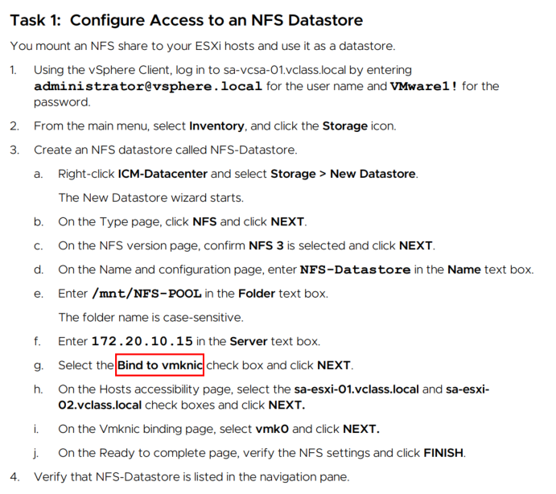

62 

## **Lab 12 Creating and Removing a Virtual Machine** 

## **Objective and Tasks** 

Use the vSphere Client to create a VM, remove a VM from the inventory, and delete a VM from the datastore: 

1. Create a Virtual Machine 

2. Remove the Virtual Machine from the vCenter Inventory 

3. Register the Virtual Machine to Re-Add it to the vCenter Inventory 

4. Delete the Virtual Machine from the Datastore 

63 

## **Task 1: Create a Virtual Machine** 

You create a virtual machine based on specific requirements. 

1. Using the vSphere Client, log in to sa-vcsa-01.vclass.local by entering **`administrator@vsphere.local`** for the user name and **`VMware1!`** for the password. 

2. From the main menu, select **Inventory** and click the **VMs and Templates** icon. 

3. Right-click **Lab VMs** and select **New Virtual Machine** . 

The New Virtual Machine wizard appears. 

4. On the Select creation type page, verify that **Create a new virtual machine** is selected and click **NEXT** . 

5. On the Select a name and folder page, enter the VM name and choose the VM location. 

   - a. Enter **`Photon-Empty`** in the **Virtual machine name** text box. 

   - b. Leave **Lab VMs** selected and click **NEXT** . 

6. On the Select a compute resource page, expand **ICM-Datacenter** > **Lab Servers** , select **saesxi-02.vclass.local** and click **NEXT** . 

7. On the Select storage page, click **iSCSI-Datastore** and click **NEXT** . 

8. On the Select compatibility page, keep the default and click **NEXT** . 

9. On the Select a guest OS page, select **Linux** from the **Guest OS Family** drop-down menu. 

10. Select **VMware Photon OS (64-bit)** from the **Guest OS Version** drop-down menu and click **NEXT** . 

11. On the Customize hardware page, configure virtual hardware settings. 

   - a. For **CPU** , leave **1** selected from the drop-down menu. 

   - b. For **Memory** , enter **`1`** GB. 

   - c. For **New Hard disk** , enter **`12`** GB. 

   - d. Expand **New Hard disk** and select **Thin Provision** from the **Disk Provisioning** dropdown menu. 

   - e. For **New Network** , verify that **Production** is selected. 

   - f. For **New CD/DVD Drive** , select **Datastore ISO File** from the drop-down menu. 

   - g. In the Select File window, click **ICM-Datastore** . 

   - h. Click the **ISO** folder and select the Photon OS ISO image **: photon-3.0-a0f216d.iso** . 

   - i. Click **OK** . 

64 

   - j. Expand **New CD/DVD Drive** . 

   - k. Select the **Connect At Power On** check box. 

   - l. Click **NEXT** . 

12. On the Ready to complete page, review the information and click **FINISH** . 

13. In the navigation pane, verify that the Photon-Empty VM appears in the Lab VMs folder. 

14. Select **Photon-Empty** in the navigation pane. 

15. In the **Summary** tab, review the settings in the different panes and verify that the settings show the correct configuration for the VM. 

Q1. In the VM Hardware pane, on which datastore is the VM located? 

- Q2. In the Related Objects pane, why are two datastores listed under Storage? 

ICM-Datastore holds the ISO image that the VM has mounted. iSCSI-Datastore holds the VM's virtual disk and configuration files. 

## NOTE 

In a production environment, the next step is to install an operating system in the new VM. However, to save class and lab time, you do not install the guest operating system. 

If you want, you can install the photon OS to see the complete installation. Power on the VM and continue the wizard process. Everything in default is enough. As root password for example assign VMware1!VMware1! 

You can log into the machine and see that everything has been installed correctly. 

To finish shutdown the Photon-Empty VM. 

65 

## **Task 2: Remove the Virtual Machine from the vCenter Inventory** 

You remove a virtual machine from the vCenter inventory. The virtual machine is unregistered from the ESXi host, so it cannot be managed by vCenter. But virtual machine's files remain on the datastore. 

1. In the navigation pane, right-click **Photon-Empty** and select **Remove from Inventory** . 

2. Click **YES** to confirm the removal. 

3. Verify that Photon-Empty does not appear in the navigation pane. 

4. Verify that Photon-Empty still exists on iSCSI-Datastore. 

   - a. In the navigation pane, click the **Storage** icon. 

   - b. Select **iSCSI-Datastore** and in the right pane, click the **Files** tab. 

   - c. Select the **Photon-Empty** folder and verify that this folder contains files. 

You should see the VM's configuration file (.vmx) and the VM's virtual disk files (.vmdk). 

## **Task 3: Register the Virtual Machine to Re-Add it to the vCenter Inventory** 

You register the Photon-Empty virtual machine to re-add it to the vCenter inventory. 

1. In the Photon-Empty folder, select the **Photon-Empty.vmx** check box. 

2. Click **REGISTER VM** . 

The Register Virtual Machine wizard appears. 

3. On the Select a name and folder page, select **Lab VMs** for the virtual machine location and click **NEXT** . 

4. On the Select a compute resource page, expand Lab Servers, select **sa-esxi-02.vclass.local** and click **NEXT** . 

5. On the Ready to complete page, click **FINISH** . 

6. In the navigation pane, click the **VMs and Templates** icon and verify that Photon-Empty appears under the Lab VMs folder. 

66 

## **Task 4: Delete the Virtual Machine from the Datastore** 

You delete the virtual machine that you created to familiarize yourself with the process of removing a VM from disk. 

1. In the navigation pane, right-click **Photon-Empty** and select **Delete from Disk** . 

2. Click **YES** to confirm deleting Photon-Empty. 

3. Verify that Photon-Empty does not appear in the navigation pane. 

4. Verify that Photon-Empty is deleted from on iSCSI-Datastore. 

   - a. In the navigation pane, click the **Storage** icon. 

   - b. Select **iSCSI-Datastore** and in the right pane, click the **Files** tab. 

   - c. Verify that the Photon-Empty folder does not appear in the list. 

67 

## **Lab 13 (Simulation) Installing VMware Tools** 

## **Objective and Tasks** 

Use the vSphere Client to install VMware Tools to an existing Windows VM: 

1. Mount the VMware Tools Image to the VM's DVD Drive 

2. Install VMware Tools with the VMware Tools Setup Wizard 

3. Verify that VMware Tools Is Running in the Guest OS 

From your local desktop, go to https://core-vmware.bravais.com/s/lWojWT317LTCzXre1hgG to open the simulation. 

68 

Extra Lab [Optional] 

If you want to play with a Windows Installation, repeat all the VM creation steps from Lab12. 

**This whole process can take a LONG TIME. That's why this lab has been removed from the course. But it may be interesting for the student to experiment with this.** 

In summary choose the options: 

- Name: Win10 

- Folder: LabVMs 

- sa-esxi-02.vclass.local 

- Compatibility ESXi 8 

- Windows / Windows 10 (64-bit) 

- 2 vCPU - 4 GB RAM - 20 GB Disk - Thin 

- CD/DVD: Datastore ISO file: ICM-Datastore /ISO/ **Windows-10.iso** . Connect at power on. 

- Power on the Win10 VM. 

Note: You may have to reboot a couple of times with Ctrl+Alt+Delete in the console, to boot the image. 

Install the OS with standard options. Then install the VMware Tools. Play with the machine, and power off at the finish. It is not necessary to delete it if Thin has been assigned. 

If you need help ask the Instructor. 

## **Lab 14 Adding Virtual Hardware** 

## **Objective and Tasks** 

Use the vSphere Client to examine a virtual machine's configuration and add virtual hardware to the virtual machine: 

1. Examine a Virtual Machine's Configuration 

2. Add Virtual Hard Disks to the Virtual Machine 

3. Compare Thin-Provisioned and Thick-Provisioned Disks 

69 

## **Task 1: Examine a Virtual Machine's Configuration** 

You use the vSphere Client to examine a VM's configuration. 

Viewing a VM's configuration is useful for general VM maintenance and troubleshooting purposes. 

1. Using the vSphere Client, log in to sa-vcsa-01.vclass.local by entering **`administrator@vsphere.local`** for the user name and **`VMware1!`** for the password. 

2. From the main menu, select **Inventory** , and click the **VM and Templates** icon. 

3. Power on the Photon-HW VM. 

   - a. Right-click **Photon-HW** and select **Power** > **Power On** . 

4. Select **Photon-HW** in the navigation pane. 

5. In the right pane, view the VM Hardware pane in the **Summary** tab. 

      - Q1. What size is the VM's hard disk 1? 

      - Q2. Is Hard disk 1 a thin-provisioned or thick-provisioned disk? 

6. Review the Capacity and Usage pane for the virtual machine. 

      - Q3. How much storage space is used by this VM? 

7. Review the Virtual Machine Details pane for the virtual machine. 

      - Q4. Is VMware Tools installed and running? 

70 

## **Task 2: Add Virtual Hard Disks to the Virtual Machine** 

To familiarize yourself with the process of adding virtual hardware, you add two virtual hard disks to the VM. You configure one hard disk as thin-provisioned and the other as thick-provisioned. 

1. In the navigation pane, right-click **Photon-HW** and select **Edit Settings** . 

The Edit Settings dialog box opens. 

2. Click **ADD NEW DEVICE** and select **Hard Disk** . 

3. Change the disk size and disk provisioning type of the new hard disk. 

   - a. Expand **New Hard disk** . 

   - b. Change the size of the new hard disk to 1 GB. 

   - c. Select **Thin Provision** from the **Disk Provisioning** drop-down menu. 

   - d. Collapse **New Hard disk** . 

4. Click **ADD NEW DEVICE** and select **Hard Disk** . 

5. Change the disk size and disk provisioning type of the second new hard disk. 

   - a. Expand the second **New Hard disk** . 

   - b. Change the size of the new hard disk to 1 GB. 

   - c. Select **Thick Provision Eager Zeroed** from the **Disk Provisioning** drop-down menu. 

6. Click **OK** . 

71 

## **Task 3: Compare Thin-Provisioned and Thick-Provisioned Disks** 

You view and compare thin-provisioned and thick-provisioned virtual disk files. 

Being aware of the differences between these two disk types is useful for planning your storage needs and also for troubleshooting storage problems. 

1. In the VM Hardware pane on the **Summary** tab, click **See All Disks** . 

The All Hard Disks window appears. 

2. Verify that you have a hard disk that is a 1 GB, thin-provisioned disk, and a hard disk that is a 1 GB, thick-provision, eager-zeroed disk. 

      - Q1. What is the name of the 1 GB, thin-provisioned disk file? 

      - Q2. What is the name of the 1 GB, thick-provision, eager-zeroed disk file? 

      - Q3. On what datastore are the hard disks located? 

3. Close the All Hard Disks window. 

4. Verify the size of the two 1 GB virtual disk files. 

   - a. In the navigation pane, click the **Storage** icon. 

   - b. Select **ICM-Datastore** and in the right pane, click **Files** . 

   - c. In the right pane, select the **Photon-HW** folder and locate **Photon-HW_1.vmdk.** 

      - Q4. What is the size of Photon-HW_1.vmdk? 

   - d. In the right pane, locate **Photon-HW_2.vmdk.** 

Q5. What is the size of Photon-HW_2.vmdk? 

The thin-provisioned disk uses only as much datastore space as the disk needs, in this case, 0 bytes. The thick-provisioned disk has all its space (1 GB) allocated during creation. 

5. Shut down the Photon-HW VM. 

   - a. In the navigation pane, click the **VMs and Templates** icon. 

   - b. Right-click **Photon-HW** and select **Power > Shut Down Guest OS** . 

   - c. Click **YES** to confirm the shutdown. 

   - d. Verify that Photon-HW is shut down and powered off. 

72 

## **Lab 15 Modifying Virtual Machines** 

## **Objective and Tasks** 

Modify a VM’s memory size, increase a VM's storage size, and rename a VM: 

1. Adjust Memory Allocation on a Powered-On Virtual Machine 

2. Increase the Size of a Virtual Disk 

3. Configure the Guest OS to Recognize the Additional Disk Space 

4. Rename a Virtual Machine in the vCenter Inventory 

73 

## **Task 1: Adjust Memory Allocation on a Powered-On Virtual Machine** 

You add, change, or configure virtual machine memory resources or options to enhance virtual machine performance. 

1. Using the vSphere Client, log in to sa-vcsa-01.vclass.local by entering **`administrator@vsphere.local`** for the user name and **`VMware1!`** for the password. 

2. From the main menu, select **Inventory** , and click the **VMs and Templates** icon. 

3. In the navigation pane, right-click **Linux-06** and select **Power** > **Power On** . 

4. In Linux-06's **Summary** tab, view the Capacity and Usage pane and record the amount (GB) of memory allocated. __________ 

5. In the navigation pane, right-click **Linux-06** and select **Edit Settings** . 

The Edit Settings window appears. 

6. Expand **Memory** and locate Memory Hot Plug. 

The memory hot plug function is active for Linux-06. Therefore, you can add memory to Linux-06 while it is powered on. 

7. In the **Memory** text box, enter **`2`** to change the amount of memory to 2 GB. 

8. Click **OK** . 

9. View the Capacity and Usage pane and verify that the value for memory allocated has increased to 2 GB. 

Aditional Step: You can go into the Remote Console on to the Linux-06 VM, and open the Terminal and use the "top" command to verify that the memory is increased. 

74 

## **Task 2: Increase the Size of a Virtual Disk** 

You increase the size of the virtual machine's virtual disk. 

1. In the navigation pane, right-click **Linux-06** and select **Edit Settings** . 

2. On the **Virtual Hardware** tab, record the size (GB) of Hard Disk 1. __________ 16 GB 

3. In the **Hard disk 1** text box, increase the disk size by 2 GB and click **OK** .  18 GB 

4. View the VM Hardware pane in Linux-06's **Summary** tab and verify that Hard disk 1 shows the correct disk size. 

5. In the navigation pane, right-click **Linux-06** and select **Power** > **Restart Guest OS** . 

6. Click **YES** to confirm the restart. 

For the Ubuntu Linux guest OS to view the additional disk space, you must restart the guest OS. The guest OS determines whether a reboot is required. 

75 

## **Task 3: Configure the Guest OS to Recognize the Additional Disk Space** 

You configure the Ubuntu Linux guest OS in the Linux-06 VM to detect the additional space that has been added to virtual hard disk 1. 

You do this by resizing the extended partition using the Disks app, then you resize the file system located in the partition. 

1. On the **Summary** tab for Linux-06, click **LAUNCH WEB CONSOLE** . 

## Or Remote Console 

   - After the VM has rebooted, you are automatically logged in to Linux-06 as the user localadmin. 

2. Start the Disks app. 

   - a. On the Linux desktop, click the **Show Applications** icon located on the lower left side of the window. 

- b. In the search box, enter **`disks`** . 

- c. Click the **Disks** icon. 

The Disks app window appears. 

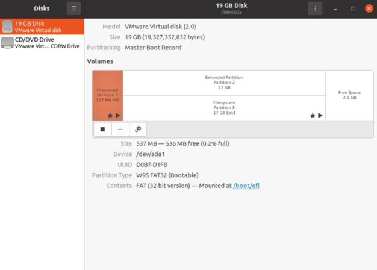

76 

3. Increase the size of the disk partition. 

   - a. Select the Extended Partition (Partition 2). 

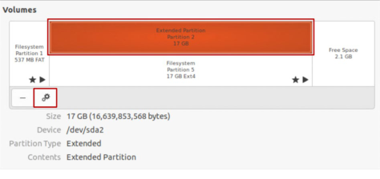

- b. Click the settings (gears) icon. 

- c. Select **Resize** . 

- d. In the Resize Volume dialog box, drag the slider all the way to the right. 

- e. Click **Resize** . 

You are prompted to enter the password for the user localadmin. 

   - f. Enter **`VMware1!`** at the password prompt and click **Authenticate** . 

   - g. Verify that Partition 2 is extended. 

4. Increase the size of the file system. 

   - a. Select the file system located on Partition 5. 

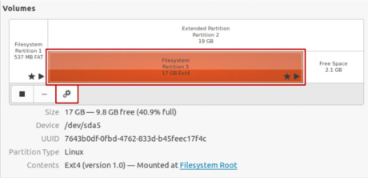

   - b. Click the settings (gears) icon and select **Resize** . 

   - c. In the Resize Volume dialog box, drag the slider all the way to the right. 

   - d. Click **Resize** . 

   - e. Verify that the file system is extended. 

5. Close the Disks app window. 

6. Close the Linux-06 console tab. 

77 

## **Task 4: Rename a Virtual Machine in the vCenter Inventory** 

You rename an existing virtual machine in the vCenter inventory. 

1. Return to the vSphere Client. 

2. In the navigation pane, right-click **Linux-06** and select **Rename** . 

3. In the **Enter the new name** text box, enter **`Linux-New`** . 

4. Click **OK** . 

5. In the navigation pane, select **Linux-New** . 

6. In the right pane, select the **Datastores** tab. 

ICM-Datastore appears in the list. This datastore is where the Linux-New VM's files are located. 

7. Right-click **ICM-Datastore** and select **Browse Files** . 

      - Q1. In the list of folders, do you see Linux-06 or Linux-New? 

8. In the navigation pane, click the **VMs and Templates** icon. 

9. Rename Linux-New back to Linux-06. 

10. Verify that Linux-06 appears in the navigation pane. 

11. Shut down Linux-06. 

   - a. In the navigation pane, right-click **Linux-06** and select **Power** > **Shut Down Guest OS** . 

   - b. Click **YES** to confirm the shutdown. 

78 

## **Lab 16 Creating Templates and Deploying VMs** 

## **Objective and Tasks** 

Create a VM template, create a customization specification, and deploy VMs from a template: 

1. Create a Virtual Machine Template 

2. Create Customization Specifications 

3. Deploy Virtual Machines from a Template 

79 

## **Task 1: Create a Virtual Machine Template** 

You create a template to define the configuration of a virtual machine and easily deploy new virtual machines from the template. 

1. Using the vSphere Client, log in to sa-vcsa-01.vclass.local by entering **`administrator@vsphere.local`** for the user name and **`VMware1!`** for the password. 

2. From the main menu, select **Inventory** , and click the **VMs and Templates** icon. 

3. Convert the Linux-Template virtual machine to a template. 

   - a. In the navigation pane, look at Linux-Template's icon. 

The icon indicates that Linux-Template is a virtual machine. 

   - b. Right-click **Linux-Template** and select **Template > Convert to Template** . 

   - c. Click **YES** to confirm the conversion. 

   - d. In the navigation pane, verify that the icon for Linux-Template changed. 

      - The icon indicates that Linux-Template is a template. 

4. Move Linux-Template to the Lab Templates folder. 

   - a. Right-click **Linux-Template** and select **Move to folder** . 

   - b. Select **Lab Templates** in the Move to folder window and click **OK** . 

5. Verify that Linux-Template appears in the Lab Templates folder. 

80 

## **Task 2: Create Customization Specifications** 

You save the guest operating system settings in a customization specification, which is applied when you clone virtual machines or deploy virtual machines from templates. 

1. From the main menu, select **Policies and Profiles** . 

2. In the left pane, select **VM Customization Specifications** . 

3. In the right pane, click **NEW** to create a custom specification for the Linux guest OS. The New VM Customization Specification wizard opens. 

4. On the Name and target OS page, configure the specification name and target guest OS. 

   - a. Enter **`Linux-Spec`** in the **Name** text box. 

   - b. Verify that **sa-vcsa-01.vclass.local** is selected from the **vCenter Server** drop-down menu. 

   - c. Click **Linux** as the **Target guest OS** . 

   - d. Click **NEXT** . 

5. On the Computer name page, specify the computer name and the domain name. 

   - a. Leave **Use the virtual machine name** selected. 

   - b. Enter **`vclass.local`** in the **Domain name** text box. 

   - c. Click **NEXT** . 

6. On the Time zone page, configure the area and location. 

   - a. Select **US** from the **Area** drop-down menu. 

   - b. Select **Pacific** from the **Location** list. 

   - c. Click **NEXT** . 

7. On the Customization script page, click **NEXT** . 

8. On the Network page, select **Manually select custom settings** , select **NIC1** and click **NEXT** . 

9. On the DNS settings page, configure the DNS server and DNS search path. 

   - a. Enter **`172.20.10.10`** in the **Primary DNS server** text box. 

   - b. Enter **`vclass.local`** in the **DNS Search Paths** text box and click **ADD** . 

   - c. Click **NEXT** . 

10. On the Ready to complete page, review the information and click **FINISH** . 

11. Verify that Linux-Spec appears in the list. 

81 

## **Task 3: Deploy Virtual Machines from a Template** 

You use a template to deploy and provision new virtual machines and customize their guest operating systems. 

1. From the main menu, select **Inventory** , and click the **VMs and Templates** icon. 

2. Deploy a VM from Linux-Template to sa-esxi-01.vclass.local. 

   - a. In the navigation pane, expand the **Lab Templates** folder. 

   - b. Right-click **Linux-Template** and select **New VM from This Template** . 

The Deploy From Template wizard opens. 

- c. On the Select a name and folder page, enter **`Linux-11`** in the **Virtual machine name** text box. 

- d. Expand **ICM-Datacenter** and select **Lab VMs** . 

- e. Click **NEXT** . 

- f. On the Select a compute resource page, expand **ICM-Datacenter > Lab Servers** and select **sa-esxi-01.vclass.local** . 

- g. Click **NEXT** . 

- h. On the Select storage page, select **iSCSI-Datastore** from the list. 

- i. In the **Select virtual disk format** drop-down menu, leave **Same format as source** selected. 

The format of the source virtual disk is Thin Provision. 

- j. Click **NEXT** . 

- k. On the Select clone options page, select the **Customize the operating system** and the **Power on virtual machine after creation** check boxes and click **NEXT** . 

- l. On the Customize guest OS page, click **Linux-Spec** and click **NEXT** . 

- m. On the Ready to complete page, review the information and click **FINISH** . 

82 

3. Deploy another VM from Linux-Template, name the VM Linux-12, and place the VM on saesxi-02.vclass.local. 

   - a. In the navigation pane, right-click **Linux-Template** and select **New VM from This Template** . 

The Deploy From Template wizard opens. 

   - b. On the Select a name and folder page, enter **`Linux-12`** in the **Virtual machine name** text box. 

   - c. Expand **ICM-Datacenter** and select **Lab VMs** . 

   - d. Click **NEXT** . 

   - e. On the Select a compute resource page, expand **ICM-Datacenter > Lab Servers** and select **sa-esxi-02.vclass.local** . 

   - f. Click **NEXT** . 

   - g. On the Select storage page, select **iSCSI-Datastore** from the list and click **NEXT** . 

   - h. On the Select clone options page, select the **Customize the operating system** and the **Power on virtual machine after creation** check boxes and click **NEXT** . 

   - i. On the Customize guest OS page, click **Linux-Spec** and click **NEXT** . 

   - j. On the Ready to complete page, review the information and click **FINISH** . 

4. In the Recent Tasks pane, monitor the progress of the two virtual machine cloning tasks and wait for their completion. 

5. When the tasks are complete, verify that Linux-11 and Linux 12 appear in the navigation pane and are powered on. 

6. In each VM's **Summary** tab, view the Related Objects pane and verify that the VM is located on the correct ESXi host. 

Linux-11 is on sa-esxi-01.vclass.local and Linux-12 is on sa-esxi-02.vclass.local. 

7. In each VM's **Summary** tab, locate where IP addresses are displayed in the Virtual Machine Details pane. 

8. Wait a few minutes and verify that the DNS name and IPv4 address are assigned. 

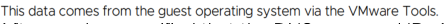

9. After you have verified that the DNS name and IPv4 address are set for each VM, shut down Linux-11 and Linux-12. 

Also you can login with the console in both VMs and see the Hostname and so on is Changed 

- a. Right-click **Linux-11** and select **Power** > **Shut Down Guest OS** . 

- b. Click **YES** to confirm the shutdown. 

- c. Repeat steps a and b for Linux-12. 

83 

## **Lab 17 Using Local Content Libraries** 

## **Objective and Tasks** 

Create a local content library to clone and deploy virtual machines: 

1. Create a Local Content Library 

2. Create an OVF Template in the Content Library 

3. Create a VM Template in the Content Library 

4. View the Content Library Templates 

5. Deploy a VM from a Template in the Content Library 

85 

## **Task 1: Create a Local Content Library** 

In the vSphere Client, you create a local content library on sa-vcsa-01.vclass.local. Content libraries are used to store templates and deploy virtual machines in the vCenter inventory. 

1. Using the vSphere Client, log in to sa-vcsa-01.vclass.local by entering **`administrator@vsphere.local`** for the user name and **`VMware1!`** for the password. 

2. From the main menu, select **Content Libraries** . 

The Content Libraries pane appears. 

3. In the right pane, click **CREATE** . 

The New Content Library wizard opens. 

4. On the Name and location page, enter **`SA-Local-Library`** in the **Name** text box and click **NEXT** . 

5. On the Configure content library page, verify that **Local content library** is selected and click **NEXT** . 

6. On the Apply security policy page, click **NEXT** . 

7. On the Add storage page, select **iSCSI-Datastore** , and click **NEXT** . 

8. On the Ready to complete page, review the information and click **FINISH** . 

9. Verify that SA-Local-Library appears in the list. 

86 

## **Task 2: Create an OVF Template in the Content Library** 

You create an OVF template in the content library by cloning a VM template located in the vCenter inventory to a template in the content library. You use the content library templates to provision virtual machines on a cluster or host. 

1. From the main menu, select **Inventory** , and click the **VMs and Templates** icon. 

2. In the navigation pane, expand **ICM-Datacenter > Lab Templates** . 

3. Right-click **Linux-Template** and select **Clone to Library** . 

The Clone to Template in Library window appears. 

4. Next to **Clone as** , leave **New template** selected. 

5. Click **SA-Local-Library** . 

6. Enter **`Linux-OVF-LibTemplate`** in the **Template name** text box and click **OK** . 

7. While you are waiting for this task to complete, you can continue on to the next task. 

87 

## **Task 3: Create a VM Template in the Content Library** 

You create a VM template in the content library by cloning a virtual machine to a template in the library. During the process, you can choose what type of template to create: VM template or OVF template. You choose VM template. 

1. From the main menu, select **Inventory** , and click the **VMs and Templates** icon. 

2. Right-click the **Photon-Base** VM and select **Clone > Clone as Template to Library** . 

The Clone Virtual Machine to Template window appears. 

3. On the Basic information, provide template information. 

   - a. From the **Template type** drop-down menu, leave **VM Template** selected. 

   - b. In the **Name** text box, enter **`Photon-LibTemplate`** . 

   - c. For the folder to locate the template, expand **ICM-Datacenter** , select **Lab Templates** and click **NEXT** . 

4. On the Location page, click **SA-Local-Library** and click **NEXT** . 

5. On the Select a compute resource page, expand **Lab Servers** , select **sa-esxi-02.vclass.local** and click **NEXT** . 

6. On the Select storage page, click **iSCSI-Datastore** and click **NEXT** . 

7. On the Ready to complete page, click **FINISH** . 

8. In the Recent Tasks pane, monitor the tasks to completion. 

88 

## **Task 4: View the Content Library Templates** 

You view the VM template and OVF template in SA-Local-Library. You also view the VM template in the vCenter inventory. 

1. From the main menu, select **Content Libraries** . 

2. In the left pane, click **SA-Local-Library** . 

3. In the right pane, click the **Templates** tab. 

The VM Templates pane appears. 

4. Verify that Photon-LibTemplate appears in the list. 

5. Click **OVF & OVA Templates** and verify that Linux-OVF-LibTemplate appears in the list. 

   - Q1. Why does Linux-OVF-LibTemplate appear under **OVF & OVA Templates** and not under **VM Templates** ? 

6. From the main menu, select **Inventory** and click the **VMs and Templates** icon. 

7. Verify that Photon-LibTemplate appears in the Lab Templates folder. 

8. Verify that Linux-OVF-LibTemplate does not appear in the Lab Templates folder. 

Q2. Why is Photon-LibTemplate in the vCenter inventory, but Linux-OVFLibTemplate is not? 

89 

## **Task 5: Deploy a VM from a Template in the Content Library** 

You use Linux-OVF-LibTemplate, located in the content library, to deploy a virtual machine to a host in your vCenter inventory. 

1. In the navigation pane, right-click **ICM-Datacenter** and select **New Virtual Machine** . The New Virtual Machine wizard appears. 

2. On the Select a creation type page, select **Deploy from template** and click **NEXT** . The Content Library pane appears. 

3. On the Select a template page, click **Linux-OVF-LibTemplate** and click **NEXT** . 

4. On the Select name and folder page, specify the following information: 

   - a. Enter **`Linux-13`** in the **Virtual machine name** text box. 

   - b. Expand **ICM-Datacenter** and select **Lab VMs** for the virtual machine location. 

   - c. Select the **Customize the operating system** check box at the bottom and click **NEXT** . 

5. On the Customize guest OS page, click **Linux-Spec** and click **NEXT** . 

6. On the Select a compute resource page, expand **Lab Servers** , select **sa-esxi-02.vclass.local** and click **NEXT** . 

7. On the Review details page, click **NEXT** . 

8. On the Select storage page, specify the following information: 

   - a. Click **iSCSI-Datastore** . 

   - b. Select **Thin Provision** from the **Select virtual disk format** drop-down list. 

   - c. Click **NEXT** . 

9. On the Select networks page, leave **pg-SA-Production** selected in the **Destination Network** drop-down list and click **NEXT** . 

10. On the Ready to complete page, click **FINISH** . 

11. In the Recent Tasks pane, monitor the progress of the template deployment tasks and wait for its completion. 

12. In the navigation pane, verify that Linux-13 appears in the Lab VMs folder. 

90 

## **Lab 18 Using Subscribed Content Libraries** 

## **Objective and Tasks** 

Publish a local content library and create a second library that subscribes to it: 

1. Publish a Local Content Library 

2. Create a Subscribed Content Library 

3. Create a Subscription for VM Templates 

4. Deploy a VM from the Subscribed Content Library 

91 

## **Task 1: Publish a Local Content Library** 

You publish the SA-Local-Library content library so that other content libraries can subscribe to it. 

1. Using the vSphere Client, log in to sa-vcsa-01.vclass.local by entering **`administrator@vsphere.local`** for the user name and **`VMware1!`** for the password. 

2. From the main menu, select **Content Libraries** . 

3. In the left pane, select **SA-Local-Library** . 

4. In the right pane, click **ACTIONS** and select **Edit Settings** . 

5. In the Edit Settings window, publish the local library. 

   - a. Select the **Enable publishing** check box. 

   - b. Select the **Enable user authentication for access to this content library** check box. 

   - c. Enter **`VMware1!`** in the **Password** and **Confirm Password** text boxes. 

   - d. Click **OK** . 

6. Click the **Summary** tab and scroll down until you see the Publication pane. 

7. Verify that SA-Local-Library is published externally and is password protected. 

8. In the Publication pane, click **COPY LINK** to copy the Subscription URL in the Publication panel to the clipboard. 

You will paste the Subscription URL in the New Content Library wizard in the next task. 

92 

## **Task 2: Create a Subscribed Content Library** 

You configure a content library named SA-Subscribed-Library that is subscribed to SA-LocalLibrary. 

## NOTE 

In a production environment, you typically create the subscribed content library in a different vCenter instance from the published library. However for lab purposes, the published library and the subscribed library are located in the same vCenter instance. 

1. From the main menu, select **Content Libraries** . 

2. In the right pane, click **CREATE** . 

The New Content Library wizard appears. 

3. On the Name and location page, name the content library and verify the vCenter Server location. 

   - a. Enter **`SA-Subscribed-Library`** in the **Name** text box. 

   - b. Verify that **sa-vcsa-01.vclass.local** is selected in the **vCenter Server** drop-down menu. c. Click **NEXT** . 

4. On the Configure content library page, configure the subscribed content library settings: 

   - a. Click **Subscribed content library** . 

   - b. Right-click the **Subscription URL** text box and select **Paste** to paste the URL that you copied in step 1. 

The subscription URL appears in the text box. 

If copy and pasting does not work, you must enter the URL manually. 

   - c. Select the **Enable authentication** check box. 

   - d. Enter **`VMware1!`** in the **Password** text box. 

   - e. Under **Download content** , click **when needed** and click **NEXT.** 

5. On the Add storage page, click **ICM-Datastore** and click **NEXT** . 

6. On the Ready to complete page, review the information and click **FINISH** . 

7. Verify that SA-Subscribed-Library appears in the content library list. 

93 

8. View the contents of the SA-Subscribed-Library. 

   - a. In the left pane, select **SA-Subscribed-Library** . 

   - b. Click the **Templates** tab. 

   - c. Click **OVF & OVA Templates** and verify that Linux-OVF-LibTemplate appears in the list. This template is the same template that is in SA-Local-Library, the source content library. 

   - d. Verify that the Stored Locally column indicates No and that the Size column indicates 0 bytes. 

SA-Subscribed-Library is configured to download library content only when needed. As a result, only the template’s metadata has been synchronized. The actual template was not synchronized with SA-Subscribed-Library because it is not yet needed. 

- e. Click **VM Templates** . 

Even though SA-Local-Library has the VM template named Photon-LibTemplate, the subscribed library does not see it yet. You must create a subscription in order to access the VM Templates. 

94 

## **Task 3: Create a Subscription for VM Templates** 

You create a subscription for VM Templates in SA-Local-Library (the library that is publishing content) so that VM templates synchronize with SA-Subscribed-Library (the library that is subscribed to the local content library). 

1. From the main menu, select **Content Libraries** . 

2. In the left pane, click **SA-Local-Library** . 

3. In the right pane, click the **Subscriptions** tab. 

4. Create a subscription for the subscriber library. 

   - a. Click the **ACTIONS** drop-down menu and select **New Subscription** . 

      - The Create Subscription wizard appears. 

   - b. On the Select subscription type page, leave **Create a new subscription to an existing Subscriber library** selected and click **NEXT** . 

   - c. On the Configure Subscription page, click **SA-Subscribed-Library** and click **NEXT** . 

   - d. On the Select folder page, select **Lab Templates** and click **NEXT** . 

   - e. On the Select compute resource page, select **sa-esxi-02.vclass.local** and click **NEXT** . 

   - f. On the Select network page, select **pg-SA-Production** and click **NEXT** . 

   - g. On the Review page, view the information and click **FINISH** . 

5. Verify that the subscription appears in the list. 

6. Publish the subscription so that all VM templates in SA-Local-Library will be published to SASubscribed-Library. 

   - a. In the right pane, select the **SA-Subscribed-Library** check box. 

   - b. Click **PUBLISH** . 

   - c. In the Publish Library dialog box, click **PUBLISH** . 

7. View the templates in the SA-Subscribed-Library. 

   - a. From the main menu, select **Content Libraries** . 

   - b. In the left pane, click **SA-Subscribed-Library** . 

   - c. In the right pane, click the **Templates** tab. 

   - d. In the VM Templates pane, verify that Photon-LibTemplate now appears in the list. 

The Stored Locally column indicates No and the Size column indicates 0 bytes because SA-Subscribed-Library is configured to download library content only when needed. 

95 

## **Task 4: Deploy a VM from the Subscribed Content Library** 

You use the vSphere Client to deploy a new VM from Linux-OVF-LibTemplate that is available in the content library SA-Subscribed-Library. 

1. From the main menu, select **Inventory** and click the **VMs and Templates** icon. 

2. In the navigation pane, right click **Lab VMs** and select **New Virtual Machine** . 

The New Virtual Machine wizard appears. 

3. On the Select a creation type page, select **Deploy from template** and click **NEXT** . 

4. On the Select a template page, click **Linux-OVF-LibTemplate** located in **SA-SubscribedLibrary** . 

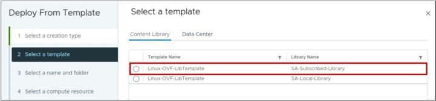

5. Click **NEXT** . 

6. On the Select a name and folder page, specify VM settings. 

   - a. Enter **`Linux-20`** in the **Virtual machine name** text box. 

   - b. Select **Lab VMs** for the virtual machine location. 

   - c. At the bottom of the page, select the **Customize the operating system** check box. 

   - d. Click **NEXT** . 

7. On the Customize guest OS page, select **Linux-Spec** and click **NEXT** . 

8. On the Select a compute resource page, expand **Lab Servers** , select **sa-esxi-02.vclass.local** and click **NEXT** . 

9. On the Review details page, click **NEXT** . 

10. On the Select storage page, provide storage information. 

   - a. Click **iSCSI-Datastore** . 

   - b. From the **Select virtual disk format** drop-down menu, select **Thin Provision** and click **NEXT** . 

11. On the Select networks page, leave **pg-SA-Production** selected in the **Destination Network** drop-down menu and click **NEXT** . 

96 

12. On the Ready to complete page, review the information and click **FINISH** . 

13. Monitor the Recent Tasks pane and wait for the deployment tasks to complete. 

14. Verify that Linux-20 appears in the navigation pane in the Lab VMs folder. 

15. View information about Linux-OVF-LibTemplate in SA-Subscribed-Library. 

   - a. From the main menu, select **Content Libraries** . 

   - b. In the left pane, select **SA-Subscribed-Library** . 

   - c. In the right pane under the **Templates** tab, click **OVF & OVA Templates** . 

   - d. Verify that the Stored Locally column now indicates Yes and that the Size column indicates a size greater than 0 bytes. 

Since the template was needed in SA-Subscribed-Library to deploy a VM, it was synchronized with SA-Subscribed-Library. 

97 

## **Lab 19 Versioning VM Templates in Content Libraries** 

## **Objective and Tasks** 

Manage multiple versions of a VM template versioning in the local content library: 

1. Check Out a VM Template in the Content Library 

2. Make Changes to the VM Template 

3. Check In the VM Template to the Content Library 

4. Revert to a Previous Version of the VM Template 

99 

## **Task 1: Check Out a VM Template in the Content Library** 

To update a template that is managed in the vCenter Server content library, you must first check out the VM template. 

1. Using the vSphere Client, log in to sa-vcsa-01.vclass.local by entering **`administrator@vsphere.local`** for the user name and **`VMware1!`** for the password. 

2. Review information about the VM template Photon-LibTemplate. 

   - a. From the main menu, select **Inventory** and click the **VMs and Templates** icon. 

   - b. In the navigation pane, select **Photon-LibTemplate** . 

   - c. Select the **Summary** tab and view the VM Template Details pane. 

      - Q1. Which content library manages this template? 

   - d. View the VM Hardware pane and review the template's hardware information. Photon-LibTemplate is configured with 1 CPU and 1024 MB of memory. 

3. In the right pane, click the **Versioning** tab and click **CHECK OUT VM FROM THIS TEMPLATE.** 

The Check out VM from VM Template wizard opens. 

4. On the Name and location page, configure the VM name and VM location. 

   - a. Enter **`photon-libtemplate-tmp`** in the **Virtual machine name** text box. 

   - b. For the virtual machine location, expand **ICM-Datacenter** , select **Lab Templates** , and click **NEXT** . 

5. On the Select compute resource page, expand **Lab Servers** and select **sa-esxi02.vclass.local** and click **NEXT** . 

6. On the Review page, review the VM information and click **FINISH.** 

7. Verify that photon-libtemplate-tmp appears in the **Versioning** tab. 

8. Look at the icons for Photon-LibTemplate and photon-libtemplate-tmp. 

Photon-LibTemplate has a template icon, but photon-libtemplate-tmp has a VM icon because it is currently checked out as a VM. 

9. In the navigation pane, verify that the photon-libtemplate-tmp VM appears in the Lab Templates folder. 

The VM that is checked out is now available for updating. 

100 

## **Task 2: Make Changes to the VM** 

You update the VM by increasing the number of virtual CPUs and memory. 

1. In the left pane, right-click **photon-libtemplate-tmp** and select **Edit Settings** . 

2. Increase the number of CPUs to **2** . 

3. Increase the memory to **4 GB.** 

4. Click **OK** . 

5. In the **Summary** tab, in the VM Hardware pane, verify that the VM has 2 CPUs and 4 GB memory. 

NOTE 

In this lab, only the VM hardware is modified, but the same steps can be followed for guest OS or guest application updates. 

101 

## **Task 3: Check In the VM Template to the Content Library** 

After the VM is modified, you check in the modified version of the VM to a template in the content library. 

1. On the **Summary** tab for the photon-libtemplate-tmp VM, in the Guest OS pane, click **CHECK IN VM TO TEMPLATE.** 

The Check In VM window opens. 

2. Enter **`Increased vCPUs to 2 and memory to 4 GB`** in the **Check In notes** text box. 

## NOTE 

Providing detailed notes is important for the version information of the VM template. **Check in notes** is a required field. 

3. Click **CHECK IN.** 

4. Monitor the Recent Tasks pane and wait for the tasks to complete. 

5. Verify that the photon-libtemplate-tmp VM is converted to the VM template PhotonLibTemplate (3). 

6. In the left pane, select **Photon-LibTemplate (3)** . 

7. In the right pane, click the **Versioning** tab and verify that the information about the VM modifications appears. 

You should see two versions of the VM template: Photon-LibTemplate (2) and PhotonLibTemplate (3). 

Photon-LibTemplate (2) is the original version of Photon-LibTemplate. 

102 

## **Task 4: Revert to a Previous Version of the VM Template** 

You revert to a previous version of Photon-LibTemplate. 

1. In the **Versioning** tab, click the ellipsis (three dots) menu next to Photon-LibTemplate (2) and select **Revert to This Version** . 

2. In the **Revert notes** text box, enter **`Reverting back to original configuration due to resource issues`** . 

3. Click **REVERT** . 

Photon-LibTemplate (2) is renamed to Photon-LibTemplate (4). 

4. In the left pane, select **Photon-LibTemplate (4).** 

5. Click the **Versioning** tab and verify that the notes for the revert operation appear next to Photon-LibTemplate (4). 

6. In the left pane, select **Photon-LibTemplate (3).** 

The **Versioning** tab states that this version is not the current VM template. PhotonLibTemplate (4) is now the current version. 

103 

## **Lab 20 vSphere vMotion Migrations** 

## **Objective and Tasks** 

Configure vSphere vMotion networking and migrate virtual machines using vSphere vMotion: 

1. Configure vSphere vMotion Networking on sa-esxi-01.vclass.local 

2. Configure vSphere vMotion Networking on sa-esxi-02.vclass.local 

3. Prepare Virtual Machines for vSphere vMotion Migration 

4. Migrate Virtual Machines Using vSphere vMotion 

## **Task 1: Configure vSphere vMotion Networking on sa-esxi01.vclass.local** 

You create a standard switch and a VMkernel port group on sa-esxi-01.vclass.local that can be used to move virtual machines from one host to another while maintaining continuous service availability. 

1. Using the vSphere Client, log in to sa-vcsa-01.vclass.local by entering **`administrator@vsphere.local`** as the user name and **`VMware1!`** as the password. 

2. From the main menu, select **Inventory** and click the **Hosts and Clusters** icon. 

3. In the navigation pane, select **sa-esxi-01.vclass.local** and click the **Configure** tab in the right pane. 

4. Under **Networking** , select **Virtual switches** . 

5. In the right pane, click **ADD NETWORKING** . 

The Add Networking wizard appears. 

6. On the Select connection type page, leave **VMkernel Network Adapter** selected and click **NEXT** . 

7. On the Select target device page, click **New standard switch** and click **NEXT** . 

104 

8. On the Create a Standard Switch page, move vmnic1 to Active adapters. 

   - a. Select **vmnic1** and click **MOVE DOWN** until vmnic1 is under Active adapters. 

   - b. Click **NEXT** . 

9. On the Port properties page, configure the vSphere vMotion settings. 

   - a. Enter **`vMotion`** in the **Network label** text box. 

   - b. Under Available services, select the **vMotion** check box and click **NEXT** . 

10. On the IPv4 settings page, configure the IP address. 

   - a. Click **Use static IPv4 settings** . 

   - b. Enter **`172.20.12.51`** in the **IPv4 address** text box. 

   - c. Enter **`255.255.255.0`** in the **Subnet mask** text box. 

   - d. Click **NEXT** . 

11. On the Ready to complete page, review the information and click **FINISH** . 

12. In the Virtual switches pane, collapse **dvs-Lab** and expand **vSwitch2** . 

13. Verify that vSwitch2 contains the vMotion port group, the vmk3 VMkernel port, and the vmnic1 physical adapter. 

105 

## **Task 2: Configure vSphere vMotion Networking on sa-esxi02.vclass.local** 

You create a standard switch and a VMkernel port group on sa-esxi-02.vclass.local that can be used to move virtual machines from one host to another while maintaining continuous service availability. 

1. In the navigation pane, select **sa-esxi-02.vclass.local** and click the **Configure** tab in the right pane. 

2. Under **Networking** , select **Virtual switches** . 

3. In the right pane, click **ADD NETWORKING** . 

The Add Networking wizard appears. 

4. On the Select connection type page, leave **VMkernel Network Adapter** selected and click **NEXT** . 

5. On the Select target device page, click **New standard switch** and click **NEXT** . 

6. On the Create a Standard Switch page, move vmnic1 to Active adapters. 

   - a. Select **vmnic1** and click **MOVE DOWN** until vmnic1 is under Active adapters. 

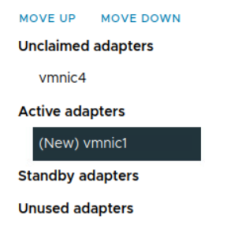

   - b. Click **NEXT** . 

7. On the Port properties page, configure the vSphere vMotion settings. 

   - a. Enter **`vMotion`** in the **Network label** text box. 

   - b. Under Available services, select the **vMotion** check box and click **NEXT** . 

106 

8. On the IPv4 settings page, configure the IP address. 

   - a. Click **Use static IPv4 settings** . 

   - b. Enter **`172.20.12.52`** in the **IPv4 address** text box. 

   - c. Enter **`255.255.255.0`** in the **Subnet mask** text box. 

   - d. Click **NEXT** . 

9. On the Ready to complete page, review the information and click **FINISH** 

10. In the Virtual switches pane, collapse **dvs-Lab** and expand **vSwitch3** . 

11. Verify that vSwitch3 contains the vMotion port group, the vmk3 VMkernel port, and the vmnic1 physical adapter. 

107 

## **Task 3: Prepare Virtual Machines for vSphere vMotion Migration** 

Using vSphere vMotion, you prepare virtual machines for hot migration between hosts. 

1. In the navigation pane, click the **VMs and Templates** icon. 

2. Power on the Linux-02 and Linux-04 VMs. 

3. Verify that Linux-02 and Linux-04 are connected to the pg-SA-Production network. 

   - a. Select **Linux-02** in the navigation pane. 

   - b. Click the **Summary** tab in the right pane. 

   - c. View the VM Hardware pane and verify that network adapter 1 is connected to the pgSA-Production network. 

   - d. Repeat steps a through c on Linux-04. 

4. Open the remote console to Linux-02. 

   - a. In the navigation pane, select **Linux-02** . 

   - b. In Linux-02's **Summary** tab, click **LAUNCH REMOTE CONSOLE** . 

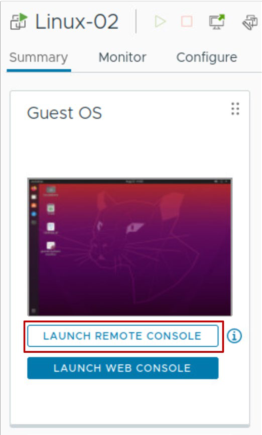

A window appears asking you to allow this site to open the vmrc link with VMware Remote Console. 

- c. Select the **Always allow https://sa-vcsa-01.vclass.local to open vmrc links** check box and click **Open Link** . This option could not appear in your laboratory 

The VMware Remote Console window to Linux-02 opens. 

108 

5. Click the **Terminal** icon, located on the left side, to open the Linux terminal window. 

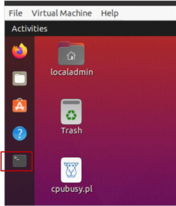

6. At the command prompt, enter **`ip route`** and record the default gateway IP address. 

   - __________ 

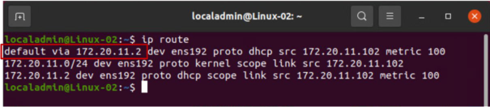

7. Enter **`ping <default_gateway_IP_address>`** at the command prompt. 

Example: `ping 172.20.11.2` 

The `ping` command runs continuously, pinging the default gateway IP address. The `ping` command is used here to simulate an application workload. 

8. Leave the `ping` command running in the Linux-02 remote console. 

109 

## **Task 4: Migrate Virtual Machines Using vSphere vMotion** 

You perform hot migrations of virtual machines residing on a shared datastore that is accessible to both the source and the target ESXi hosts. 

1. Leave the Linux-02 console open and return to the vSphere Client. 

2. Migrate the Linux-02 virtual machine from host sa-esxi-01.vclass.local to host sa-esxi02.vclass.local. 

   - a. In the navigation pane, right-click **Linux-02** and select **Migrate** . 

The Migrate wizard opens. 

- b. On the Select a migration type page, click the **VM origin** link in the top right corner. 

The pop up window conveniently shows you the host on which the VM is running (saesxi-01.vclass.local), the networks the VM is connected to, and the datastore on which the VM's files are located. 

The **VM origin** link appears on every page in this wizard. 

- c. Leave **Change compute resource only** selected and click **NEXT** . 

- d. On the Select a compute resource page, click **sa-esxi-02.vclass.local** . 

The sa-esxi-02.vclass.local host is the destination host to which you migrate the Linux02 virtual machine. The migration requirements are validated. If the validation does not succeed, warning or error messages appear in the Compatibility pane. If errors appear, you cannot continue with the migration until the errors are resolved. 

   - e. Click **NEXT** . 

   - f. On the Select networks page, leave **pg-SA-Production** selected in the **Destination Network** drop-down menu and click **NEXT** . 

   - g. On the Select vMotion priority page, leave **Schedule vMotion with high priority (recommended)** selected and click **NEXT** . 

   - h. On the Ready to complete page, review the information and click **FINISH** . 

3. Monitor the Recent Tasks pane and verify that the Relocate virtual machine task started. 

4. Return to the Linux-02 remote console and monitor to verify that no pings are dropped during the migration. 

You might notice the console go blank for a few seconds, then continue to display pings. 

110 

5. Switch between the Recent Tasks pane and the Linux-02 console and monitor the migration progress. 

6. When the migration is complete, return to the Linux-02 console and close the Terminal window to stop the `ping` command. 

7. Close the Linux-02 remote console window. 

8. In the navigation pane, click the **Hosts and Clusters** icon. 

9. Verify that Linux-02 is located on sa-esxi-02.vclass.local. 

10. In the navigation pane, select **Linux-04** and in the **Summary** tab, view the Related Objects pane. 

Linux-04 is running on sa-esxi-01.vclass.local. 

11. Migrate the Linux-04 virtual machine from host sa-esxi-01.vclass.local to host sa-esxi02.vclass.local. 

The Hosts and Clusters view is displayed in the navigation pane. 

- a. In the navigation pane, drag **Linux-04** from sa-esxi-01.vclass.local to sa-esxi02.vclass.local. 

The Migrate wizard opens. 

   - b. On the Select a migration type page, click **Change compute resource only** and click **NEXT** . 

   - c. On the Select a compute resource page, verify that **sa-esxi-02.vclass.local** is selected and click **NEXT** . 

   - d. On the Select networks page, leave **pg-SA-Production** selected from the **Destination Network** drop-down menu and click **NEXT** . 

   - e. On the Select vMotion priority page, leave **Schedule vMotion with high priority (recommended)** selected and click **NEXT** . 

   - f. On the Ready to complete page, review the information and click **FINISH** . 

12. Monitor the Recent Tasks pane and wait for the Relocate virtual machine task to finish. 

13. In the navigation pane, verify that Linux-04 appears under sa-esxi-02.vclass.local. 

14. Shut down Linux-02 and Linux-04. 

   - a. Right-click **Linux-02** and select **Power** > **Shut Down Guest OS** . 

   - b. Click **YES** to confirm the shutdown. 

   - c. Repeat steps a and b for Linux-04. 

111 

## **Lab 21 vSphere Storage vMotion Migrations** 

## **Objective and Tasks** 

Use vSphere Storage vMotion to migrate virtual machines: 

1. Migrate Virtual Machine Files from One Datastore to Another 

2. Migrate Both the Compute Resource and Storage of a Virtual Machine 

112 

## **Task 1: Migrate Virtual Machine Files from One Datastore to Another** 

With vSphere Storage vMotion, you migrate the files of a virtual machine from one datastore to another while the virtual machine is running. 

1. Using the vSphere Client, log in to sa-vcsa-01.vclass.local by entering **`administrator@vsphere.local`** for the user name and **`VMware1!`** for the password. 

2. From the main menu, select **Inventory** and click the **VMs and Templates** icon. 

3. Power on the Linux-11 VM. 

4. Locate the Related Objects pane on Linux-11's **Summary** tab. 

5. Verify that Linux-11 is located on iSCSI-Datastore. 

6. In the navigation pane, right-click **Linux-11** and select Migrate . The Migrate wizard opens. 

Optional: Open the Remote Console and ping the DG. During the migration, access to the RC will be cut off, but not a single ping should be lost on the VM. 

7. On the Select a migration type page, click the **VM origin** link in the top right corner. This link provides you with the datastore on which the VM is located. 

8. On the Select a migration type page, click **Change storage only** and click **NEXT** . 

9. On the Select storage page, select **ICM-Datastore** as the destination storage. 

10. Click **NEXT** . 

11. On the Ready to complete page, review the information and click **FINISH** . 

12. Monitor the Recent Tasks pane and wait for the Relocate virtual machine task to finish. This task takes a couple minutes to finish. 

13. In the Related Objects pane on the **Summary** tab, verify that Linux-11 is on ICM-Datastore. 

113 

## **Task 2: Migrate Both the Compute Resource and Storage of a Virtual Machine** 

You migrate Linux-11 to a different ESXi host and a different datastore. 

1. In the navigation pane, select **Linux-11** . 

2. In the Related Objects pane on the **Summary** tab, verify that Linux-11 is on sa-esxi01.vclass.local and ICM-Datastore. 

3. Migrate the Linux-11 VM to host sa-esxi-02.vclass.local and datastore iSCSI-Datastore. 

   - a. In the navigation pane, right-click **Linux-11** and select **Migrate** . 

   - b. On the Select a migration type page, click **Change both compute resource and storage** and click **NEXT** . 

   - c. On the Select compute resource page, expand **ICM-Datacenter** > **Lab Servers** , select **sa-esxi-02.vclass.local** and click **NEXT** . 

   - d. On the Select storage page, click **iSCSI-Datastore** and click **NEXT** . 

   - e. On the Select networks page, keep **pg-SA-Production** selected in the **Destination Network** drop-down menu and click **NEXT** . 

   - f. On the Select vMotion priority page, leave **Schedule vMotion with high priority (recommended)** selected and click **NEXT** . 

   - g. On the Ready to complete page, review the information and click **FINISH** . 

4. In the Recent Tasks pane, monitor the progress of the virtual machine migration. This task takes a couple minutes to finish. 

5. Verify that the Linux-11 virtual machine migrated successfully. 

   - a. In the Related Objects pane on Linux-11's **Summary** tab, verify that the host is sa-esxi02.vclass.local and that the datastore is iSCSI-Datastore. 

6. Shut down the Linux-11 VM. 

   - a. In the navigation pane, right-click **Linux-11** and select **Power** > **Shut Down Guest OS** . 

   - b. Click **YES** to confirm the shutdown. 

Optional: If you want, you can leave the Remote Console open and see that not a single ping should be interrupted, even in this migration, which is a simultaneous vMotion + Storage vMotion. 

114 

## **Lab 22 Working with Snapshots** 

## **Objective and Tasks** 

Take VM snapshots, revert a VM to a different snapshot, and delete snapshots: 

1. Take Snapshots of a Virtual Machine 

2. Add Files and Take Another Snapshot of a Virtual Machine 

3. Revert the Virtual Machine to a Snapshot 

4. Delete a Snapshot 

5. Delete All Snapshots 

115 

## **Task 1: Take Snapshots of a Virtual Machine** 

You take a snapshot to preserve the state and the data of a virtual machine at the time that the snapshot is taken. 

You use snapshots when you must revert to a previous virtual machine state. 

1. Using the vSphere Client, log in to sa-vcsa-01.vclass.local by entering **`administrator@vsphere.local`** for the user name and **`VMware1!`** for the password. 

2. From the main menu, select **Inventory** and click the **VMs and Templates** icon. 

3. Power on the Linux-02 VM. 

4. Open the Linux-02 VM web console. 

   - a. On Linux-02's **Summary** tab, click the **LAUNCH WEB CONSOLE** link. Or Remote Console 

   - b. If the localadmin user account is locked, enter **`VMware1!`** for the password. 

The `cpubusy.pl` file and `gnome-system-monitor` shortcut are located on the desktop. 

5. Return to the vSphere Client. 

6. Take a snapshot of Linux-02. 

   - a. In the navigation pane, right-click **Linux-02** and select **Snapshots** > **Take Snapshot** . The Take Snapshot window opens. 

   - b. In the **Name** text box, enter **`With cpubusy and gnome`** . 

   - c. Deselect the **Include virtual machine's memory** check box. 

   - d. Click **CREATE** . 

7. Monitor the Recent Tasks pane and wait for the task to complete. 

8. Delete `cpubusy.pl` and `gnome-system-monitor` from the Linux-02 desktop. 

   - a. Return to the **Linux-02** console tab. 

   - b. On the desktop, drag **cpubusy.pl** and **gnome-system-monitor** to the Trash bin on the desktop. 

9. Return to the vSphere Client. 

116 

10. Take another snapshot of Linux-02. 

   - a. In the navigation pane, right-click **Linux-02** and select **Snapshots** > **Take Snapshot** . The Take Snapshot window opens. 

   - b. In the **Name** text box, enter **`Without cpubusy and gnome`** . 

   - c. Deselect the **Include virtual machine's memory** check box. 

   - d. Click **CREATE** . 

11. Monitor the Recent Tasks pane and wait for the task to complete. 

117 

## **Task 2: Add Files and Take Another Snapshot of a Virtual Machine** 

You add a file to Linux-02 and create another snapshot of the virtual machine. 

This snapshot contains a file from which you can see how a virtual machine changes when you revert to different snapshots in subsequent tasks. Each snapshot contains different files on the desktop so that you can see changes when you revert to them in subsequent tasks. 

1. Restore `cpubusy.pl` from the Trash bin to the Linux-02 desktop. 

   - a. Return to the **Linux-02** console tab. 

   - b. Double-click the Trash bin icon on the desktop. 

   - c. Select **cpubusy.pl** and click **Restore** . 

   - d. Close the Trash bin window. 

   - e. Verify that `cpubusy.pl` appears on the desktop. 

2. Take a snapshot of Linux-02. 

   - a. Return to the vSphere Client. 

   - b. Right-click **Linux-02** and select **Snapshots** > **Take Snapshot** . 

   - c. Enter **`With cpubusy`** in the **Name** text box. 

   - d. Enter **`Restored cpubusy to the desktop`** in the **Description** text box. 

   - e. Leave the **Include virtual machine's memory** check box selected. 

   - f. Click **CREATE** . 

3. Monitor the task in the Recent Tasks pane and wait for the task to complete. 

The task takes slightly longer than the previous snapshots because the guest memory is also saved. 

4. Close the **Linux-02** console tab. 

118 

## **Task 3: Revert the Virtual Machine to a Snapshot** 

You revert a virtual machine to the state it had at the time when the selected snapshot was taken. You observe how the virtual machine changes when you revert to the snapshot. 

1. In the navigation pane, right-click **Linux-02** and select **Snapshots** > **Manage Snapshots** . 

The **Snapshots** tab appears in the right pane. 

You should see three snapshots. The difference in icons is because you selected the **Include virtual machine’s memory** check box when you took the snapshot. 

2. In the **Snapshots** tab, view the snapshots tree. 

   - Q1. Which snapshots include the VM's memory? 

   - Q2. Where is the You are here pointer located? 

3. Select the **Without cpubusy and gnome** snapshot and click **REVERT** . 

4. Click **REVERT** to confirm the revert operation. 

   - Q3. Where is the You are here pointer located now? 

5. View the navigation pane. 

   - Q4. Did the Linux-02 virtual machine power off and why? 

6. Power on **Linux-02** . 

7. Open the Linux-02 VM web console. 

Wait for the boot process to finish. When it finishes, you are logged in as localadmin. 

   - Q5. Is either cpubusy.pl or gnome-system-monitor on the desktop? 

8. Close the **Linux-02** console tab. 

9. In the vSphere Client navigation pane, select **Linux-02** and click the **Snapshots** tab in the right pane. 

The You Are Here pointer appears under the snapshot called Without cpubusy and gnome. 

10. Select the **With cpubusy** snapshot and click **REVERT** . 

11. Click **REVERT** to confirm the revert operation. 

12. Monitor the Recent Tasks pane and wait for the task to complete. 

   - When the task is finished, the You Are Here pointer appears under the snapshot called With cpubusy. 

119 

13. View the navigation pane. 

Q6. Did the virtual machine power off? Why or why not? 

14. Open the Linux-02 VM web console. 

Q7. Is cpubusy.pl on the desktop? 

- Q8. Is gnome-system-monitor on the desktop? 

## **Task 4: Delete a Snapshot** 

You delete an individual snapshot and observe the behavior of the VM. 

1. Return to the vSphere Client. 

2. In the right pane, click the **Snapshots** tab. 

The You are here pointer appears under the With cpubusy snapshot. 

3. Select the **Without cpubusy and gnome** snapshot and click **DELETE** . 

4. Click **DELETE** to confirm the deletion. 

The Without cpubusy and gnome snapshot disappears. 

Q1. Did the virtual machine power off? 

- Q2. In the virtual machine console, is cpubusy.pl on the desktop? 

120 

## **Task 5: Delete All Snapshots** 

You use the Delete All function to delete all the snapshots of the Linux-02 VM. 

1. Return to the vSphere Client. 

2. In the **Snapshots** tab in the right pane, click **DELETE ALL** . 

3. Click DELETE ALL to confirm that you want to delete all the remaining snapshots. 

The message `No snapshot available` appears in the **Snapshots** tab. 

Q1. Are all the remaining snapshots deleted from the snapshots tree? 

4. Return to the Linux-02 console tab. 

   - Q2. Is cpubusy.pl on the desktop. If so, why? 

5. Close the **Linux-02** console tab. 

6. Shut down Linux-02. 

121 

## **Lab 23 Controlling VM Resources** 

## **Objective and Tasks** 

Observe the behavior of VMs with different CPU share values: 

1. Create CPU Contention 

2. Verify the CPU Share Functionality 

## **Task 1: Create CPU Contention** 

You create CPU contention between the Linux-02 and Linux-04 virtual machines for testing your lab environment. You use CPU scheduling affinity to force both VMs to be scheduled on the same logical CPU, and you run the `cpubusy.pl` script on both VMs to generate CPU activity. By creating contention, you force the VMs to compete for and share the limited logical CPU resources on the ESXi host. This approach might lead to performance degradation. 

1. Using the vSphere Client, log in to sa-vcsa-01.vclass.local by entering **`administrator@vsphere.local`** for the user name and **`VMware1!`** for the password. 

2. From the main menu, select **Inventory** and click the **Hosts and Clusters** icon. 

3. Verify that the Linux-02 and Linux-04 VMs are shut down. 

4. Verify that Linux-02 and Linux-04 are located on the sa-esxi-02.vclass.local host. 

   - a. In the navigation pane, select **sa-esxi-02.vclass.local** . 

   - b. In the right pane, click the **VMs** tab. 

   - c. Verify that Linux-02 and Linux-04 appear in the list. 

123 

5. If Linux-02 or Linux-04 is not on sa-esxi-02.vclass.local, migrate the VM to sa-esxi02.vclass.local. 

   - a. In the navigation pane, right-click the VM and select **Migrate** . 

   - b. On the Select a migration type page, click **Change compute resource only** and click **NEXT** . 

   - c. On the Select a compute resource page, select **sa-esxi-02.vclass.local** and click **NEXT** . 

   - d. On the Select networks page, leave the default and click **NEXT** . 

   - e. On the Ready to complete page, click **FINISH** . 

6. Configure Linux-02 and Linux-04 to run only on logical CPU 0. 

   - if you have followed everything correctly up to here. 

- a. In the navigation pane, right-click **Linux-02** and select **Edit Settings** . 

- b. On the **Virtual Hardware** tab, expand the CPU pane. 

- c. In the **Scheduling Affinity** text box, enter **`0`** . 

This setting forces Linux-02 to run only on logical CPU 0. 

- d. Click **OK** . 

## IMPORTANT 

CPU scheduling affinity is used in this lab to create CPU contention for training purposes only. VMware strongly discourages the use of this feature in a production environment. 

   - e. Repeat steps a through d on the Linux-04 VM. 

7. Power on Linux-02 and Linux-04. 

8. Verify that Linux-02 and Linux-04 each has a CPU shares value of Normal. 

   - a. In the navigation pane, select **Linux-02** and click the **Monitor** tab in the right pane. 

   - b. Select **Utilization** in the right pane. 

   - c. View the Virtual Machine CPU pane and verify that the Shares value is Normal (1000). 

   - d. Repeat steps a through c on Linux-04. 

9. Open remote consoles to Linux-02 and Linux-04 and wait for the VMs to boot up completely. 

   - a. In the virtual machine's **Summary** tab, click **LAUNCH REMOTE CONSOLE** . 

124 

10. Start the `cpubusy.pl` script from the command line on Linux-02 and Linux-04. 

   - a. From the list of icons on the left, click the **Terminal** icon to open the Linux command prompt. 

   - b. Enter **`cd Desktop`** to go to the `Desktop` folder. 

   - c. Enter **`./cpubusy.pl`** to start the `cpubusy` script. 

On the Spanish keyboard the slash / is the hyphen - 

   - This script runs continuously. It stabilizes within 1 or 2 minutes. The script repeatedly performs floating-point computations. The script displays the duration (wall-clock time) of a computation, for example, `I did three million sines in 1 seconds!` 

- d. Repeat step a through c for Linux-04. 

You can use the number of seconds reported as a performance estimate. The program should run at about the same rate in each virtual machine. 

11. After 1 or 2 minutes, verify that the duration of computation value (in seconds) is similar between Linux-02 and Linux-04. 

Q1. Why are the values similar? 

125 

## **Task 2: Verify the CPU Share Functionality** 

You verify that VMs receive the correct CPU allocation during contention. CPU allocation is based on the number of shares given to the VM. 

1. Return to the vSphere Client. 

2. Change the number of CPU shares for Linux-02 to High. 

   - a. In the navigation pane, right-click **Linux-02** and select **Edit Settings** . 

   - b. On the **Virtual Hardware** tab, expand the CPU pane. 

   - c. From the **Shares** drop-down menu, select **High** . 

When set to High, the VM is allocated 2000 shares. 

   - d. Click **OK** . 

3. Change the number of CPU shares for Linux-04 to Low. 

   - a. In the navigation pane, right-click **Linux-04** and select **Edit Settings** . 

   - b. On the **Virtual Hardware** tab, expand the CPU pane. 

   - c. From the **Shares** drop-down menu, select **Low** . 

      - When set to Low, the VM is allocated 500 shares. 

   - d. Click **OK** . 

4. Verify that CPU shares are set to High for Linux-02 and Low for Linux-04. 

   - a. Select **Linux-02** and click the **Monitor** tab. 

   - b. Select **Utilization** and verify that the Shares value is High (2000). 

   - c. Repeat steps a through b for Linux-04 and verify that the Shares value is Low (500). 

5. Return to each VM console and monitor the results of the `cpubusy` script. 

      - Q1. What is the difference in performance between Linux-02 and Linux-04? 

6. Close the terminal window in each VM console to stop the `cpubusy` script. 

The script must be stopped in each virtual machine. If the script is left running, the performance of other labs might be affected. 

7. Close the **Linux-02** and **Linux-04** console windows. 

8. Shut down the **Linux-02** and **Linux-04** VMs. 

126 

9. Remove CPU scheduling affinity from Linux-02 and Linux-04. 

You cannot modify the scheduling affinity until the VMs are powered off. Verify that the VMs are powered off before proceeding. 

- a. In the navigation pane, right-click **Linux-02** and select **Edit Settings** . 

- b. On the **Virtual Hardware** tab, expand the CPU pane. 

- c. Remove `0` from the **Scheduling Affinity** text box. 

The text box must be blank. 

- d. Click **OK** . 

- e. Repeat steps a through d on the Linux-04 VM. 

127 

## **Lab 24 Implementing vSphere DRS Clusters** 

## **Objective and Tasks** 

Create a vSphere DRS cluster, use Cluster Quickstart to perform the basic configuration, and verify proper vSphere DRS functionality: 

1. Create a Cluster That Is Configured for vSphere DRS 

2. Verify vSphere vMotion Configuration on the ESXi Hosts 

3. Add ESXi Hosts to the Cluster 

4. Modify vSphere DRS Settings 

5. Power On VMs and Review vSphere DRS Recommendations 

6. Review vSphere DRS Recommendations When the Cluster Is Imbalanced 

129 

## **Task 1: Create a Cluster That Is Configured for vSphere DRS** 

You create a vSphere cluster and you use Cluster Quickstart to activate the vSphere DRS service. vSphere DRS ensures that the resource requirements for the virtual machines in the cluster are satisfied. 

1. Using the vSphere Client, log in to sa-vcsa-01.vclass.local by entering **`administrator@vsphere.local`** for the user name and **`VMware1!`** for the password. 

2. From the main menu, select **Inventory** and click the **Hosts and Clusters** icon. 

3. In the navigation pane, right-click **ICM-Datacenter** and select **New Cluster** . 

   - The New Cluster dialog box opens. 

4. Configure the new cluster. 

   - a. In the **Name** text box, enter **`ICM-Compute-01`** . 

   - b. Leave vSphere DRS deactivated. 

You will use Cluster Quickstart to activate the vSphere DRS service. 

   - c. Deselect the **Manage all hosts in the cluster with a single image** check box. You will manage your hosts with images in another lab. 

   - d. Click **NEXT** . 

   - e. On the Review page, click **FINISH** . 

   - f. If a window appears asking you to share feedback on vSAN, select the **Don't show me this again** check box and click **CLOSE** . 

5. Verify that the ICM-Compute-01 cluster appears in the navigation pane. 

In the right pane, the Cluster Quickstart pane appears. 

6. Use Cluster Quickstart to activate the vSphere DRS service. 

   - a. In the Cluster basics pane, click **EDIT** . 

The Edit Cluster Settings dialog box appears. 

   - b. Click the **vSphere DRS** toggle button to on. 

   - c. Click **OK** . 

7. Verify that vSphere DRS is listed in the Cluster basics pane. 

130 

## **Task 2: Verify vSphere vMotion Configuration on the ESXi Hosts** 

You verify that a VMkernel port is configured for vSphere vMotion on sa-esxi-01.vclass.local and sa-esxi-02.vclass.local. vSphere vMotion is used by vSphere DRS to move VMs among the hosts in the cluster. 

1. In the navigation pane, select **sa-esxi-01.vclass.local** and click the **Configure** tab. 

2. In the right pane under **Networking** , select **VMkernel adapters** . 

3. Verify that the vMotion VMkernel port has vMotion as an enabled service. 

4. Repeat steps 1 through 3 for sa-esxi-02.vclass.local. 

131 

## **Task 3: Add ESXi Hosts to the Cluster** 

You use Cluster Quickstart to add ESXi hosts to the ICM-Compute-01 cluster. 

1. If there are VMs running on sa-esxi-01.vclass.local or sa-esxi-02.vclass.local, shut the VMs down. 

The Cluster Quickstart wizard places the hosts in maintenance mode as it adds them to the cluster. A host cannot enter maintenance mode if VMs are running on the host. So, you must shut down or suspend the VMs before proceeding. 

   - a. In the navigation pane, select **ICM-Datacenter** . 

   - b. In the right pane, select the **VMs** tab. 

   - c. Select the check boxes of all VMs that are powered on. 

   - d. Right-click any one of the powered-on VMs and select **Power** > **Shut Down Guest OS** . 

   - e. Click **YES** to confirm shutting down the selected VMs. 

   - f. Wait for the VMs to shut down and power off. 

2. In the navigation pane, select the **ICM-Compute-01** cluster. 

The Cluster Quickstart pane is shown in the right pane. 

3. In the Add hosts pane, click **ADD** . 

The Add hosts dialog box opens. 

4. Click the **Existing hosts (0 from 2)** tab. 

5. Select the **sa-esxi-01.vclass.local** and **sa-esxi-02.vclass.local** check boxes, and click **NEXT** . 

6. On the Host summary page, review the information and click **NEXT** . 

7. On the Review page, click **FINISH** . 

8. Monitor the Recent Tasks pane and wait for the tasks to complete. 

9. In the navigation pane, expand **ICM-Compute-01** and verify that sa-esxi-01.vclass.local and sa-esxi-02.vclass.local are located in the cluster. 

The hosts are in maintenance mode. 

10. Take both hosts out of maintenance mode. 

   - a. Right-click each host and select **Maintenance Mode** > **Exit Maintenance Mode** . 

   - b. Verify that each host has exited maintenance mode by the change in their icon. 

132 

## **Task 4: Modify vSphere DRS Settings** 

You use Cluster Quickstart to modify the automation level and migration threshold settings for testing purposes. 

1. In the navigation pane, select **ICM-Compute-01** . 

The Cluster Quickstart pane appears. 

2. In the Configure cluster pane, click **CONFIGURE** . 

The Configure cluster wizard appears. 

3. On the Distributed switches page, select the **Configure networking settings later** check box and click **NEXT** . 

4. On the Advanced options page, select **Manual** from the **Automation level** drop-down menu. 

In Manual mode, vSphere DRS presents you with VM placement recommendations that you can choose from. 

5. Select **5** from the **Migration threshold** drop-down menu. 

Level 5 sets the migration threshold to aggressive. 

6. Click **NEXT** . 

7. On the Review page, click **FINISH** . 

8. Verify that the vSphere DRS settings are set correctly. 

   - a. Click the cluster's **Summary** tab. 

   - b. Locate the vSphere DRS pane and click **VIEW DRS SETTINGS** . 

   - c. Verify that the migration automation level is Manual. 

   - d. Since you selected level 5 for the migration threshold, verify that recommendations from priority 1 through 5 will be applied. 

If you see an alarm like this, just wait for the vCLS machines to deploy. This may take some time. 

You can continue the rest of the lab during this process. 

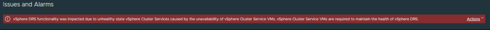

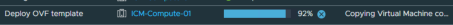

133 

## **Task 5: Power On VMs and Review vSphere DRS Recommendations** 

You can run vSphere DRS in either manual, partially automated, or fully automated modes. In manual mode, you review the recommendations for optimal VM placement provided by vSphere DRS when you power on a VM. 

1. Power on Linux-02, Linux-04 and Linux-06 and choose vSphere DRS recommendations to place each VM on sa-esxi-01.vclass.local. 

   - a. In the navigation pane, right-click **Linux-02** and select **Power** > **Power On** . 

The Power On Recommendations window opens. vSphere DRS provides you with one or more recommendations for placing the VM when it is powered on. 

   - b. Select the recommendation that places Linux-02 on sa-esxi-01.vclass.local and click **OK** . 

   - c. Repeat steps a and b for Linux-04 and Linux-06, making sure to place the VMs on saesxi-01.vclass.local. 

2. Verify that Linux-02, Linux-04 and Linux-06 are on sa-esxi-01.vclass.local. 

   - a. In the navigation pane, select **sa-esxi-01.vclass.local** . 

   - b. In the right pane, click the **VMs** tab and verify that Linux-02, Linux-04 and Linux-06 are listed and powered on. 

Notice that a vSphere Cluster Service VM (vCLS) is also listed and powered on. The vSphere Cluster Services manager automatically deploys this VM when vSphere DRS is activated. 

3. Select **ICM-Compute-01** in the navigation pane and click the **Summary** tab. 

4. View the vSphere DRS pane and view the VM DRS Scores. 

You might have to click the **Refresh** icon at the top of the window to see updated scores. 

- Q1. What do the VM DRS scores tell you? 

134 

## **Task 6: Review vSphere DRS Recommendations When the Cluster Is Imbalanced** 

You use the cpubusy script to create a load imbalance in the cluster and observe how vSphere DRS works. vSphere DRS provides recommendations for VM placement to ensure that the VMs have the resources that they require. 

1. Open the web consoles for Linux-02 and Linux-04. 

   - a. In the virtual machine's **Summary** tab, click **LAUNCH WEB CONSOLE** . 

2. Start the `cpubusy.pl` script on Linux-02 and Linux-04. 

   - a. From the list of icons on the left, click the **Terminal** icon to open the Linux command prompt. 

   - b. Enter **`cd Desktop`** to go to the `Desktop` folder. 

   - c. Enter **`./cpubusy.pl`** to start the `cpubusy` script. 

This script runs continuously. The script repeatedly performs floating-point computations. The script displays the duration (wall-clock time) of a computation, for example, `I did three million sines in 1 seconds!` 

- d. Repeat step a through c for Linux-04. 

Let the scripts run for a couple of minutes. 

3. View vSphere DRS scores for the VMs. 

   - a. Return to the vSphere Client. 

   - b. In the navigation pane, select **ICM-Compute-01** . 

   - c. In the **Summary** tab, view the VM DRS Score information in the vSphere DRS pane. 

   - d. Click the **Monitor** tab and under **vSphere DRS** , select **VM DRS Score** . 

      - Q1. What do the scores tell you? 

4. View vSphere DRS recommendations. 

   - a. In the **Monitor** tab under **vSphere DRS** , select **Recommendations** . 

   - b. Click **RUN DRS NOW** . 

   - c. Review the recommendations and their reasons. 

135 

5. Apply all the recommendations. 

   - a. Click **SELECT ALL** . 

   - b. Click **APPLY RECOMMENDATIONS** . 

6. Monitor the Recent Tasks pane and wait for the migration tasks to complete. 

7. Return to the cluster's **Summary** tab and observe any changes to the DRS scores. You might have to wait a couple minutes for score changes to occur. 

      - Q2. Did the vSphere DRS scores improve? 

8. Stop the cpubusy scripts in the Linux-02 and Linux-04 consoles. 

   - a. Close the terminal window in each VM console to stop the cpubusy script. 

9. Close the Linux-02 and Linux-04 consoles. 

10. Return to the vSphere Client and shut down the Linux-02, Linux-04 and Linux-06 VMs. 

136 

## **Lab 25 Configuring vSphere HA** 

## **Objective and Tasks** 

Configure vSphere HA and test its functionality: 

1. Configure vSphere HA in a Cluster 

2. View Information About the vSphere HA Cluster 

3. Configure Network Management Redundancy 

4. Test the vSphere HA Functionality 

5. View the vSphere HA Cluster Resource Usage 

6. Configure the Percentage of Resource Degradation to Tolerate 

137 

## **Task 1: Configure vSphere HA in a Cluster** 

You configure vSphere HA on the ICM-Compute-01 cluster to achieve higher levels of virtual machine availability than each ESXi host can provide individually. 

1. Using the vSphere Client, log in to sa-vcsa-01.vclass.local by entering **`administrator@vsphere.local`** for the user name and **`VMware1!`** for the password. 

2. From the main menu, select **Inventory** and click the **Hosts and Clusters** icon. 

3. Power on the Linux-02 and Linux-04 VMs. 

vSphere DRS presents you with VM placement recommendations. 

   - a. Choose the first recommendation and click **OK** . 

4. Select **ICM-Compute-01** and click the **Configure** tab in the right pane. 

5. Under **Services** , select **vSphere Availability** and click the first **EDIT** button to the right of vSphere HA. 

The Edit Cluster Settings dialog box opens. 

6. Click the **vSphere HA** toggle button to on and click **OK** . 

7. Monitor the Recent Tasks pane and wait for the vSphere HA configuration tasks to complete. 

This might take a couple minutes. 

8. View the **Configure** tab and verify that vSphere HA is turned on. 

## This task can take some time 

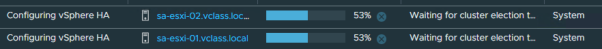

138 

## **Task 2: View Information About the vSphere HA Cluster** 

You view status and configuration information about the ICM-Compute-01 cluster. You notice that the ESXi hosts in the cluster have only one management VMkernel adapter. 

1. In the right pane, click the **Monitor** tab. 

2. Under **vSphere HA** , select **Summary** . 

The vSphere HA summary information appears. 

3. Record the name of the primary host. __________ 

   - a. If a primary host is not listed, click the **Refresh** icon at the top of the window. 

vSphere HA might still be in the initialization process. 

4. Record the number of Protected virtual machines. __________ 

5. Click the **VMs** tab in the right pane. 

   - Q1. Does the number of protected virtual machines match the number of poweredon virtual machines in the cluster? 

If both hosts are added to the cluster and no errors occur on the cluster, the number of protected VMs equals the number of powered-on VMs. The number of protected VMs includes the vSphere Cluster Service VMs. 

6. Click the **Monitor** tab. 

7. Under **vSphere HA** , select **Heartbeat** . 

   - Q2. How many datastores are used to monitor heartbeat? 

8. Under **vSphere HA** , select **Configuration Issues** and review errors or warnings that are displayed. 

You should see a warning message that sa-esxi-02.vclass.local has no management network redundancy. Currently, sa-esxi-02.vclass.local has a single management VMkernel adapter. Also, the Management network has only one physical adapter, vmnic0. vSphere HA still works with only one VMkernel adapter or one physical adapter in the Management network. But a second management VMkernel adapter, or physical adapter, is necessary for management network redundancy. 

Configuring management network redundancy is also a best practice. 

Q3. Why is there no warning message for sa-esxi-01.vclass.local? 

139 

## **Task 3: Configure Network Management Redundancy** 

You configure network management redundancy by adding a second physical adapter (vmnic) to the Management Network port group. Adding a second vmnic creates redundancy and removes the single point of failure. 

1. In the navigation pane, select **sa-esxi-02.vclass.local** . 

2. In the right pane, click the **Configure** tab and under **Networking** , select **Virtual switches** . 

3. Collapse **dvs-Lab** and expand **vSwitch0** . 

4. To the right of vSwitch0, click **MANAGE PHYSICAL ADAPTERS** . 

5. Select **vmnic4** and move it down until it appears under Standby adapters. 

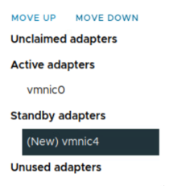

6. Click **OK** 

7. Verify that vSwitch0 has two physical adapters, vmnic0 and vmnic4. 

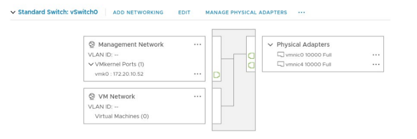

8. In the navigation pane, right-click **sa-esxi-02.vclass.local** and select **Reconfigure for vSphere HA** . 

Wait for the reconfiguration task to complete. 

140 

9. Verify that no configuration issues are listed for vSphere HA. 

   - a. In the navigation pane, select **ICM-Compute-01** . 

   - b. In the **Monitor** tab, select **Configuration Issues** under **vSphere HA** . 

   - c. Click the **Refresh** icon at the top of the window. 

   - d. Verify that the management network redundancy warning for sa-esxi-02.vclass.local goes away. 

141 

## **Task 4: Test the vSphere HA Functionality** 

You set up vSphere HA to monitor the cluster environment and detect hardware failures. 

When an ESXi host outage is detected, vSphere HA automatically restarts the virtual machines on the other ESXi hosts in the cluster. 

1. In the navigation pane, select **ICM-Compute-01** and click the **Monitor** tab. 

2. Under **vSphere HA** , select **Summary** and record the name of the primary host. 

   - **__________** 

3. Verify that the primary host contains one or more powered-on virtual machines. 

   - a. Select the primary host in the navigation pane. 

   - b. In the right pane, click the **VMs** tab and verify that **Virtual Machines** is selected. 

   - c. If all the virtual machines are powered off on the primary host, power on at least one of the virtual machines. 

4. Record the name of one or more powered-on virtual machines on the primary host. 

   - __________ 

5. Simulate a host failure by rebooting the primary host in the cluster. 

## IMPORTANT 

Ensure that you reboot the system. Do not shut down the system. 

- a. In the navigation pane, right-click the primary ESXi host and select **Power** > **Reboot** . 

A warning message appears stating that you chose to reboot the host, which is not in maintenance mode. 

   - b. Enter **`Testing vSphere HA`** as the reason for rebooting and click **OK** . 

6. View the events that occur while the vSphere HA cluster recovers from the host failure. 

   - a. Select **ICM-Compute-01** in the navigation pane and click the **Monitor** tab in the right pane. 

   - b. Under **Tasks and Events** , select **Events** . 

The cluster entries are sorted by time. Note the entries that appear when the host failure was detected. 

- c. In the navigation pane, select the host that you rebooted and click the **VMs** tab in the right pane. 

Q1. Do you see the virtual machines that were running on this host (the original primary host) and whose names you recorded earlier? 

142 

   - d. In the navigation pane, select **ICM-Compute-01** . 

   - e. In the right pane, click the **Monitor** tab. 

   - f. In the right pane under **vSphere HA** , select **Summary** . Q2. Has the primary host changed? 

7. Monitor the original primary ESXi host in the navigation pane until it is fully running again. It takes a few minutes for the original primary host to become fully running. 

143 

## **Task 5: View the vSphere HA Cluster Resource Usage** 

You examine the CPU and memory resource usage information of the ICM-Compute-01 cluster. 

1. In the navigation pane, select **ICM-Compute-01** and click the **Monitor** tab in the right pane. 

2. Examine CPU reservation information for the cluster. 

   - a. In the right pane under **Resource Allocation** , select **CPU** . 

   - b. Record information for the cluster. 

      - Used Reservation by other __________ 

      - Available Reservation __________ 

      - Total Reservation Capacity __________ 

   - c. Verify that the CPU reservation is not set on the virtual machines. 

The Reservation column shows 0 (MHz). 

3. Examine memory reservation information for the cluster. 

   - a. Under **Resource Allocation** , select **Memory** and record the information for the cluster. 

      - Used Reservation by other __________ 

      - Available Reservation __________ 

      - Total Reservation Capacity __________ 

   - b. Verify that the memory reservation is not set on the virtual machines. The Reservation column shows 0 (MB). 

144 

## **Task 6: Configure the Percentage of Resource Degradation to Tolerate** 

In your vSphere HA cluster, you specify the percentage of resource degradation to tolerate and you verify that a message appears when the reduction threshold is met. 

vSphere DRS must be activated to use this admission control option. 

1. Verify that vSphere DRS is activated on ICM-Compute-01. 

   - a. In the right pane, select the **Configure** tab. 

   - b. vSphere DRS should be turned on. The automation level is set to Manual. 

2. For vSphere HA, configure the percentage of resource degradation to tolerate. 

   - a. In the right pane under **Services** , select **vSphere Availability** . 

   - b. Click the first **EDIT** button, next to vSphere HA. 

The Edit Cluster Settings window appears. 

- c. Click the **Admission Control** tab. 

- d. In the **Performance degradation VMs tolerate** text box, enter **`0`** . 

If you reduce the threshold to 0%, a warning is generated when cluster usage exceeds the available cluster capacity. 

   - e. Click **OK** . 

3. Generate CPU activity by starting the cpubusy script on some VMs and powering on other VMs. 

   - a. In the navigation pane, select **Linux-04** and in the right pane, click the **Summary** tab. 

   - b. Click **LAUNCH WEB CONSOLE** to open the VM console. 

   - c. From the list of icons on the left, click the **Terminal** icon to open the Linux command prompt. 

   - d. Enter **`cd Desktop`** to go to the `Desktop` folder. 

   - e. Enter **`./cpubusy.pl`** to start the `cpubusy` script. 

Let the script run for a couple of minutes. 

- f. Repeat step a through e for Linux-02. 

- g. Power on the Linux-11 and Linux-12 VMs, making sure that you place them on the same host as Linux-02 and Linux-04. 

145 

4. Verify that a message appears about the configured failover resources in the ICM-Compute01 cluster. 

   - a. In the navigation pane, select **ICM-Compute-01** and click the **Summary** tab in the right pane. 

      - You should see an informational message that says `Running VMs utilization cannot satisfy the configured failover resources on the cluster ICM-Compute-01 in ICM-Datacenter` . 

You might have to wait a few minutes for the message to appear. 

5. Close the Linux-02 and Linux-04 consoles. 

6. Shut down any VMs that you powered on. 

7. In the vSphere Client, click the **Refresh** icon at the top of the window. 

8. Verify that the message about the configured failover resources no longer appears in the cluster's **Summary** tab. 

146 

## **Lab 26 Using vSphere Lifecycle Manager** 

## **Objective and Tasks** 

Update ESXi hosts using vSphere Lifecycle Manager: 

1. Create a Cluster and Select an Image 

2. Add ESXi Hosts to the Cluster 

3. Check for Host Compliance 

4. Remediate Noncompliant Hosts 

147 

## **Task 1: Create a Cluster and Select an Image** 

You create a vSphere cluster, and you enable vSphere Lifecycle Manager to manage the hosts in the cluster with an image. 

1. From the main menu, select **Inventory** and click the **Hosts and Clusters** icon. 

2. In the navigation pane, right-click **ICM-Datacenter** and select **New Cluster** . The New Cluster wizard appears. 

3. On the Basics page, enter information about the cluster. 

   - a. Enter **`ICM-Compute-02`** in the **Name** text box. 

   - b. Keep the vSphere DRS, vSphere HA, and vSAN services turned off. 

   - c. Leave the **Manage all hosts in the cluster with a single image** check box selected. 

   - d. Click **NEXT** . 8.0 U1c - 22088125 

4. On the Image page, select ~~**8.0 GA - 20513097** .~~ from the **ESXi Version** drop-down menu and click **NEXT** . 

5. On the Review page, review the information and click **FINISH** . 

6. In the Recent Tasks pane, monitor the progress as the cluster is created. 

7. Verify that ICM-Compute-02 appears in the navigation pane. 

In the right pane, the Cluster Quickstart pane appears. 

8. Verify that **Lifecycle Management (Manage all hosts with one image)** is the only selected service in the Cluster basics pane. 

148 

## **Task 2: Add ESXi Hosts to the Cluster** 

You remove sa-esxi-01.vclass.local and sa-esxi-02.vclass.local from the ICM-Compute-01 cluster and add them to the ICM-Compute-02 cluster. 

You also add a third ESXi host, sa-esxi-03.vclass.local, to the cluster. This host uses vSphere version 7.0. 

1. Verify that all VMs are shut down on sa-esxi-01.vclass.local and sa-esxi-02.vclass.local. 

## IMPORTANT 

Do not shut down the vCLS VMs. Shut down all the VMs you used in the labs. 

You must shut down your VMs on sa-esxi-01.vclass.local and sa-esxi-02.vclass.local because you place these hosts in maintenance mode. 

2. Record the ESXi build number for sa-esxi-01.vclass.local and sa-esxi-02.vclass.local. 

   - a. Select the ESXi host and click the **Summary** tab. 

   - b. In the Host Details pane, view the Hypervisor information and record the ESXi build number for sa-esxi-01.vclass.local and sa-esxi-02.vclass.local. __________ 

The build number must be the same for both the hosts. 

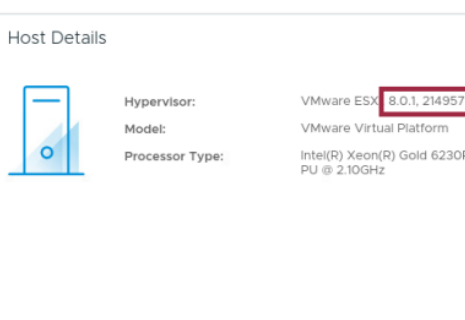

149 

3. Place sa-esxi-01.vclass.local in maintenance mode. 

   - a. In the navigation pane, right-click **sa-esxi-01.vclass.local** and select **Maintenance Mode** > **Enter Maintenance Mode** . 

   - b. Deselect the **Move powered-off and suspended virtual machines to other hosts in the cluster** check box and click **OK** . 

A warning message might appear stating that one or more powered on VMs are on saesxi-01.vclass.local. The vCLS VMs are powered on, but do not shut down these VMs. The vSphere Cluster Services manager shuts down these VMs for you. 

   - c. Click **OK** to confirm placing the host in maintenance mode. 

   - d. Verify that sa-esxi-01.vclass.local is in maintenance mode. 

4. Place sa-esxi-02.vclass.local in maintenance mode. 

   - a. In the navigation pane, right-click **sa-esxi-02.vclass.local** and select **Maintenance Mode** > **Enter Maintenance Mode** . 

   - b. Deselect the **Move powered-off and suspended virtual machines to other hosts in the cluster** check box and click **OK** . 

A warning message might appear stating that one or more powered on VMs are on saesxi-02.vclass.local. The vCLS VMs are powered on, but do not shut down these VMs. The vSphere Cluster Services manager shuts down these VMs for you. 

- c. Click **OK** . 

- d. In the navigation pane, select **sa-esxi-02.vclass.local** and click the **VMs** tab in the right pane. 

The vSphere Cluster Service VMs are running on this host. 

The Recent Tasks pane shows that the Enter maintenance mode task has started. Other tasks will power off the vSphere Cluster Service VMs. After these VMs are powered off, the Enter maintenance mode task is complete. 

The entire process takes a couple minutes. 

   - e. Verify that sa-esxi-02.vclass.local is in maintenance mode. 

5. In the navigation pane, drag **sa-esxi-01.vclass.local** and **sa-esxi-02.vclass.local** to the ICMCompute-02 cluster. 

6. Verify that sa-esxi-01.vclass.local and sa-esxi-02.vclass.local are in the ICM-Compute-02 cluster. 

These hosts are still in maintenance mode. 

150 

7. Take sa-esxi-01.vclass.local and sa-esxi-02.vclass.local out of maintenance mode. 

   - a. In the navigation pane, right-click **sa-esxi-01.vclass.local** and select **Maintenance Mode** > **Exit Maintenance Mode** . 

   - b. Right-click **sa-esxi-02.vclass.local** and select **Maintenance Mode** > **Exit Maintenance Mode** . 

8. Power on the Linux-02 and Linux-04 VMs. You power on these VMs to demonstrate that vSphere Lifecycle Manager can update the ESXi hosts when the VMs are powered on. 

9. Add the sa-esxi-03.vclass.local host to the ICM-Compute-02 cluster. 

   - a. In the navigation pane, right-click **ICM-Compute-02** and select **Add Hosts** . 

The Add hosts wizard appears. 

   - b. In the **New hosts (0)** tab, enter **sa-esxi-03.vclass.local** in the **IP address or FQDN** text box. 

   - c. Enter **`root`** in the **Username** text box and **`VMware1!`** in the **Password** text box. 

   - d. Click **NEXT** . 

   - e. On the Host Summary page, click **NEXT** . 

   - f. On the Import Image page, keep the default and click **NEXT** . 

   - g. On the Review page, click **FINISH** . 

10. Verify that sa-esxi-03.vclass.local is added to the ICM-Compute-02 cluster. This host is in maintenance mode. 

11. Right-click **sa-esxi-03.vclass.local** and select **Maintenance Mode** > **Exit Maintenance Mode** . 

12. Select **sa-esxi-03.vclass.local** and view its **Summary** tab. 

13. In the Host Details pane, view the Hypervisor information and record the ESXi build number for sa-esxi-03.vclass.local. __________ 

The host is installed with vSphere 7.0.3. 

151 

## **Task 3: Check for Host Compliance** 

You check the hosts for compliance and determine why they are out of compliance. 

1. In the navigation pane, select **ICM-Compute-02** and click the **Updates** tab in the right pane. 

2. In the Image Compliance pane, click **CHECK COMPLIANCE** . 

3. Monitor the Recent Tasks pane and wait for the task to complete. 

4. View the Image Compliance pane and read any warning and information messages. All the hosts are out of compliance. 

5. In the Image Compliance pane, click each ESXi host and determine why the host is out of compliance. 

sa-esxi-01.vclass.local and sa-esxi-02.vclass.local have the vmware-fdm VMware Installation Bundle, which is missing from the image. You can ignore the warning because the vmwarefdm VIB is the vSphere HA agent that is installed on the host when you turn on vSphere HA. 

sa-esxi-03.vclass.local is out of compliance because the host version differs from the image version. sa-esxi-03.vclass.local uses version 7.0 U3g and the image version is 8.0 GA. 

152 

## **Task 4: Remediate Noncompliant Hosts** 

You remediate the noncompliant hosts to bring them to compliance with the defined cluster image. 

1. In the Image Compliance pane, click **RUN PRE-CHECK** to ensure that the ICM-Compute-02 cluster is ready to remediate. 

2. Monitor the Recent Tasks pane and wait for the tasks to complete. 

3. Verify that `No pre-check issues found` appears in the Image Compliance pane. 

4. In the Image Compliance pane, click **REMEDIATE ALL** to remediate the hosts in the cluster. The Review Remediation Impact window appears. 

5. Select the different titles in the left pane to view information. 

The **I accept the terms of the end user license agreement** check box at the bottom of the window is selected for you. 

6. Click **START REMEDIATION** . 

7. Monitor the Recent Tasks pane to view the status of the individual tasks that are started during the remediation. 

8. Monitor the remediation from the Image Compliance pane. 

The host is rebooted as part of the remediation. When the host comes back online, a second compliance check automatically runs. 

The remediation process takes about 10 to 15 minutes to complete. 

9. When the remediation is complete, verify that the Image Compliance pane shows that all hosts in the cluster are compliant. 

## All these warnings can be ignored 

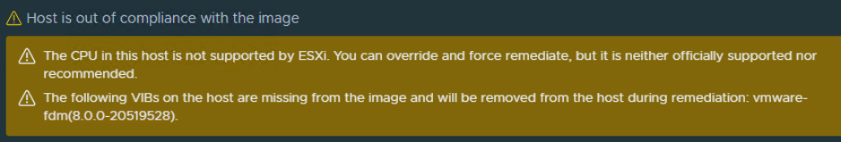

153 

154 

## Answer Key 

## Lab 1 Accessing the Lab Environment 

- Q1. How many CPUs and how much memory does this ESXi host have? 

- A1. This ESXi host has 2 CPUs and 16 GB of memory. 

- Q2. Is the NTP service running on this ESXi host? 

- A2. No, the NTP Daemon is stopped. 

- Q3. How many virtual machines are on this host? 

- A3. Six. 

- Q4. What are the guest operating system types for the virtual machines on this host? 

- A4. Ubuntu Linux (64-bit) and VMware Photon OS (64-bit). 

- Q1. Do you see the host (sa-esxi-01.vclass.local) that you logged in the previous task? 

- A1. No. The sa-esxi-01.vclass.local ESXi host that you connected using VMware Host Client is not yet added to the vCenter inventory. 

## Lab 4 Creating and Managing the vCenter Inventory 

- Q1. How many logical processors (CPUs) does the ESXi host have? 

- A1. Two CPUs. 

- Q2. How much memory is installed on the ESXi host? 

- A2. 16 GB. 

- Q3. How many networks is this ESXi host connected to? 

- A3. One network. 

## Lab 7 Creating Standard Switches 

- Q1. Which physical adapters are connected to vSwitch0? 

- A1. vmnic0, vmnic4, vmnic5, and vmnic6 

- Q2. Which port groups are connected to vSwitch0? 

- A2. IP Storage 1, IP Storage 2, Management Network, and VM Network 

- Q3. Which virtual machines and templates are connected to the VM Network port group? 

155 

- A3. Photon-Base, Photon-HW, Linux-Template, Linux-02, Linux-04, and Linux-06. 

## Lab 9 Accessing iSCSI Storage 

- Q1. How many port groups are listed and what are their names? 

- A1. Two port groups, IP Storage 1 and IP Storage 2 

## Lab 12 Creating and Removing a Virtual Machine 

- Q1. In the VM Hardware pane, on which datastore is the VM located? 

- A1. The VM's hard disk and its configuration files are located on iSCSI-Datastore. 

- Q2. In the Related Objects pane, why are two datastores listed under Storage? 

- A2. ICM-Datastore holds the ISO image that the VM has mounted. iSCSI-Datastore holds the VM's virtual disk and configuration files. 

## Lab 14 Adding Virtual Hardware 

- Q1. What size is the VM's hard disk 1? 

- A1. 5 GB. 

- Q2. Is Hard disk 1 a thin-provisioned or thick-provisioned disk? 

- A2. Thin-provisioned disk. 

- Q3. How much storage space is used by this VM? 

- A3. A little over 2 GB. 

- Q4. Is VMware Tools installed and running? 

- A4. Yes. It takes approximately two minutes to report that VMware Tools is running. 

- Q1. What is the name of the 1 GB, thin-provisioned disk file? 

- A1. Photon-HW_1.vmdk 

- Q2. What is the name of the 1 GB, thick-provision, eager-zeroed disk file? 

- A2. Photon-HW_2.vmdk 

- Q3. On what datastore are the hard disks located? 

- A3. ICM-Datastore 

- Q4. What is the size of Photon-HW_1.vmdk? 

- A4. 0 Bytes 

- Q5. What is the size of Photon-HW_2.vmdk? 

- A5. 1,048,576 KB (1 GB) 

156 

## Lab 15 Modifying Virtual Machines 

- Q1. In the list of folders, do you see Linux-06 or Linux-New? 

- A1. Linux-06. 

- A1. When you change the name of a virtual machine, the names of the folder and files on the datastore are not updated. 

## Lab 17 Using Local Content Libraries 

- Q1. Why does Linux-OVF-LibTemplate appear under **OVF & OVA Templates** and not under **VM Templates** ? 

- A1. Because you cloned a VM template instead of cloning a VM. When you clone a VM template to a template in the content library, the library template is an OVF template. 

- Q2. Why is Photon-LibTemplate in the vCenter inventory, but Linux-OVF-LibTemplate is not? 

- A2. Photon-LibTemplate is a VM Template. VM templates appear in the vCenter inventory, whereas OVF templates do not. 

## Lab 19 Versioning VM Templates in Content Libraries 

- Q1. Which content library manages this template? 

- A1. SA-Local-Library 

## Lab 22 Working with Snapshots 

- Q1. Which snapshots include the VM's memory? 

- A1. The With cpubusy snapshot includes the VM's memory, indicated by the snapshot icon. 

- Q2. Where is the You are here pointer located? 

- A2. The You are here pointer is under the snapshot called With cpubusy. 

- Q3. Where is the You are here pointer located now? 

- A3. The You are here pointer is under the snapshot called Without cpubusy and gnome. 

- Q4. Did the Linux-02 virtual machine power off and why? 

- A4. Yes. The virtual machine powered off because the memory state was not preserved. 

- Q5. Is either cpubusy.pl or gnome-system-monitor on the desktop? 

- A5. No. These files were deleted before creating the snapshot called Without cpubusy and gnome. 

- Q6. Did the virtual machine power off? Why or why not? 

- A6. No. The virtual machine did not power off because the memory state was preserved. 

- Q7. Is cpubusy.pl on the desktop? 

- A7. Yes. 

157 

- Q8. Is gnome-system-monitor on the desktop? 

- A8. No. 

- Q1. Did the virtual machine power off? 

- A1. No. 

- Q2. In the virtual machine console, is cpubusy.pl on the desktop? 

- A2. Yes. The cpubusy.pl file is still on the desktop because deleting the snapshot does not change the virtual machine's current state. Deleting the snapshot removes the ability to return to that snapshot's point in time. 

- Q1. Are all the remaining snapshots deleted from the snapshots tree? 

- A1. Yes. 

- Q2. Is cpubusy.pl on the desktop. If so, why? 

- A2. Yes. The current state of the virtual machine is not altered. Snapshots are consolidated and then removed. The option to revert to those earlier points in time is no longer available. 

## Lab 23 Controlling VM Resources 

- Q1. Why are the values similar? 

- A1. The values are similar because the CPU share allocation of Linux-02 and Linux-04 gives them equal share of the CPU on which they are both running. 

- Q1. What is the difference in performance between Linux-02 and Linux-04? 

- A1. Linux-04 has only one-fourth of the CPU shares that Linux-02 has. Linux-04 receives one-fourth of the CPU cycles of the logical CPU to which the virtual machines are pinned. 

## Lab 24 Implementing vSphere DRS Clusters 

- Q1. What do the VM DRS scores tell you? 

- A1. Answers vary depending on when you view the pane. 

- Q1. What do the scores tell you? 

- A1. Answers vary depending on the activity in the cluster. 

- Q2. Did the vSphere DRS scores improve? 

- A2. Yes. By applying the recommendations, vSphere DRS migrated one or more VMs to balance the cluster's load and satisfy each VM's resource requirements. You might not see a cluster DRS score of greater than 80%, but you should see a better score. 

158 

## Lab 25 Configuring vSphere HA 

- Q1. Does the number of protected virtual machines match the number of powered-on virtual machines in the cluster? 

- A1. Yes. 

- Q2. How many datastores are used to monitor heartbeat? 

- A2. Two datastores. Because both datastores are shared by all the hosts in the cluster, the datastores are automatically selected for heartbeating. 

- Q3. Why is there no warning message for sa-esxi-01.vclass.local? 

- A3. Because the Management Network port group on sa-esxi-01.vclass.local contains more than one physical adapter. 

- Q1. Do you see the virtual machines that were running on this host (the original primary host) and whose names you recorded earlier? 

- A1. No. You might have to refresh the screen. The virtual machines previously running on this host are running on the remaining host in the cluster. 

- Q2. Has the primary host changed? 

- A2. Yes. The secondary host is elected as the new primary host. 

159 

