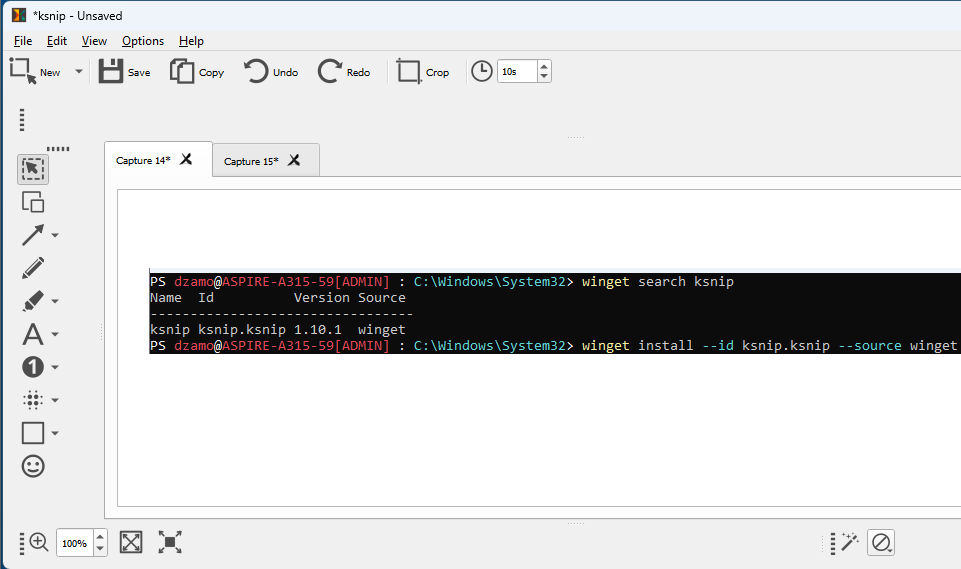
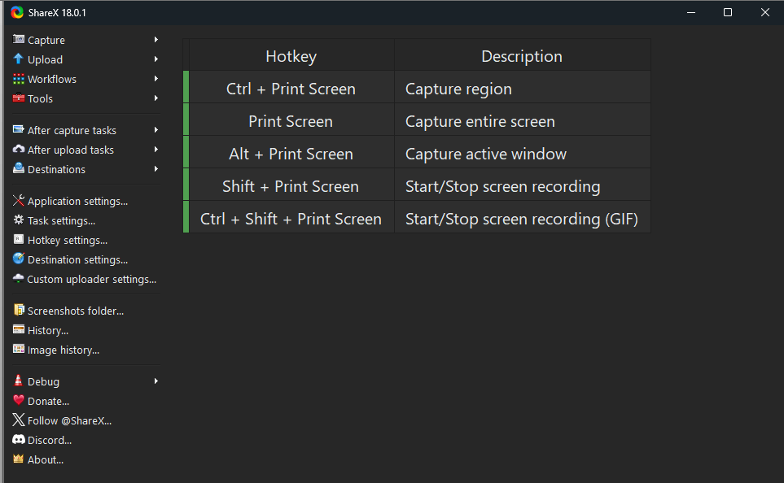

# Capturadores de pantallas en Windows 11

## Desinstalar ScreenSketch

El siguiente comando PowerShell 7 (como `Administrator`) desinstala ScreenSketch.

```powershell
# Para encontrar el nombre completo del paquete de la herramienta de recortes
Get-AppxPackage *ScreenSketch* | Select-Object Name, PackageFullName

# Para desinstalar la aplicación de captura de pantalla
Remove-AppxPackage -Package <PackageFullName>
```

**Donde:** `<PackageFullName>` es el nombre completo de la aplicación, que muestra el primer comando (por ejemplo puede ser algo como `Microsoft.ScreenSketch_1.0.0.0_x64__8wekyb3d8bbwe`).

## Ksnip

**Nota del autor:**

- Basado en librerías qt, es la similar utilidad que también esta disponible para [KDE Plasma](https://kde.org/es/plasma-desktop/).
- Me gusta porque es multiplaforma o al menos disponible en Linux, y/o Windows.
- Similar a `shutter` (aplicación mas propia de Desktop Linux, c/librerías GTK) soporta capturar secuencias de pantallasos dejandolas en multitabs

```powershell
# Buscar Ksnip
> winget search ksnip
winget search ksnip
Name  Id          Version Source
---------------------------------
ksnip ksnip.ksnip 1.10.1  winget

# Instalar
> winget install --id ksnip.ksnip --source winget
```

### Interface de ksnip



## ShareX

**Nota del autor:** Aunque entiendo es el que recomiendan por buena integración para con Windows 11, no me convence del todo.

```powershell
PS dzamo@ASPIRE-A315-59[ADMIN] : C:\Windows\System32> winget search ShareX
Name   Id            Version Source
-------------------------------------
ShareX 9NBLGGH4Z1SP  Unknown msstore
ShareX ShareX.ShareX 18.0.1  winget
PS dzamo@ASPIRE-A315-59[ADMIN] : C:\Windows\System32> winget install ShareX.ShareX --source winget
Found ShareX [ShareX.ShareX] Version 18.0.1
This application is licensed to you by its owner.
Microsoft is not responsible for, nor does it grant any licenses to, third-party packages.
Downloading https://github.com/ShareX/ShareX/releases/download/v18.0.1/ShareX-18.0.1-setup.exe
  ██████████████████████████████   101 MB /  101 MB
Successfully verified installer hash
Starting package install...
Successfully installed
```

### Interface de ShareX



## Otros aplicaciones de capturas

En la tabla siguiente se enumeran otras varias aplicaciones, también disponibles como paquetes de Winget (seguramente para con chocolatey estan también disponibles).

|Nombre `ID` (`winget`)| nota|
|:--                   | :-- |
| `Flameshot.Flameshot`| La recomendada por Jesús; me gusta esta utilidad, disponible también en Linux|
| `Skillbrains.Lightshot`| No la he usado|
| `Greenshot.Greenshot`| La tipica Greenshot de toda la vida|