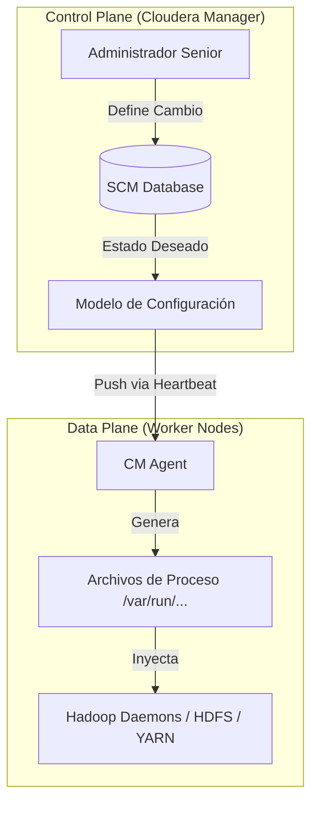

import Admonition from '@theme/Admonition';

# Gobernanza de Configuraciones y Ciclo de Vida del Cambio

En Cloudera Data Platform (CDP), la gestión de configuraciones no es una edición directa de archivos en disco. Se basa en una arquitectura de **Estados de Verdad** coordinada por Cloudera Manager (CM).

## 1. Dicotomía de Estados: Modelo vs. Runtime

La arquitectura de CM desacopla la intención del administrador de la ejecución real en el nodo.

*   **Modelo (Model):** La configuración almacenada en la base de datos de CM. Es lo que "debería ser".
*   **Ejecución (Runtime):** Los procesos reales ejecutándose en los nodos. Un desfase entre estos dos estados genera una **Configuración Caduca (Stale Configuration)**.

## 2. Taxonomía y Precedencia de Archivos

El sistema de archivos de configuración sigue una jerarquía de herencia estricta para permitir la flexibilidad sin sacrificar la estandarización.

| Nivel | Tipo de Archivo | Origen | Alcance |
| :--- | :--- | :--- | :--- |
| **Default** | `*-default.xml` | JAR del Servicio | Valores de fábrica definidos por el desarrollador. |
| **Cluster** | `*-site.xml` | Cloudera Manager | Definiciones a nivel de clúster o servicio (override). |
| **Entorno** | `*-env.sh` | Bash Script | Configuraciones de JVM, Heap Memory y variables de entorno. |
| **Logging** | `log4j.properties` | Java Properties | Control de granularidad y retención de registros. |

:::info[Regla de Precedencia]
Una configuración definida a nivel de **Job (Cliente)** tiene prioridad sobre la del **Cluster**, la cual a su vez sobresale de los **Defaults**. Esto permite tunear aplicaciones específicas sin afectar la estabilidad global.
:::

## 3. Modo de Mantenimiento (Maintenance Mode)

Protocolo crítico para operaciones programadas. Al activar el Modo de Mantenimiento en un host o servicio:
1.  Se **suprimen las alertas** y health checks para evitar falsos positivos en el monitoreo.
2.  Se evita que el planificador de YARN asigne nuevas tareas a los nodos afectados.
3.  Permite realizar cambios de software o hardware bajo una ventana de riesgo controlada.

:::danger[Riesgo de Cambio]
Cualquier cambio fuera de una **Ventana de Mantenimiento (Outage Window)** debe ser evaluado mediante una matriz de impacto (Severidad vs. Probabilidad).
:::

---

_Enlace Interno Recomendado:_ [Consulte el SOP de Inspección de Logs](./cdp-logs-taxonomy-rca.mdx) para validar errores tras un cambio de configuración.
