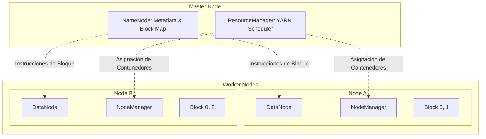

import Admonition from '@theme/Admonition';

# HDFS: Arquitectura y Principios de Diseño Enterprise

En el ecosistema Cloudera Data Platform (CDP), el **Hadoop Distributed File System (HDFS)** no es simplemente un sistema de archivos, sino una capa de persistencia distribuida diseñada para el procesamiento masivo de datos bajo el paradigma de "Data Locality".

## 1. Mantras y Filosofía de Diseño

La arquitectura de HDFS se basa en premisas de ingeniería que priorizan la disponibilidad y el rendimiento secuencial sobre la latencia de acceso aleatorio.

:::info[Principios de Ingeniería (Mantra)]
*   **Smart Software, Utility Hardware:** La inteligencia reside en la capa de software, permitiendo el despliegue sobre hardware comercial (*commodity*).
*   **Data Locality:** Es más eficiente mover el código (procesamiento) hacia los datos que viceversa.
*   **Write-Once, Read-Many:** Optimizado para flujos de trabajo de análisis de datos persistentes.
:::

## 2. Topología HDFS y Orquestación YARN

La integración de HDFS con YARN es fundamental para la supercomputación distribuida. Mientras HDFS gestiona la **Localidad de Datos**, YARN gestiona la **Localidad de Cómputo**.

## 3. Mecánica de Bloques y Replicación

HDFS fragmenta los archivos en bloques de datos (Default: **128MB**).

1.  **Inmutabilidad:** Los bloques son inmutables para garantizar la integridad del checksum.
2.  **Validación Forense:** Cada bloque se valida mediante sumas de comprobación (*checksums*) durante la lectura para detectar corrupciones de disco de forma proactiva.
3.  **Tolerancia a Fallos:** El factor de replicación (default 3) asegura que el sistema pueda perder nodos enteros sin interrupción del servicio.

## 4. Riesgos Arquitectónicos: Small File Syndrome

Como administradores, el mayor riesgo para la estabilidad del NameNode es la proliferación de archivos pequeños.

:::danger Impacto en el Heap Space
El NameNode es un proceso **In-Memory**. Cada objeto (archivo, directorio o bloque) ocupa ~150 bytes en la memoria RAM del NameNode.
*   **Síndrome:** Millones de archivos de 1MB saturan el Heap Space mucho antes de agotar el almacenamiento físico.
*   **Consecuencia:** Degradación severa en las búsquedas (NN Lookups) y fallos críticos en la gestión de recursos de YARN.
:::

---
_Referencia Técnica: CDP ADMIN-230 - Module 21-01_
