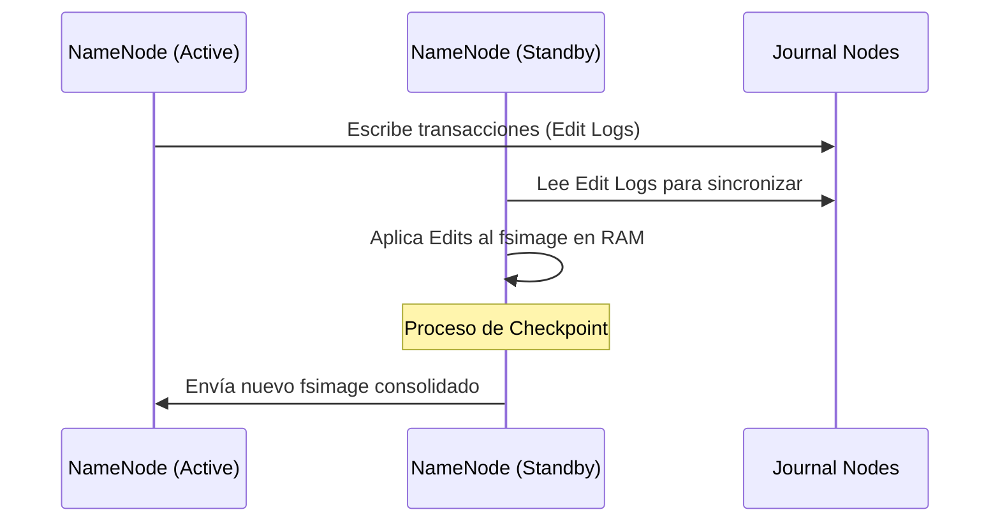
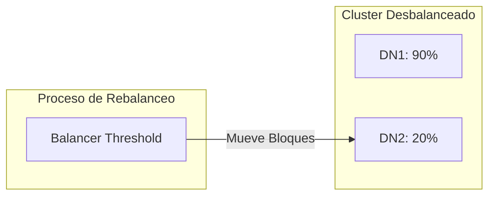

# HDFS: Arquitectura de Defensa y Consistencia

La estabilidad de un cluster CDP no depende solo del hardware, sino de la implementación de límites lógicos y procesos de mantenimiento de metadatos. Como administradores, nuestra función es actuar como la **primera línea de defensa** de la integridad de los datos.

## 1. El Ciclo de Vida de los Metadatos: Checkpointing

El NameNode gestiona la persistencia de la estructura del sistema de archivos mediante dos artefactos críticos: el **fsimage** (estado consolidado) y los **Edit Logs** (transacciones recientes).

:::caution[Importancia del RollEdits]
Si los Edit Logs crecen indefinidamente sin consolidarse en un `fsimage`, el tiempo de arranque del NameNode tras un fallo será prohibitivo. En CDP, el **Reports Manager** automatiza este proceso cada hora (por defecto).
:::

## 2. Estrategias de Cuotas de Almacenamiento

Existen dos vectores de restricción de recursos para prevenir que un usuario o aplicación sature el cluster:

| Tipo de Cuota | Descripción Técnica | Fallo Típico |
| :--- | :--- | :--- |
| **Name Quota** | Límite de número de archivos y directorios. | `NSQuotaExceededException` |
| **Space Quota** | Límite de bytes físicos consumidos (considerando réplicas). | `DSQuotaExceededException` |

:::danger[Regla de Cálculo de Espacio]
Si un archivo de 1GB tiene un factor de replicación de 3, la **Space Quota** debe permitir al menos 3GB de consumo. No monitorizar esto causa fallos en pipelines de ingesta.
:::

## 3. Dinámica de Rebalanceo del Cluster

El **HDFS Balancer** es la herramienta encargada de redistribuir los bloques cuando existe una desviación en el uso de disco entre DataNodes.

*   **Threshold:** Se define como la diferencia porcentual máxima permitida entre el nodo más lleno y el promedio del cluster (Default: 10%).
*   **Waterlines:** Un uso superior al 80% requiere acción inmediata; al 90%, el sistema corre riesgo inminente de stop por falta de espacio para bloques temporales.

---
_Referencia: CDP ADMIN-230 - Módulos 22-01 y 22-05_
