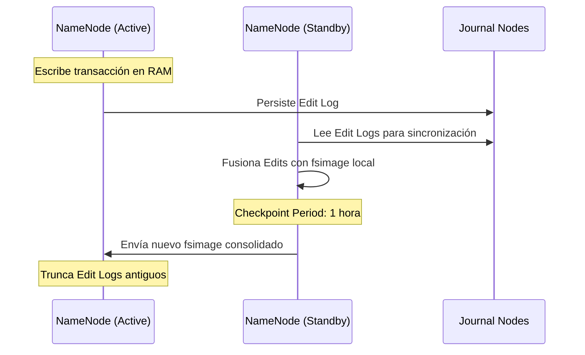

# Gobernanza de Almacenamiento y Resiliencia de Metadatos

En infraestructuras CDP de misión crítica, la gestión de HDFS trasciende el simple almacenamiento de archivos. Requiere una estrategia proactiva para mantener la integridad de los metadatos y la distribución equilibrada de los bloques de datos.

## 1. Ciclo de Vida de Metadatos: El Checkpoint de fsimage

El NameNode mantiene el estado del sistema de archivos en memoria. Para garantizar la persistencia y la recuperación rápida, HDFS utiliza un proceso de consolidación entre el **fsimage** (snapshot estático) y los **Edit Logs** (transacciones en tiempo real). El NameNode coordina la persistencia mediante la fusión del **fsimage** y los **Edit Logs**. En CDP, el **Reports Manager** monitoriza este proceso.

:::info Impacto Administrativo
Un NameNode con Edit Logs masivos no consolidados resultará en tiempos de arranque (*Startup*) prohibitivos, afectando los acuerdos de nivel de servicio (SLA).
:::

:::warning Alerta de Operación
Si el proceso de consolidación falla, Cloudera Manager reportará un estado de **Concerning** o **Bad** en el health check: *"The aging of the last checkpoint is... hours"*.
:::

## 2. Umbrales de Capacidad y Alertas Críticas

Como administradores, operamos bajo el concepto de **Capacity "Ungood"** para prevenir paradas del clúster por saturación de disco. La Web UI de Cloudera Manager utiliza un código de colores y estados estandarizados:

| CM Health Status (Estado de Salud) | Acción Requerida | Capacidad Usada | Nota |
| :--- | :--- | :--- | :--- |
| 🟢 **Good** (saludable) | Monitoreo estándar | < 60% | Saludable |
| 🟡 **Concerning** (Advertencia) | **Action Required:** Limpieza o expansión | 70% - 80% | Advertencia |
| 🔴 **Bad** (Crítico)| **Urgent Action:** Eliminación de datos | > 80% | Crítico |
| 🛑 **Critical** (Fallo Inminente) | **Crisis Action:** El sistema puede entrar en modo Read-only | > 90% | Fallo Inminente |

:::danger Relación 1:4
Recuerde que en producción, **1 TB de datos netos requiere 4 TB de almacenamiento bruto** (Replicación x3 + 25% overhead para logs y archivos temporales de YARN).
:::

## 3. Estrategias de Rebalanceo (HDFS Balancer)

El balanceo de datos no es automático tras añadir nuevos DataNodes. El administrador debe orquestar el proceso para evitar puntos calientes (*Hotspots*) de E/S. Cuando la distribución de bloques es asimétrica, CM marcará los DataNodes con una alerta de **Unbalanced Cluster**.

*   **Rebalance Waterline:** El Balancer mueve bloques desde nodos que exceden el promedio del clúster hacia nodos con menor ocupación.
*   **Threshold (Umbral):** Por defecto es **10%**. Significa que ningún nodo debe estar un 10% más lleno que el promedio global.

{/*
*   **Balancer Threshold:** Diferencia porcentual máxima permitida (Default: 10%).
*   **Rebalance Operation:** Se ejecuta desde **HDFS > Actions > Rebalance**.
*/}

---
_Enlace Interno:_ [Consulte la Arquitectura Core de HDFS](./hdfs-architecture-principles.mdx) para entender la fragmentación de bloques.