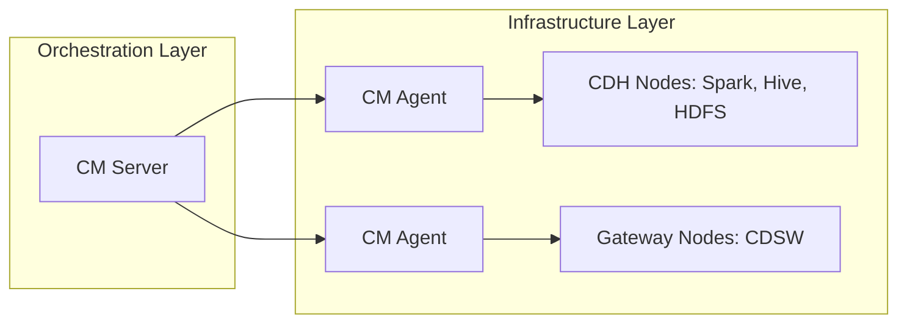

import Tabs from '@theme/Tabs';
import TabItem from '@theme/TabItem';

# Administrando Cloudera Data Platform

El curso **ADMIN-230** define a **Cloudera Data Platform (CDP)** como un conjunto de productos integrados "Edge to AI". En este ecosistema, **Cloudera Manager (CM)** actúa como la herramienta DevOps autoritativa para el despliegue, gestión y escalabilidad de infraestructuras críticas.

:::info Visión General
Esta nota actúa como el marco de referencia (Syllabus Técnico) para la administración de clústeres empresariales, cubriendo desde los principios de diseño hasta la automatización vía REST API.
:::

## 1. Arquitectura Tecnológica de Cloudera

La plataforma se basa en una arquitectura **Servidor-Agente**, donde el Cloudera Manager Server orquesta la configuración y los Agentes ejecutan los procesos en cada nodo del clúster.

## 2. Pilares del Aprendizaje Técnico

Basado en los objetivos del curso, la administración de CDP se divide en tres dominios principales:

<Tabs>
  <TabItem value="deploy" label="Despliegue e Instancia" default>
    - **Principios de Diseño:** Entender la arquitectura y herramientas base.
    - **Repositorios:** Creación de repositorios "Air Gap" para entornos sin internet.
    - **Construcción:** Instalación de Cloudera Manager y despliegue del Clúster.
    - **Runtime:** Instalación de agentes y del Runtime de CDP.
  </TabItem>
  <TabItem value="security" label="Seguridad y Configuración">
    - **Auto-TLS:** Despliegue de CM como Root CA y creación de archivos `jssecacerts`.
    - **Kerberos:** Configuración y despliegue de autenticación fuerte.
    - **Gobernanza:** Gestión de usuarios y mejores prácticas recomendadas por el administrador.
  </TabItem>
  <TabItem value="ops" label="Operaciones y Ciclo de Vida">
    - **Gestión de Software:** Uso de **Parcels** para cambios y actualizaciones.
    - **Mantenimiento:** Backups de la base de datos SCM y upgrades de plataforma.
    - **Automatización:** Uso de **REST API** (Swagger UI) y scripts para gestión programática.
  </TabItem>
</Tabs>

---

## 3. Operaciones Críticas del Administrador

El documento ADMIN-230 destaca procesos específicos que garantizan la operatividad del negocio:

### 3.1 Gestión de Procesos vía `supervisord`
A diferencia de los servicios tradicionales de Linux, CDP utiliza `supervisord` para:
* Monitorear constantemente el estado de los demonios.
* Automatizar el reinicio de servicios del clúster ante fallos imprevistos.

### 3.2 Gestión de Recursos y Capacidad
* **YARN Queues:** Instalación y configuración de colas para el manejo de jobs.
* **Escalabilidad:** Procedimientos para añadir o remover *workers* y el decommissing de nodos.
* **Performance:** Tuning de propiedades específicas en Cloudera Manager.

:::tip Problem Management
El curso introduce el concepto de **Support Bundles**. Es vital recordar el uso de **Redaction Rules** (Reglas de Redacción) para proteger datos sensibles antes de cualquier escalación a soporte.
:::

## 4. Roadmap de Módulos (Detalle de Curso)

| Fase | Tópicos Clave |
| :--- | :--- |
| **Setup** | Air Gap, Instalación de Agentes, Roles de Administrador. |
| **Config** | Role Groups, Propiedades de Configuración, TLS, Kerberos. |
| **Management** | Gestión de Parcels, YARN Queues, Resource Management. |
| **Maintenance** | Backup/Restore, Upgrades, REST API Scripts. |

---
_Referencia: Cloudera Educational Services - Version 2.2.2 - ADMIN-230_
