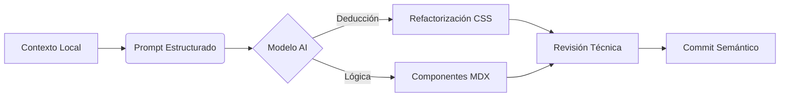

import Tabs from '@theme/Tabs';
import TabItem from '@theme/TabItem';

# Protocolos de Interacción con IA para UI/UX

En nuestra arquitectura de conocimiento, la IA no es un generador de texto, sino un **Senior Frontend Engineer** externo. Para obtener resultados de nivel "Seniority", debemos utilizar prompts basados en **Arquitectura y Contexto**, no solo en instrucciones aisladas.

## 1. El Flujo de Trabajo AI-Ops

El siguiente diagrama describe cómo este protocolo utiliza la capacidad de razonamiento inductivo de modelos como **Claude 3.5 Sonnet** o **DeepSeek-V3**.



---

## 2. Protocolo de Refactorización de Admonitions

Este protocolo se utiliza específicamente cuando los elementos nativos de Infima/Docusaurus no cumplen con el estándar visual **dz.log** (basado en ToolJet).

### 2.1 El "Master Prompt"

Copia y adapta este bloque cuando necesites que la IA rediseñe componentes globales:

:::tip Protocolo de Uso
Utiliza este prompt preferentemente en **Claude AI** debido a su superior manejo de jerarquías de variables CSS y diseño sistemático.
:::

```markdown
### Rol: Senior Frontend Engineer & UI/UX Specialist
**Especialidad:** Docusaurus, Infima CSS y Sistemas de Diseño.

**Contexto del Proyecto:**
Sitio: `dz.log` (Inspiración: ToolJet Docs).
Framework: Docusaurus 3+.
CSS Base: Infima + Variables Tabler (`--tblr-*`).
Componente a refactorizar: **Admonitions** (alertas :::).

**El Problema:**
Falta de integración visual entre los bloques de código internos y el contenedor de la alerta. Jerarquía tipográfica disonante.

**Tarea:** Redefinir estilos en `custom.css` para:
1. Sobreescribir selectores `.admonition` y `.alert`.
2. Heredar estética de la clase `.dz-note` (bordes finos, radio 6px).
3. Integrar bloques `pre` y `code` con estilo "incrustado".
4. Soporte nativo para Modo Claro/Oscuro mediante variables de tema.

**Variables Disponibles:**
- Primario: `#4d72fa`
- Danger: `#d63939`
- Info: `#4299e1`
- Background: `--ifm-color-emphasis-100`
```

---

## 3. Metodología de Implementación

Para asegurar que los cambios no rompan la mantenibilidad del sitio, sigue este procedimiento:

<Tabs>
  <TabItem value="steps" label="Pasos de Ejecución" default>

1. **Extracción de Contexto:** Copia las primeras 50 líneas de tu `custom.css` actual.
2. **Inyección de Prompt:** Proporciona el prompt anterior junto con el CSS copiado a la IA.
3. **Validación Visual:** Aplica los estilos en modo `npm start` y verifica el contraste en Dark Mode.
4. **Refactorización de Código:** Asegúrate de que los bloques de código dentro de `:::info` no tengan márgenes dobles.

  </TabItem>
  <TabItem value="rules" label="Reglas de Oro">

*   **No !important:** Evita el uso de `!important` a menos que sea para ganar a un estilo inline de un plugin.
*   **Variables Primero:** Si la IA sugiere un color hexadecimal, pídele que use o cree una variable CSS.
*   **Aislamiento:** Los estilos de Admonitions deben estar en su propia sección dentro de `custom.css`.

  </TabItem>
</Tabs>

## 4. Consideraciones Técnicas (SOP)

:::danger Peligro: Especificidad CSS
Docusaurus carga los estilos de los componentes en un orden específico. Si tus nuevos estilos no se aplican, envuelve tus selectores en `[data-theme] .admonition` para aumentar la especificidad sin romper la cascada.
:::

### Ejemplo de Bloque Esperado (Output de IA)
```css
/* Sección: Custom Admonitions dz.log */
.admonition {
  border: 1px solid var(--ifm-color-emphasis-300);
  border-radius: 6px;
  background-color: var(--dz-bg-subtle);
  padding: 1.25rem;
}

.admonition code {
  background-color: rgba(0, 0, 0, 0.05); /* Modo claro */
}

[data-theme='dark'] .admonition code {
  background-color: rgba(255, 255, 255, 0.1); /* Modo oscuro */
}
```

---
_Protocolo actualizado el: 2024-03-20_
_Responsable: Arquitecto de Soluciones_
