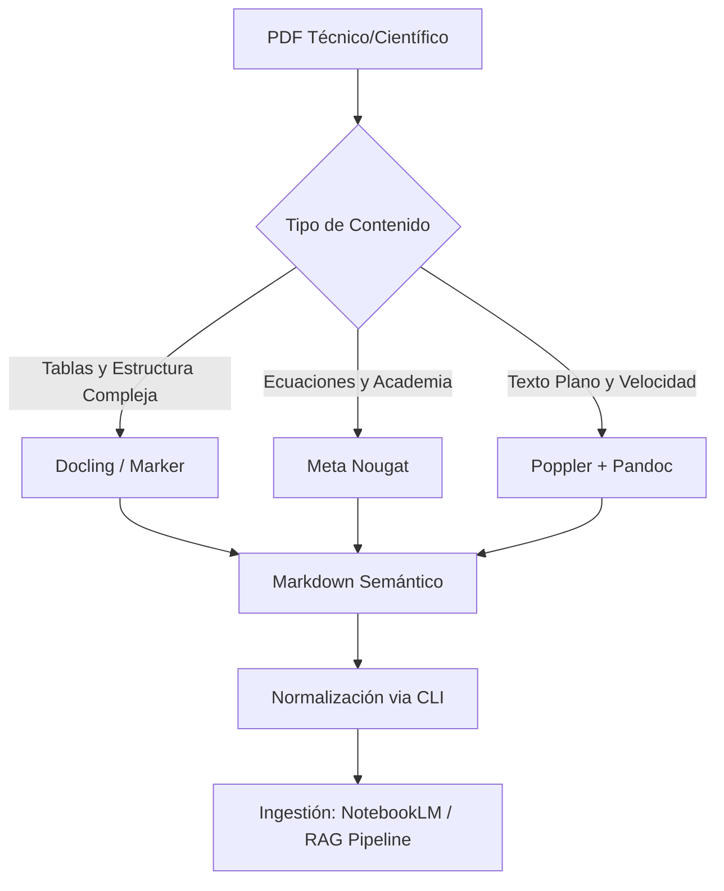

import Tabs from '@theme/Tabs';
import TabItem from '@theme/TabItem';

# Pipeline de Ingestión y Transformación Semántica

En el marco de la **Ingeniería de Prompts** y el estudio profundo mediante LLMs (como NotebookLM), la calidad del resultado es directamente proporcional a la pureza semántica de la fuente. El formato PDF, diseñado para la visualización, debe ser "desestructurado" y vuelto a organizar en **Markdown** para eliminar el ruido sistémico (headers, footers, artefactos de maquetación).

## 1. Arquitectura del Flujo de Transformación

El siguiente diagrama detalla el proceso de conversión desde un binario visual (PDF) hasta un activo de conocimiento indexable.



## 2. Motores de Inferencia de Layout (State-of-the-Art)

A diferencia del OCR tradicional, estos motores utilizan Deep Learning para entender la jerarquía del documento.

<Tabs>
  <TabItem value="marker" label="Marker (General Purpose)" default>

Ideal para libros técnicos y manuales de certificación (CKA/Cloudera).
*   **Capacidad:** Detecta orden de lectura, elimina artefactos y extrae imágenes.
*   **Comando Operativo:**
    ```bash
    marker_single /ruta/archivo.pdf --output_dir ./output/ --batch_multiplier 2
    ```

  </TabItem>
  <TabItem value="docling" label="Docling (IBM Research)">

Optimizado para documentos densos en datos tabulares.
*   **Capacidad:** Su motor de reconocimiento de tablas es superior para análisis financiero o técnico.
*   **Comando Operativo:**
    ```bash
    docling /ruta/archivo.pdf --to md
    ```

  </TabItem>
  <TabItem value="nougat" label="Nougat (Scientific)">

El estándar para papers científicos y documentación con carga matemática pesada.
*   **Capacidad:** Traduce visualmente ecuaciones a LaTeX de forma nativa.

  </TabItem>
</Tabs>

## 3. Interoperabilidad y Formatos Intermedios (DocX)

Para flujos que requieren revisión humana o integración con Google Docs antes de la ingesta final en NotebookLM, se recomienda el uso de **Pandoc** como puente semántico.

:::info El Rol de Pandoc
No se recomienda la conversión directa `PDF -> DocX` via herramientas de oficina (LibreOffice/Word), ya que generan metadatos de posicionamiento absoluto que confunden al LLM. El flujo profesional es:
**`PDF -> Markdown (IA) -> DocX (Pandoc)`**
:::

**Comando de conversión estructural:**
```bash
pandoc documento.md --reference-doc=template.docx -o ingestion_ready.docx
```

## 4. Procedimiento Operativo de Normalización (SOP)

Una vez obtenido el archivo Markdown, es imperativo realizar una limpieza proactiva mediante utilidades de CLI Linux.

<step>
1. **Recorte de Contexto Irrelevante:**
   Elimine páginas de bibliografía o índices que consumen tokens innecesarios.
   ```bash
   qpdf --empty --pages input.pdf 1-50 -- output_recortado.pdf
   ```
</step>

<step>
2. **Limpieza de Artefactos de Paginación:**
   Elimine números de página sueltos que rompen la continuidad de los párrafos.
   ```bash
   sed -i '/^[0-9]\+$/d' documento.md
   ```
</step>

<step>
3. **Consolidación Temática:**
   Para estudios transversales, combine múltiples fuentes en un solo compendio.
   ```bash
   cat chapter_*.md > full_knowledge_base.md
   ```
</step>

## 5. Consideraciones para NotebookLM

:::tip Optimización de Contexto
NotebookLM procesa mejor archivos con una estructura de encabezados clara (`#`, `##`, `###`). Asegúrese de que su Markdown respete esta jerarquía para que el modelo pueda realizar citaciones precisas de las fuentes originales.
:::

---
### Navegación de Referencia

*   **Estándares Relacionados:**
    *   [Estándares de Visibilidad de Contenidos](../version-control/docusaurus-visibility-lifecycle.mdx)
    *   [Guía de Estilo y Gobernanza](../overview.mdx)
*   **Dominio de Aplicación Primario:**
    *   [Administración de Cloudera (CDP)](../../data-engineering/cloudera-administration/index.mdx)
