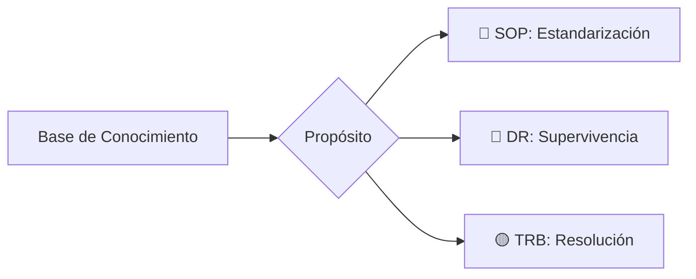

import Tabs from '@theme/Tabs';
import TabItem from '@theme/TabItem';

# Gobernanza de Documentación Técnica

Este documento define la **Taxonomía Oficial** y los estándares de ingeniería aplicados a esta base de conocimientos.

## 1. Clasificación Semántica (Taxonomía)



---

## 2. Anatomía de una Nota Técnica Senior

1. ### Definición del Contexto (RCA)
   Todo documento debe iniciar con el "Por qué". Identificar el error o requerimiento e identificar el impacto.

2. ### Ejecución Técnica Atómica
   Aquí es donde vive el SOP. No se permiten párrafos densos; se utilizan bloques de código con títulos descriptivos.

3. ### Validación de Resultados
   Un procedimiento no termina cuando se ejecuta el comando, sino cuando se valida el éxito mediante logs o dashboards.

---

## 3. Matriz de Detalle Operativo

Utilice las pestañas para profundizar en los requerimientos técnicos de cada fase definida anteriormente.

<Tabs>
  <TabItem value="context" label="📍 Contexto" default>
    - **Problema:** Descripción sucinta del fallo.
    - **Impacto:** ¿A qué servicios afecta?
  </TabItem>
  <TabItem value="code" label="🛠️ Código">
    ```bash title="hdfs-check.sh"
    # Ejemplo de comando estándar de validación
    hdfs fsck / -files -blocks -locations
    ```
  </TabItem>
  <TabItem value="logs" label="📊 Logs">
    ```text title="output.log"
    Status: HEALTHY
    Total blocks (validated): 1250
    ```
  </TabItem>
</Tabs>

---

:::tip Certificaciones en Foco
Este estándar se aplica estrictamente a los módulos de **CKA (Kubernetes)** y **Cloudera SysAdmin**, asegurando que el material de estudio sea idéntico a una documentación de producción real.
:::
