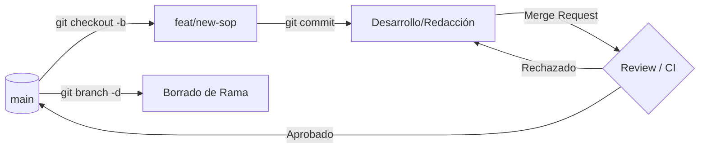

import Tabs from '@theme/Tabs';
import TabItem from '@theme/TabItem';

# Estrategia de Ramas y Ciclo de Vida

En arquitecturas de software modernas, la rama `main` es sagrada. Para proteger la integridad del código y la documentación, implementamos un modelo de **Short-lived Feature Branches** (ramas de vida corta). Este enfoque reduce la divergencia de código y facilita la integración continua.

## 1. Convención de Nomenclatura (Naming Standard)

Adoptamos el uso de **prefijos semánticos** para identificar la naturaleza del cambio antes de leer una sola línea de código.

| Prefijo | Propósito | Ejemplo |
| :--- | :--- | :--- |
| `feat/` | Nuevas funcionalidades o secciones de notas. | `feat/cka-networking` |
| `fix/` | Corrección de errores en scripts o links rotos. | `fix/broken-links-cloudera` |
| `docs/` | Cambios exclusivos en documentación o SOPs. | `docs/update-naming-policy` |
| `refactor/` | Reestructuración de carpetas o limpieza de MDX. | `refactor/move-node-runtime` |
| `study/` | Ramas experimentales o de laboratorio personal. | `study/cka-scheduling` |

:::danger Anti-Patterns a Evitar
- **Nombres Personales:** No uses `daniel/fix-bug`. Usa el propósito, no el autor.
- **Ramas Permanentes:** No mantengas ramas como `documentacion-v1` separadas de `main` por meses.
- **Nombres Genéricos:** Evita `update`, `cambios` o `test`.
:::

---

## 2. Ciclo de Vida de una Rama

El flujo de trabajo estándar asegura que cada cambio sea validado antes de su persistencia en la rama principal.



---

## 3. SOP: Limpieza de Repositorio (Housekeeping)

Un repositorio profesional debe mantenerse esbelto. Las ramas que ya han sido integradas o los experimentos fallidos deben ser eliminados sistemáticamente.

### Escenario de Ejemplo
Supongamos que el comando `git branch --all` muestra una rama obsoleta llamada `cka/study-victus` (incumple el estándar de prefijos).

<Tabs>
  <TabItem value="local" label="Borrado Local" default>

Para eliminar la rama localmente (solo si ya estás en `main`):

```bash title="Terminal"
# Intentar borrado seguro (falla si no ha sido mergeada)
git branch -d cka/study-victus

# Forzar borrado (si los cambios ya no son necesarios)
git branch -D cka/study-victus
```

  </TabItem>
  <TabItem value="remote" label="Borrado Remoto">

Para eliminar la referencia en el servidor (GitLab/GitHub):

```bash title="Terminal"
# Comando directo al origin
git push origin --delete cka/study-victus
```

  </TabItem>
  <TabItem value="prune" label="Sincronización">

Después de limpiezas masivas, purgue las referencias locales a ramas que ya no existen en el servidor:

```bash title="Terminal"
git fetch --prune
```

  </TabItem>
</Tabs>

---

## 4. Separación Docs vs Código: El Veredicto Técnico

Es una **excelente práctica** separar la lógica del contenido mediante ramas de prefijo `docs/` vs `feat/`. 

### Beneficios para el Pipeline (CI/CD)
Al detectar cambios exclusivamente en `docs/`, nuestro pipeline en GitLab puede saltarse etapas costosas como el despliegue de infraestructura de pruebas y centrarse solo en el **Build estático** de Docusaurus.

:::tip Recomendación de Arquitecto
Mantén tus ramas de documentación cerca del código, pero bajo su propio prefijo. Asegúrate de que su destino final siempre sea `main` para evitar el "Drift de Documentación" (cuando la nota dice algo que el sistema ya no hace).
:::

---
_Documentación Relacionada:_ 
- [Semántica de Commits (Conventional Commits)](./git-conventional-commits.mdx) 
- [Bootstrap del Entorno CKA](../../platform-engineering/certification-lab/cka-environment-bootstrap.mdx)
