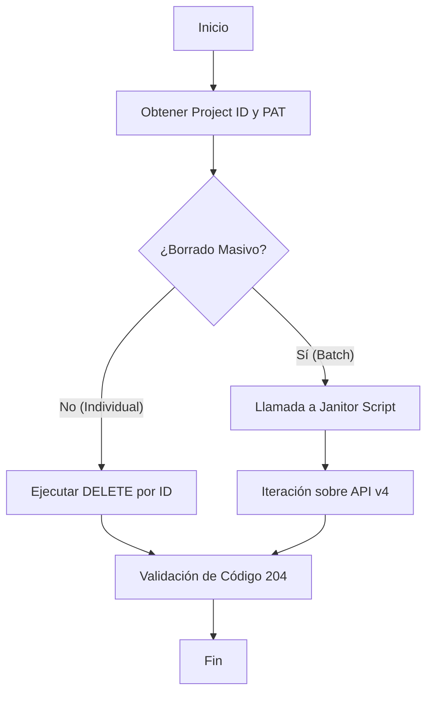

import Tabs from '@theme/Tabs';
import TabItem from '@theme/TabItem';

# Gestión Programática de Pipelines

En entornos de **Ingeniería de Plataforma**, el mantenimiento del historial de CI/CD es vital para la higiene del repositorio y la optimización de cuotas de almacenamiento. Este estándar define el procedimiento para interactuar con la API v4 de GitLab para la eliminación de registros de ejecución.

:::info Arquitectura de Repositorio
Siguiendo nuestro estándar de **Repositorio Unificado**, el código fuente de las herramientas de limpieza reside en la raíz del proyecto (`/scripts/ops/`), mientras que este documento sirve como su especificación técnica y manual de usuario.
:::

## 1. Requisitos Previos (Alistamiento)

Para interactuar con la API, se requieren dos componentes de identidad y localización:

1.  **Personal Access Token (PAT):** Generado en *User Settings > Access Tokens* con el scope `api`.
2.  **Project ID:** Identificador numérico único del repositorio (disponible en la página principal del proyecto).

```bash title="Dependencias de Estación de Trabajo"
# Instalación de procesador JSON y cliente de transferencia
sudo apt update && sudo apt install curl jq -y
```

---

## 2. Protocolo de Ejecución

El flujo lógico para la purga de datos sigue una arquitectura de **Identificación -> Validación -> Eliminación**.



---

## 3. Comandos Operativos

<Tabs>
  <TabItem value="single" label="Eliminación Individual" default>

Utilice este método para eliminar un pipeline específico (ej: el `#52`) tras una validación fallida o detección de datos sensibles.

```bash title="Terminal (Manual)"
# Definición de variables de sesión (Volátiles)
read -sp "Token: " GIT_TOKEN
export PROJ_ID="12345678"
export PIPE_ID="52"

# Ejecución del comando DELETE
curl --request DELETE \
     --header "PRIVATE-TOKEN: $GIT_TOKEN" \
     "https://gitlab.com/api/v4/projects/$PROJ_ID/pipelines/$PIPE_ID"
```

  </TabItem>
  <TabItem value="mass" label="Purga Masiva (Janitor)">

Para limpiezas recurrentes, se recomienda el uso del script automatizado. Este método procesa los últimos 20 registros de forma secuencial.

```bash title="Ejecución desde la Raíz"
# Asegúrese de estar en la raíz del repositorio pascual-zamo.gitlab.io
chmod +x ./scripts/ops/gitlab-janitor.sh
./scripts/ops/gitlab-janitor.sh
```

  </TabItem>
</Tabs>

---

## 4. Código Fuente Operativo

El script de limpieza se mantiene fuera de la carpeta de documentación para permitir su integración en tareas programadas (cron) y evitar conflictos de renderizado en el SSG.

```bash title="scripts/ops/gitlab-janitor.sh"
#!/bin/bash
# ==============================================================================
# NAME: gitlab-janitor.sh
# DESCRIPTION: Automatización de purga de pipelines vía API v4
# ==============================================================================

TOKEN="${GIT_TOKEN}" # Se recomienda heredar de variable de entorno
PROJECT_ID="tu-id-aqui"

if [ -z "$TOKEN" ]; then
    echo "Error: La variable GIT_TOKEN no está definida."
    exit 1
fi

# Obtener IDs de pipelines (Últimos 20)
PIPELINES=$(curl --header "PRIVATE-TOKEN: $TOKEN" \
    "https://gitlab.com/api/v4/projects/$PROJECT_ID/pipelines?per_page=20" | jq '.[].id')

for ID in $PIPELINES; do
    echo "Eliminando Pipeline ID: $ID"
    STATUS=$(curl --request DELETE --header "PRIVATE-TOKEN: $TOKEN" \
        --write-out "%{http_code}" --silent --output /dev/null \
        "https://gitlab.com/api/v4/projects/$PROJECT_ID/pipelines/$ID")
    
    if [ "$STATUS" == "204" ]; then
        echo "Exito: ID $ID eliminado."
    else
        echo "Fallo: ID $ID devolvió código $STATUS."
    fi
done
```

:::info Mantenimiento del Script
Para proponer mejoras a este script, edite directamente el archivo en `/scripts/ops/`. El pipeline de validación de este repositorio no permite el despliegue si existen errores de sintaxis en la carpeta de scripts.
:::

---

## 5. Consideraciones de Seguridad y Auditoría

:::danger Advertencia de Integridad
La eliminación de un pipeline es una **operación irreversible**. Se pierden logs de ejecución, artefactos y la trazabilidad de despliegues pasados.
:::

- **No borre pipelines de producción:** Mantenga al menos 90 días de historial.
- **Inyección de Secretos:** Nunca guarde el `PRIVATE-TOKEN` dentro del código. Utilice el comando `read` o variables de entorno del sistema.
- **Validación de Roles:** Se requiere rol de **Owner** para ejecutar borrados vía API en namespaces personales.

---
**Documentación Relacionada:**
- [Estrategia de Ramas y Ciclo de Vida](./git-branching-model.mdx)
- [SOP: Configuración de Entorno CKA](../../platform-engineering/certification-lab/cka-environment-bootstrap.mdx)
- [Gestión de Runtimes: Node.js](../../sysadmin-linux/runtimes/node-runtime-setup.mdx)
