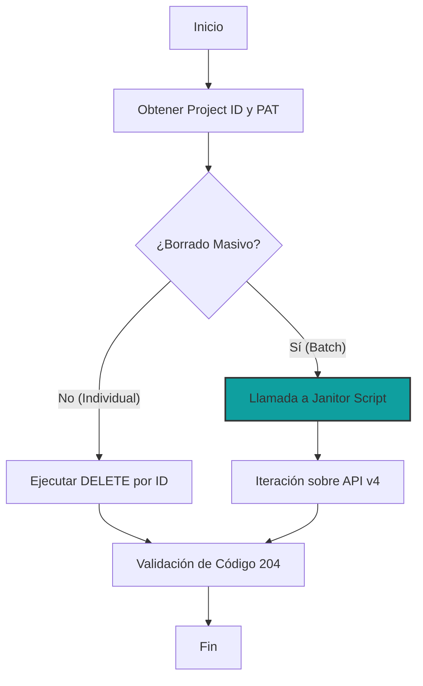

import Tabs from '@theme/Tabs';
import TabItem from '@theme/TabItem';
import CodeBlock from '@theme/CodeBlock';
// Importación dinámica del script real desde la raíz del repositorio
import JanitorScript from '@site/scripts/ops/gitlab-janitor.sh';

# Gestión Programática de Pipelines

En entornos de **Ingeniería de Plataforma**, el mantenimiento del historial de CI/CD es vital para la higiene del repositorio y la optimización de cuotas de almacenamiento. Este estándar define el procedimiento para interactuar con la API v4 de GitLab para la eliminación de registros de ejecución.

:::info Arquitectura de Repositorio Unificado
Siguiendo nuestra estrategia de **Single Source of Truth (SSOT)**, el código fuente de las herramientas de limpieza reside en la raíz del proyecto (`/scripts/ops/`). Este documento importa dinámicamente el script real para garantizar que la documentación nunca quede obsoleta respecto al código operativo.
:::

## 1. Requisitos Previos (Alistamiento)

Para interactuar con la API, se requieren dos componentes de identidad y localización:

1.  **Personal Access Token (PAT):** Generado en *User Settings > Access Tokens* con el scope `api`.
2.  **Project ID:** Identificador numérico único del repositorio (disponible en la página principal del proyecto).

```bash title="Dependencias de Estación de Trabajo"
# Instalación de procesador JSON y cliente de transferencia
sudo apt update && sudo apt install curl jq -y
```

---

## 2. Protocolo de Ejecución

El flujo lógico para la purga de datos sigue una arquitectura de **Identificación -> Validación -> Eliminación**.



---

## 3. Comandos Operativos

<Tabs>
  <TabItem value="single" label="Eliminación Individual" default>

Utilice este método para eliminar un pipeline específico (ej: el `#52`) tras una validación fallida o detección de datos sensibles.

```bash title="Terminal (Manual)"
# Inyección segura de Token (Evita que quede en el historial de comandos)
read -sp "Ingrese su GitLab PAT: " GIT_TOKEN
export PROJ_ID="tu_id_de_proyecto"
export PIPE_ID="52"

# Ejecución del comando DELETE
curl --request DELETE \
     --header "PRIVATE-TOKEN: $GIT_TOKEN" \
     "https://gitlab.com/api/v4/projects/$PROJ_ID/pipelines/$PIPE_ID"
```

  </TabItem>
  <TabItem value="mass" label="Purga Masiva (Janitor)">

Para limpiezas recurrentes, se recomienda el uso del script automatizado. Este método procesa los registros de forma secuencial validando el código de respuesta HTTP.

```bash title="Ejecución desde la Raíz"
# Asegúrese de estar en la raíz: ~/pascual-zamo.gitlab.io/
chmod +x ./scripts/ops/gitlab-janitor.sh
./scripts/ops/gitlab-janitor.sh
```

  </TabItem>
</Tabs>

---

## 4. Código Fuente Operativo (SSOT)

El siguiente bloque de código se importa directamente desde el archivo `scripts/ops/gitlab-janitor.sh`. Cualquier modificación en el archivo físico se reflejará aquí automáticamente.

<CodeBlock language="bash" title="scripts/ops/gitlab-janitor.sh" showLineNumbers>
  {JanitorScript}
</CodeBlock>

:::tip Mantenimiento del Script
Si detecta un fallo en la lógica de borrado, edite el archivo directamente en la carpeta `/scripts/ops/` de su entorno local. Al hacer `git push`, tanto el script como esta página de documentación se actualizarán en sincronía.
:::

---

## 5. Consideraciones de Seguridad y Auditoría

:::danger Advertencia de Integridad
La eliminación de un pipeline es una **operación irreversible**. Se pierden logs de ejecución, artefactos y la trazabilidad de despliegues pasados.
:::

- **Gobernanza de Datos:** No borre pipelines de producción. Mantenga al menos 90 días de historial para auditorías.
- **Inyección de Secretos:** Nunca guarde el `PRIVATE-TOKEN` dentro del código de forma plana. Utilice el comando `read` (visto en la sección 3) o variables de entorno protegidas.
- **Privilegios:** Se requiere rol de **Owner** para ejecutar borrados vía API en namespaces personales de GitLab.

---
**Documentación Relacionada:**
- [Estrategia de Ramas y Ciclo de Vida](./git-branching-model.mdx)
- [Gestión de Dotfiles e Infraestructura Personal](../../sysadmin-linux/terminal-tools/dotfiles-management.mdx)
- [SOP: Configuración de Entorno CKA](../../platform-engineering/certification-lab/cka-environment-bootstrap.mdx)
