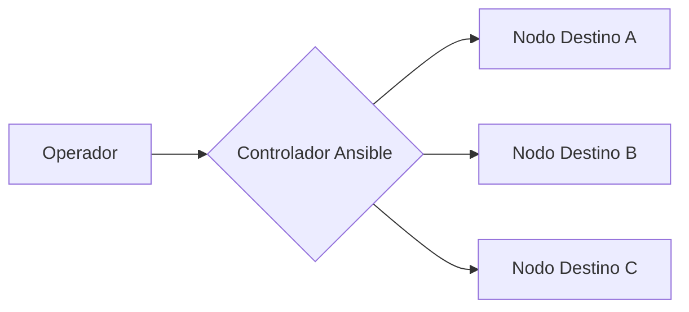

import Tabs from '@theme/Tabs';
import TabItem from '@theme/TabItem';

# Arquitectura del Nodo de Control

Este estándar define los requisitos para el diseño de un **Plano de Control** de automatización. El objetivo es centralizar la lógica de orquestación, garantizando un entorno aislado y reproducible.

## 1. El Rol del Controlador

El Nodo de Control actúa como la única fuente de verdad para la ejecución de configuraciones. Para ver cómo implementar este diseño específicamente en Fedora, consulte el [Procedimiento de Despliegue en Fedora 43](./sop-ans-fedora43-deploy.mdx).

## 2. Diagrama de Flujo (Modelo Push)

## 3. Requisitos de Infraestructura
- **Sistema Base:** Fedora 43 o RHEL 9.
- **Seguridad:** Uso exclusivo de llaves SSH (Ed25519) sin contraseña para tareas automatizadas.
- **Auditoría:** Los logs deben persistir en `/var/log/ansible_execution.log`.

---
**Siguiente paso recomendado:**  
Si ya comprende la arquitectura, proceda con la [Guía de Instalación y Configuración](./sop-ans-fedora43-deploy.mdx).
