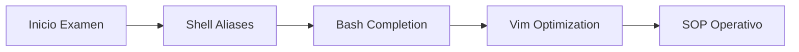

import Tabs from '@theme/Tabs';
import TabItem from '@theme/TabItem';

# Configuración de Entorno de Alto Rendimiento (CKA)

En el contexto del examen **Certified Kubernetes Administrator (CKA)**, el tiempo es el recurso más crítico. Este protocolo establece la configuración de "piso base" que debe ejecutarse en los primeros 2 minutos para maximizar la agilidad operativa.

## 1. Pipeline de Inicialización (Bootstrap)

El objetivo es reducir la carga cognitiva y los errores de sintaxis mediante alias y autocompletado.



### 1.1. Optimización de la Shell (Bash)

Ejecute estas directivas inmediatamente al iniciar la sesión para habilitar el autocompletado y el alias universal `k`.

```bash
# Habilitar autocompletado de kubectl
source <(kubectl completion bash)
echo "source <(kubectl completion bash)" >> ~/.bashrc

# Alias universal y autocompletado para 'k'
alias k=kubectl
complete -F __start_kubectl k

# Variables de entorno críticas (Time-Savers)
export do="--dry-run=client -o yaml"
export now="--force --grace-period=0"
```

:::tip Uso de Variables
*   `k create deploy nginx $do > deploy.yaml`: Genera el manifiesto instantáneamente sin crear el recurso.
*   `k delete pod busybox $now`: Elimina el pod inmediatamente, saltándose el ciclo de terminación estándar (30s).
:::

---

## 2. Configuración del Editor de Texto (Vim)

Kubernetes depende de la indentación YAML. Un archivo `.vimrc` mal configurado es la principal causa de fallos en el examen.

Cree o edite el archivo `~/.vimrc`:

```vim
set ts=2        " Tab size a 2 espacios
set sw=2        " Shift width a 2 espacios
set et          " Expand tabs (usa espacios en lugar de tabs reales)
set nu          " Mostrar números de línea para depurar errores de YAML
set sts=2       " Soft tab stop
```

:::caution Validación de YAML
Si al pegar un manifiesto el código se "desplaza" hacia la derecha, ejecute `:set paste` dentro de Vim antes de pegar, y `:set nopaste` después.
:::

---

## 3. Comandos de Inspección Forense

Memorice estas variaciones para evitar el uso excesivo de `describe`, que genera un output demasiado extenso.

<Tabs>
  <TabItem value="inspeccion" label="Inspección Rápida" default>

```bash
# Ver recursos con labels (clave para NetworkPolicies y Services)
k get pods --show-labels

# Listar eventos ordenados por tiempo (clave para Troubleshooting)
k get events --sort-by=.metadata.creationTimestamp

# Ver consumo de recursos (Requiere Metrics Server)
k top nodes
k top pods --containers
```

  </TabItem>
  <TabItem value="contexto" label="Gestión de Contextos">

El examen requiere saltar entre múltiples clústeres. No pierda tiempo escribiendo el nombre completo.

```bash
# Cambiar de contexto rápidamente
k config use-context <nombre-del-cluster>

# Listar todos los contextos actuales
k config get-contexts
```

  </TabItem>
</Tabs>

---

## 4. Cheat Sheet de Comandos Imperativos

Priorice siempre la creación imperativa para generar la base del YAML.

| Acción | Comando Imperativo |
| :--- | :--- |
| **Pod** | `k run nginx --image=nginx $do` |
| **Deployment** | `k create deploy web --image=nginx --replicas=3 $do` |
| **Service** | `k expose pod nginx --port=80 --name=nginx-svc $do` |
| **Job** | `k create job test --image=busybox $do -- bin/sh -c "echo Hi"` |
| **CronJob** | `k create cj test --image=busybox --schedule="*/1 * * * *" $do` |

## 5. Conclusión Operativa

Este alistamiento no es opcional; es la infraestructura mínima para un Administrador de Kubernetes Senior. La práctica diaria de estos comandos reduce el error humano y permite centrarse en la resolución de problemas lógicos del clúster.

---
_Enlace Interno Recomendado:_ [Estrategia de Ramas para Manifiestos](../../engineering-standards/version-control/git-branching-model.mdx) | [Protocolo de Ingestión Semántica](../../engineering-standards/ai-protocols/document-ingestion-pipeline.mdx)
