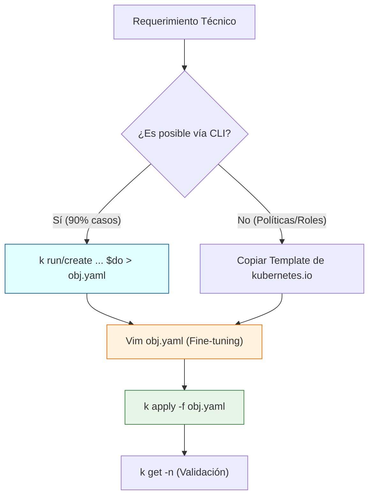

import Tabs from '@theme/Tabs';
import TabItem from '@theme/TabItem';

# Ingeniería de la Productividad en Terminal

En un escenario de **Alta Disponibilidad** o durante la certificación **CKA**, la latencia humana (el tiempo que tardas en escribir y corregir comandos) es el principal cuello de botella. Este estándar establece un entorno de terminal optimizado para reducir la carga cognitiva y el error táctico.

## 1. Perfil Operativo de Shell (`.bashrc`)

La configuración de la shell no es un lujo, sino un **acelerador de entrega**. El objetivo es minimizar los *keystrokes* (pulsaciones de teclas) mediante una arquitectura de aliases jerárquica.

### 1.1. Aliases de Inspección y Despliegue
Añada estas definiciones al archivo `~/.bashrc` para habilitar una navegación fluida entre recursos:

```bash title="~/.bashrc"
# Abstracción Core
alias k='kubectl'

# Get Resources (Read-Only Ops)
alias kgp='k get pods'
alias kgs='k get svc'
alias kgd='k get deploy'
alias kgn='k get nodes'
alias kga='k get all'

# Context & Namespace Management (High Frequency)
# Uso: kns development
alias kns='k config set-context --current --namespace'

# Velocidad de Ejecución (Environment Variables)
export do="--dry-run=client -o yaml"
export now="--force --grace-period=0"

# Inyección de Autocompletado (Crítico)
source <(kubectl completion bash)
complete -o default -F __start_kubectl k
```

:::warning Validación de Contexto
El alias `kns` modifica el contexto actual permanentemente. Antes de ejecutar comandos destructivos, valide siempre el namespace actual con:
`k config view --minify | grep namespace`
:::

---

## 2. Configuración del Entorno de Edición (Vim)

Kubernetes es, en esencia, gestión de estado mediante **YAML**. Un editor mal configurado es un riesgo sistémico. El siguiente protocolo garantiza que Vim se comporte como un validador de sintaxis básico.

```bash title="Inicialización de .vimrc"
cat <<EOF > ~/.vimrc
set tabstop=2       # Indentación estándar YAML
set shiftwidth=2    # Espaciado de flujo
set expandtab       # Conversión de Tabs a Espacios (Obligatorio)
set nu              # Referenciación por línea para Troubleshooting
syntax on           # Resaltado sintáctico de objetos K8s
set cursorline      # Localización visual rápida
EOF
```

---

## 3. Workflow de Resolución: El Método "Imperativo-First"

Un Administrador Senior no escribe archivos YAML desde cero. El flujo de trabajo debe seguir una arquitectura de **Generación -> Edición -> Aplicación**.



---

## 4. Protocolos de Supervivencia y Diagnóstico

### A. Gestión de Ciclo de Vida Acelerado
En entornos de examen o incidentes en vivo, el tiempo de espera por defecto (30s) para eliminar pods es inaceptable.

```bash
# Borrado instantáneo (Skip Grace Period)
k delete pod <pod_name> $now
```

### B. Descubrimiento Semántico de Recursos
Cuando la estructura de un objeto es incierta, utilice el motor de documentación interno en lugar de fuentes externas.

<Tabs>
  <TabItem value="explain" label="Exploración de Campos" default>

```bash
# Navegación jerárquica de la API
k explain pod.spec.containers.livenessProbe
```

  </TabItem>
  <TabItem value="labels" label="Filtrado por Etiquetas">

```bash
# Crucial para NetworkPolicies y Services
k get pods --show-labels
k get pods -l app=nginx
```

  </TabItem>
</Tabs>

## 5. Conclusión de Arquitectura
La adopción de estos estándares permite al ingeniero centrarse en la **lógica del clúster** y no en la **sintaxis de la herramienta**. La maestría en la terminal es la base de la observabilidad y el mantenimiento preventivo.

---
**Documentación Relacionada:**
- [SOP: Bootstrap del Entorno CKA](./cka-environment-bootstrap.mdx)
- [Gestión de Runtimes: Node.js](../../sysadmin-linux/runtimes/node-runtime-setup.mdx)
- [Estándares de Git y Conventional Commits](../../engineering-standards/version-control/git-conventional-commits.mdx)
