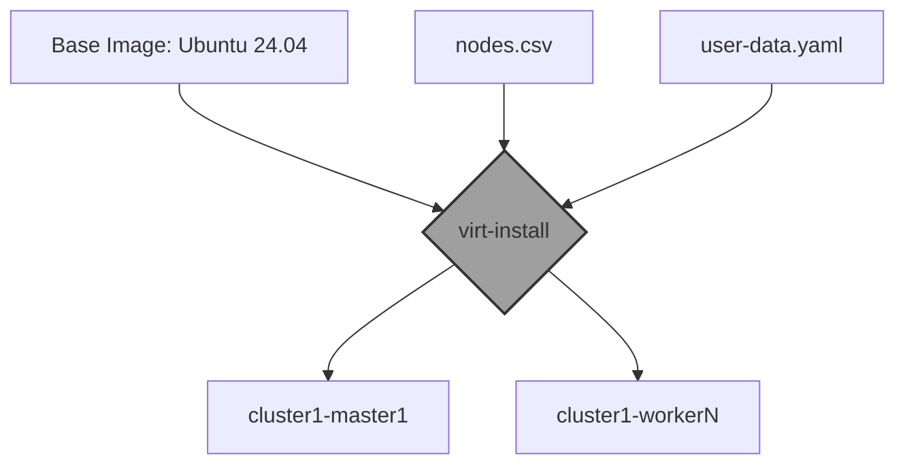

import Tabs from '@theme/Tabs';
import TabItem from '@theme/TabItem';
import CodeBlock from '@theme/CodeBlock';
import UserData from '!!raw-loader!@site/_projects/cka_use_case/library/vms_provision/provision_with_containerd/user-data.yaml.example';
import ProvisionScript from '!!raw-loader!@site/_projects/cka_use_case/library/vms_provision/provision_with_containerd/vms_provision.sh';

# Provisión Automatizada de Nodos

Este estándar técnico define el proceso de creación de infraestructura base para un clúster de Kubernetes v1.35 utilizando **Infraestructura como Código (IaC)** ligera sobre un hipervisor Linux (KVM).

## 1. Arquitectura de Despliegue

Utilizamos un modelo de "Imágenes Doradas" mediante archivos `.qcow2` diferenciales y personalización dinámica en el primer arranque via **Cloud-Init**.

## 2. Definición de la Topología (`nodes.csv`)

La matriz de nodos define el estado deseado de recursos y direccionamiento IP estático.

| Hostname | RAM | vCPUs | IP (Static) | Role |
| :--- | :--- | :--- | :--- | :--- |
| `cluster1-master1` | 2048 | 2 | 10.2.3.4 | Control Plane |
| `cluster1-worker1-3` | 2048 | 2 | 10.2.3.4X | Worker Nodes |

---

## 3. Lógica de Aprovisionamiento (Scripting)

El script `vms_provision.sh` orquesta el ciclo de vida de la creación de VMs, gestionando discos diferenciales para optimizar el almacenamiento y utilizando `virt-customize` para inyectar configuraciones de red antes del arranque.

<CodeBlock language="bash" title="vms_provision.sh" showLineNumbers>
  {ProvisionScript}
</CodeBlock>

---

## 4. Configuración del Runtime vía Cloud-Init

Para garantizar la inmutabilidad, el archivo `user-data.yaml` automatiza el **Hardening del OS**, la instalación del runtime **containerd** y la optimización de parámetros del Kernel (`sysctl`) necesarios para Kubernetes.

:::caution Gestión de Secretos
En este ejemplo, la contraseña se inyecta mediante un hash SHA-512. En entornos productivos, se recomienda el uso de SSH Keys exclusivamente y la inyección de secretos vía Vault.
:::

<CodeBlock language="yaml" title="user-data.yaml.example" showLineNumbers>
  {UserData}
</CodeBlock>

---
**Documentación Relacionada:**
- [SOP: Orquestación con Ansible](./k8s-ansible-orchestration.mdx)
- [Hardening de OS y Runtime](./k8s-os-runtime-prep.mdx)
