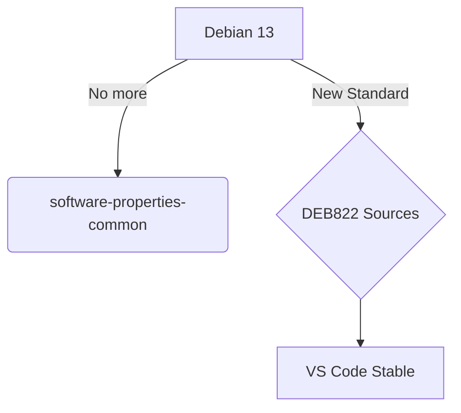

import Admonition from '@theme/Admonition';

# VS Code en Debian 13 (Trixie)

En Debian 13, la administración de repositorios ha evolucionado. Se ha eliminado `software-properties-common` y se ha adoptado el formato **DEB822** (`.sources`) para una mayor seguridad y legibilidad de las fuentes.

:::tip[Optimización Q4OS (KDE)]
Esta guía incluye ajustes específicos para la integración de VS Code con el gestor de ventanas KWin de Plasma, optimizando el renderizado en una Acer Aspire (12th Gen).
:::

## 1. Implementación Estándar DEB822

Este método es el sustituto moderno al antiguo `add-apt-repository`.

```bash title="Terminal"
# 1. Preparación del entorno (curl nativo)
sudo apt update && sudo apt install curl gpg -y

# 2. Keyring Isolation
sudo mkdir -p /etc/apt/keyrings
curl -sSL https://packages.microsoft.com/keys/microsoft.asc | gpg --dearmor | sudo tee /etc/apt/keyrings/microsoft.gpg > /dev/null

# 3. Creación de fuente declarativa (DEB822)
sudo tee /etc/apt/sources.list.d/vscode.sources <<EOF
Types: deb
URIs: https://packages.microsoft.com/repos/code
Suites: stable
Components: main
Architectures: amd64
Signed-By: /etc/apt/keyrings/microsoft.gpg
EOF

# 4. Instalación
sudo apt update && sudo apt install code -y
```

## 2. Configuración de Performance (KDE Plasma)

Ajustes recomendados en `settings.json` para evitar parpadeos en Wayland/X11 y mejorar el look & feel:

```json title="~/.config/Code/User/settings.json"
{
    "window.titleBarStyle": "custom",
    "editor.fontFamily": "'JetBrains Mono', 'Fira Code', monospace",
    "editor.tabSize": 2,
    "workbench.colorTheme": "Dracula",
    "telemetry.telemetryLevel": "off"
}
```

## 3. Validación de Entorno



---

:::note Compatibilidad
Esta guía es exclusiva para **Debian 13**. Para sistemas basados en **Ubuntu 24.04 o Linux Mint 22**, utiliza el [protocolo de instalación estándar](./ubuntu-vscode-dev-setup.mdx).
:::

**Documentación Relacionada:**
- [Configuración de Runtimes en Debian](../runtimes/node-runtime-setup.mdx)
- [Arquitectura de Ingestión Semántica](../../engineering-standards/ai-protocols/document-ingestion-pipeline.mdx)
