import Tabs from '@theme/Tabs';
import TabItem from '@theme/TabItem';

# Dotfiles: Infraestructura de Configuración y Persistencia

En la ingeniería de plataformas, la **consistencia del entorno** es un requisito no funcional crítico. Los **Dotfiles** representan nuestra "Infraestructura como Código" (IaC) aplicada a la estación de trabajo. Una gestión profesional de estos archivos garantiza una transición fluida entre dispositivos (Acer Aspire, HP Victus) y una memoria muscular infalible para certificaciones como la **CKA**.

## 1. Arquitectura de Enlaces Simbólicos (Symlinks)

La estrategia de gestión se basa en mantener un repositorio centralizado de Git y proyectar su contenido hacia el `$HOME` mediante punteros lógicos.

Como profesionales DevOps, no copiamos archivos de configuración manualmente. Utilizamos un repositorio centralizado y **Enlaces Simbólicos (Symlinks)**.

:::info Por qué usar Symlinks
Un enlace simbólico permite que el archivo resida en tu carpeta de configuración sincronizada (ej. `~/dotfiles`) pero el sistema operativo crea un "acceso directo" en la ruta donde la aplicación lo espera (ej. `~/.bashrc`).
:::



```mermaid
graph LR
    subgraph "Repositorio Central"
        B[~/dotfiles/bash/.bashrc]
        V[~/dotfiles/vim/.vimrc]
        S[~/dotfiles/vscode/settings.json]
    end

    subgraph "Sistema Operativo ($HOME)"
        HB[~/.bashrc]
        HV[~/.vimrc]
        HVS[~/.config/Code/User/settings.json]
    end

    B -- "ln -s" --> HB
    V -- "ln -s" --> HV
    S -- "ln -s" --> HVS
    
    style B fill:#112233,stroke:#333
    style S fill:#112233,stroke:#333
```

:::info Ventaja Operativa
Al usar **Symlinks**, cualquier cambio realizado en la aplicación (ej. cambiar el tema en VS Code) se refleja inmediatamente en el repositorio de Git, listo para ser versionado y distribuido.
:::

---

## 2. Configuración Unificada de VS Code (CKA-Ready)

Para maximizar la productividad en el examen CKA, configuramos VS Code para emular el comportamiento de una terminal pura con **Vim**, manteniendo estándares estrictos de indentación YAML.

```json title="~/.config/Code/User/settings.json"
{
    // --- UI & ASPECTO (DRACULA STYLE) ---
    "workbench.colorTheme": "Dracula",
    "editor.fontSize": 14,
    "editor.fontFamily": "'JetBrains Mono', 'Fira Code', monospace",
    "editor.fontLigatures": true,
    "editor.minimap.enabled": false,
    "telemetry.telemetryLevel": "off",

    // --- EDITOR CORE (ALINEADO A YAML/K8S) ---
    "editor.tabSize": 2,
    "editor.insertSpaces": true,
    "editor.wordWrap": "on",
    "files.autoSave": "onFocusChange",
    "editor.formatOnSave": false,

    // --- EXTENSIÓN VIM (MEMORIA MUSCULAR CKA) ---
    "vim.useSystemClipboard": true,
    "vim.hlsearch": true,
    "vim.leader": "<space>",
    "vim.insertModeKeyBindings": [
        { "before": ["j", "j"], "after": ["<Esc>"] }
    ],
    "vim.handleKeys": {
        "<C-f>": false,
        "<C-z>": false
    },

    // --- TERMINAL INTEGRADA ---
    "terminal.integrated.fontSize": 13,
    "terminal.integrated.defaultProfile.linux": "bash",
    "terminal.integrated.defaultProfile.windows": "Git Bash",
    "terminal.integrated.showOnStartup": "always",

    // --- KUBERNETES ---
    "kubernetes.kubectlVersioning": "use-context",
    "yaml.schemas": {
        "kubernetes": "/*.yaml"
    }
}
```

---

## 3. Protocolo de Despliegue Automatizado

El aprovisionamiento de una nueva máquina debe ser atómico. Evitamos la configuración manual mediante un script de orquestación.

<Tabs>
  <TabItem value="script" label="Automatización (SOP)" default>

<step>
1. **Clonación del Repositorio:**
   ```bash
   git clone <tu-repo-dotfiles> ~/dotfiles
   cd ~/dotfiles
   ```
</step>

<step>
2. **Ejecución del Enlazador:**
   El script utiliza `ln -sfn` para forzar la creación del link incluso si el archivo destino existe.
   ```bash title="install.sh"
   #!/bin/bash
   # Link de VS Code (Path para Linux)
   ln -sfn ~/dotfiles/vscode/settings.json ~/.config/Code/User/settings.json
   # Link de Vim
   ln -sfn ~/dotfiles/vim/.vimrc ~/.vimrc
   ```
</step>

  </TabItem>
  <TabItem value="manual" label="Comando Manual">

Para enlaces rápidos y aislados:
```bash
ln -sfn /path/to/source /path/to/destination
```

  </TabItem>
  <TabItem value="script-funcional" label="Automatización con Función">
  
  Para desplegar este entorno en Desktop y/o Workstation, se desarrolla el siguiente script de instalación con función.

  **Script con codifcación funcional**

  ```bash title="~/dotfiles/install.sh"
  #!/bin/bash
  # Directorio del repositorio
  DOTFILES_DIR="$HOME/dotfiles"

  echo "Iniciando despliegue de Dotfiles..."

  # Función para crear enlaces simbólicos
  link_file() {
    local src=$1; local dest=$2
    ln -sfn "$src" "$dest"
    echo "Linked: $dest -> $src"
  }
  # 1. Bash Config
  link_file "$DOTFILES_DIR/bash/.bashrc" "$HOME/.bashrc"
      
  # 2. Vim Config
  link_file "$DOTFILES_DIR/vim/.vimrc" "$HOME/.vimrc"
      
  # 3. VS Code Config (Linux)
  link_file "$DOTFILES_DIR/vscode/settings.json" "$HOME/.config/Code/User/settings.json"
    
  echo "Entorno configurado correctamente."
  ```

  </TabItem>
</Tabs>

---

## 4. Estrategia de Sincronización Híbrida

Como Administradores Senior, combinamos dos tecnologías para garantizar la disponibilidad global de nuestra configuración:

1.  **Git (Control de Versiones):** Para cambios estructurales y auditoría. Todo cambio en un alias de Cloudera o K8s debe seguir el estándar de [Conventional Commits](../../engineering-standards/version-control/git-conventional-commits.mdx).
2.  **Syncthing (Persistencia Instantánea):** Sincroniza la carpeta `~/dotfiles` entre dispositivos en tiempo real. Esto permite que una extensión instalada en la **Acer Aspire** esté disponible en la **HP Victus** sin necesidad de un `git push`.

:::danger Advertencia de Seguridad
Nunca incluya claves SSH, tokens de API o archivos `.kube/config` en el repositorio de Dotfiles. Estos secretos deben gestionarse mediante herramientas de Vault o el llavero del sistema.
:::

---

## 5. Navegación Cruzada (Relacionados)

Este artículo es parte del ecosistema de productividad del sitio. Consulte los siguientes artículos para profundizar:

*   **Infraestructura Base:** [VS Code en Debian 13](./deb13-vscode-dev-setup.mdx) | [VS Code en Ubuntu](./ubuntu-vscode-dev-setup.mdx)
*   **Preparación CKA:** [Bootstrap del Entorno K8s](../../platform-engineering/certification-lab/cka-environment-bootstrap.mdx)
*   **Gobernanza:** [Estándar de Mensajes de Commit](../../engineering-standards/version-control/git-conventional-commits.mdx)

---
_Referencia Técnica: SysAdmin SOP-04 - Workstation Persistence_
