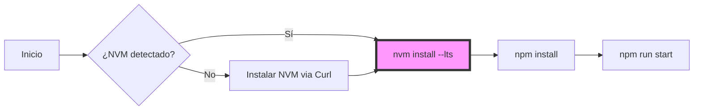

import Tabs from '@theme/Tabs';
import TabItem from '@theme/TabItem';

# Gestión del Runtime: Node.js

En arquitecturas de ingeniería modernas, la gestión del runtime de Node.js debe estar desacoplada de los repositorios del sistema operativo. Esto previene conflictos de permisos (`EACCES`) y permite la paridad de entornos entre desarrollo y producción.

Este estándar define el uso de **Node Version Manager (NVM)** sobre estaciones de trabajo basadas en **Debian 13 (Trixie)** con escritorio **KDE Plasma (Q4OS)**.

:::info Visión de Arquitectura
El uso de NVM garantiza que los paquetes globales instalados vía `npm install -g` residan en el espacio de usuario (`$HOME`), eliminando la necesidad de `sudo` y preservando la integridad de las rutas protegidas del sistema.
:::

## 1. Protocolo de Instalación de NVM

El despliegue de NVM es el primer paso crítico para habilitar el ecosistema de desarrollo (Docusaurus/Astro).

<step>
1. **Inyección del Script de Gestión:**
   Descargue y ejecute el instalador oficial en el perfil del usuario.
   ```bash title="Terminal"
   curl -o- https://raw.githubusercontent.com/nvm-sh/nvm/v0.40.1/install.sh | bash
   ```
</step>

<step>
2. **Persistencia de Variables de Entorno:**
   Asegure que la shell reconozca el binario añadiendo estas directivas al final de su `~/.bashrc`:
   ```bash
   export NVM_DIR="$([ -z "${XDG_CONFIG_HOME-}" ] && echo "$HOME/.nvm" || echo "$XDG_CONFIG_HOME/nvm")"
   [ -s "$NVM_DIR/nvm.sh" ] && \. "$NVM_DIR/nvm.sh" 
   ```
</step>

<step>
3. **Refresco de Sesión:**
   ```bash
   source ~/.bashrc
   ```
</step>

---

## 2. Estrategia de Versiones (LTS)

Para garantizar la estabilidad en la compilación de este sitio (`dz.log`) y herramientas Big Data, utilizaremos exclusivamente ramas **LTS (Long Term Support)**.

<Tabs>
  <TabItem value="lts" label="Ruta LTS (Recomendado)" default>

```bash
# Instalar última versión estable
nvm install --lts

# Definir como persistente
nvm alias default 'lts/*'
```

  </TabItem>
  <TabItem value="specific" label="Versiones Específicas">

Utilice este método solo si un proyecto legacy requiere retrocompatibilidad:
```bash
nvm install 18.20.0
nvm use 18.20.0
```

  </TabItem>
</Tabs>

---

## 3. Integración con el Proyecto DZ.LOG

Para evitar discrepancias en el despliegue de este repositorio, implementamos un **Contrato de Versión** mediante archivos `.nvmrc`.

:::tip Práctica de Ingeniería Senior
Siempre que trabaje en el directorio `~/hot-tier/pascual-zamo.gitlab.io`, valide el runtime. Al entrar en la carpeta, ejecute `nvm use` para sincronizarse con la versión declarada en el proyecto.
:::

**Procedimiento para declarar la versión del proyecto:**
```bash title="Estableciendo el contrato"
node -v > .nvmrc # Captura la versión actual (ej: v22.13.0)
```

---

## 4. Diagnóstico y Troubleshooting

| Error Común | Causa Raíz | Acción Correctiva |
| :--- | :--- | :--- |
| `EACCES` | Node instalado vía APT | Desinstalar Node de APT e instalar vía NVM |
| `command not found: nvm` | Bash no inicializado | Validar carga en `~/.bashrc` y ejecutar `source` |
| `GLIBC not found` | Desajuste de Kernel | Validar Debian 13 / Kernel 6.x+ |

### Flujo Lógico de Inicialización



---
**Documentación Relacionada:**
- [Gobernanza de Estilo de la Base de Conocimiento](engineering-standards/overview.mdx)
- [Pipeline de Ingestión Semántica](engineering-standards/ai-protocols/document-ingestion-pipeline.mdx)
