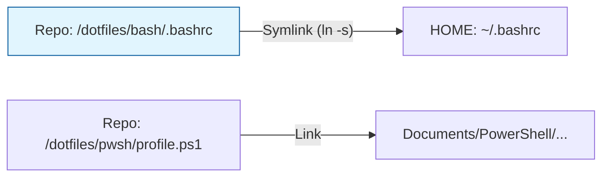

import Tabs from '@theme/Tabs';
import TabItem from '@theme/TabItem';

# Gestión de Entorno (Dotfiles)

En una arquitectura de ingeniería profesional, la configuración de la terminal debe tratarse como **Configuración como Código (CaC)**. Este repositorio centraliza los `dotfiles` en la raíz para garantizar la paridad de herramientas entre diferentes estaciones de trabajo (Debian, Q4OS, Windows/WSL).

## 1. Arquitectura de Sincronización

No copiamos los archivos manualmente. Utilizamos **Enlaces Simbólicos (Symlinks)**. De esta forma, cualquier cambio realizado en los archivos del repositorio se refleja instantáneamente en el sistema, permitiendo versionar las mejoras del entorno de forma orgánica.



---

## 2. Protocolo de Implementación

Elija su entorno operativo para vincular las configuraciones:

<Tabs>
  <TabItem value="linux" label="Linux (Bash)" default>

### Vinculación de Perfiles
Ejecute estos comandos desde la raíz del repositorio para "anclar" su configuración:

```bash title="Terminal"
# 1. Backup de la config original (Solo la primera vez)
mv ~/.bashrc ~/.bashrc.bak
mv ~/.bash_aliases ~/.bash_aliases.bak

# 2. Creación de Enlaces Simbólicos
ln -sf $(pwd)/dotfiles/bash/.bashrc ~/.bashrc
ln -sf $(pwd)/dotfiles/bash/.bash_aliases ~/.bash_aliases

# 3. Aplicar cambios
source ~/.bashrc
```

  </TabItem>
  <TabItem value="pwsh" label="PowerShell 7">

### Vinculación del Perfil ($PROFILE)
En Windows o Linux con PowerShell 7, localice su archivo de perfil y apunte al archivo del repositorio.

```powershell title="PowerShell"
# Crear el directorio del perfil si no existe
New-Item -ItemType Directory -Force -Path (Split-Path $PROFILE)

# Crear enlace simbólico (Requiere privilegios de Admin en Windows)
New-Item -ItemType SymbolicLink -Path $PROFILE -Value "$PSScriptRoot\dotfiles\powershell\Microsoft.PowerShell_profile.ps1"
```

  </TabItem>
</Tabs>

---

## 3. Estándar de Contenido de los Dotfiles

Para mantener la portabilidad, los archivos deben seguir esta estructura lógica:

1.  **Variables de Entorno:** Paths de SDKs (Node, K8s, Python).
2.  **Aliases de Productividad:** Atajos de `kubectl`, `git`, y navegación.
3.  **Prompt Personalizado:** Identidad visual de la terminal (`PS1`).
4.  **Funciones Operativas:** Scripts pequeños para tareas recurrentes.

:::tip Recomendación de Seguridad
Nunca incluya credenciales (API Keys, Passwords) directamente en los archivos versionados. Utilice un archivo `.env.local` que esté incluido en el `.gitignore` y cárguelo desde el `.bashrc`:
```bash
[ -f ~/.env.local ] && source ~/.env.local
```
:::

---
**Documentación Relacionada:**
- [SOP: Ingeniería de Productividad en Terminal](../../platform-engineering/certification-lab/cka-terminal-productivity.mdx)
- [Vim Sovereignty: Estándar de Edición](./vim-sovereignty.mdx)
