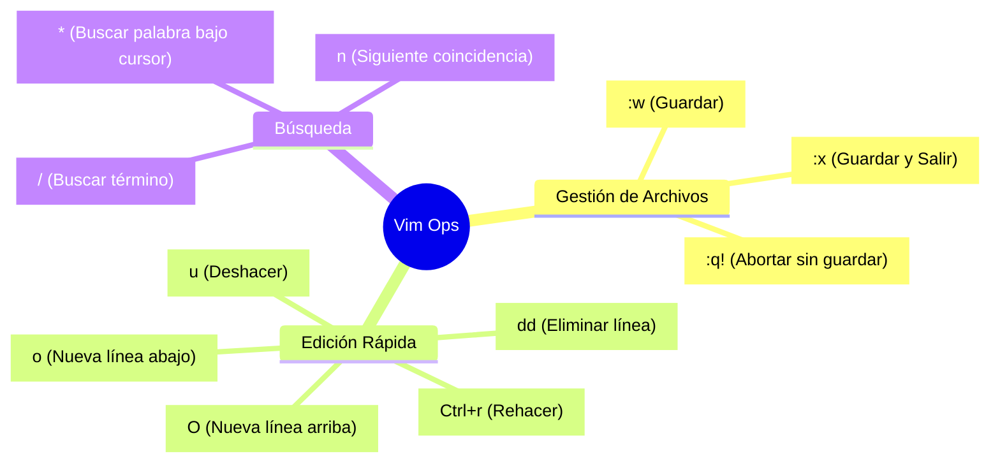

import Tabs from '@theme/Tabs';
import TabItem from '@theme/TabItem';

# Vim Sovereignty: Estándar de Edición en Terminal

En la administración de sistemas a escala, la capacidad de editar manifiestos YAML y archivos de configuración sin salir de la terminal es una ventaja competitiva. Este protocolo define los flujos de trabajo necesarios para dominar **Vim** como una herramienta de ingeniería, no solo como un editor de texto.

## 1. Operaciones de Alcance Global

Para un Arquitecto, la eficiencia se mide en la reducción de comandos repetitivos. Estas secuencias permiten gestionar el buffer completo de forma instantánea.

| Objetivo Operativo | Secuencia (Modo Normal) | Lógica Técnica |
| :--- | :--- | :--- |
| **Reset de Buffer** | `:%d` | Borrado total del archivo. |
| **Snap-to-Start** | `gg` | Posicionamiento en línea 1, columna 1. |
| **Snap-to-End** | `G` | Salto al final del flujo. |
| **Selección Integral** | `ggVG` | Acoplamiento: Inicio -> Modo Visual -> Final. |
| **Sincronización de Clipboard** | `:%y` | Copia del buffer completo al registro. |

:::tip Integración con Entornos Modernos
Si opera desde **VSCodeVim**, asegúrese de que su `settings.json` tenga habilitada la opción `"vim.useSystemClipboard": true` para que las operaciones de *yank* (`y`) interactúen directamente con el portapapeles de su SO (Debian/Q4OS).
:::

---

## 2. Gestión de Estructuras YAML (Indentación Masiva)

La integridad de los servicios en Kubernetes y Cloudera depende de la jerarquía de espacios. Vim permite correcciones estructurales sin intervención manual línea por línea.

### Flujo de Re-indentación

1.  **Activación Visual:** Presione `V` (Modo Visual de Línea).
2.  **Selección de Bloque:** Use `j/k` para sombrear el objeto (ej. un `spec` completo).
3.  **Desplazamiento:**
    *   `>`: Incrementa la indentación (2 espacios según nuestro `.vimrc`).
    *   `<`: Reduce la indentación.
4.  **Repetición Atómica:** Presione `.` para repetir el último desplazamiento sobre la misma selección.

---

## 3. Navegación y Búsqueda Forense

Cuando se analizan logs o descripciones de recursos extensos (ej. un `describe pod` de 500 líneas), la búsqueda secuencial es ineficiente.

<Tabs>
  <TabItem value="search" label="Búsqueda de Patrones" default>

```bash
# Iniciar búsqueda
/ <término_a_buscar> [Enter]

# Navegación entre coincidencias
n  # Siguiente (Next)
N  # Anterior (Previous)
```

  </TabItem>
  <TabItem value="internal" label="Navegación de Línea">

```bash
$  # Salto al final de la línea actual
0  # Salto al inicio de la línea (incluye espacios)
^  # Salto al primer carácter no vacío (ideal para YAML)
```

  </TabItem>
</Tabs>

---

## 4. Arquitectura de Salida (Modo Escape)

Para minimizar la fatiga del túnel carpiano y acelerar el cambio de modo, se recomienda el mapeo de "escape rápido".

```vim title="~/.vimrc snippet"
" Salir de modo insertar sin usar la tecla Esc
inoremap jj <Esc>
inoremap kk <Esc>
```

---

## 5. Cheat Sheet de Productividad



:::info Configuración Requerida
Este SOP asume que su entorno ha sido inicializado según el [Protocolo de Bootstrap de Terminal](../../platform-engineering/certification-lab/cka-terminal-productivity.mdx), garantizando que `tabstop=2` y `expandtab` estén activos para evitar errores de tabulación en YAML.
:::

---
**Documentación Relacionada:**
- [SOP: Ingeniería de Productividad en Terminal](../../platform-engineering/certification-lab/cka-terminal-productivity.mdx)
- [Gestión de Runtimes: Node.js](../runtimes/node-runtime-setup.mdx)
- [Arquitectura HDFS: Principios](../../data-engineering/cloudera-administration/hdfs-architecture-principles.mdx)
