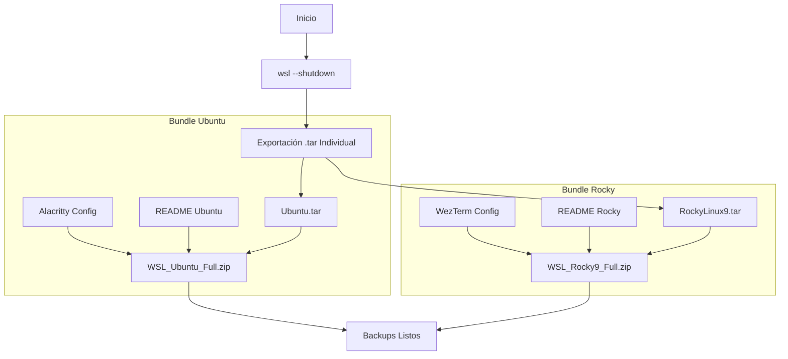

# 📦 Backup Granular de Instancias WSL 2

Este protocolo detalla la creación de paquetes de migración independientes. Cada paquete contiene la imagen de la distribución, su configuración de terminal (Alacritty/WezTerm) y una nota informativa.

## 🔄 Diagrama de Proceso de Empaquetado



## 🛠️ Script de Ejecución (PowerShell 7)

Ejecutar como **Administrador**. El script asume que los README ya han sido creados en la ruta de destino.

```powershell
# 1. Preparación y Apagado
wsl --shutdown
$dest = "D:\10_Hot-Tier_Caliente\WSL\Backups"

# --- PAQUETE UBUNTU (Terminal: Alacritty) ---
Write-Host ">>> Procesando Bundle Ubuntu..." -ForegroundColor Cyan
wsl --export Ubuntu "$dest\Ubuntu.tar"

# Definir archivos asociados (Ajustar rutas de ser necesario)
$ubuntuBundle = @(
    "$dest\Ubuntu.tar",
    "$env:APPDATA\alacritty\alacritty.toml", # Configuración de Alacritty
    "$dest\README_Ubuntu.md"                # Tu nota de expansión
)

Compress-Archive -Path $ubuntuBundle -DestinationPath "$dest\WSL_Ubuntu_Migration.zip" -Force

# --- PAQUETE ROCKY LINUX 9 (Terminal: WezTerm) ---
Write-Host ">>> Procesando Bundle Rocky Linux 9..." -ForegroundColor Green
wsl --export RockyLinux9 "$dest\RockyLinux9.tar"

# Definir archivos asociados
$rockyBundle = @(
    "$dest\RockyLinux9.tar",
    "$env:USERPROFILE\.wezterm.lua",         # Configuración de WezTerm
    "$dest\README_Rocky.md"                 # Tu nota de expansión
)

Compress-Archive -Path $rockyBundle -DestinationPath "$dest\WSL_Rocky9_Migration.zip" -Force

# 2. Limpieza de archivos .tar (Opcional)
# Remove-Item "$dest\*.tar"
```

## 📋 Contenido de los Paquetes

| Recurso | Destino Ubuntu | Destino Rocky |
| :--- | :--- | :--- |
| **Imagen WSL** | `Ubuntu.tar` | `RockyLinux9.tar` |
| **Config. Terminal** | `alacritty.toml` | `.wezterm.lua` |
| **Documentación** | `README_Ubuntu.md` | `README_Rocky.md` |

## 🚀 Restauración Post-Migración

Para restablecer el entorno en el nuevo sistema:

1. Extraer el `.zip` correspondiente.
2. Importar la distro:
   `wsl --import <Nombre> <RutaInstalacion> .\<Archivo>.tar`
3. Mover el archivo de configuración de la terminal a su ruta original (`%APPDATA%` para Alacritty o `%USERPROFILE%` para WezTerm).

---
**Generado por:** dzamo-sysadmin | **Contexto:** Migración Sistema Operativo 2026
