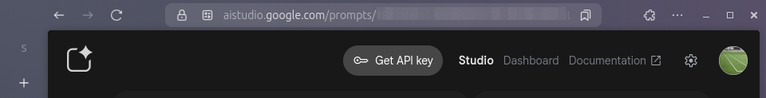
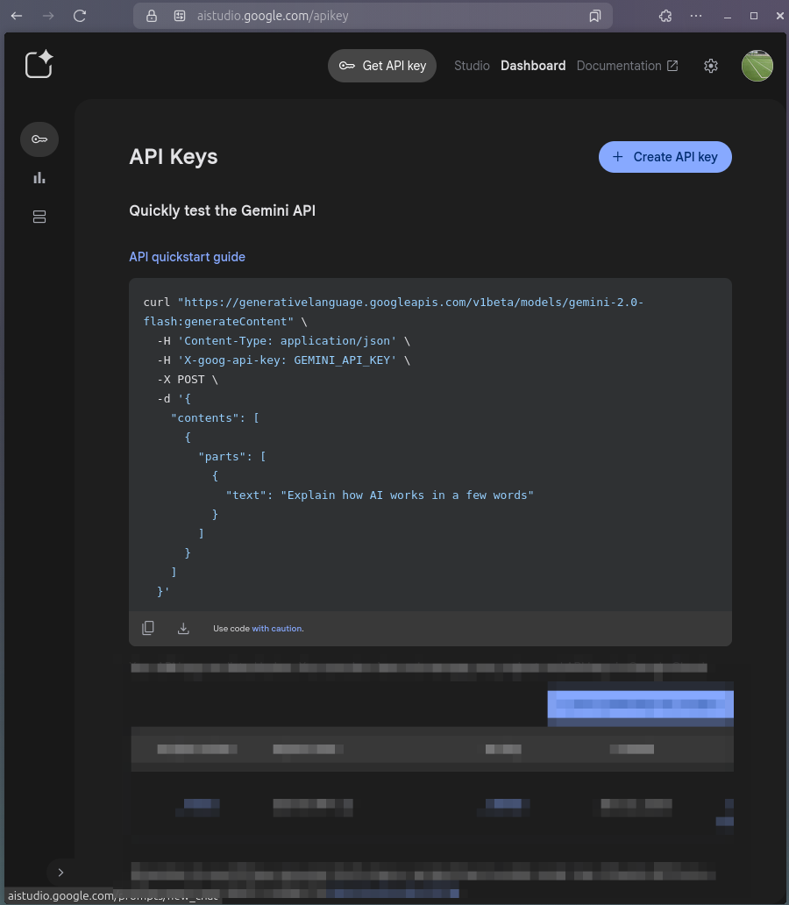

1.  **Obtener una API Key Gratuita:** Es el primer y más importante paso. La obtendrás desde Google AI Studio.
2.  **Elegir la Herramienta:** Te recomendaré **Python** como la opción más sencilla y directa por la excelente librería oficial que ofrece Google, pero también te daré una alternativa en **Bash/Shell** que es muy potente.
3.  **El Script:** Crearemos un script que:
    *   Busque todas las imágenes en una carpeta específica (por ejemplo, `*.png`, `*.jpg`).
    *   Las procese una por una en un bucle.
    *   Envíe cada imagen a la API de Gemini con la instrucción de extraer el texto (hacer OCR).
    *   Imprima el resultado en la terminal con formato Markdown.

### Paso 1: Obtener tu API Key Gratuita

Esto es indispensable. Sin una clave, no puedes llamar a la API.

1. Ve a Google AI Studio: https://aistudio.google.com/

2. Inicia sesión con tu cuenta de Google.
3. Haz clic en "Get API key" (Obtener clave de API) en la esquina superior izquierda.

4. Crea una nueva clave de API en un proyecto nuevo.

5. Copia y guarda tu clave en un lugar seguro. No la compartas ni la subas a repositorios públicos como GitHub.