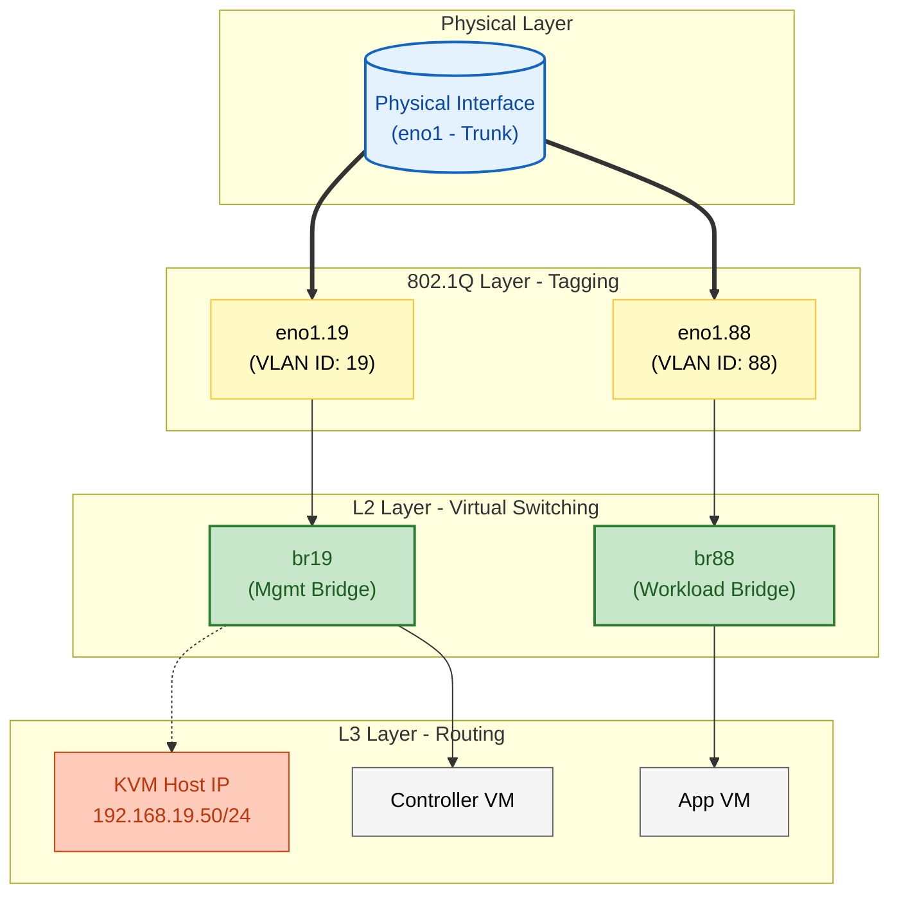

import { Steps, LinkButton } from '@astrojs/starlight/components';

## 📋 Architectural Definition

**Engineering Context:**
In bare-metal virtualization environments (KVM Host), utilizing a "Flat Network" introduces security risks and broadcast congestion. It is necessary to evolve the host network configuration to support **multiple isolation zones** using a single physical interface (Trunk).

**Design Objectives:**
1.  **L3 Decoupling:** The host management IP must not reside on the physical interface but on a virtual Bridge, enabling greater flexibility.
2.  **802.1Q Segmentation:** Implementation of VLAN sub-interfaces to segregate Management traffic (VLAN 19) from Lab/Tenant traffic (VLAN 88).
3.  **NetworkManager Persistence:** Declarative configuration via `nmcli` to ensure stability across reboots, deprecating legacy scripts.

---

## 🏗️ Host Logical Topology

The following diagram details the internal network stack configured within the KVM Host (`kvm-001`).

---

## 🚀 Implementation Procedure (SOP)

This design has been standardized and documented in the **Ops Standards Library**. The SOP details the atomic `nmcli` commands required to transform a standard interface into a VLAN trunk with bridges.

  <LinkButton 
    href="https://github.com/daniel-zamo/ops-standards-library/blob/main/linux/SOP-LINUX-NM-01_bridge-vlan-config.md"
    variant="primary"
    icon="github"
    target="_blank"
  >
    View Technical Procedure (GitHub)
  </LinkButton>
  <LinkButton 
    href="https://github.com/daniel-zamo/ops-standards-library/tree/main/linux"
    variant="secondary"
    icon="external"
    target="_blank"
  >
    Explore OPS Repo
  </LinkButton>

### Configuration Outcomes

Upon applying this architecture:

1.  **Isolation:** VMs connected to `br88` are logically isolated from the host management network.
2.  **Standardization:** Dependency on unpredictable interface names (e.g., `eth0` vs `enp3s0`) is eliminated by abstracting connectivity into standardized Bridges (`brXX`).
3.  **Observability:** The structure allows for independent traffic inspection of each segment using `tcpdump -i br19`.
