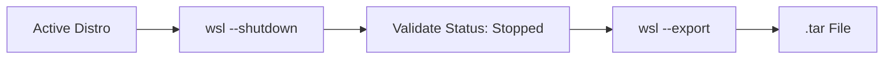

import { Steps, Aside, Badge } from '@astrojs/starlight/components';

This procedure describes how to extract the complete file system of a WSL 2 distribution to convert it into a portable `.tar` artifact.

<Badge text="Priority: High" variant="caution" /> <Badge text="Environment: Windows/WSL2" variant="note" />

---

## 🔄 Generation Workflow

Unlike a traditional VM snapshot, WSL requires a dump of the file system (*RootFS*). This workflow ensures the consistency of file pointers.



---

## 🚀 Execution Procedure

To prevent locked files by the Linux kernel and ensure filesystem integrity, follow these steps from **PowerShell 7** using standard user privileges.

<Steps>

1.  **Environment Preparation**
    
    Shut down the WSL engine completely. This will close all active distributions and background processes.
    ```powershell
    wsl --shutdown
    ```

2.  **Status Validation**
    
    Ensure the target distribution is listed as `Stopped`.
    ```powershell
    wsl --list --verbose
    ```

3.  **Export Commands**
    
    The command captures the exact state of the instance, including packages in `/usr`, configurations in `/etc`, and data in `/home`.

    ```powershell
    # Define output path (Hot Storage Tier)
    $storage = "D:\10_Hot-Tier_Caliente\WSL\backups"

    # Export Ubuntu instance with timestamp
    wsl --export Ubuntu "$storage\Ubuntu-$(get-date -f yyyyMMdd).tar"

    # Export Rocky Linux 9 instance with timestamp
    wsl --export RockyLinux9 "$storage\RockyLinux9-$(get-date -f yyyyMMdd).tar"
    ```

</Steps>

---

## 🔍 Diagnostics & Critical Points

<Aside type="danger" title="Corruption Risk">
**Never** run an export without first executing a `--shutdown`. Although WSL might allow the command to run, open files (especially databases or sockets) may end up in an inconsistent state within the `.tar` archive.
</Aside>

<Aside type="tip" title="Storage Management">
The export process does not apply compression by default. Ensure the destination drive has free space at least **1.2x** the size of the original `ext4.vhdx` file.
</Aside>

### Implementation Notes
- **Permissions:** The command correctly captures Linux attributes (UID/GID), regardless of the user running PowerShell.
- **Portability:** The resulting file can be imported into any Windows machine using `wsl --import`.

---
**Reference Documentation:** [Microsoft Docs - WSL Management](https://learn.microsoft.com/en-us/windows/wsl/basic-commands)
**Author:** `dzamo-sysadmin` | **Version:** 1.0
