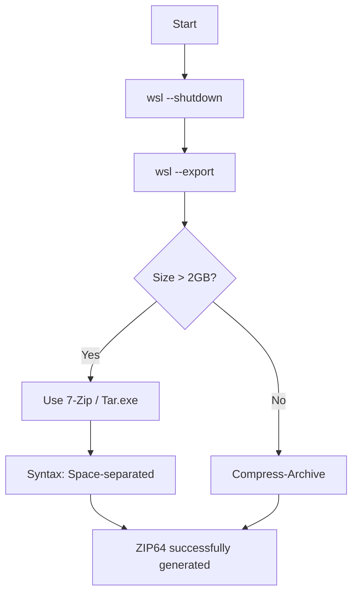

import { Steps, Aside, LinkCard, CardGrid, Badge } from '@astrojs/starlight/components';

When WSL distributions exceed **2GB**, the native Windows command `Compress-Archive` fails due to Zip32 standard limitations. For production environments or data-heavy distros, it is mandatory to use external tools like **7-Zip** or **Tar**.

<Aside type="danger" title="Common Error">
`System.IO.IOException: Stream was too long.`  
If you see this in PowerShell, you are attempting to compress a file larger than 2GB using obsolete native tools.
</Aside>

---

## 🔄 Robust Bundling Workflow

This diagram describes the decision logic for choosing the right compression tool based on the artifact size.



---

## 🛠️ Corrected Execution Script (PowerShell 7)

When invoking external binaries like `7z.exe`, PowerShell handles arguments differently than native cmdlets. **The most frequent mistake is separating paths with commas.**

<Steps>

1.  **Shutdown Instances**
    Ensuring VHDX consistency before the export.
    ```powershell
    wsl --shutdown
    ```

2.  **Variable Definition**
    Setting up destination paths (Hot Storage Tier).
    ```powershell
    $dest = "D:\10_Hot-Tier_Caliente\WSL\backups"
    ```

3.  **7-Zip Bundling (Array Pattern)**
    The cleanest way to pass files to 7-Zip is through an array. PowerShell will automatically expand it using **spaces** as delimiters.

    ```powershell
    # Ubuntu Bundle (~20GB)
    $ubuntuFiles = @(
        "$dest\Ubuntu.tar",
        "$env:APPDATA\alacritty\alacritty.toml",
        "$dest\README_Ubuntu.md"
    )

    # Direct invocation (7z must be in PATH)
    7z.exe a -tzip "$dest\WSL_Ubuntu_Migration.zip" $ubuntuFiles
    ```

</Steps>

---

## ⚠️ Syntax Troubleshooting

| Error | Cause | Solution |
| :--- | :--- | :--- |
| `Stream was too long` | 2GB limit in `Compress-Archive`. | Switch to **7-Zip** or **Tar**. |
| `The filename... syntax is incorrect` | Using commas (`,`) in 7z arguments. | Pass files separated by spaces or via Array. |
| `Scan WARNINGS` | Missing paths or strange characters. | Verify quotes in paths containing spaces. |

---

## 🔗 Related Resources & Notes

<CardGrid>
  <LinkCard 
    title="Previous SOP: Export RootFS" 
    description="Prerequisites for generating the base .tar file." 
    href="/en/notes/wsl-export-guide/" 
  />
  <LinkCard 
    title="Download 7-Zip" 
    description="Official binary for High-Capacity file handling." 
    href="https://www.7-zip.org/" 
  />
</CardGrid>

:::tip[Integrity Tip]
Always confirm the final size with:  
`Get-ChildItem "$dest\*.zip" | Select-Object Name, @{N="GB"; E={$_.Length / 1GB}}`
:::

---
**Generated by:** dzamo-sysadmin | **Status:** Syntax Verified in PS7
