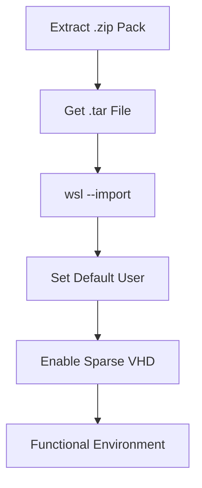

import { Steps, Aside, LinkCard, CardGrid, Badge } from '@astrojs/starlight/components';

After an OS migration or when there is a need to replicate an environment, Linux instances are reconstructed using `.tar` artifacts. This process ensures the development environment is identical to the original.

<Badge text="Scenario: Disaster Recovery" variant="success" /> <Badge text="Tool: WSL CLI" variant="note" />

---

## 🔄 Restoration Workflow

The process doesn't end with the import; it requires identity adjustments and disk optimization to become fully operational.



---

## 🛠️ Deployment Procedure

Follow these steps from a **PowerShell 7** terminal with write permissions on the target drive.

<Steps>

1.  **Distribution Deployment**
    
    Import the filesystem by specifying the instance name and the installation path (where the new `ext4.vhdx` will be created).

    ```powershell
    # Define instances path (Hot Tier)
    $installRoot = "D:\10_Hot-Tier_Caliente\WSL\instances"

    # Import Ubuntu instance
    wsl --import Ubuntu "$installRoot\Ubuntu" ".\Ubuntu.tar" --version 2

    # Import Rocky Linux 9 instance
    wsl --import RockyLinux9 "$installRoot\RockyLinux9" ".\RockyLinux9.tar" --version 2
    ```

2.  **Reset Default User**
    
    <Aside type="caution" title="Default Behavior">
    After an `--import`, WSL always starts as the `root` user. To return to your operational user (`dzamo`), use the internal configuration file.
    </Aside>

    Enter the distribution and create the configuration file:
    ```bash
    # Execute inside the Linux instance
    sudo tee /etc/wsl.conf <<EOF
    [user]
    default=dzamo
    EOF
    ```
    *Note: Requires restarting the instance (`wsl --terminate <distro>`) to apply changes.*

3.  **Storage Optimization (Sparse VHD)**
    
    To prevent the virtual disk from reserving unnecessary space on the host, enable *sparse* mode.

    ```powershell
    wsl --manage Ubuntu --set-sparse true
    wsl --manage RockyLinux9 --set-sparse true
    ```

</Steps>

---

## 🔍 Verification & Integrity

Once the steps are completed, validate that the WSL inventory reflects the correct states:

```powershell
wsl --list --verbose
```

| Parameter | Expected Value |
| :--- | :--- |
| **Version** | 2 |
| **Status** | Stopped / Running |
| **User** | Non-root (after wsl.conf setup) |

---

## 🔗 Series Articles

<CardGrid>
  <LinkCard 
    title="SOP: Base Export" 
    description="How to capture the RootFS before migration." 
    href="/en/notes/wsl-export-guide/" 
  />
  <LinkCard 
    title="SOP: Backup >2GB" 
    description="Compression strategies with 7-Zip for heavy files." 
    href="/en/notes/wsl-backup-7zip-strategy/" 
  />
</CardGrid>

---
**Generated by:** dzamo-sysadmin | **Status:** Operational post-migration
