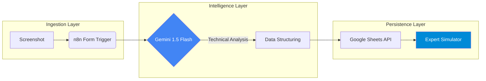

import { Steps, LinkButton } from '@astrojs/starlight/components';

## 📋 Executive Summary

Preparing for high-density certifications like **AZ-104 (Azure Administrator)** creates a significant cognitive load when managing feedback and documentation. This project addresses this "learning bottleneck" through an **AI-Ops** pipeline.

I developed a system that automates the ingestion and technical analysis of Azure scenarios, leveraging Artificial Intelligence to perform logical troubleshooting of each question and populate a dynamic simulator in real-time.

### 🎯 Engineering Objectives
*   **Toil Reduction:** Eliminate manual transcription of exam questions.
*   **Multimodal Analysis:** Direct image processing via LLMs (Vision).
*   **Data Sovereignty:** Self-hosted implementation on private infrastructure to ensure full workflow control.

---

## 🏗️ Architecture & Data Flow

The solution decouples data capture from logical reasoning, using **n8n** as the central orchestrator.



### Design Decisions
1.  **Gemini 1.5 Flash:** Chosen for its low latency in multimodal tasks and efficient context window for analyzing network diagrams in screenshots.
2.  **SOP-Driven Architecture:** The workflow is not an isolated script; it follows the **SOP-CLOUD-AZ-03** operational standard.

---

## 💻 Technical Implementation

<Steps>

1.  **Infrastructure Orchestration (IaC)**

    The n8n workflow is managed as code within my infrastructure repository, allowing for deployment across any automation instance.

    ```bash
    # Asset path in IaC repository
    automations/workflows/az104-ai-processor/workflow.json
    ```

2.  **AI Agent Configuration**

    An AI node was implemented with a specialized prompt instructing the model to act as a **Senior Azure Solutions Architect**, forcing structured JSON output with resource identification and distractor analysis fields.

3.  **Google API Integration**

    Connected via OAuth2 to push results into a dynamic simulator, enabling easy review of errors through "Azure Domain" filters.

</Steps>

## 🔍 Operational Value & Impact

| Metric | Manual Process | AI Pipeline |
| :--- | :--- | :--- |
| **Processing Time** | 5 - 10 Minutes | < 15 Seconds |
| **Analysis Depth** | Subjective | Based on Official Documentation |
| **Scalability** | Limited | Unlimited (via Webhook) |

---

## 📚 Documentation & Code

This project is a real-world implementation of my engineering standards. You can check the technical details here:

<div style="display: flex; gap: 1rem; flex-wrap: wrap; margin-top: 1.5rem;">
  <LinkButton href="https://github.com/daniel-zamo/infrastructure-as-code/tree/main/automations/workflows/az104-ai-processor" variant="primary" icon="github">
    View Code (IaC)
  </LinkButton>
  <LinkButton href="https://github.com/daniel-zamo/ops-standards-library/blob/main/cloud/azure/SOP-CLOUD-AZ-03_ai-exam-processor.md" variant="secondary" icon="document">
    View Standard (SOP)
  </LinkButton>
</div>

:::tip[Professional Context]
This solution demonstrates my ability to integrate **Large Language Models (LLMs)** into traditional IT processes, optimizing the learning curve and knowledge management.
:::
