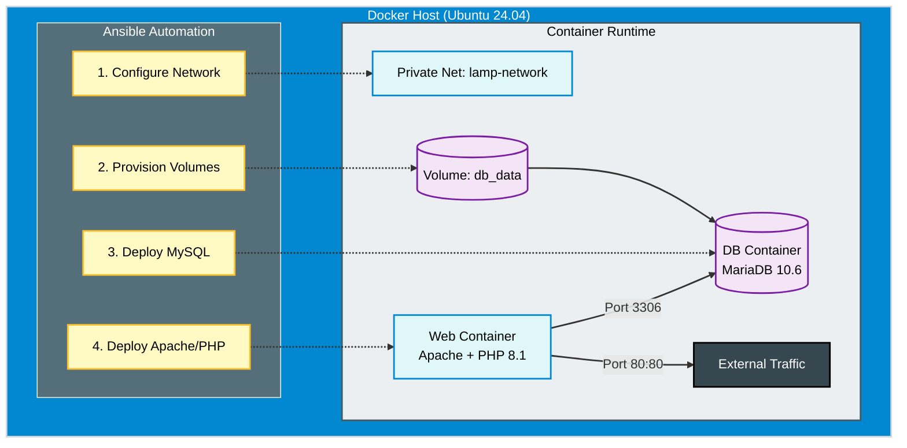

import { Steps } from '@astrojs/starlight/components';

## 📋 Executive Summary

This project addresses the need to standardize the deployment of PHP-based web applications (Legacy) in a modern environment. Instead of manually configuring servers, we use **Ansible** to define the desired infrastructure state and **Docker** to encapsulate application dependencies.

### 🎯 Engineering Objectives
1.  **Idempotency:** Ability to execute the deployment multiple times without duplicating resources or generating errors.
2.  **Network Segregation:** Isolation of the database (Backend) from the web server (Frontend) using private bridge networks.
3.  **Persistence:** Management of Docker volumes to ensure MySQL data durability.

---

## 🏗️ Solution Architecture

The design implements a **Data Sidecar** pattern and container segregation managed by an external controller (Ansible).



---

## 💻 Technical Implementation (Ansible)

The deployment logic is encapsulated in an **Ansible Playbook**. Unlike `docker-compose`, this approach allows for pre-deployment host validations and secure secret management via Ansible Vault.

<Steps>

1.  **Inventory Definition**

    We target the Docker host within our lab infrastructure.

    ```ini title="inventory.ini"
    [app_servers]
    192.168.1.60 ansible_user=dzamo ansible_ssh_private_key_file=~/.ssh/id_rsa
    ```

2.  **Playbook Structure**

    The code below ensures the Docker network exists, creates persistent volumes, and launches containers in the correct order to respect dependencies.

    ```yaml title="deploy-lamp.yml"
    ---
    - name: LAMP Stack Provisioning
      hosts: app_servers
      become: true
      vars:
        project_name: "intranet-core"
        mysql_root_pass: "SecureRoot123!" # In prod use Ansible Vault
        mysql_db: "intranet_db"
        mysql_user: "app_user"
        mysql_pass: "AppPass2025"
        
      tasks:
        - name: Create Isolated Docker Network
          community.docker.docker_network:
            name: "{{ project_name }}-net"
            driver: bridge

        - name: Create DB Persistence Volume
          community.docker.docker_volume:
            name: "{{ project_name }}-db-data"

        - name: Deploy Database (MariaDB)
          community.docker.docker_container:
            name: "{{ project_name }}-db"
            image: mariadb:10.6
            state: started
            restart_policy: always
            networks:
              - name: "{{ project_name }}-net"
            env:
              MARIADB_ROOT_PASSWORD: "{{ mysql_root_pass }}"
              MARIADB_DATABASE: "{{ mysql_db }}"
              MARIADB_USER: "{{ mysql_user }}"
              MARIADB_PASSWORD: "{{ mysql_pass }}"
            volumes:
              - "{{ project_name }}-db-data:/var/lib/mysql"
            labels:
              com.role: "database"

        - name: Deploy Web Server (Apache+PHP)
          community.docker.docker_container:
            name: "{{ project_name }}-web"
            image: php:8.1-apache
            state: started
            restart_policy: always
            ports:
              - "80:80"
            networks:
              - name: "{{ project_name }}-net"
            volumes:
              # Mount source code from host
              - ./src:/var/www/html
            labels:
              com.role: "frontend"
    ```

3.  **Application Code (Proof of Concept)**

    To validate connectivity between containers, we inject a simple PHP script that attempts to connect to the database using the internal container DNS name (`intranet-core-db`).

    ```php title="./src/index.php"
    <?php
    $servername = "intranet-core-db"; // Internal Docker DNS resolution
    $username = "app_user";
    $password = "AppPass2025";

    // Create connection
    $conn = new mysqli($servername, $username, $password);

    // Verify
    if ($conn->connect_error) {
        die("❌ Connection failed: " . $conn->connect_error);
    }
    echo "✅ Successfully connected to MariaDB from Apache Container.";
    ?>
    ```

4.  **Execution & Verification**

    Launch the playbook and verify the final state.

    ```bash
    ansible-playbook -i inventory.ini deploy-lamp.yml
    ```

</Steps>

## 🔍 Value Analysis

Transitioning from manual Bash scripts to Ansible for this deployment provides:

| Feature | Traditional Bash Script | Ansible + Docker |
| :--- | :--- | :--- |
| **State Control** | Imperative (Hard to tell if it failed halfway) | Declarative (Ensures final state) |
| **Cleanup** | Manual (Risk of residue) | Native container lifecycle management |
| **Portability** | Bound to Host OS | Executable on any Host with Docker Engine |

### Next Steps (Roadmap AZ-104)

This project serves as the baseline for the next cloud migration phase:
1.  **Lift & Shift:** Reuse this Playbook to provision an Ubuntu VM in **Azure Compute**.
2.  **Database Migration:** Decouple the MariaDB container and connect the App to **Azure Database for MariaDB**.
