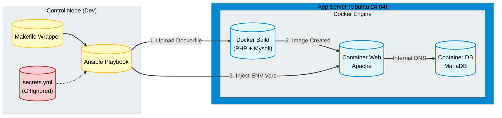

import { Steps } from '@astrojs/starlight/components';

## 📋 Executive Summary

This project modernizes the deployment of Legacy PHP applications, evolving from manual configuration to **Immutable Infrastructure**. Unlike basic container deployments, this solution addresses real-world challenges: compiling custom PHP extensions (`mysqli`), managing credentials securely outside the codebase, and standardizing the development environment.

### 🎯 Engineering Objectives
1.  **Immutability:** On-demand custom Docker image builds to inject system dependencies during deployment.
2.  **Security (12-Factor App):** Full decoupling of credentials. Source code contains no secrets; they are injected as environment variables.
3.  **Standardization:** Implementation of a `Makefile` wrapper to abstract Python/Ansible complexity and ensure zero-friction onboarding.

---

## 🏗️ Solution Architecture

The workflow implements a remote **Build & Deploy** pattern orchestrated by Ansible. The control node handles configuration and secrets, while the remote host builds and runs the containers.



---

## 💻 Technical Implementation

The solution uses a professional structure separating configuration, secrets, and deployment logic.

<Steps>

1.  **Execution Wrapper (Makefile)**

    To avoid versioning and virtual environment issues, we encapsulate commands in a `Makefile`. This ensures every developer uses the exact same tooling.

    ```makefile title="Makefile"
    setup:
        python3 -m venv .venv
        .venv/bin/pip install ansible-core docker
        .venv/bin/ansible-galaxy install -r requirements.yml

    deploy:
        .venv/bin/ansible-playbook playbook/deploy-lamp.yml
    ```

2.  **Secret Management (Override Pattern)**

    Ansible loads public variables (`all.yml`) first, then overwrites them with a local secret file that is excluded from Git (`.gitignore`).

    ```yaml title="playbook/deploy-lamp.yml"
    - hosts: app_servers
      vars_files:
        - "../group_vars/all.yml"      # Public Structure (Placeholders)
        - "../group_vars/secrets.yml"  # Local Secrets (Real Passwords)
    ```

3.  **Playbook Logic (Build & Run)**

    The playbook not only pulls images but uploads a `Dockerfile` and compiles a custom image to support `mysqli`.

    ```yaml title="playbook/deploy-lamp.yml"
    tasks:
      - name: Build Custom PHP Image
        community.docker.docker_image:
          name: "{{ custom_image_name }}"
          tag: latest
          build:
            path: "{{ remote_project_path }}" # Remote path to Dockerfile
          source: build
          force_source: true

      - name: Deploy Web Container
        community.docker.docker_container:
          name: "{{ project_name }}-web"
          image: "{{ custom_image_name }}:latest" # Use the freshly built image
          env:
            # Secure injection of environment variables
            DB_HOST: "{{ project_name }}-db"
            DB_USER: "{{ mysql_user }}"
            DB_PASSWORD: "{{ mysql_pass }}"
    ```

4.  **Agnostic Code (PHP)**

    The source code (`src/index.php`) contains no credentials. It reads the environment configuration, complying with *The Twelve-Factor App* principles.

    ```php title="src/index.php"
    <?php
    // Secure reading from Environment Variables
    $servername = getenv('DB_HOST');
    $username = getenv('DB_USER');
    $password = getenv('DB_PASSWORD');

    $conn = new mysqli($servername, $username, $password, $dbname);
    
    if ($conn->connect_error) {
        die("❌ Connection failed: " . $conn->connect_error);
    }
    echo "✅ Successfully connected to MariaDB.";
    ?>
    ```

5.  **Standardized Execution**

    Thanks to the Makefile, deployment is reduced to two commands, regardless of the underlying complexity.

    ```bash
    # Initialization (First time only)
    make setup

    # Idempotent Deploy
    make deploy
    ```

</Steps>

## 🔍 Value Analysis

| Feature | Traditional Bash Script | Ansible + Docker Pro |
| :--- | :--- | :--- |
| **Credentials** | Hardcoded in files (`.php`) | Injected in Memory (ENV) |
| **Dependencies** | Manual installation (`apt-get`) | Automatic Docker Build |
| **Portability** | "Works on my machine" | Standardized via Makefile |

### Next Steps (Roadmap AZ-104)

This project serves as the baseline for cloud migration. We have documented this process in the Cloud Operations section:

1. **IaaS Migration:** Replicate this architecture using Azure Virtual Machines.
   - **[👉 View Scenario 01: LAMP Migration to Azure IaaS](/en/az-cloud-ops/compute/scenario-01-lamp-iaas/)**

2. **Azure Container Registry (ACR):** Move the build process to the cloud.
3. **Azure Key Vault:** Centralized secret management.
