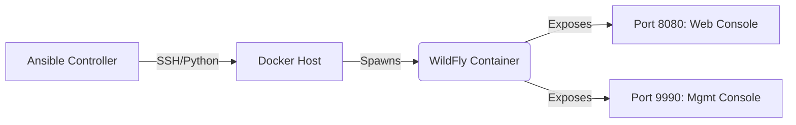

import { Steps, FileTree } from '@astrojs/starlight/components';

## 🚀 Business Scenario

In enterprise environments (such as Banking or Telco sectors), manually deploying Application Servers (Middleware) leads to configuration drift and security inconsistencies.

This project demonstrates a **Modernization Strategy**: shifting from manual installation of **JBoss/WildFly** on bare metal to an automated, containerized deployment orchestrated by **Ansible**.

### Architectural Goals
1.  **Immutability:** Use Docker to ensure the application server runtime is identical across environments.
2.  **Automation:** Use Ansible to handle the container lifecycle and configuration injection.
3.  **Standards:** Deploy the latest stable WildFly version replacing legacy proprietary JBoss instances.

---

## 🛠️ Infrastructure Design

The solution utilizes a Controller Node (Ansible) targeting a Docker Host to provision the middleware service.



### Prerequisites
*   **Host:** Ubuntu 24.04 (Docker Host).
*   **Controller:** Linux Workstation / WSL2 with Ansible installed.
*   **Collection:** `community.docker` installed on the controller.

---

## 💻 Implementation Details

<Steps>

1.  **Define the Inventory**

    We treat the infrastructure as code. The inventory defines the target Docker host.

    ```ini title="inventory.ini"
    [middleware_hosts]
    192.168.1.50 ansible_user=dzamo ansible_python_interpreter=/usr/bin/python3
    ```

2.  **The Ansible Playbook**

    This playbook ensures the Docker service is active, pulls the official WildFly image, and deploys it with specific management users defined as environment variables.

    ```yaml title="deploy-wildfly.yml"
    ---
    - name: Provision Middleware Stack (WildFly)
      hosts: middleware_hosts
      become: true
      vars:
        wildfly_version: "24.0.0.Final"
        container_name: "wildfly-prod-01"
        mgmt_user: "admin"
        mgmt_pass: "SecurePass123!"

      tasks:
        - name: Ensure Python Docker SDK is present
          apt:
            name: python3-docker
            state: present
            update_cache: yes

        - name: Pull WildFly Image
          community.docker.docker_image:
            name: "quay.io/wildfly/wildfly:{{ wildfly_version }}"
            source: pull

        - name: Deploy WildFly Container
          community.docker.docker_container:
            name: "{{ container_name }}"
            image: "quay.io/wildfly/wildfly:{{ wildfly_version }}"
            state: started
            restart_policy: always
            ports:
              - "8080:8080" # App Port
              - "9990:9990" # Management Port
            command: /opt/jboss/wildfly/bin/standalone.sh -b 0.0.0.0 -bmanagement 0.0.0.0
            env:
              WILDFLY_USERNAME: "{{ mgmt_user }}"
              WILDFLY_PASSWORD: "{{ mgmt_pass }}"
            labels:
              environment: "production"
              stack: "java-middleware"

        - name: Wait for Management Interface
          wait_for:
            host: "127.0.0.1"
            port: 9990
            delay: 10
    ```

3.  **Execution & Validation**

    Running the playbook applies the state idempotently.

    ```bash
    ansible-playbook -i inventory.ini deploy-wildfly.yml
    ```

    **Verification:**
    Access the WildFly Management Console via browser at `http://<HOST_IP>:9990`.

</Steps>

## 🔍 Technical Deep Dive

### Why this approach?
Traditionally, SysAdmins would unzip the JBoss `tar.gz`, edit `standalone.xml` manually, and create `systemd` units. This playbook replaces ~40 manual steps with a single codified definition.

*   **Security:** Credentials are injected via variables (and can be encrypted with Ansible Vault).
*   **Networking:** We bind `-b 0.0.0.0` explicitly to allow external access to the container, a common pitfall in containerized middleware.

### Future Roadmap
*   **Azure Integration:** Push this image to **Azure Container Registry (ACR)**.
*   **Clustering:** Configure WildFly in Domain Mode using JGroups/TCPPing for High Availability.
