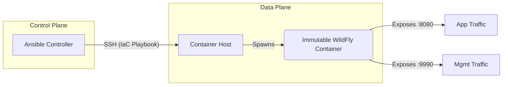

import { Steps, FileTree } from '@astrojs/starlight/components';

## 📋 Executive Summary

In critical infrastructure sectors (Banking & Telco), traditional "Pet-based" middleware management leads to unacceptable risks: **configuration drift**, unpatched **security vulnerabilities**, and slow **Time-to-Market** for new features.

This project implements an **Infrastructure Modernization** strategy, migrating legacy JBoss/WildFly workloads toward an immutable, container-based architecture.

### 🎯 Solution Objectives
*   **Operational Integrity:** Ensure the artifact deployed in Development is bit-for-bit identical to Production (Environment Parity).
*   **Security by Design:** Runtime secret injection, avoiding hardcoded credentials in XML configuration files.
*   **Disaster Recovery (DR):** Reduction of RTO (Recovery Time Objective) from hours to seconds via automated redeployment.

---

## 🏗️ Architecture & Design Decisions

The solution decouples the runtime (WildFly) from configuration, orchestrated by a centralized controller.



### Technical Principles
1.  **Immutability (Docker):** Abandoning "in-place" updates (yum update). Every deployment destroys the previous container and spins up a clean, approved version.
2.  **Idempotency (Ansible):** The playbook can be executed N times without adverse side effects, enforcing the desired state.
3.  **12-Factor App:** Environment-specific configuration (users, passwords, JVM memory) is injected via **Environment Variables**, not by editing `standalone.xml`.

---

## 💻 Technical Implementation

<Steps>

1.  **Inventory Definition (IaC)**

    The inventory segregates environments, allowing different policies for `staging` and `production` from a single code base.

    ```ini title="inventory.ini"
    [middleware_nodes]
    # Target node acting as Container Host
    192.168.1.50 ansible_user=dzamo ansible_python_interpreter=/usr/bin/python3
    ```

2.  **Provisioning Playbook**

    This artifact automates the full lifecycle. Note the use of `restart_policy: always` for automatic resilience against daemon failures.

    ```yaml title="deploy-wildfly.yml"
    ---
    - name: Middleware Stack Orchestration (WildFly)
      hosts: middleware_nodes
      become: true
      vars:
        # Strict versioning to avoid accidental upgrades
        wildfly_tag: "24.0.0.Final"
        container_name: "wildfly-prod-core"
        # In production, these would come from Ansible Vault
        mgmt_user: "admin_ops"
        mgmt_pass: "{{ vault_mgmt_pass | default('SecurePass123!') }}"

      tasks:
        - name: Prerequisite Verification (Python SDK)
          apt:
            name: python3-docker
            state: present
            update_cache: yes
            cache_valid_time: 3600

        - name: Pull Approved Base Image
          community.docker.docker_image:
            name: "quay.io/wildfly/wildfly:{{ wildfly_tag }}"
            source: pull

        - name: Container Deployment (Runtime)
          community.docker.docker_container:
            name: "{{ container_name }}"
            image: "quay.io/wildfly/wildfly:{{ wildfly_tag }}"
            state: started
            restart_policy: always
            ports:
              - "8080:8080" # HTTP Traffic
              - "9990:9990" # JBoss CLI Console
            # Binding to 0.0.0.0 is required in containers for external exposure
            command: /opt/jboss/wildfly/bin/standalone.sh -b 0.0.0.0 -bmanagement 0.0.0.0
            env:
              WILDFLY_USERNAME: "{{ mgmt_user }}"
              WILDFLY_PASSWORD: "{{ mgmt_pass }}"
            labels:
              com.company.env: "production"
              com.company.service: "middleware-core"

        - name: Service Health Validation (Healthcheck)
          wait_for:
            host: "127.0.0.1"
            port: 9990
            delay: 5
            timeout: 60
    ```

3.  **Execution & Verification**

    ```bash
    ansible-playbook -i inventory.ini deploy-wildfly.yml
    ```

</Steps>

## 🔍 Value & Impact Analysis

Implementing this automated flow replaces a manual procedure of **~40 steps** documented in Word/Excel, achieving:

| Metric | Before (Manual) | After (Automated) |
| :--- | :--- | :--- |
| **Provisioning Time** | 4 Hours | < 2 Minutes |
| **Human Error** | High Risk | Eliminated (Idempotent) |
| **Scalability** | Linear (1 admin per N servers) | Exponential |

### Roadmap & Next Steps
*   **Hardening:** Implement vulnerability scanning (Trivy/Clair) in the CI pipeline.
*   **High Availability:** Evolution towards a JBoss Cluster in Domain Mode using **JGroups with TCPPING** for non-multicast environments.
