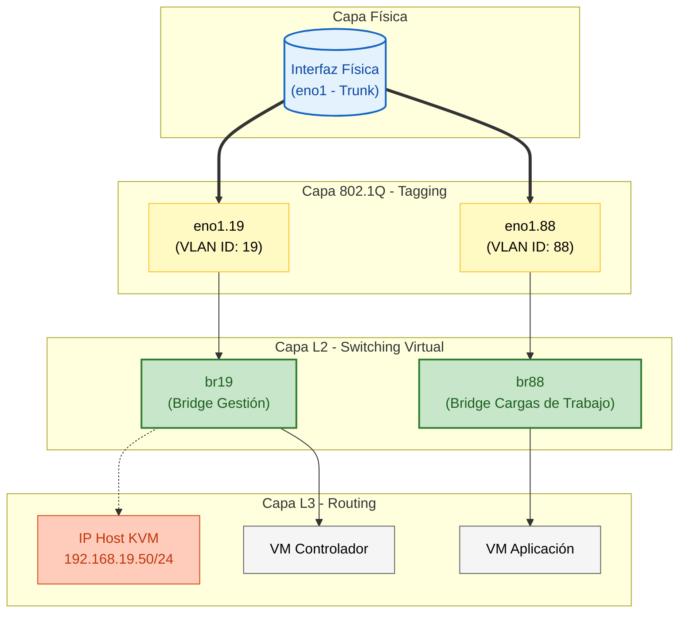

import { Steps, LinkButton } from '@astrojs/starlight/components';

## 📋 Definición de Arquitectura

**Contexto de Ingeniería:**
En entornos de virtualización *bare-metal* (Host KVM), el uso de una red plana ("Flat Network") presenta riesgos de seguridad y congestión de broadcast. Se requiere evolucionar la configuración de red del host anfitrión para soportar **múltiples zonas de aislamiento** utilizando una única interfaz física (Trunk).

**Objetivos de Diseño:**
1.  **Desacoplamiento L3:** La IP de gestión del host no debe residir en la interfaz física, sino en un Bridge virtual, permitiendo mayor flexibilidad.
2.  **Segmentación 802.1Q:** Implementación de sub-interfaces VLAN para segregar tráfico de Gestión (VLAN 19) y Laboratorio/Tenant (VLAN 88).
3.  **Persistencia NetworkManager:** Configuración declarativa mediante `nmcli` para garantizar la estabilidad tras reinicios, abandonando scripts legacy.

---

## 🏗️ Topología Lógica del Host

El siguiente diagrama detalla la pila de red interna configurada dentro del Host KVM (`kvm-001`).

---

## 🚀 Procedimiento de Implementación (SOP)

Este diseño ha sido estandarizado y documentado en la **Librería de Estándares de Operaciones**. El SOP detalla los comandos atómicos de `nmcli` necesarios para transformar una interfaz estándar en un trunk VLAN con bridges.

  <LinkButton 
    href="https://github.com/daniel-zamo/ops-standards-library/blob/main/linux/SOP-LINUX-NM-01_bridge-vlan-config.md"
    variant="primary"
    icon="github"
    target="_blank"
  >
    Ver Procedimiento Técnico (GitHub)
  </LinkButton>
  <LinkButton 
    href="https://github.com/daniel-zamo/ops-standards-library/tree/main/linux"
    variant="secondary"
    icon="external"
    target="_blank"
  >
    Explorar Repo OPS
  </LinkButton>

### Resultados de la Configuración

Al aplicar esta arquitectura:

1.  **Aislamiento:** Las VMs conectadas a `br88` están lógicamente aisladas de la red de gestión del host.
2.  **Estandarización:** Se elimina la dependencia de nombres de interfaz impredecibles (ej. `eth0` vs `enp3s0`) al abstraer la conexión en Bridges estandarizados (`brXX`).
3.  **Observabilidad:** La estructura permite inspeccionar el tráfico de cada segmento independientemente usando `tcpdump -i br19`.
