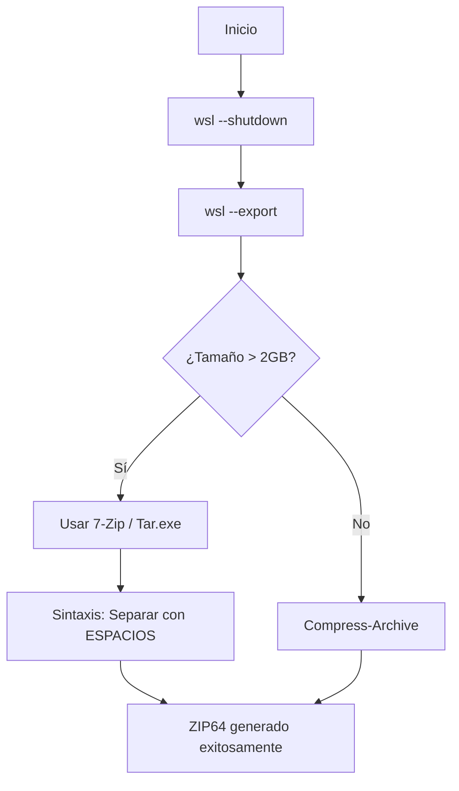

import { Steps, Aside, LinkCard, CardGrid, Badge } from '@astrojs/starlight/components';

Cuando las distribuciones de WSL exceden los **2GB**, el comando nativo de Windows `Compress-Archive` falla debido a limitaciones del estándar Zip32. Para entornos de producción o distros con grandes volúmenes de datos, es imperativo utilizar herramientas externas como **7-Zip** o **Tar**.

<Aside type="danger" title="Error Común">
`System.IO.IOException: Stream was too long.`  
Si ves este error en PowerShell, estás intentando comprimir un archivo mayor a 2GB con herramientas nativas obsoletas.
</Aside>

---

## 🔄 Flujo de Empaquetado Robusto

Este diagrama describe la lógica de decisión para elegir la herramienta de compresión según el tamaño del artefacto.



---

## 🛠️ Script de Ejecución Corregido (PowerShell 7)

Al invocar binarios externos como `7z.exe`, PowerShell maneja los argumentos de forma distinta a los cmdlets nativos. **El error más frecuente es separar las rutas con comas.**

<Steps>

1.  **Cierre de Instancias**
    Aseguramos la consistencia del VHDX antes del export.
    ```powershell
    wsl --shutdown
    ```

2.  **Definición de Variables**
    Configuramos las rutas de destino (Tier Caliente).
    ```powershell
    $dest = "D:\10_Hot-Tier_Caliente\WSL\backups"
    ```

3.  **Empaquetado con 7-Zip (Array Pattern)**
    La forma más limpia de pasar archivos a 7-Zip es mediante un array. PowerShell lo expandirá automáticamente usando **espacios** como separador.

    ```powershell
    # Bundle para Ubuntu (~20GB)
    $ubuntuFiles = @(
        "$dest\Ubuntu.tar",
        "$env:APPDATA\alacritty\alacritty.toml",
        "$dest\README_Ubuntu.md"
    )

    # Invocación directa (7z debe estar en el PATH)
    7z.exe a -tzip "$dest\WSL_Ubuntu_Migration.zip" $ubuntuFiles
    ```

</Steps>

---

## ⚠️ Troubleshooting de Sintaxis

| Error | Causa | Solución |
| :--- | :--- | :--- |
| `Stream was too long` | Límite de 2GB en `Compress-Archive`. | Cambiar a **7-Zip** o **Tar**. |
| `The filename... syntax is incorrect` | Uso de comas (`,`) en los argumentos de 7z. | Pasar los archivos separados por espacios o vía Array. |
| `Scan WARNINGS` | Caracteres extraños o rutas no encontradas. | Verificar comillas en rutas que contienen espacios. |

---

## 🔗 Recursos y Notas Relacionadas

<CardGrid>
  <LinkCard 
    title="SOP Anterior: Export RootFS" 
    description="Requisitos previos para generar el archivo .tar base." 
    href="/es/notes/wsl-export-guide/" 
  />
  <LinkCard 
    title="Descargar 7-Zip" 
    description="Binario oficial para manejo de archivos High-Capacity." 
    href="https://www.7-zip.org/" 
  />
</CardGrid>

:::tip[Tip de Integridad]
Confirmar siempre el tamaño final con:  
`Get-ChildItem "$dest\*.zip" | Select-Object Name, @{N="GB"; E={$_.Length / 1GB}}`
:::

---
**Generado por:** dzamo-sysadmin | **Estado:** Sintaxis Verificada en PS7
