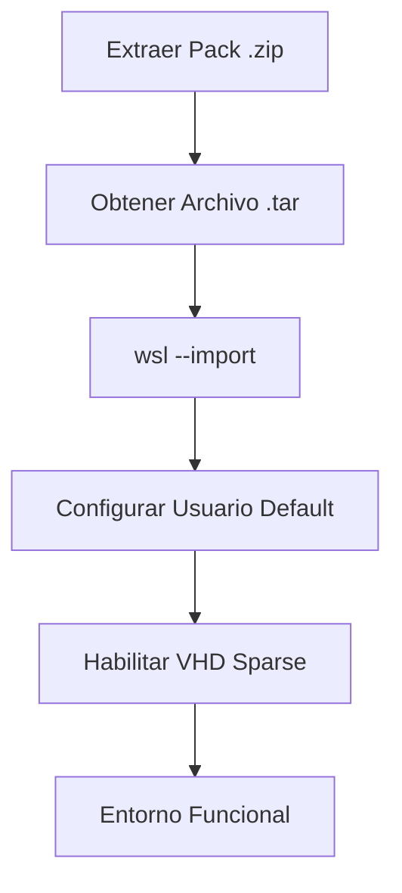

import { Steps, Aside, LinkCard, CardGrid, Badge } from '@astrojs/starlight/components';

Una vez realizada la migración del sistema operativo o ante la necesidad de replicar un entorno, se procede a reconstruir las instancias Linux utilizando los artefactos `.tar`. Este proceso garantiza que el entorno de desarrollo sea idéntico al original.

<Badge text="Escenario: Recuperación ante Desastres" variant="success" /> <Badge text="Herramienta: WSL CLI" variant="note" />

---

## 🔄 Flujo de Restauración

El proceso no termina con la importación; requiere ajustes de identidad y optimización de disco para ser plenamente operativo.



---

## 🛠️ Procedimiento de Despliegue

Siga estos pasos desde una terminal de **PowerShell 7** con permisos de escritura en el disco de destino.

<Steps>

1.  **Despliegue de la Distribución**
    
    Importamos el sistema de archivos especificando el nombre de la instancia y la ruta de instalación (donde se creará el nuevo `ext4.vhdx`).

    ```powershell
    # Definir ruta de instancias (Tier Caliente)
    $installRoot = "D:\10_Hot-Tier_Caliente\WSL\instances"

    # Importar instancia de Ubuntu
    wsl --import Ubuntu "$installRoot\Ubuntu" ".\Ubuntu.tar" --version 2

    # Importar instancia de Rocky Linux 9
    wsl --import RockyLinux9 "$installRoot\RockyLinux9" ".\RockyLinux9.tar" --version 2
    ```

2.  **Restablecer Usuario Predeterminado**
    
    <Aside type="caution" title="Comportamiento por Defecto">
    Tras un `--import`, WSL inicia siempre como usuario `root`. Para volver a tu usuario operativo (`dzamo`), utiliza el archivo de configuración interna.
    </Aside>

    Entre en la distribución y cree el archivo de configuración:
    ```bash
    # Ejecutar dentro de la instancia Linux
    sudo tee /etc/wsl.conf <<EOF
    [user]
    default=dzamo
    EOF
    ```
    *Nota: Requiere reiniciar la instancia (`wsl --terminate <distro>`) para aplicar cambios.*

3.  **Optimización de Almacenamiento (Sparse VHD)**
    
    Para evitar que el disco virtual reserve espacio innecesario en el host, habilitamos el modo *sparse*.

    ```powershell
    wsl --manage Ubuntu --set-sparse true
    wsl --manage RockyLinux9 --set-sparse true
    ```

</Steps>

---

## 🔍 Verificación e Integridad

Una vez completados los pasos, valide que el inventario de WSL refleja los estados correctos:

```powershell
wsl --list --verbose
```

| Parámetro | Valor Esperado |
| :--- | :--- |
| **Versión** | 2 |
| **Estado** | Stopped / Running |
| **Usuario** | No-root (tras configurar wsl.conf) |

---

## 🔗 Artículos de la Serie

<CardGrid>
  <LinkCard 
    title="SOP: Exportación Base" 
    description="Cómo capturar el RootFS antes de la migración." 
    href="/es/notes/wsl-export-guide/" 
  />
  <LinkCard 
    title="SOP: Backup >2GB" 
    description="Estrategias de compresión con 7-Zip para archivos pesados." 
    href="/es/notes/wsl-migration-backup-strategy/" 
  />
</CardGrid>

---

**Generado por:** dzamo-sysadmin | **Status:** Operativo post-migración
