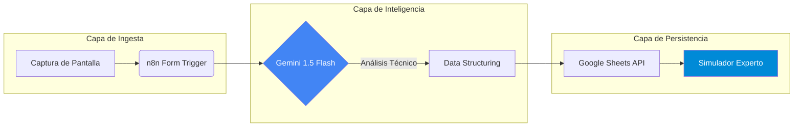

import { Steps, LinkButton } from '@astrojs/starlight/components';

## 📋 Resumen Ejecutivo

La preparación de certificaciones de alta densidad como la **AZ-104 (Azure Administrator)** genera una carga cognitiva significativa al gestionar feedback y documentación. Este proyecto resuelve este "cuello de botella" mediante una pipeline de **AI-Ops**.

He desarrollado un sistema que automatiza la ingesta y el análisis técnico de escenarios de Azure, utilizando inteligencia artificial para realizar un *troubleshooting* lógico de cada pregunta y poblar un simulador dinámico en tiempo real.

### 🎯 Objetivos de Ingeniería
*   **Reducción de Toil:** Eliminar la transcripción manual de preguntas de examen.
*   **Análisis Multimodal:** Procesamiento directo de imágenes mediante LLMs (Vision).
*   **Soberanía de Datos:** Implementación *self-hosted* sobre infraestructura propia para garantizar el control de los flujos.

---

## 🏗️ Arquitectura y Flujo de Datos

La solución desacopla la captura del dato del razonamiento lógico, utilizando **n8n** como orquestador central.



### Decisiones de Diseño
1.  **Gemini 1.5 Flash:** Elegido por su baja latencia en tareas multimodales y su ventana de contexto eficiente para analizar diagramas de red en capturas.
2.  **Arquitectura Basada en SOP:** El flujo no es un script aislado; sigue el estándar operativo **SOP-CLOUD-AZ-03**.

---

## 💻 Implementación Técnica

<Steps>

1.  **Orquestación de Infraestructura (IaC)**

    El flujo de n8n se gestiona como código dentro de mi repositorio de infraestructura, permitiendo su despliegue en cualquier instancia de automatización.

    ```bash
    # Ruta del activo en el repositorio IaC
    automations/workflows/az104-ai-processor/workflow.json
    ```

2.  **Configuración del Agente de IA**

    Se implementó un nodo de IA con un prompt especializado que instruye al modelo a actuar como un **Azure Solutions Architect**, forzando una salida estructurada en JSON con campos de identificación de recursos y análisis de distractores.

3.  **Integración de API de Google**

    Conexión mediante OAuth2 para volcar los resultados en un simulador dinámico, facilitando el repaso de errores mediante filtros de "Dominio de Azure".

</Steps>

## 🔍 Valor e Impacto Operativo

| Métrica | Proceso Manual | Pipeline de IA |
| :--- | :--- | :--- |
| **Tiempo de Procesamiento** | 5 - 10 Minutos | < 15 Segundos |
| **Profundidad de Análisis** | Subjetiva | Basada en Documentación Oficial |
| **Escalabilidad** | Limitada | Ilimitada (vía Webhook) |

---

## 📚 Documentación y Código

Este proyecto es una implementación real de mis estándares de ingeniería. Puedes consultar los detalles técnicos aquí:

<div style="display: flex; gap: 1rem; flex-wrap: wrap; margin-top: 1.5rem;">
  <LinkButton href="https://github.com/daniel-zamo/infrastructure-as-code/tree/main/automations/workflows/az104-ai-processor" variant="primary" icon="github">
    Ver Código (IaC)
  </LinkButton>
  <LinkButton href="https://github.com/daniel-zamo/ops-standards-library/blob/main/cloud/azure/SOP-CLOUD-AZ-03_ai-exam-processor.md" variant="secondary" icon="document">
    Ver Estándar (SOP)
  </LinkButton>
</div>

:::tip[Contexto Profesional]
Esta solución demuestra mi capacidad para integrar **Modelos de Lenguaje (LLMs)** en procesos de IT tradicionales, optimizando la curva de aprendizaje y la gestión del conocimiento.
:::
